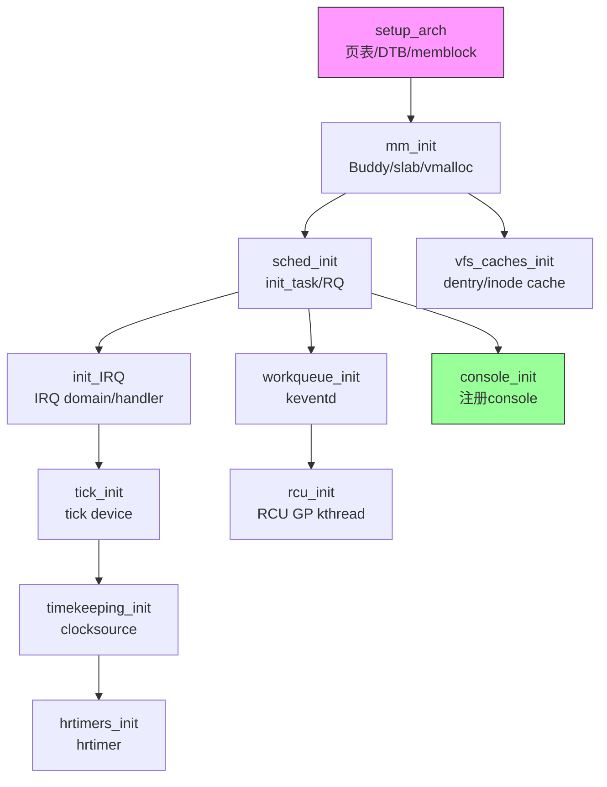
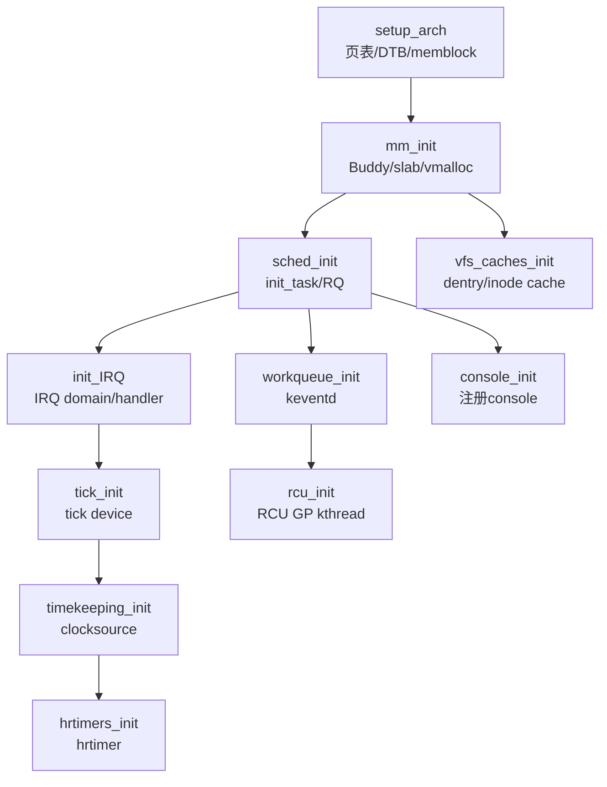

# 7.5.2 start_kernel：C语言世界的入口

> 所属：第7章 启动引导与Bootloader > 7.5 内核启动：从_start到init
> 难度：[E] | 预计阅读时间：45分钟

## 本节导读

U-Boot通过`bootm`跳转到内核后，ARM64的`__primary_switched`最终把控制权交给了C世界的第一个函数——`start_kernel()`。从这一刻起，Linux内核不再是汇编代码的精密编排，而是C语言的宏大交响乐。本节深入`init/main.c`的初始化全景，解答三个核心问题：`start_kernel()`的初始化清单为什么是这个顺序？`setup_arch()`如何将扁平设备树转换成内核的`device_node`森林？子系统间的隐式依赖链如何在源码中体现？

---

## 知识点1：start_kernel() 总览 — init/main.c的初始化交响乐 [E] ~1500字

### 问题场景

你在调试一块i.MX8MP板卡，U-Boot已通过`booti`成功跳转，串口打印出：

```
[    0.000000] Booting Linux on physical CPU 0x0000000000 [0x410fd034]
[    0.000000] Linux version 6.6.36-rt24-lts-foxcraft ...
```

然后系统静默了约300ms才继续输出。这300ms里内核在做什么？如果这300ms内系统挂死，你该如何定位？

### 机制深入：start_kernel的完整调用链

`start_kernel()`位于`init/main.c`，是Linux内核中**唯一一个既非中断上下文、也非进程上下文**的C函数——此时调度器尚未初始化，当前"执行体"本质上是一个高级汇编桩。函数体长达数百行，但可归纳为七个严格有序的乐章：

| 阶段 | 核心函数 | 关键职责 | 此阶段可用的资源 |
|------|---------|---------|----------------|
| 1. 架构初始化 | `setup_arch()` | 解析dtb、初始化内存布局、设置CPU特性 | 栈（临时）、BSS段 |
| 2. 内存管理 | `mm_init()` | 建立Buddy分配器、slab、vmalloc空间 | 页表（setup_arch建立） |
| 3. 调度器 | `sched_init()` | 初始化`init_task`、CFS运行队列、负载均衡 | `kmalloc`可用 |
| 4. 中断子系统 | `init_IRQ()` / `irq_init()` | 设置IRQ domain、注册arch-specific handler | 进程上下文（`current`指向`init_task`） |
| 5. 时间子系统 | `time_init()` | 注册clocksource/clockevent、启用tick | 中断可用 |
| 6. 控制台 | `console_init()` | 注册printk的console输出设备 | 完整中断+定时器 |
| 7. 剩余初始化 | `rest_init()` | 创建`kernel_init`线程，进入多任务世界 | 调度器+中断+内存全就绪 |

💡 **关键洞察**：上述顺序**不可任意调换**，不是编码风格问题，而是硬核的依赖关系——`sched_init()`需要`mm_init()`提供`kmalloc`来分配运行队列；`init_IRQ()`需要`sched_init()`完成后`current`宏才能正常工作；`console_init()`之前所有`pr_info()`都被缓冲到`__log_buf`，直到console注册后才一次性flush。

### 关键代码路径

```c
/* init/main.c — start_kernel() 骨架（Linux 6.6 LTS） */
asmlinkage __visible void __init start_kernel(void)
{
    /* === 第0步：关闭本地中断，设置栈指针 === */
    local_irq_disable();
    early_boot_irqs_disabled = true;

    /* === 第1步：架构相关初始化（必须最先）=== */
    setup_arch(&command_line);          /* 解析dtb，设置memory布局 */
    mm_init_cpumask(&init_mm);          /* 初始化init_mm的CPU掩码 */

    /* === 第2步：建立内核内存管理 === */
    mm_init();                          /* Buddy/slab/vmalloc */

    /* === 第3步：调度器初始化 === */
    sched_init();                       /* init_task, CFS队列 */

    /* === 第4步：工作队列、RCU、IRQ === */
    init_IRQ();                         /* 架构中断控制器 */
    irq_init();                         /* 通用IRQ框架 */
    tick_init();                        /* tick层初始化 */
    init_timers();                      /* 低精度定时器 */

    /* === 第5步：时间keeping与hrtimer === */
    timekeeping_init();                 /* 读取clocksource */
    hrtimers_init();                    /* 高精度定时器 */

    /* === 第6步：控制台与printk === */
    console_init();                     /* 注册串口console */

    /* === 第7步：进入多任务世界 === */
    rest_init();                        /* 永不返回 */
}
```

⚠️ **常见陷阱**：`start_kernel()`在`rest_init()`之前**绝不返回**，也不存在"退出"路径。如果某阶段触发`panic()`，你会看到一条错误消息后系统halt——这是设计如此，因为此时尚无进程可调度，无法走正常的`do_exit()`路径。

### 实践案例：那消失的300ms

回到本节开头的问题。通过在命令行追加`initcall_debug`和`loglevel=8`，启动日志显示：

```
[    0.000000] calling  init_oops_setup+0x0/0x50 @ 1
[    0.000000] initcall init_oops_setup+0x0/0x50 returned 0 after 0 usecs
...
[    0.296318] calling  imx_uart_console_setup+0x0/0x1a0 @ 1
[    0.296347] console [ttymxc0] enabled
```

300ms的静默期实际是`setup_arch()` → `mm_init()` → `sched_init()`的执行时间。`console_init()`之前printk数据被缓冲到`__log_buf`（默认大小`1 << CONFIG_LOG_BUF_SHIFT`字节），直到串口console注册后才flush。这解释了为什么你看到"Booting Linux"后立即有一段静默——那不是hang死，而是console尚未注册。

🔴 **安全提醒**：在产品环境中，若`CONFIG_EARLY_PRINTK`未开启且`console_init()`之前的阶段崩溃，你将看不到任何错误信息。调试这类问题务必开启`CONFIG_DEBUG_LL`（直接写UART寄存器，绕过printk框架）。

---

## 知识点2：setup_arch() — 架构相关初始化的深水区 [E] ~1500字

### 问题场景

你在一块Rockchip RK3588板卡上移植内核，dtb已确认通过U-Boot正确传递，但启动时`setup_arch()`触发`panic`：

```
[    0.000000] Error: unrecognized/unsupported device tree compatible list
```

dtb明明用`dtc`编译通过了，为什么内核不认？这涉及`setup_arch()`中设备树解析与架构匹配的内部机制。

### 机制深入：setup_arch的两阶段工作

`setup_arch()`的实现位于`arch/arm64/kernel/setup.c`，其核心职责可分解为三个层次：

```
setup_arch()
├── unflatten_device_tree()      ← 将dtb二进制解析为device_node树
│   └── unflatten_dt_nodes()     ← 递归展开每个节点
├── arm64_memblock_init()        ← 初始化memblock分配器
│   └── memblock_add()           ← 注册memory节点中的物理内存
└── paging_init()                ← 建立最终页表，开启MMU
    └── map_mem()                ← 线性映射整个物理内存
```

**第一阶段：设备树反扁平化（unflatten）**

dtb在内存中是一坨紧凑的二进制blob，内核需要将其转换成链接好的`struct device_node`树。`unflatten_device_tree()`在`drivers/of/fdt.c`中实现，其工作过程是：

1. **预扫描**：遍历dtb一遍，计算总节点数和属性数，分配连续内存
2. **深度优先展开**：递归创建`device_node`，填入`name`、`type`、`properties`链表
3. **建立父子链接**：`parent`、`child`、`sibling`指针编织成树

```c
/* drivers/of/fdt.c — unflatten_dt_nodes 核心逻辑 */
static void *unflatten_dt_nodes(void *blob, ...)
{
    /* 第一轮：计数，确定所需内存 */
    for (offset = 0; offset >= 0; offset = fdt_next_node(blob, offset, &depth))
        size += sizeof(struct device_node) + ...;

    /* 第二轮：实际展开 */
    for (offset = 0; offset >= 0; offset = fdt_next_node(blob, offset, &depth)) {
        np = unflatten_dt_alloc(&mem, sizeof(*np), __alignof__(*np));
        populate_node(blob, offset, &mem, np, ...);
        /* 链接 parent/child/sibling */
        if (depth == 0)
            of_root = np;           /* 根节点赋值 */
    }
}
```

⚠️ **常见陷阱**：`populate_node`中对`compatible`属性的解析使用`of_fdt_is_compatible()`，它要求dtb中的compatible字符串**严格匹配**`__initconst`定义的`machine_desc`表。如果dts写的是`"rockchip,rk3588-evb1-v10"`而内核只有`"rockchip,rk3588"`，匹配失败就会触发上述panic。修复方法：确保dts的compatible前缀包含内核已支持的SoC标识。

**第二阶段：内存布局建立**

`arm64_memblock_init()`读取设备树`/memory`节点的`reg`属性，通过`early_init_fdt_scan_reserved_mem()`将保留内存区域标记为`nomap`，然后通过`memblock_add()`将可用物理内存注册到memblock分配器。这是Buddy系统接管之前的**早期物理内存分配器**。

```c
/* arch/arm64/mm/init.c — arm64_memblock_init */
void __init arm64_memblock_init(void)
{
    /* 扫描/memreserve和reserved-memory节点 */
    early_init_fdt_scan_reserved_mem();

    /* 注册memory节点的物理内存 */
    fdt_enumerate_memory_ranges((cb)memblock_add);

    /* 为内核镜像自身保留空间（_text ~ _end） */
    memblock_reserve(__pa(_text), _end - _text);

    /* 为crashkernel、CMA等保留 */
    arm64_reserve_init();
}
```

**第三阶段：页表建立**

`paging_init()`调用`map_mem()`，建立物理内存到内核虚拟地址空间的线性映射（`PAGE_OFFSET`起始）。ARM64使用4级页表（4KB页时），`map_mem()`遍历memblock中的每个内存区域，逐页创建PTE映射。这是`mm_init()`中Buddy系统能正常工作的前提。

### Trade-off：设备树解析策略

| 策略 | 实现复杂度 | 内存占用 | 错误处理 | 适用场景 |
|------|----------|---------|---------|---------|
| 内核启动时完整unflatten | 中 | 较大（所有节点常驻） | 启动时panic，无退路 | 通用场景，ARM64默认 |
| 按需lazy展开 | 高 | 小（只展开访问的节点） | 运行时可能OOM | 内存极端受限的MCU |
| 不展开，直接读原始dtb | 低 | 最小 | 无结构校验，易静默失败 | 快速原型验证（不推荐） |

💡 **技巧**：在`setup_arch()`阶段可以通过`of_flat_dt_is_compatible()`直接扫描原始dtb来读取chosen节点的`bootargs`，这比等待unflatten完成更早可用。内核的`cmdline`处理正是利用了这个提前窗口。

---

## 知识点3：关键子系统初始化顺序 — 为什么是这条路？ [E] ~1200字

### 问题场景

假设你不小心打乱了`start_kernel()`的调用顺序，把`sched_init()`放到`mm_init()`之前，会发生什么？

答案：大概率在`sched_init()`内部触发NULL指针解引用。因为`sched_init()`需要调用`kzalloc()`分配`struct rq`（运行队列）和`struct sched_domain`，而`kzalloc()`依赖Buddy系统，Buddy系统又依赖`mm_init()`建立的页表和mem_map数组。

### 依赖链的形式化分析

子系统初始化顺序不是随意排列，而是构成一个**偏序集（poset）**。我们可以将其形式化为依赖图：



### 三条核心依赖链

| 依赖链 | 前置条件 | 后置需求 | 违反后果 |
|--------|---------|---------|---------|
| **内存→调度** | `mm_init()`完成Buddy/slab | `sched_init()`需要`kmalloc`分配RQ | 分配失败panic |
| **调度→中断** | `sched_init()`建立`init_task` | `init_IRQ()`注册handler需进程上下文 | `current`宏失效，软中断无法下发 |
| **中断→时间→控制台** | `init_IRQ()` + `tick_init()` | `timekeeping_init()`读取timer | console无法定时flush，printk阻塞 |

**链1：mm_init → sched_init**

`sched_init()`在`kernel/sched/core.c`中实现。它不仅要初始化每个CPU的运行队列（`per_cpu(runqueues, cpu)`），还要创建`idle_task`的`task_struct`和内核栈。这些结构都通过`kzalloc()`分配，而`kzalloc`依赖`slab/slub`，slab又依赖Buddy页分配器，Buddy依赖`mm_init()`初始化的`mem_map`和`free_area`。

```c
/* kernel/sched/core.c — sched_init 片段 */
void __init sched_init(void)
{
    for_each_possible_cpu(i) {
        struct rq *rq;

        rq = kzalloc_node(sizeof(struct rq), GFP_KERNEL, ...);  /* ← 需要kmalloc */
        rq->curr = idle_thread;                                  /* ← init_task */
        init_rq_hrtick(rq);
        ...
    }
    init_idle(current, smp_processor_id());                     /* ← current = init_task */
}
```

**链2：sched_init → init_IRQ**

中断注册本身不直接调用调度函数，但`init_IRQ()`会调用`irq_set_percpu_devid()`等函数，这些函数最终可能唤醒内核线程。更重要的是——**软中断（softirq）的执行需要进程上下文作为fallback**。当`raise_softirq()`被调用时，如果当前处于硬中断上下文，内核会将软中断推迟到`ksoftirqd`线程执行。如果`sched_init()`未完成，`ksoftirqd`尚未创建，软中断无法处理。

**链3：时间→控制台**

`console_init()`本身不依赖定时器，但printk的**console flush机制依赖工作队列和定时器**。当printk缓冲区满或达到超时阈值时，需要定时器中断触发flush。如果时间子系统未初始化，printk可能无限期缓冲而不输出——这解释了为什么某些移植案例中printk似乎"丢失"了。

### 实践案例：某RISC-V移植的启动顺序bug

某团队将OpenSBI+U-Boot+Linux移植到一块自定义RISC-V SoC时，遇到如下症状：启动到`start_kernel()`后挂死，JTAG显示PC卡在`raw_spin_lock_irqsave`。

根因分析：该SoC的PLIC中断控制器驱动在`init_IRQ()`阶段注册，但PLIC需要先初始化`irq_domain`。`irq_domain`的分配调用了`kzalloc`，这没有问题；但问题出在该驱动在probe时尝试`request_irq()`，而`request_irq()`内部调用了`irq_activate()`，`irq_activate()`在某些路径上会尝试唤醒线程化的中断处理线程——这要求调度器已完成初始化。

修复：在`init_IRQ()`中，将PLIC的完整初始化推迟到`irqchip_init()`（属于`initcall`的arch级别），而不是在`setup_arch()`末尾过早调用。这样确保了调用链中所有前置条件已满足。

🔴 **安全提醒**：在移植新SoC时，`setup_arch()`中调用的任何函数都可能触发隐式的依赖链。建议在早期移植阶段开启`CONFIG_DEBUG_KERNEL` + `CONFIG_DEBUG_SPINLOCK`，这样违反顺序的锁操作会触发明确的WARN而非静默hang死。

---

## 本节总结

`start_kernel()`是Linux内核从"静态代码"走向"动态系统"的临界点。它的初始化顺序经过三十多年演进，已形成严格的依赖拓扑：

1. **`setup_arch()`先行**：解析设备树、建立页表、初始化memblock，是后续一切的物理基础
2. **`mm_init()`次之**：Buddy/slab/vmalloc就绪后，`kmalloc`生态才能运作
3. **`sched_init()`第三**：`init_task`诞生后，内核才有了"进程上下文"的概念
4. **中断/时间/控制台依次就绪**：从底层硬件抽象到上层可见输出的递进
5. **`rest_init()`跃迁**：创建`kernel_init`，正式进入多任务世界

理解这个顺序不是背诵函数名，而是理解每个子系统**为什么需要前置条件**——当你下次面对一块新SoC的移植启动挂死时，这份依赖链地图会是你最有力的诊断工具。

---

## 配套资源

### 表格清单

1. **start_kernel() 七阶段初始化顺序表**（知识点1）：列出阶段、核心函数、职责、可用资源
2. **子系统依赖关系表**（知识点3）：列出三条核心依赖链及其违反后果
3. **设备树解析策略Trade-off表**（知识点2）：对比完整unflatten、lazy展开、直接读dtb三种策略

### 图示清单（mermaid代码）



### 代码清单

1. `init/main.c: start_kernel()` — 七阶段骨架代码
2. `drivers/of/fdt.c: unflatten_dt_nodes()` — 设备树反扁平化核心逻辑
3. `arch/arm64/mm/init.c: arm64_memblock_init()` — 物理内存布局初始化
4. `kernel/sched/core.c: sched_init()` — 调度器初始化片段
