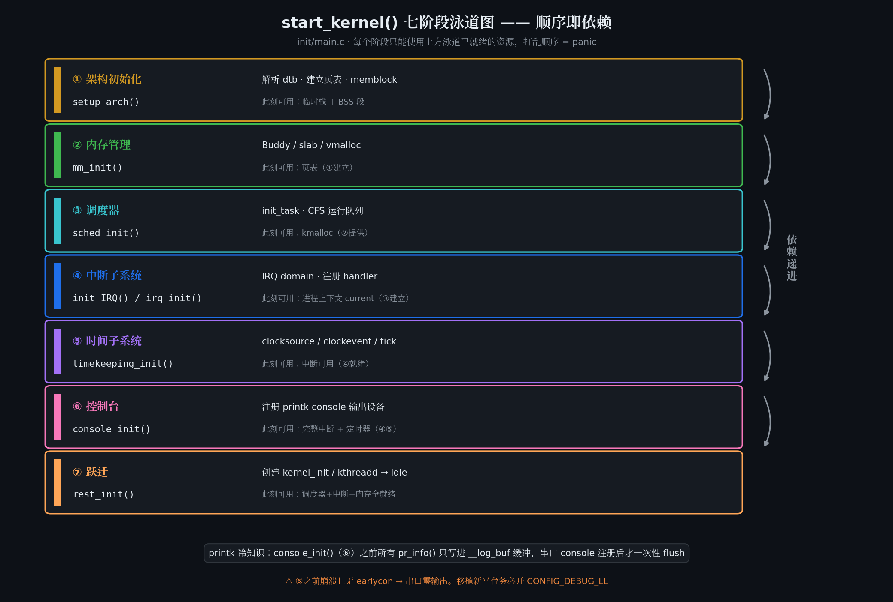
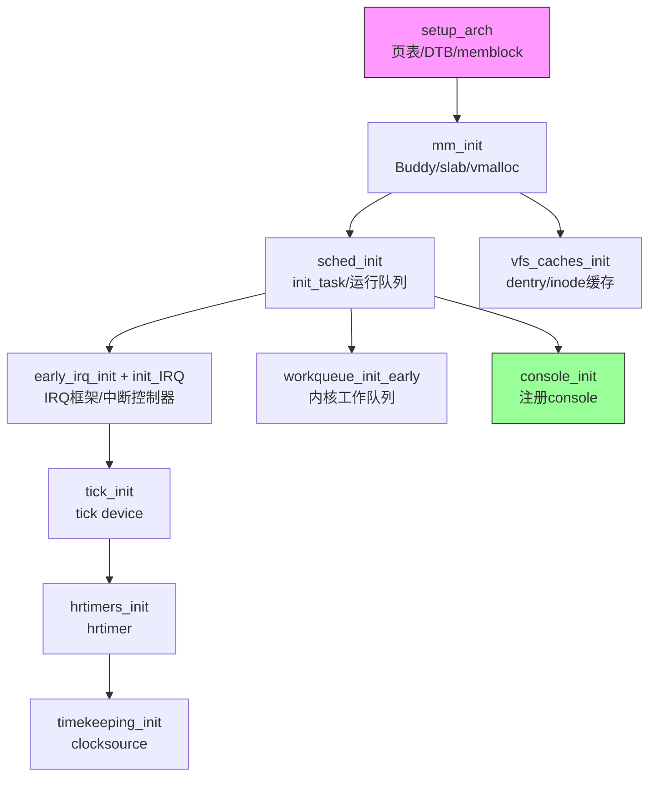

# 7.5.2 start_kernel：C语言世界的入口

> 所属章节：第7章 启动链深度解析 > 7.5 内核启动
> 
> 难度：[E] | 预计阅读时间：45分钟

## <span class="blue"> 本节导读

7.5.1 末尾，`__primary_switched` 清完 BSS、设好最终的栈，一条 `b start_kernel` 把执行流送进了 `init/main.c`——内核的第一个 C 函数。这个函数体里有近百个初始化调用，从解析设备树到创建第一个内核线程，顺序三十年没变过大格局。这个顺序不是编排习惯，是一张严格的依赖网：内存管理必须在调度器之前，调度器必须在中断子系统之前，任何一环换位都会当场 panic。<BR>
本节覆盖：`start_kernel` 的特殊身份与七阶段分组、初始化顺序背后的三条核心依赖链、`setup_arch` 阶段的关键动作、拿到任意一行启动日志如何对应回具体源码。

---

## <span class="blue"> "Booting Linux" 之后的几百毫秒静默 [E]

一块 i.MX8MP 板卡，`booti` 跳转后串口打印：

```
[    0.000000] Booting Linux on physical CPU 0x0000000000 [0x410fd034]
[    0.000000] Linux version 6.6.36-rt24-lts ...
```

然后静默约 300ms，才继续涌出大量日志。这 300ms 是 hang 死吗？不是——`start_kernel` 正在全力工作，只是它的输出无处可去。

原因在 printk 的工作方式：`console_init()` 之前，系统里还没有注册任何控制台设备，所有 `pr_info()` 的输出只能先攒在内存里的环形缓冲区 `__log_buf`（大小由 `CONFIG_LOG_BUF_SHIFT` 决定）。直到串口 console 注册成功的那一刻，缓冲的几百行日志才被一次性倒出来。所以启动早期的时间戳全是 `0.000000`，而"静默几百毫秒后日志喷涌"是每块板子的固定节目——静默的时长，恰好就是 `setup_arch()` 到 `console_init()` 之间全部初始化的耗时。

> 💡 想在这段静默期里看到日志，在 bootargs 里加 `earlycon`。earlycon 是早期控制台：绕过整个 printk 框架，按固定参数直接写 UART 寄存器，console 注册前就能输出。它比正式串口简陋（无缓冲、无格式化特性），但在"Starting kernel 之后无输出"的排查里是刚需。

### 速查：printk 日志级别与 earlycon 上手

earlycon 解决的是"黑窗期有没有输出"，配套的另一个问题是"输出多少"——这由 printk 的日志级别控制，两者是启动调试的一对基本旋钮。

- **一句话解释**：printk 用 8 个级别（0~7）给每条日志标优先级，只有级别数值小于控制台阈值的日志才会上串口；earlycon 则是在 console 注册前以轮询方式直写 UART 的临时输出通道。
- **为什么重要**：启动调试的第一动作往往是调日志级别——阈值不对，关键日志根本没机会显示；而 `console_init()` 之前的一切问题，没有 earlycon 就只能靠猜。
- **快速参考**：
  - 8 个级别：`KERN_EMERG`(0) → `KERN_ALERT`(1) → … → `KERN_INFO`(6) → `KERN_DEBUG`(7)，数值越小越紧急
  - 默认阈值：`CONFIG_CONSOLE_LOGLEVEL_DEFAULT`，通常为 7（即 DEBUG 级别不显示）
  - 启动期放开：bootargs 加 `loglevel=8`，或直接加 `debug`
  - earlycon 启用：bootargs 加 `earlycon=uart8250,mmio32,0xff1a0000`（基址换成本板 UART 的实际地址）
  - 运行时调整：`dmesg -n 8`，或写 `/proc/sys/kernel/printk`
- **全书螺旋关联**：printk 环形缓冲区、动态调试（dyndbg）等调试手段的体系化内容见第 23 章「系统调试方法论」；用日志时间戳分析启动耗时见第 24 章「启动全链路优化」。

### start_kernel 的特殊身份

`start_kernel()` 是整个内核里唯一一个既不在中断上下文、也不在进程上下文运行的 C 函数——此刻调度器还不存在，`current` 指向的 `init_task` 只是一个手工搭好的静态结构。这带来两条硬约束：

- 它在 `rest_init()` 之前**绝不返回**，也没有正常的退出路径；任何阶段 `panic()`，结果都是打印一条错误然后 halt，因为还没有进程可走 `do_exit()`
- 它调用的每个函数都必须假设"更底层的设施可能还不存在"——这正是初始化顺序如此严苛的根源

---

## <span class="blue"> 近百个调用怎么读：七阶段分组 [E]

逐个背函数名没有意义，按职责把近百个调用归进七个阶段，骨架就清楚了：

| 阶段 | 核心函数 | 关键职责 | 此阶段新可用的资源 |
|------|---------|---------|------------------|
| 1. 架构初始化 | `setup_arch()` | 解析 dtb、建内存布局、建最终页表 | 栈、BSS、memblock |
| 2. 内存管理 | `mm_init()` | Buddy 分配器、slab、vmalloc 空间 | `kmalloc` 生态 |
| 3. 调度器 | `sched_init()` | `init_task` 归位、每 CPU 运行队列 | 进程上下文 |
| 4. 中断子系统 | `early_irq_init()` / `init_IRQ()` | IRQ 描述符框架、中断控制器（`irqchip_init()`） | 硬中断可用 |
| 5. 时间子系统 | `tick_init()` / `hrtimers_init()` / `timekeeping_init()` | tick、高低精度定时器、clocksource | 定时器 |
| 6. 控制台与 VFS 缓存 | `console_init()` → `vfs_caches_init()` | 注册 console、dentry/inode 缓存 | 可见输出、文件缓存 |
| 7. 进入多任务 | `rest_init()` | 创建 `kernel_init` 与 `kthreadd` | 调度器全面接管 |

对应到源码骨架（Linux 6.6 LTS，`init/main.c`，有删节）：

```c
asmlinkage __visible void __init start_kernel(void)
{
    local_irq_disable();                /* 先关本地中断 */

    /* 阶段1：架构初始化（必须最先） */
    setup_arch(&command_line);          /* 解析dtb，内存布局，最终页表 */

    /* 阶段2：内存管理 */
    mm_init();                          /* Buddy / slab / vmalloc */

    /* 阶段3：调度器 */
    sched_init();                       /* init_task，每CPU运行队列 */

    /* 阶段4：中断 */
    early_irq_init();                   /* IRQ描述符框架 */
    init_IRQ();                         /* 架构中断控制器，内含irqchip_init() */

    /* 阶段5：时间 */
    tick_init();
    hrtimers_init();                    /* 高精度定时器 */
    timekeeping_init();                 /* 读clocksource */

    /* 阶段6：控制台与VFS缓存 */
    console_init();                     /* 注册console，日志开闸 */
    /* … fork_init / proc_caches_init / security_init 等数十个调用 … */
    vfs_caches_init();                  /* dentry/inode/mount缓存 */

    /* 阶段7：进入多任务世界 */
    rest_init();                        /* 创建kernel_init，永不返回 */
}
```



---

## <span class="blue"> 顺序为什么换不得：三条依赖链 [E]

做一个思想实验：把 `sched_init()` 挪到 `mm_init()` 之前会怎样？大概率在它的 `kzalloc()` 里当场翻车——开启组调度（`CONFIG_FAIR_GROUP_SCHED` / `CONFIG_RT_GROUP_SCHED`）时，`sched_init()` 要为根任务组分配一套 per-CPU 指针数组，而 `kzalloc` 依赖 slab，slab 依赖 Buddy 页分配器，Buddy 依赖 `mm_init()` 建好的 `mem_map` 和 `free_area`。地基没打，楼起不来。

初始化顺序构成的不是一条链，而是一张依赖图：


```mermaid
graph TD
    A[setup_arch<br/>页表/DTB/memblock] --> B[mm_init<br/>Buddy/slab/vmalloc]
    B --> C[sched_init<br/>init_task/运行队列]
    C --> D[early_irq_init + init_IRQ<br/>IRQ框架/中断控制器]
    C --> E[workqueue_init_early<br/>内核工作队列]
    D --> F[tick_init<br/>tick device]
    B --> H[vfs_caches_init<br/>dentry/inode缓存]
    F --> J[hrtimers_init<br/>hrtimer]
    J --> I[timekeeping_init<br/>clocksource]
    C --> K[console_init<br/>注册console]

    style A fill:#f9f,stroke:#333
    style K fill:#9f9,stroke:#333
```

抓主干的话，三条链最关键：

| 依赖链 | 前置提供 | 后置消费 | 违反后果 |
|--------|---------|---------|---------|
| **内存 → 调度** | Buddy/slab，`kmalloc` 可用 | 分配运行队列、task 结构 | 分配失败 panic |
| **调度 → 中断** | `init_task`、内核线程机制 | 软中断 fallback 到 `ksoftirqd` | 软中断无法执行 |
| **中断 → 时间** | IRQ 框架、timer 中断可用 | tick、hrtimer、timekeeping | jiffies 不走、定时器不触发 |

**链一：内存 → 调度。** `sched_init()`（`kernel/sched/core.c`）为每个可能的 CPU 分配运行队列，并把 `init_task` 挂上去：

```c
void __init sched_init(void)
{
    /* 开了组调度才走这段：为根任务组分配per-CPU指针数组 */
    if (ptr) {
        ptr = (unsigned long)kzalloc(ptr, GFP_NOWAIT);  /* 需要kmalloc就绪 */
        root_task_group.se = (struct sched_entity **)ptr;
        ...
    }

    for_each_possible_cpu(i) {
        struct rq *rq = cpu_rq(i);      /* 运行队列是per-CPU静态定义，直接初始化 */
        raw_spin_lock_init(&rq->__lock);
        ...
    }
    init_idle(current, smp_processor_id());    /* current = init_task */
}
```

那一句 `kzalloc` 就是整条链的具象化：调度器的第一块动态内存，由内存管理子系统提供。

**链二：调度 → 中断。** `init_IRQ()` 注册的中断 handler 本身不直接碰调度器，但软中断的执行需要进程上下文兜底：硬中断里 `raise_softirq()` 时，内核把软中断推迟给 `ksoftirqd` 内核线程执行。`sched_init()` 没完成，这个线程不存在，软中断就无人处理。

**链三：中断 → 时间。** tick 设备的心跳来自 timer 硬件中断，hrtimer 的到期处理也挂在中断路径上；`early_irq_init()` 和 `init_IRQ()` 没把 IRQ 框架和中断控制器立起来，时间子系统初始化得再完整也是一潭死水——jiffies 不走、定时器不触发。这也解释了源码里 `tick_init()` 紧跟在 `init_IRQ()` 之后的固定排位。

还有一条跨小节的链值得单独记住：`vfs_caches_init()` 必须在 `do_initcalls()` 之前。dentry/inode 缓存是文件系统世界的地基，7.5.3 要讲的几百个驱动初始化函数在 probe 时都要往 sysfs、devtmpfs 里创建节点，缓存没建好，这些节点无处安放。

> ⚠️ 移植新 SoC 时，`setup_arch()` 里调用的每个函数都可能踩中隐式依赖。某 RISC-V 移植案例中，PLIC 中断控制器在 `setup_arch` 阶段被手工初始化，注册 handler 的内部路径要唤醒线程化中断处理线程——前提是调度器已就绪，而此时它还没影。修复方式是删掉手写初始化，交给标准入口：中断控制器驱动用 `IRQCHIP_DECLARE` 声明自己，`init_IRQ()` 里的 `irqchip_init() → of_irq_init()` 会按设备树 compatible 在正确时机拉起它们。早期移植阶段建议开 `CONFIG_DEBUG_SPINLOCK`，违反顺序的锁操作会触发明确的 WARN，而不是静默 hang 死。

---

## <span class="blue"> setup_arch：七阶段的第一块基石 [E]

`setup_arch()`（`arch/arm64/kernel/setup.c`）是 `start_kernel` 的第一个大动作，做三件事。

**第一件：消费 dtb。** 把 dtb 从紧凑的二进制 blob 展开成 `struct device_node` 树的 `unflatten_device_tree()`，7.4.2 已逐字段讲过，这里只需记住它在 `setup_arch` 里的位置——dtb 是后续一切硬件认知的来源，所以它必须最先。展开之前，内核还会用 `early_init_dt_scan()` 直接扫原始 blob，提前取出 chosen 节点的 `bootargs` 和 memory 节点信息，不等树建完。

如果 dtb 的 `compatible` 与内核内置的 `machine_desc` 表对不上——比如 dts 写了 `"rockchip,rk3588-evb1"` 而内核只认 `"rockchip,rk3588"`——`setup_arch` 会直接 panic：`Error: unrecognized/unsupported device tree compatible list`。dtb 能被 `dtc` 编译通过只说明语法正确，不代表内核认这个机器标识；修复方向是让 dts 的 compatible 列表里包含内核已支持的前缀。

**第二件：建立 memblock。** Buddy 系统接管之前，内核需要一个更原始的物理内存分配器——memblock，解决"页分配器自己还没建好时谁来分内存"的鸡生蛋问题。注意可用内存的登记在更早的 `early_init_dt_scan()` 里就做了（7.4.2 的 Phase 0）；`arm64_memblock_init()` 接手后的工作是**裁剪与保留**——把内核寻址能力之外的物理内存裁掉、把内核镜像和 initrd 占用的区域登记为保留、最后扫描 reserved-memory 节点：

```c
/* arch/arm64/mm/init.c - arm64_memblock_init（v6.6，节录） */
void __init arm64_memblock_init(void)
{
    /* 1. 裁掉超出内核寻址能力的物理内存，选定线性映射基址 */
    memblock_remove(1ULL << PHYS_MASK_SHIFT, ULLONG_MAX);
    memstart_addr = round_down(memblock_start_of_DRAM(), ARM64_MEMSTART_ALIGN);
    ...

    /* 2. 内核镜像自身占用的区域登记为保留，防被挪用 */
    memblock_reserve(__pa_symbol(_stext), _end - _stext);

    /* 3. 扫描 dtb 的 reserved-memory 节点，标记占用/nomap */
    early_init_fdt_scan_reserved_mem();

    high_memory = __va(memblock_end_of_DRAM() - 1) + 1;
}
```

**第三件：建最终页表。** `paging_init()` 遍历 memblock 里的内存区域，建立物理内存到内核虚拟地址空间的线性映射。这一步正式接过 7.5.1 里 `swapper_pg_dir` 的早期映射，把它扩充成覆盖全部物理内存的最终形态——ID Map 的临时世界到这里彻底成为历史。

---

## <span class="blue"> 拿到任意一行日志，怎么对应回源码 [I→E]

本章的立身之本是"启动日志 ↔ 源码"的映射。`start_kernel` 阶段的高频日志对应关系：

| 启动日志 | 打印位置（源码） | 所属阶段 |
|---------|----------------|---------|
| `Booting Linux on physical CPU 0x0` | `arch/arm64/kernel/setup.c` 的 `setup_arch()` | 阶段 1 开始 |
| `Linux version 6.6.x ...` | `init/main.c` 的 `start_kernel()` 开头 | 进入 C 世界 |
| `Machine model: xxx` | `setup_machine_fdt()` 读 dtb 的 `model` | 阶段 1 |
| `earlycon: ... at MMIO 0x...` | earlycon 注册 | 阶段 1（如启用） |
| `PID hash table entries: ...` | `pidhash_init()` | 阶段 1~2 之间（mm_init 之前） |
| `Dentry cache hash table entries: ...` | `dcache_init()` ← `vfs_caches_init()` | 阶段 6 |
| `Mount-cache hash table entries: ...` | `mnt_init()` ← `vfs_caches_init()` | 阶段 6 |
| `sched_clock: 56 bits at ...` | `timekeeping_init()` 附近 | 阶段 5 |
| `console [ttyS0] enabled` | `register_console()` ← `console_init()` | 阶段 6，日志开闸 |

反查方法固定为三步：把日志里的特征字符串（去掉变量部分）拿到内核源码里 grep，定位到打印它的函数，再对照七阶段表确认此刻哪些设施已就绪。比如看到 `Dentry cache hash table entries` 之后 hang 死，故障窗口就锁定在 `vfs_caches_init()` 之后到 `rest_init()` 之前的那串调用（pagecache_init、proc_root_init、cgroup_init 等）——注意此时 console 早已注册（`console_init()` 在 `vfs_caches_init()` 之前），所以日志是能正常出的，卡住的就是打印间隙里的某个调用。比"系统在启动中卡死"精确了三个数量级。

> 💡 时间戳是另一个定位工具：早期日志时间戳全是 `0.000000`，说明时钟还没校准；从某一行开始时间戳跳动，说明 clocksource 已工作。两行之间的日志量，就是对应阶段的实际耗时。

`rest_init()` 之后，`start_kernel` 的故事结束：它创建 `kernel_init`（PID 1）和 `kthreadd`（PID 2）两个内核线程，自己退化为 0 号 idle 进程。剩下的几百个驱动和子系统初始化函数，由 `kernel_init` 里的 `do_initcalls()` 接手——那是 7.5.3 的八级 initcall 机制，线程诞生的细节则在 7.5.4。

---

## <span class="blue"> 本节总结

| 要点 | 内容 |
|------|------|
| **静默期的真相** | `console_init()` 前 printk 只进 `__log_buf`，console 注册后一次性倒出；要看早期日志加 `earlycon` |
| **特殊身份** | 唯一既非中断上下文也非进程上下文的 C 函数；`rest_init()` 前绝不返回，panic 即 halt |
| **七阶段分组** | 架构 → 内存 → 调度 → 中断 → 时间 → VFS缓存/控制台 → `rest_init` |
| **三条核心依赖链** | 内存→调度（kmalloc）、调度→中断（ksoftirqd）、中断→时间（timer IRQ） |
| **setup_arch 三件事** | 消费 dtb（unflatten 见 7.4.2）、建 memblock、`paging_init` 建最终页表 |
| **compatible panic** | dtb 语法对 ≠ 内核认得；compatible 须含内核 `machine_desc` 表中的前缀 |
| **日志反查法** | 特征字符串 grep 源码 → 定位函数 → 对照七阶段确认已就绪设施 |
| **交接** | `rest_init()` 创建 `kernel_init` 与 `kthreadd`，驱动初始化移交 `do_initcalls()`（7.5.3） |

> 🔴 这张顺序表的价值不在背诵，而在故障定位：知道每个阶段"此刻什么是可用的"，就能把一句模糊的"启动卡死"收敛成"卡在某某子系统初始化"。这是面对新 SoC 移植时最值钱的诊断地图。

---

## <span class="blue"> 下一步

`rest_init()` 创建 `kernel_init` 之后，剩下几百个子系统和驱动的初始化函数由 `do_initcalls()` 统一执行。7.5.3 拆开这套八级 initcall 机制：宏怎么在编译期把函数指针排进指定的段、运行时怎么按级遍历、以及"日志里最后一行 initcall"这个最实用的定位手法。

---

## <span class="blue"> 延伸阅读

- Linux 内核源码：`init/main.c`（`start_kernel` 全文）
- Linux 内核源码：`arch/arm64/kernel/setup.c`（`setup_arch` 与 `setup_machine_fdt`）
- Linux 内核源码：`arch/arm64/mm/init.c`（`arm64_memblock_init`、`paging_init`）
- Linux 内核源码：`kernel/sched/core.c`（`sched_init`）
- Linux 内核文档：`Documentation/admin-guide/kernel-parameters.rst`（`earlycon`、`loglevel`、`initcall_debug`）
