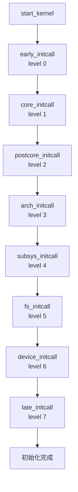

# 7.5.3 initcalls：八级初始化机制

> 所属：第7章 内核启动与初始化 > 7.5 内核启动流程
> 难度：[I→E] | 预计阅读时间：35分钟

## 本节导读

Linux内核包含数百个子系统、数千个驱动，如何保证它们按正确顺序初始化？当某驱动在`device_initcall`中注册却依赖尚未初始化的子系统时，系统如何表现？本节深入`initcall`八级初始化机制的源码实现，从链接器脚本到运行时遍历，帮你建立"初始化顺序问题"的系统化排查能力。

---

## 知识点1：为什么需要initcalls [I] ~600字

### 问题场景

假设你是某SoC平台的BSP工程师，负责移植一款新芯片。在bring-up阶段，你发现温度传感器`sht3x`驱动加载时总线通信失败，而同一总线上的EEPROM驱动却工作正常。深入排查后发现，`sht3x`驱动在启动早期被调用时，其依赖的`regmap-I2C`层尚未完全就绪。

这个场景引出了一个根本性问题：Linux内核包含数百个子系统、数千个驱动，如何保证它们按正确的先后顺序初始化？

你面临的具体约束包括：

1. **子系统间存在显性依赖**：`regmap`子系统必须在`i2c`控制器驱动之前初始化，否则温度传感器驱动无法通过I2C总线读写寄存器。
2. **架构相关代码需要先就绪**：ARM的`machine_desc`必须在架构独立代码之前解析，否则内存映射信息缺失。
3. **驱动数量庞大且动态变化**：一个典型嵌入式内核配置可能包含300+驱动，手动维护初始化顺序不现实。
4. **模块化与静态编译的统一**：无论驱动是`y`编译进内核还是`m`动态加载，都需要清晰的初始化语义。

从更宏观的视角看，内核初始化是一个典型的"依赖图遍历"问题。如果让开发者手动指定每个驱动的初始化顺序，不仅会形成维护噩梦，还会因为依赖关系的动态变化（如Kconfig配置变更导致某子系统未编译）而引入脆弱性。initcall机制本质上是一种**声明式**的解决方案——驱动作者只需声明"我是什么类型的初始化"，由框架保证执行顺序。

🔴 **安全提醒**：初始化顺序错误可能导致`NULL pointer dereference`（访问未初始化子系统的函数指针）或`silent failure`（驱动注册成功但硬件不工作，无错误日志）。后者在生产环境中尤为危险——系统"似乎"正常启动，但某路传感器未启用。

### 设计目标

initcall机制的设计目标可归纳为四点：

| 目标 | 说明 |
|------|------|
| **确定性顺序** | 通过编译期优先级标记，确保执行顺序可预测 |
| **可扩展性** | 新增驱动/子系统无需修改既有代码的初始化顺序 |
| **零运行时开销** | 初始化完成后，initcall段内存可被回收（`__init`属性） |
| **跨架构统一** | x86/ARM/RISC-V共用同一套抽象，架构差异在`arch_initcall`层处理 |

💡 **技巧**：内核启动后可通过`dmesg | grep "initcall"`查看各initcall的执行耗时和结果，这对启动优化至关重要。

---

## 知识点2：八级优先级 [E] ~1200字

### 优先级全景

initcall机制将初始化划分为8个优先级（0-7），数字越小越早执行。每一级都有明确的语义边界和典型使用场景。



### 八级优先级详解表

| 级别 | 宏定义 | 优先级值 | 语义定位 | 典型初始化内容 |
|:--:|:--|:--:|:--|:--|
| 0 | `early_initcall(fn)` | 0 | **最早期基础设施** | 内存管理子系统早期设置、`wq`早期初始化、`cpuidle`早期框架 |
| 1 | `core_initcall(fn)` | 1 | **核心内核服务** | `kernel`参数解析、`tracepoint`、基础`kobject`、通知链框架、`irq_work` |
| 2 | `postcore_initcall(fn)` | 2 | **核心延伸设施** | `regmap`核心、`pci`基础结构、`clk`核心框架、`regulator`核心、`dma-mapping` |
| 3 | `arch_initcall(fn)` | 3 | **架构相关代码** | `machine_desc`匹配、SoC-specific时钟/复位初始化、CPU热插拔早期、`unwind`支持 |
| 4 | `subsys_initcall(fn)` | 4 | **子系统层** | `i2c`核心、`spi`核心、`pwm`核心、`input`子系统、`rtc`核心、`watchdog`核心 |
| 5 | `fs_initcall(fn)` | 5 | **文件系统层** | `ext4`、`squashfs`、`procfs`、`sysfs`、`devtmpfs`挂载、`crypto`算法注册 |
| 6 | `device_initcall(fn)` | 6 | **设备驱动层** | 具体设备驱动：`i2c`控制器驱动、`spi`控制器驱动、`uart`驱动、`gpio`控制器、`mmc`主机驱动 |
| 7 | `late_initcall(fn)` | 7 | **收尾与延迟初始化** | 调试功能启用、性能计数器后期配置、`deferred probe`处理、模块参数最终校验 |

### 各级典型初始化内容深度表

| 级别 | 关键数据结构/函数 | 为何在此级别 |
|:--:|:--|:--|
| 0 | `mm_init`、`workqueue_init_early` | 内存分配器和workqueue是后续所有初始化的基础 |
| 1 | `kobject_init_and_add`、`tracepoint_init` | 设备模型和跟踪依赖的基础kobject需要最早就绪 |
| 2 | `regmap_init`、`clk_init` | regmap/clk是许多SoC驱动的"元依赖"，必须在总线之前 |
| 3 | `setup_machine`、`arm64_memblock_init` | 必须解析设备树/机器描述后，才知道有什么硬件 |
| 4 | `i2c_init`、`spi_init`、`pwmchip_add` | 总线/子系统核心必须在具体设备驱动之前 |
| 5 | `vfs_caches_init`、`mnt_init` | 文件系统需要块设备层就绪，但又必须在应用层之前 |
| 6 | `platform_driver_register`、各`*_probe` | 依赖前面所有层级提供的基础设施 |
| 7 | `deferred_probe_initcall`、`debugfs_init` | 处理前面因依赖未满足而推迟的probe，以及调试设施 |

### 关键记忆法则

```
Memory/Core → Framework → Arch → Bus/Subsystem → FS → Device → Late
   0    1        2          3          4            5       6        7
```

💡 **技巧**：记住"**M**emory before **C**ore before **F**ramework before **A**rch before **B**us before **F**S before **D**evice before **L**ate"——按首字母`MCFABFDL`的顺序，对应0→7。

### 同级别内的顺序问题

⚠️ **陷阱**：很多工程师误以为initcall能精确控制每个函数的调用顺序。**同一级别内的执行顺序由链接顺序决定**，而链接顺序取决于`Makefile`中`obj-y`列表的排列和链接器的输入顺序。这意味着：

```makefile
# drivers/Makefile
obj-y += i2c/          # i2c子系统先链接
obj-y += hwmon/        # hwmon驱动后链接
```

如果`sht3x`（`drivers/hwmon/`）和`i2c-omap`（`drivers/i2c/`）都是`device_initcall`，上述`Makefile`顺序确保了`i2c`子系统先初始化。但这种隐式依赖是脆弱的——如果有人在`drivers/Makefile`中调整了目录顺序，或者将驱动移到了其他目录，就可能破坏初始化顺序。

🔴 **安全提醒**：永远不要依赖同级别的链接顺序来保证正确性。如果存在跨文件的依赖关系，应使用不同的initcall级别，或者通过`deferred probe`机制处理。

---

## 知识点3：实现机制 [E] ~1500字

### 3.1 __define_initcall宏：编译期的优先级标记

initcall机制的核心魔法在于**链接器脚本**与**宏扩展**的配合。先看宏定义（`include/linux/init.h`）：

```c
/* include/linux/init.h */

/* 基础宏：将函数指针放入指定的initcall段 */
#define __define_initcall(fn, id) \
    static initcall_t __initcall_##fn##id __used \
    __attribute__((__section__(".initcall" #id ".init"))) = fn

/* 八级宏定义 */
#define early_initcall(fn)      __define_initcall(fn, 0)
#define core_initcall(fn)       __define_initcall(fn, 1)
#define postcore_initcall(fn)   __define_initcall(fn, 2)
#define arch_initcall(fn)       __define_initcall(fn, 3)
#define subsys_initcall(fn)     __define_initcall(fn, 4)
#define fs_initcall(fn)         __define_initcall(fn, 5)
#define device_initcall(fn)     __define_initcall(fn, 6)
#define late_initcall(fn)       __define_initcall(fn, 7)
```

**宏展开示例**：

```c
/* 驱动代码中的声明 */
static int __init my_driver_init(void)
{
    return platform_driver_register(&my_driver);
}
device_initcall(my_driver_init);

/* 预处理后展开为：
 * static initcall_t __initcall_my_driver_init6 __used
 * __attribute__((__section__(".initcall6.init"))) = my_driver_init;
 */
```

这个展开做了两件关键的事：

1. **声明一个静态函数指针变量** `__initcall_my_driver_init6`，类型为`initcall_t`（即`typedef int (*initcall_t)(void)`）
2. **通过`__attribute__((__section__))`将该变量放入`.initcall6.init`段**

### 3.2 链接器脚本中的initcall段

链接器脚本（以ARM64为例，`arch/arm64/kernel/vmlinux.lds.S`）定义了这些段的布局：

```ld
/* arch/arm64/kernel/vmlinux.lds.S */

.init.data : {
    ...
    /* 按顺序收集所有initcall段 */
    __initcall_start = .;
    KEEP(*(.initcall0.init))
    KEEP(*(.initcall1.init))
    KEEP(*(.initcall2.init))
    KEEP(*(.initcall3.init))
    KEEP(*(.initcall4.init))
    KEEP(*(.initcall5.init))
    KEEP(*(.initcall6.init))
    KEEP(*(.initcall7.init))
    __initcall_end = .;
    ...
}
```

`KEEP`指令确保即使某些段在链接时看起来"未被引用"，也不会被优化丢弃。`__initcall_start`和`__initcall_end`两个符号标记了initcall数组的起止位置，供运行时遍历使用。

### 3.3 do_initcalls()：运行时遍历执行

`init/main.c`中的`do_initcalls()`是实际执行初始化的函数：

```c
/* init/main.c */

extern initcall_t __initcall_start[];
extern initcall_t __initcall_end[];

static void __init do_initcalls(void)
{
    initcall_t *fn;

    for (fn = __initcall_start; fn < __initcall_end; fn++) {
        do_one_initcall(*fn);
    }
}

int __init do_one_initcall(initcall_t fn)
{
    int count = preempt_count();
    int ret;

    /* 记录开始时间 */
    initcall_debug_start(fn);

    /* 关键：执行初始化函数 */
    ret = fn();

    initcall_debug_end(fn, ret);

    /* 校验：初始化函数不得改变preempt_count */
    if (preempt_count() != count) {
        pr_err("initcall %pS returned with changed preempt_count!\n", fn);
    }

    /* 后续处理：同步rcu、释放工作队列等 */
    flush_scheduled_work();
    return ret;
}
```

**遍历的本质**：`__initcall_start`到`__initcall_end`之间是一片连续的函数指针数组。由于链接器脚本按0-7的顺序排列各段，遍历顺序自然就是优先级顺序。

### 3.4 启动调用链


关键代码路径追踪：

```c
/* init/main.c */
static void __init do_basic_setup(void)
{
    ...
    /* 初始化驱动模型核心 */
    driver_init();
    /* 初始化IRQ子系统 */
    init_irq_proc();
    /* 执行所有initcalls */
    do_initcalls();
    /* 处理推迟的probe */
    do_deferred_initcalls();
}
```

### Trade-off表格：initcall机制的设计权衡

| 维度 | initcall方案 | 替代方案（如手动排序） | 分析 |
|:--|:--|:--|:--|
| **可维护性** | 宏标记，新增代码无需改既有顺序 | 需维护全局初始化列表 | initcall胜：避免中央列表的合并冲突 |
| **调试难度** | 分散在各文件中，需`grep`追踪 | 集中在单一文件 | 手动排序胜：一目了然 |
| **灵活性** | 8级固定，细粒度不够 | 任意指定序号 | 手动排序胜：但过度灵活易混乱 |
| **运行时开销** | 遍历函数指针数组，O(n) | 直接调用，O(1) | 手动排序胜：但n<1000，差异可忽略 |
| **内存占用** | initcall段启动后可回收 | 代码常驻 | initcall胜：`__init`标记释放约50-200KB |
| **模块支持** | `module_init()`映射到`device_initcall` | 需额外机制 | initcall胜：统一静态/动态加载 |

---

## 实践案例：probe失败的根因定位

### 场景描述

某项目中，温度传感器驱动`sht3x`编译进内核，启动日志显示：

```
[    1.234567] sht3x 0-0044: probe deferral - i2c controller not ready
[    3.456789] sht3x 0-0044: probe failed with error -517
```

但`i2c`控制器驱动（`i2c-omap`）在`dmesg`中显示已成功注册。问题出在哪里？

### 根因分析

深入查看代码发现：

```c
/* drivers/i2c/busses/i2c-omap.c */
static int __init omap_i2c_init_driver(void)
{
    return platform_driver_register(&omap_i2c_driver);
}
module_platform_driver(omap_i2c_init_driver);  /* 展开为 device_initcall */

/* drivers/hwmon/sht3x.c */
static int __init sht3x_init(void)
{
    return i2c_add_driver(&sht3x_driver);  /* 也是 device_initcall */
}
module_i2c_driver(sht3x);  /* 展开为 device_initcall */
```

⚠️ **陷阱**：两者都是`device_initcall(level 6)`！同一级别内，执行顺序由链接顺序决定，而非依赖关系。

根本原因是：
1. `sht3x`驱动注册时调用了`i2c_add_driver()`
2. `i2c_add_driver()`触发`i2c_bus_type`的`match`和`probe`
3. 此时`i2c-omap`控制器虽然已注册`platform_driver`，但其`.probe()`可能尚未执行（同级别的另一个initcall）
4. 总线控制器硬件未实际使能，导致`sht3x`的I2C通信失败

### 解决方案对比

| 方案 | 实现方式 | 适用场景 | 风险 |
|:--|:--|:--|:--|
| **A. 调整initcall级别** | 将控制器改为`subsys_initcall`，设备保持`device_initcall` | 控制器确无其他同级别依赖 | 控制器若依赖`fs_initcall`级别的功能会失败 |
| **B. 使用deferred probe** | 驱动返回`-EPROBE_DEFER`，依赖内核延迟重试机制 | 复杂依赖链、控制器初始化时间较长 | 启动延迟增加 |
| **C. 修改built-in链接顺序** | 调整`Makefile`中的`obj-y`顺序，让控制器先链接 | 快速验证、依赖链简单 | 脆弱，新增驱动可能打破顺序 |
| **D. 设备树`depends-on`** | 利用设备树`power-domains`、`resets`属性表达依赖 | 现代内核、设备树完备的平台 | 需要平台固件配合 |

**推荐方案B**：在现代内核（v3.18+）中，`deferred probe`是处理此类问题的标准做法。驱动作者应在`probe()`函数中：

```c
static int sht3x_probe(struct i2c_client *client)
{
    struct i2c_adapter *adapter = client->adapter;
    
    /* 显式检查总线功能 */
    if (!i2c_check_functionality(adapter, I2C_FUNC_I2C))
        return -EPROBE_DEFER;  /* 不是-EINVAL，让内核稍后重试 */
    
    /* 或者：获取regmap时 */
    data->regmap = devm_regmap_init_i2c(client, &sht3x_regmap_config);
    if (IS_ERR(data->regmap)) {
        ret = PTR_ERR(data->regmap);
        if (ret == -EPROBE_DEFER)
            return ret;
        return dev_err_probe(&client->dev, ret, "regmap init failed\n");
    }
    ...
}
```

💡 **技巧**：使用`dev_err_probe()`（内核v5.2+引入）代替`dev_err()` + `return`，它自动处理`-EPROBE_DEFER`的日志抑制——避免同一驱动的deferral消息刷屏。

---

## 本节总结

initcall八级初始化机制是Linux内核解决"子系统有序初始化"问题的工程杰作。核心要点回顾：

1. **八级顺序**：`early(0)→core(1)→postcore(2)→arch(3)→subsys(4)→fs(5)→device(6)→late(7)`，每级语义清晰。
2. **实现三要素**：`__define_initcall`宏（编译期标记段）→ 链接器脚本（按序排列段）→ `do_initcalls()`（运行时遍历）。
3. **probe失败排查**：同级别的initcall顺序由链接顺序决定，非依赖关系。遇到`-517`（`EPROBE_DEFER`）时，检查依赖项是否在同级别或更晚级别。
4. **内存优化**：所有`__init`标记的函数和`.init.*`段数据在启动后被释放，降低运行时内存占用。

### 3.5 initcall_debug：启动优化的利器

内核提供了`initcall_debug`命令行参数，启用后会打印每个initcall的执行耗时：

```
# 在bootargs中添加：initcall_debug
[    0.123456] initcall omap_i2c_init_driver+0x0/0x48 returned 0 after 234 usecs
[    0.234567] initcall sht3x_init+0x0/0x30 returned 0 after 45 usecs
[    1.345678] initcall deferred_probe_initcall+0x0/0x90 returned 0 after 876543 usecs
```

通过分析这些日志，可以快速定位启动耗时瓶颈。例如上例中`deferred_probe_initcall`花费了876ms，说明存在大量deferred probe重试，需要检查依赖链。

### 3.6 __init属性的内存回收机制

所有通过initcall注册的初始化函数都带有`__init`属性：

```c
#define __init      __section__(".init.text") __cold notrace
#define __initdata  __section__(".init.data")
```

在`free_initmem()`调用后，这些段占用的物理内存会被释放并归还给伙伴系统。一个典型嵌入式内核可回收50-200KB的`.init`段内存——对于只有64MB RAM的设备来说，这是不小的收益。

💡 **技巧**：编写初始化函数时，确保只访问同样标记为`__init`或`__initdata`的数据。如果某个数据结构在初始化后仍需使用（如设备树解析后的配置缓存），必须将其标记为普通数据或动态分配，否则释放`.init`段后访问会导致page fault。

⚠️ **常见陷阱速查**：

| 现象 | 可能原因 | 排查方向 |
|:--|:--|:--|
| 驱动注册但probe不执行 | 依赖的资源（时钟、复位）在同/后级别 | `dmesg`查看deferred probe日志 |
| `NULL dereference`在initcall中 | 依赖的子系统尚未初始化到可用状态 | 检查initcall级别是否匹配 |
| 启动时间异常长 | 大量deferred probe重试 | `initcall_debug`查看耗时 |
| 模块加载正常，built-in失败 | `module_init`映射到`device_initcall`，静态/动态路径差异 | 检查`CONFIG_MODULE`相关配置 |

---

## 配套资源

### 表格清单

1. **八级优先级详解表**：覆盖宏定义、优先级值、语义定位、典型内容
2. **各级典型初始化内容深度表**：每级的关键数据结构/函数及选型理由
3. **Trade-off表格**：initcall机制 vs 手动排序的六维度对比
4. **解决方案对比表**：probe deferral问题的四种解决方案
5. **常见陷阱速查表**：四种典型现象与排查方向

### 图示清单（mermaid代码）

1. **initcalls执行流程图**（八级顺序流程图）
2. **启动调用链流程图**（从`start_kernel`到`do_initcalls`的完整调用链）

### 代码清单

1. **`__define_initcall`宏定义**（`include/linux/init.h`）
2. **链接器脚本initcall段**（`arch/arm64/kernel/vmlinux.lds.S`）
3. **`do_initcalls()`和`do_one_initcall()`**（`init/main.c`）
4. **驱动initcall声明展开示例**（实际驱动中的`device_initcall`用法）
5. **`probe()`中`EPROBE_DEFER`处理模式**（`sht3x`驱动示例）

### 扩展阅读

- `Documentation/driver-api/driver-model/driver.rst` — 驱动模型官方文档
- `include/asm-generic/vmlinux.lds.h` — 通用链接器脚本宏定义
- `init/main.c:do_one_initcall()` — 实际执行代码，含`initcall_debug`支持

