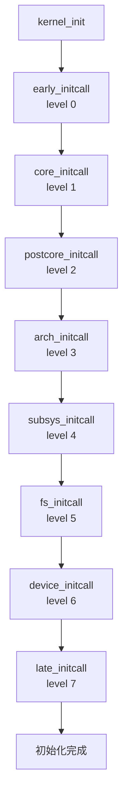
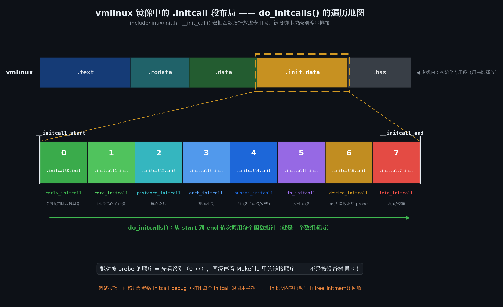
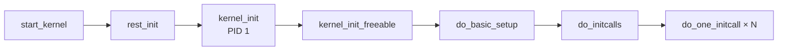

# 7.5.3 initcalls：八级初始化机制

> 所属：第7章 系统启动全链路 > 7.5 内核启动：从_start到init
> 
> 难度：[I→E] | 预计阅读时间：35分钟

## <span class="blue"> 本节导读

7.5.2 走完 `start_kernel` 的七个阶段，调度器、内存、中断、VFS 缓存全部就绪，`kernel_init` 线程接过了接力棒。但此时还有几百个子系统和驱动的初始化函数没跑——它们散落在内核源码的几百个文件里，彼此还有严格的先后要求：I2C 核心必须在 I2C 控制器驱动之前，控制器又必须在挂在总线上的传感器之前。这个排序问题不是靠一份中央清单解决的，而是靠一套编译期排队机制：initcall。<BR>
本节覆盖：initcall 八级优先级的语义边界、`__define_initcall` 宏与链接器段如何在编译期完成排队、`do_initcalls()` 的运行时遍历、用 `initcall_debug` 日志定位出错模块与 deferred probe 的正确用法。

---

## <span class="blue"> 同一根 I2C 总线上，EEPROM 活了，温度传感器死了 [I]

一块新板的 bring-up 阶段，I2C 总线上的 EEPROM 驱动工作正常，温度传感器 sht3x 却通信失败。查到最后，原因不在硬件也不在驱动逻辑：sht3x 的初始化函数被调用时，它依赖的 I2C 控制器驱动虽然"已经注册"，但 probe 还没真正执行完——两个驱动用了同一个初始化级别，谁先跑由链接顺序决定，而不是由依赖关系决定。

这个案例背后是内核初始化的一个根本约束：一个典型嵌入式内核配置包含 300 个以上的驱动和子系统，它们构成一张依赖网，而这张网还会随 Kconfig 配置变化。让开发者手工维护一份全局初始化顺序清单，既容易写错，又会因每次配置变更而失效。initcall 机制给出的是声明式答案：驱动作者只声明"我属于哪一类初始化"，顺序由框架保证。

### 八级优先级

initcall 把全部初始化函数分成 8 级，数字越小越早执行：


```mermaid
flowchart TD
    A[kernel_init] --> B[early_initcall<br/>level 0]
    B --> C[core_initcall<br/>level 1]
    C --> D[postcore_initcall<br/>level 2]
    D --> E[arch_initcall<br/>level 3]
    E --> F[subsys_initcall<br/>level 4]
    F --> G[fs_initcall<br/>level 5]
    G --> H[device_initcall<br/>level 6]
    H --> I[late_initcall<br/>level 7]
    I --> J[初始化完成]
```

| 级别 | 宏 | 语义定位 | 典型内容 |
|:--:|:--|:--|:--|
| 0 | `early_initcall` | 最早期基础设施 | workqueue 早期初始化、cpuidle 框架 |
| 1 | `core_initcall` | 核心内核服务 | 参数解析、tracepoint、通知链 |
| 2 | `postcore_initcall` | 核心延伸设施 | regmap、clk、regulator 核心框架 |
| 3 | `arch_initcall` | 架构相关代码 | machine_desc、SoC 时钟/复位、irqchip |
| 4 | `subsys_initcall` | 子系统层 | i2c/spi/pwm/input/rtc 核心 |
| 5 | `fs_initcall` | 文件系统层 | ext4、procfs、sysfs、devtmpfs、crypto |
| 6 | `device_initcall` | 设备驱动层 | 各控制器与设备驱动的注册 |
| 7 | `late_initcall` | 收尾 | deferred probe 处理、调试设施 |

级别的语义就是依赖方向：框架（0~2）在总线（4）之前，总线在具体驱动（6）之前，兜底的延迟处理（7）在最后。驱动作者选型时只需回答一个问题——"我的依赖最晚到哪一级就绪"，然后把自己放到更晚的级别。

> ⚠️ 同一级别之内没有顺序保证，执行顺序由链接顺序决定——也就是 `Makefile` 里 `obj-y` 列表的排列。`drivers/Makefile` 中 `obj-y += i2c/` 排在 `obj-y += hwmon/` 前，纯属巧合地救了 sht3x 这一类驱动。目录一调整、驱动一搬家，顺序就破。跨文件的依赖关系要么用不同级别表达，要么交给 deferred probe，永远不要把正确性押在链接顺序上。

> 🔴 初始化顺序错误有两种死法：显式的 NULL pointer dereference（访问尚未初始化的子系统），和静默失败（驱动注册成功但硬件不工作、无任何日志）。后者在生产环境更危险——系统"看起来"正常，某路传感器却一直没启用。

---

## <span class="blue"> 编译期排队：宏把函数指针放进指定段 [E]

initcall 的排序不靠运行时计算，靠的是编译期和链接期的一次性排队。理解它需要一个背景概念：链接器段（section）。编译产物不是一坨无结构的二进制，而是按用途分段的——代码进 `.text`、已初始化数据进 `.data`、未初始化数据进 `.bss`；链接器脚本可以把所有输入文件里的同名段收集到一起连续摆放，并在段的头尾定义符号。initcall 就是借这个机制，把几百个函数指针按级别排成一张有序的表。

### 宏：一个函数指针，放进 `.initcallN.init` 段

核心定义在 `include/linux/init.h`：

```c
#define __define_initcall(fn, id) \
    static initcall_t __initcall_##fn##id __used \
    __attribute__((__section__(".initcall" #id ".init"))) = fn

#define early_initcall(fn)      __define_initcall(fn, 0)
#define core_initcall(fn)       __define_initcall(fn, 1)
#define postcore_initcall(fn)   __define_initcall(fn, 2)
#define arch_initcall(fn)       __define_initcall(fn, 3)
#define subsys_initcall(fn)     __define_initcall(fn, 4)
#define fs_initcall(fn)         __define_initcall(fn, 5)
#define device_initcall(fn)     __define_initcall(fn, 6)
#define late_initcall(fn)       __define_initcall(fn, 7)
```

以驱动里最常见的写法为例，看它展开成什么：

```c
static int __init my_driver_init(void)
{
    return platform_driver_register(&my_driver);
}
device_initcall(my_driver_init);

/* 预处理后等价于：
 * static initcall_t __initcall_my_driver_init6 __used
 * __attribute__((__section__(".initcall6.init"))) = my_driver_init;
 */
```

展开只做了两件事：声明一个静态函数指针变量，值是这个初始化函数；再用 `__attribute__((__section__))` 把这个变量塞进名为 `.initcall6.init` 的段。全内核几百个驱动各写各的，互不通信，但所有 6 级初始化函数的指针都落进了同一个段。

### 链接器脚本：把八个段按序首尾相接

链接器脚本（ARM64 为 `arch/arm64/kernel/vmlinux.lds.S`）负责把这些段按级别顺序拼起来：

```ld
.init.data : {
    ...
    __initcall_start = .;
    KEEP(*(.initcall0.init))
    KEEP(*(.initcall1.init))
    KEEP(*(.initcall2.init))
    KEEP(*(.initcall3.init))
    KEEP(*(.initcall4.init))
    KEEP(*(.initcall5.init))
    KEEP(*(.initcall6.init))
    KEEP(*(.initcall7.init))
    __initcall_end = .;
    ...
}
```

`KEEP` 防止链接器把"看起来没被引用"的段优化掉——这些函数指针确实没人直接引用，是靠运行时遍历调用的。`__initcall_start` 和 `__initcall_end` 两个符号标记整张表的起止。至此排序完成：`__initcall_start` 到 `__initcall_end` 之间是一片连续的函数指针数组，0 级在前 7 级在后。



> 💡 `module_init()` 与这套机制是同一语义的两个出口：驱动编译进内核（`y`）时，`module_init` 就展开为 `device_initcall`；编译成模块（`m`）时，它变成 `insmod` 时的模块入口。同一份驱动代码，静态和动态两条路径的初始化语义因此统一。

---

## <span class="blue"> 运行时遍历：do_initcalls [E]

编译期排好的表，运行时要有人挨个执行。这条执行链从 7.5.2 的 `rest_init()` 接过来：


```mermaid
flowchart LR
    A[start_kernel] --> B[rest_init]
    B --> C[kernel_init<br/>PID 1]
    C --> D[kernel_init_freeable]
    D --> E[do_basic_setup]
    E --> F[do_initcalls]
    F --> G[do_one_initcall × N]
```

`kernel_init` 线程的诞生过程是 7.5.4 的主题，本节只取其中一环：`do_basic_setup()` 里的 `do_initcalls()`（`init/main.c`）：

```c
extern initcall_t __initcall_start[];
extern initcall_t __initcall_end[];

static void __init do_initcalls(void)
{
    initcall_t *fn;

    for (fn = __initcall_start; fn < __initcall_end; fn++)
        do_one_initcall(*fn);
}
```

遍历的本质朴素得出乎意料：段已经在链接期按级别排好，运行时只需从 `__initcall_start` 走到 `__initcall_end`，逐个调用——数组的物理顺序就是优先级顺序，不需要任何排序算法。

每个函数的执行由 `do_one_initcall()` 包了一层，除了调用本身还做两件校验与善后：

```c
int __init do_one_initcall(initcall_t fn)
{
    int count = preempt_count();
    int ret;

    initcall_debug_start(fn);   /* initcall_debug开启时记录起点 */
    ret = fn();                 /* 真正执行初始化函数 */
    initcall_debug_end(fn, ret);

    if (preempt_count() != count)
        pr_err("initcall %pS returned with changed preempt_count!\n", fn);

    flush_scheduled_work();     /* 冲刷本函数可能排入的工作队列 */
    return ret;
}
```

preempt_count 校验抓的是"初始化函数忘了释放锁/关抢占"这类低级错误；`flush_scheduled_work()` 保证一个 initcall 排入工作队列的任务在进入下一个 initcall 前执行完——这也是一条隐式的顺序保证。

### 跑完之后，这段内存就还回去了

所有 initcall 函数都带 `__init` 属性，代码进 `.init.text` 段；初始化用的临时数据标 `__initdata`，进 `.init.data`。全部初始化完成后，`free_initmem()` 把这些段占用的物理页整体还给 Buddy 系统——一个典型嵌入式内核可回收几十到两百 KB，对 64MB 内存的设备不是小数目。

> ⚠️ 初始化后仍要使用的数据绝不能标 `__initdata`。`.init` 段释放后，相关物理页会被 Buddy 系统重新分配，再去访问就是踩着别人的内存读，故障形态随机且极难复现。

---

## <span class="blue"> 日志里最后一行 initcall：定位出错模块 [I→E]

initcall 机制最实用的副产品是 `initcall_debug`。bootargs 里加上这个参数后，每个 initcall 的执行都会留下两行日志：

```
[    0.123456] calling  omap_i2c_init_driver+0x0/0x48 @ 1
[    0.123712] initcall omap_i2c_init_driver+0x0/0x48 returned 0 after 234 usecs
[    0.234567] calling  sht3x_init+0x0/0x30 @ 1
[    0.234612] initcall sht3x_init+0x0/0x30 returned 0 after 45 usecs
```

`calling` 行给出函数符号、代码位置和发起线程（`@ 1` 即 PID 1 的 `kernel_init`）；`returned` 行给出返回值和耗时。这两行日志支撑两类排查。

**排查一：启动 hang 死/崩溃。** 内核在 initcall 里死掉时，日志的最后一行必然是一个没有配对 `returned` 的 `calling xxx+0x0/0xNN @ 1`——xxx 就是出事的那一方。拿这个符号去 vmlinux 里反查（`addr2line -e vmlinux <地址>`或直接 grep 源码），模块、文件、函数一步到位。没有 `initcall_debug` 时，这类问题只能靠二分配置猜，有了它就是读最后一行的事。

**排查二：deferred probe 与 -517。** 回到开头的 sht3x 案例，打开日志能看到：

```
[    1.234567] sht3x 0-0044: probe deferral - i2c controller not ready
[    3.456789] sht3x 0-0044: probe failed with error -517
```

`-517` 即 `-EPROBE_DEFER`：驱动在 probe 里发现依赖（时钟、复位、总线控制器）尚未就绪时，不报错退出，而是返回这个码，告诉内核"把我还到待处理队列，等依赖就绪后重试"。deferred probe 是 3.18 之后处理同级别依赖的标准机制，它承认一个现实：八级粒度再细，也表达不完驱动间所有的依赖边。

驱动侧的正确写法是主动检查依赖、命中即 defer：

```c
static int sht3x_probe(struct i2c_client *client)
{
    if (!i2c_check_functionality(client->adapter, I2C_FUNC_I2C))
        return -EPROBE_DEFER;    /* 让内核稍后重试，而非报错退出 */

    data->regmap = devm_regmap_init_i2c(client, &sht3x_regmap_config);
    if (IS_ERR(data->regmap))
        return dev_err_probe(&client->dev, PTR_ERR(data->regmap),
                             "regmap init failed\n");
    ...
}
```

`dev_err_probe()`（5.2+）顺带解决日志刷屏问题：返回 `-EPROBE_DEFER` 时它只记录不打印，避免每次重试都喷一条错误。

面对同级别的依赖死结，有四种解法：

| 方案 | 做法 | 适用 | 风险 |
|:--|:--|:--|:--|
| A. 拉开级别 | 控制器提到 `subsys_initcall` | 控制器无更晚依赖 | 依赖判断错会引入新故障 |
| B. deferred probe | probe 返回 `-EPROBE_DEFER` | 复杂依赖链，现代内核标准做法 | 重试增加启动耗时 |
| C. 调整链接顺序 | 改 `Makefile` 的 `obj-y` 排列 | 快速验证 | 脆弱，目录调整即失效 |
| D. 设备树表达依赖 | `power-domains`、`resets` 等属性 | 设备树完备的平台 | 依赖固件配合 |

工程上的排序是 B 优先、A 次之、D 看平台、C 只用于验证。`initcall_debug` 的耗时列还有第三个用途——启动优化：`returned 0 after 876543 usecs` 这样的行直接指出瓶颈；如果 `deferred_probe_initcall` 耗时巨大，说明大量驱动在反复重试，该回头修依赖表达，而不是硬等。

---

## <span class="blue"> 本节总结

| 要点 | 内容 |
|------|------|
| **解决什么问题** | 几百个初始化函数的排序：声明式分级替代手工全局清单 |
| **八级顺序** | early(0) → core(1) → postcore(2) → arch(3) → subsys(4) → fs(5) → device(6) → late(7) |
| **同级无保证** | 同级别顺序由链接顺序决定，跨文件依赖必须拉开级别或用 deferred probe |
| **编译期排队** | `__define_initcall` 把函数指针放进 `.initcallN.init` 段，链接器脚本按 0~7 拼接，定界符号 `__initcall_start/end` |
| **运行时遍历** | `do_initcalls()` 顺序遍历函数指针数组；`do_one_initcall()` 附带 preempt_count 校验与工作队列冲刷 |
| **内存回收** | `__init`/`__initdata` 段在 `free_initmem()` 后归还 Buddy，可回收几十到两百 KB |
| **hang 死定位** | `initcall_debug` 日志里最后一行无配对 `returned` 的 `calling xxx`，即出错模块 |
| **-EPROBE_DEFER** | 依赖未就绪时返回 -517 等待重试；配 `dev_err_probe()` 防日志刷屏 |
| **启动优化** | `after N usecs` 列直接暴露耗时瓶颈 |

> 🔴 记住两个边界，initcall 的坑就去掉大半：级别表达依赖方向，但同级别内不表达任何顺序；`-EPROBE_DEFER` 是正常机制不是错误，但它反复出现时，说明依赖表达该修了。

---

## <span class="blue"> 延伸阅读

- Linux 内核源码：`include/linux/init.h`（`__define_initcall` 与八级宏定义）
- Linux 内核源码：`init/main.c`（`do_initcalls`、`do_one_initcall`）
- Linux 内核源码：`include/asm-generic/vmlinux.lds.h`（initcall 段的通用链接宏）
- Linux 内核文档：`Documentation/driver-api/driver-model/driver.rst`（驱动模型与 probe）
- Linux 内核文档：`Documentation/admin-guide/kernel-parameters.rst`（`initcall_debug`）
