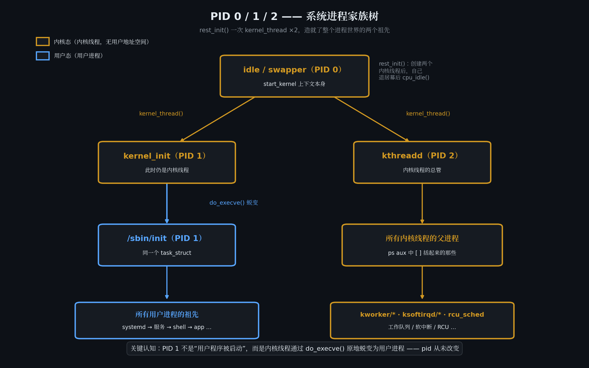
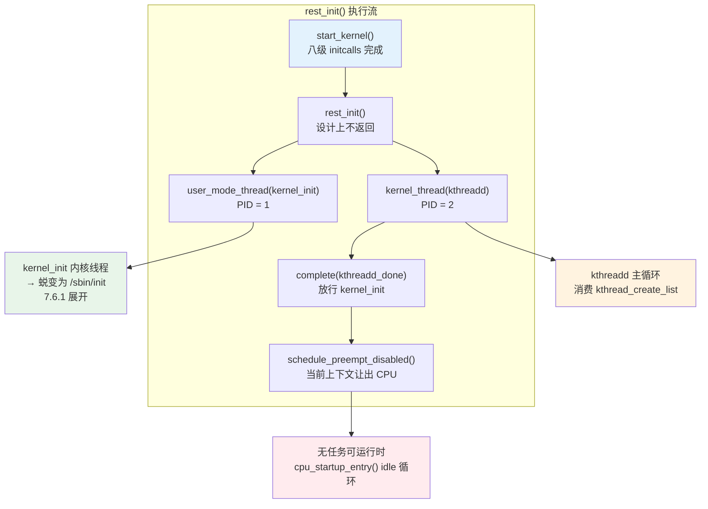

# 7.5.4 rest_init与kernel_init：1号进程的诞生

> 所属章节：第7章 启动链深度解析 > 7.5 内核启动
> 
> 难度：[I→E] | 预计阅读时间：40分钟

## <span class="blue"> 本节导读

7.5.3 走完了八级 initcalls：从 early 到 late，几百个初始化函数按链接顺序全部执行完毕，该 probe 的驱动都 probe 了。`start_kernel()` 的调用栈走到这里只剩最后一件事——调用 `rest_init()`。函数名很直白：剩下的初始化。但它做的事远比名字重大：把这条从复位向量一路跑过来的执行流一分为三，裂变出 PID 0、1、2 三个进程。从这一刻起，Linux 从"一段顺序执行的初始化代码"变成"一个多进程操作系统"。<BR>
本节覆盖：`start_kernel()` 为什么不能 return、`rest_init()` 如何创建 kernel_init 与 kthreadd、idle 进程的存在理由、内核线程创建的两种模式、`Freeing unused kernel memory` 这行日志的分界意义。

---

## <span class="blue"> start_kernel 的最后一行为什么不是 return [E]

C 语言的直觉是：函数跑完就 return，控制权交还调用者。但 `start_kernel()` 是被汇编直接跳转进来的——`__primary_switched` 之后没有任何"调用者"在等返回值。它要是真的 return，CPU 会拿着栈上一个无效地址继续取指，立刻跑飞。

所以 `start_kernel()` 的结尾必须给这条执行流找一个"永远有事可做"的归宿：

```c
/* init/main.c - start_kernel() 尾部，Linux 6.6 */
    ...
    /* Do the rest non-__init'ed, we're now alive */
    arch_call_rest_init();
}
```

`arch_call_rest_init()` 最终落到 `rest_init()`，后者在设计上就不返回。从汇编入口借来的这条执行流，将在 `rest_init()` 里完成三次身份分配。

这里需要先建立一个概念区分：**内核线程与用户进程**。两者在调度器眼里都是 `task_struct`，走同一套调度逻辑，区别在于地址空间——用户进程拥有独立的 `mm_struct` 和用户态页表，内核线程没有，它只在内核地址空间里运行，永远不需要切到用户态。这个区分马上就会用到：`rest_init()` 要创建的两个新进程都起步于内核地址空间，但 1 号有点特殊——它由 `user_mode_thread()` 创建，从诞生那一刻起就按"能 exec 用户程序"的规格打造，7.6.1 里所谓"蜕变成用户进程"，只是它主动调用 `kernel_execve()` 的最后一步。

---

## <span class="blue"> 一分为三：PID 0/1/2 各自解决什么问题 [E]

`rest_init()` 的全部工作可以读成三行：创建 1 号、创建 2 号、把自己变成 0 号。

```c
/* init/main.c - rest_init（Linux 6.6，节录） */
noinline void __ref __noreturn rest_init(void)
{
    struct task_struct *tsk;
    int pid;

    rcu_scheduler_starting();

    /*
     * ① 先创建 PID=1：kernel_init。注意用的是 user_mode_thread()——
     * 它从创建起就带着"能 exec 用户程序"的规格。
     * kernel_init 很快就要创建 kthread，所以它会在 kthreadd_done
     * 上阻塞，直到 2 号就位。
     */
    pid = user_mode_thread(kernel_init, NULL, CLONE_FS);
    rcu_read_lock();
    tsk = find_task_by_pid_ns(pid, &init_pid_ns);
    tsk->flags |= PF_NO_SETAFFINITY;      /* 钉在启动核上 */
    set_cpus_allowed_ptr(tsk, cpumask_of(smp_processor_id()));
    rcu_read_unlock();

    /* ② 再创建 PID=2：kthreadd 内核线程 */
    pid = kernel_thread(kthreadd, NULL, NULL, CLONE_FS | CLONE_FILES);
    rcu_read_lock();
    kthreadd_task = find_task_by_pid_ns(pid, &init_pid_ns);
    rcu_read_unlock();

    system_state = SYSTEM_SCHEDULING;     /* 调度器进入正常服务状态 */
    complete(&kthreadd_done);             /* 放行 kernel_init */

    /*
     * ③ 当前执行流（start_kernel 的上下文）成为 PID=0 的 idle 进程。
     * 先调度一次让系统动起来，然后进入 idle 主循环，永不返回。
     */
    schedule_preempt_disabled();
    cpu_startup_entry(CPUHP_ONLINE);
}
```

三个 PID 的分工：

| PID | 线程函数 | 最终身份 | 解决什么问题 |
|-----|---------|---------|------------|
| 0 | `rest_init()` 自身（复用 start_kernel 上下文） | idle 进程（每 CPU 一个） | 调度器在"无任务可跑"时必须有一个合法的去处 |
| 1 | `kernel_init()` | 蜕变为 `/sbin/init` 用户进程 | 所有用户进程的祖先，负责把根文件系统上的 init 跑起来 |
| 2 | `kthreadd()` | 内核线程（永不退出） | 所有后续内核线程的统一创建者 |



> 🔴 **PID 1 是整个用户空间的信任根。** `/sbin/init` 被替换，攻击者就以 root 身份接管全部进程的生命周期——这正是 Secure Boot 链把 init 程序列为关键验证目标的原因。

创建顺序里藏着一个容易看漏的细节：为什么是 1 号在前、2 号在后？内核源码注释说得很清楚——`kernel_init` 必须先拿到 PID 1，但它启动后马上要创建内核线程，而如果它在 `kthreadd` 存在之前就调度运行，创建请求会无人受理。解法是让 `kernel_init` 在 `kthreadd_done` 这个 completion 上阻塞，等 `rest_init()` 创建完 `kthreadd` 再放行。先挂号、后开诊。

### 为什么 2 号进程必须存在：内核线程不能随便生

一个容易被跳过的问题：创建内核线程，直接 `do_fork()` 不就行了，为什么还要专门养一个 `kthreadd`？

答案是上下文限制。`do_fork()` 要在进程上下文中执行——它会分配内存、可能睡眠。而系统跑起来之后，创建内核线程的诉求大量来自驱动 probe、中断底半部、workqueue，这些上下文里直接 fork 要么被禁止，要么把死锁风险扩散得到处都是。`kthreadd` 给出的解法是**委托**：`kthread_create()` 不直接创建线程，只把请求挂到 `kthread_create_list` 链表上、唤醒 `kthreadd`，由它在干净的进程上下文里完成 `do_fork()`。

```c
/* kernel/kthread.c - kthreadd（节录） */
int kthreadd(void *unused)
{
    struct task_struct *tsk = current;
    struct kthread_create_info *create;

    set_task_comm(tsk, "kthreadd");
    for (;;) {
        set_current_state(TASK_INTERRUPTIBLE);
        if (list_empty(&kthread_create_list))
            schedule();                    /* 没有创建请求就睡眠 */
        __set_current_state(TASK_RUNNING);

        spin_lock(&kthread_create_lock);
        while (!list_empty(&kthread_create_list)) {
            create = list_entry(kthread_create_list.next,
                                struct kthread_create_info, list);
            list_del_init(&create->list);
            spin_unlock(&kthread_create_lock);

            create_kthread(create);        /* 在这里真正 do_fork() */

            spin_lock(&kthread_create_lock);
        }
        spin_unlock(&kthread_create_lock);
    }
}
```

启动之后看一眼进程表，所有内核线程的 PPID 都是 2，就是这个机制的直接证据：

```
ps -eo pid,ppid,comm | awk '$2 == 2'
```

两种创建模式的分工由此固定：

| 模式 | 接口 | 机制 | 适用场景 |
|-----|------|------|---------|
| 直接创建 | `kernel_thread()` | 同步调用 `do_fork()`，立即得到 PID | 早期初始化——`kernel_init`、`kthreadd` 自身就是这么来的 |
| 委托创建 | `kthread_create()` | 请求入队，`kthreadd` 异步完成 | 运行时驱动、子系统动态创建内核线程 |

> 💡 `kernel_thread()` 返回的是**子进程的 PID**，不是线程句柄——它和 `pthread_create()` 的语义完全不同。早期驱动代码里把它当句柄保存再拿来" join "，是常见的误读。

### 为什么 idle 不另外创建，而是就地改造

注意 `rest_init()` 没有为 idle 进程调用 `kernel_thread()`，而是把 `current`——也就是 `start_kernel()` 一直在用的 `init_task`——直接转为 idle。理由是最小化设计：`init_task` 是内核编译期静态定义的第一个 `task_struct`，它的内核栈正承载着当前执行流；与其新建一个再废弃旧的，不如就地转换身份。`schedule_preempt_disabled()` 把 CPU 让给刚创建的 1 号和 2 号，这条从复位向量一路跑来的执行流就此退居幕后。



---

## <span class="blue"> idle 循环：CPU 的兜底任务 [I]

"idle 进程"这个名字容易引起误解——它不是一个普通的后台进程，而是**调度器的保底选项**。调度器有一条硬性约束：任何时刻 `current` 都必须指向一个合法的 `task_struct`。就绪队列为空时，调度器不能"谁都不选"，只能切到 idle。idle 进程解决的就是这个"无事可做时 CPU 去哪"的问题。

idle 循环的本体在 `cpu_startup_entry()` → `do_idle()`，核心是一个无限循环：

```c
/* kernel/sched/idle.c - 简化逻辑 */
while (1) {
    while (!need_resched()) {
        /*
         * 执行平台特定的 idle 指令。
         * ARM64 上最终落到 WFI（Wait For Interrupt），
         * CPU 核进入低功耗状态，等下一个中断唤醒。
         */
        arch_cpu_idle();
    }
    schedule_idle();              /* 有任务就绪，立刻让出 */
}
```

`WFI` 让 CPU 核停下来省电，直到定时器 tick 或设备中断把它唤醒。这就是为什么"什么都没干"的 Linux 板子 CPU 并不在空转——idle 是电源管理的第一入口，cpuidle 框架正是挂在 `arch_cpu_idle()` 这个钩子上，电源管理章节会展开。

还要注意 idle 是**每 CPU 一个**的：SMP 系统中每个核上线时都会派生自己的 idle 线程，启动核的 idle 是 PID 0，其余核的 idle 从语义上同属"0 号家族"。这也解释了为什么在 `ps` 和 `/proc` 里查不到 PID 0——idle 线程是调度器的内部构造，不参与普通进程的枚举语义。

> ⚠️ 不要对 idle 做进程级假设。idle 线程没有用户空间、不参与信号语义、在 `/proc` 下没有 PID 0 目录。需要观察 CPU 空闲程度时，正确的入口是 `vmstat` 的 `id` 列或 cpuidle 的 sysfs 统计，而不是去找一个"idle 进程"。

---

## <span class="blue"> 分界线日志：Freeing unused kernel memory 之后，1 号进程登场 [I]

回到串口日志。`rest_init()` 执行完毕不代表内核初始化全部结束——1 号线程醒来之后还有一段"内核时间"：SMP 启动、initramfs 处理、控制台打开都在这段路上，7.6.1 逐步展开。这段路的终点是一行熟悉的日志：

```
[    0.xxxxxx] Freeing unused kernel memory: 1024K
```

打印它的是 `free_initmem()`，由 `kernel_init` 在一切就绪后调用，把 `.init.text` 和 `.init.data` 段占用的物理页还给伙伴系统。7.5.3 提过所有 initcall 函数都带 `__init` 属性、链进这两个段——这行日志就是它们的集体退役仪式，典型能回收几十 KB 到几百 KB 内存。

为什么必须等到此刻才能释放？`.init` 段里躺着全部 initcall 函数和早期初始化代码，只有确认同步、异步初始化都执行完毕，这些代码才确定不会再被调用。因此 `kernel_init` 在释放前先调 `async_synchronize_full()` 等所有异步任务收尾——顺序反了，释放后的内存访问就是非法的。

这行日志之后紧跟着的，是整条启动链的名场面：

```
[    0.xxxxxx] Run /sbin/init as init process
```

`kernel_init` 即将通过 `do_execve()` 完成自我替换，从内核线程变成用户空间的 1 号进程——内核线程如何"变成"用户进程，是 7.6.1 的主线。

> 💡 排查启动问题时，PID 0/1/2 是三个天然的分界标记：日志里出现 `Run /sbin/init`，说明 `rest_init()` 与 `kernel_init` 的内核侧初始化全部成功；停在此前的任何位置，问题都还在内核线程的世界里，先别去怀疑 rootfs 里的应用。

---

## <span class="blue"> 本节总结

| 要点 | 内容 |
|------|------|
| **start_kernel 的归宿** | 无调用者可返回，必须以不返回的 `rest_init()` 收尾 |
| **一分为三** | 复用当前上下文为 PID 0（idle），`user_mode_thread()` 创建 PID 1（kernel_init，自带 exec 规格），`kernel_thread()` 创建 PID 2（kthreadd） |
| **先 1 后 2 的顺序逻辑** | kernel_init 必须先占住 PID 1，但在 `kthreadd_done` 上阻塞，等 kthreadd 就位再运行 |
| **kthreadd 的存在理由** | `do_fork()` 只能在进程上下文执行；`kthread_create()` 委托给 kthreadd 统一创建，运行时内核线程的 PPID 都是 2 |
| **idle 进程** | 调度器的保底 `task_struct`，每 CPU 一个；`WFI` 省电，是 cpuidle 的挂载点；不在 `ps`/`/proc` 常规枚举中 |
| **Freeing unused kernel memory** | `kernel_init` 在 `async_synchronize_full()` 之后调 `free_initmem()`，回收 `.init` 段；此后调用 `__init` 函数即非法 |
| **下一棒** | `Run /sbin/init as init process` 之后，kernel_init 的蜕变路径由 7.6.1 展开 |

> 🔴 `rest_init()` 是整条启动链上"代码"与"系统"的分水岭：此前是一段顺序执行的初始化程序，此后是一个按调度器规则运转的多进程操作系统。理解这三个 PID 的分工，就拿到了阅读此后每一行启动日志的坐标系。

---

## <span class="blue"> 下一步

1 号线程醒来，但离用户空间还差关键几步：等其余核上线、打开 fd 0/1/2 控制台、按尝试序列寻找 init 程序，最后 `kernel_execve()` 完成变身。7.6.1 沿 `kernel_init` 线程的执行路径走完这段"内核时间"；路上的根文件系统挂载（initramfs 与真实 rootfs 怎么切换）是 7.6.2 的主线。

---

## <span class="blue"> 延伸阅读

- `init/main.c`：`rest_init()`、`kernel_init()` 与 `start_kernel()` 尾部
- `kernel/kthread.c`：`kthreadd()` 与 `kthread_create()` 的委托创建机制
- `kernel/sched/idle.c`：idle 主循环与 `arch_cpu_idle()` 钩子
- `Documentation/admin-guide/init.rst`：init 进程相关的内核参数说明
