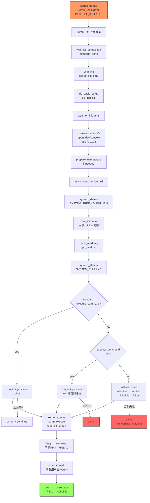

# 7.6.1 kernel_init线程的执行路径

> 所属：第7章 内核启动与初始化 > 7.6 init进程的诞生
> 难度：[I→E] | 预计阅读时间：35分钟

## 本节导读

从 `rest_init()` 中 `kernel_thread(kernel_init, NULL, CLONE_FS)` 被调用那一刻起，PID 1 的内核线程已经诞生。但它要完成从"内核线程"到"用户空间init进程"的蜕变，还需要经历异步初始化同步、控制台打开、init内存释放、二进制加载等多个关键阶段。本节深入 `kernel_init()` 的完整执行路径，剖析这个Linux启动流程中最关键的边界函数。

---

## 知识点1：kernel_init_freeable() — 初始化尾声的"大杂烩" [E]

### 问题场景

在嵌入式平台上，你常常会遇到这样的现象：内核日志已经打印到 `"Freeing unused kernel image memory"`，但系统随后hang住，没有任何输出。或者，某些总线设备（如I2C传感器）在启动时有时能被探测到，有时不能。这些问题的根因，往往就藏在 `kernel_init_freeable()` 与其后续阶段的交互中。

### 机制深入

`kernel_init_freeable()` 位于 `init/main.c`，是 `kernel_init()` 调用的第一个主要函数。它的名字暗示了其设计哲学：所有"可释放的"初始化工作都在这里完成——完成后，`__init` 段内存就可以被回收了。

**关键代码路径（Linux 6.x）：**

```c
/* init/main.c */
static noinline void __init kernel_init_freeable(void)
{
    /* 1. 等待 kthreadd 就位 */
    wait_for_completion(&kthreadd_done);

    /* 2. 解除GFP掩码限制，允许阻塞分配 */
    gfp_allowed_mask = __GFP_BITS_MASK;
    set_mems_allowed(node_states[N_MEMORY]);
    set_cpus_allowed_ptr(current, cpu_all_mask);
    cad_pid = get_pid(task_pid(current));    /* Ctrl-Alt-Del target */

    /* 3. SMP启动 */
    smp_prepare_cpus(setup_max_cpus);
    do_pre_smp_initcalls();
    lockup_detector_init();
    smp_init();           /* 启动secondary CPUs */
    sched_init_smp();

    /* 4. 核心驱动初始化 */
    do_basic_setup();     /* → do_initcalls() */

    /* 5. 等待initramfs就绪 */
    wait_for_initramfs();

    /* 6. 打开控制台（内核6.x后移至此处） */
    console_on_rootfs();

    /* 7. 确定initramfs中的init路径 */
    if (!ramdisk_execute_command)
        ramdisk_execute_command = "/init";

    ramdisk_command_access = init_eaccess(ramdisk_execute_command);
    if (ramdisk_command_access != 0) {
        ramdisk_execute_command = NULL;
        prepare_namespace();    /* 挂载真实rootfs */
    }

    integrity_load_keys();
    load_default_modules();
}
```

**`do_basic_setup()` → `do_initcalls()` 调用链：**

```
do_basic_setup()
  ├── driver_init()              /* 初始化设备模型 */
  │     ├── devtmpfs_init()
  │     ├── driver_class_init()
  │     ├── bus_init()           /* platform, pci, usb... */
  │     └── ...
  ├── init_irq_proc()
  ├── usermodehelper_enable()
  ├── do_initcalls()             /* 按level执行所有__init函数 */
  │     ├── do_initcall_level(early)
  │     ├── do_initcall_level(core)
  │     ├── do_initcall_level(postcore)
  │     ├── do_initcall_level(arch)
  │     ├── do_initcall_level(subsys)
  │     ├── do_initcall_level(fs)
  │     ├── do_initcall_level(device)   /* 大部分driver_probe在这里 */
  │     └── do_initcall_level(late)
  └── load_default_elevator_module()
```

`do_initcalls()` 按照链接段顺序执行从 `__initcall_start` 到 `__initcall_end` 之间的所有初始化函数。这里的 `device_initcall()` 级别（level 6）是大多数驱动 `probe()` 被执行的地方，也是 `deferred probe` 被触发的起点。

### async_synchronize_full() 的意义

`kernel_init_freeable()` 返回后，`kernel_init()` 立即调用 `async_synchronize_full()`。这个调用的重要性常被低估：

```c
/* init/main.c - kernel_init() */
kernel_init_freeable();
/* need to finish all async __init code before freeing the memory */
async_synchronize_full();
```

`async_synchronize_full()` 等待所有通过 `async_schedule()` 提交的异步任务完成。这些任务包括：

1. **异步设备probe**（`driver_async_probe`）：加速启动的驱动并行探测
2. **initramfs异步解压**（`do_populate_rootfs_async`）
3. **部分架构的延迟初始化**

在较新内核中，`async` 子系统已重构为基于 `workqueue` 的实现，`async_synchronize_full()` 内部会 `flush_workqueue()` 所有待处理的 async work。

### Trade-off表格

| 策略 | 启动延迟 | 可靠性 | 适用场景 |
|------|---------|--------|---------|
| 完全同步probe | 长（串行） | 最高 | 资源紧耦合的嵌入式系统 |
| async probe + sync等待 | 中等 | 高 | 通用Linux发行版（默认） |
| async probe + 不等待 | 最短 | 低（race风险） | 快速启动场景，需手动保证依赖 |
| deferred probe延迟重试 | 中等 | 中高 | 依赖链复杂的设备树系统 |

### 常见陷阱

⚠️ **陷阱1：async probe与模块加载死锁**。某些驱动在async probe中会调用 `request_module()` 加载依赖模块，而模块初始化末尾也可能调用 `async_synchronize_full()`，形成AB-BA死锁。内核通过 `PF_USED_ASYNC` 标志做了条件规避，但 out-of-tree 驱动需注意。

⚠️ **陷阱2：initramfs未解压完成就访问rootfs**。`wait_for_initramfs()` 必须在 `console_on_rootfs()` 之前完成，否则 `/dev/console` 节点可能还不存在。

💡 **技巧**：调试deferred probe问题时，可查看 `/sys/kernel/debug/devices_deferred` 获取被延迟探测的设备列表。

---

## 知识点2：打开控制台 — 从printk到stdio的关键一跃 [E]

### 问题场景

很多嵌入式开发者遇到过这样的困惑：内核启动早期的 `printk()` 能正常输出到串口，但用户空间的 `printf()` 却没有任何输出。或者，`/dev/console` 打开失败导致启动停止。理解 `kernel_init` 中控制台打开的时机和机制，是解决这类问题的关键。

### 机制深入

**历史变迁**：

| 内核版本 | 实现方式 | 位置 |
|---------|---------|------|
| 3.x - 5.x | `sys_open("/dev/console")` + `sys_dup(0)` x2 | `kernel_init_freeable()` |
| 6.x+ | `filp_open("/dev/console")` + `init_dup()` x3 | 独立的 `console_on_rootfs()` |

**现代实现（内核 6.x）：**

```c
/* init/main.c */
void __init console_on_rootfs(void)
{
    struct file *file = filp_open("/dev/console", O_RDWR, 0);

    if (IS_ERR(file)) {
        pr_err("Warning: unable to open an initial console, err = %ld\n",
               PTR_ERR(file));
        return;
    }
    init_dup(file);   /* fd 0 - stdin  */
    init_dup(file);   /* fd 1 - stdout */
    init_dup(file);   /* fd 2 - stderr */
    fput(file);
}
```

`init_dup()` 是内核专用的fd复制函数，与 `sys_dup()` 的核心区别在于它直接操作 `current->files`，并通过RCU机制保证并发安全——这在启动早期是必要的设计。

### 为什么内核不能直接打开控制台？

这是一个常见的误解。实际上，**内核确实是在内核态打开控制台的**，但它使用的是文件系统接口（`filp_open`），而非直接操作UART硬件寄存器。这样做的原因有三层：

1. **VFS抽象层要求**：`/dev/console` 是一个VFS节点，可能是真实TTY设备、串口console、或伪终端。内核统一通过VFS访问，保持设备无关性。

2. **文件描述符语义**：用户空间的stdin/stdout/stderr是fd层面的抽象。通过VFS打开后，init进程继承这些fd，后续fork的用户进程自然继承，形成Unix标准的stdio继承链。

3. **内核日志与用户输出的分离**：`printk()` 走的是独立的console输出路径（`console_drivers` 链表），与用户空间的write(1)完全不同。内核态直接写硬件会绕过VFS缓冲和行规程（line discipline），破坏终端语义。

```
┌─────────────────────────────────────────────────────────┐
│                    用户空间视角                           │
│  write(1, "hello", 5)  →  fd 1 → /dev/console          │
│                              ↓                           │
│                     VFS (tty_write)                      │
│                              ↓                           │
│                    TTY line discipline                   │
│                              ↓                           │
│                    UART driver (serial)                  │
├─────────────────────────────────────────────────────────┤
│                    内核空间视角                           │
│  printk("hello") → console_drivers → serial_console_write │
│                     (直接调用驱动callback)                 │
└─────────────────────────────────────────────────────────┘
```

### 关键代码路径

```c
/* 旧接口对比（内核5.x），实现逻辑相同但API不同 */
if (sys_open((const char __user *) "/dev/console", O_RDWR, 0) < 0)
    pr_err("Warning: unable to open an initial console.\n");
(void) sys_dup(0);    /* 复制为stdout  */
(void) sys_dup(0);    /* 复制为stderr  */
```

### Trade-off表格

| 方案 | 优点 | 缺点 | 适用场景 |
|------|------|------|---------|
| 内核VFS打开（当前设计） | 统一语义，fd可继承，支持各种console后端 | 依赖rootfs已挂载 | 通用场景 |
| 直接操作UART寄存器 | 不依赖文件系统 | 破坏抽象，无line discipline | 极端early debug |
| earlycon保持到用户空间 | 无缝衔接 | 实现复杂，需kernel/userspace协调 | 特定嵌入式系统 |

### 常见陷阱

🔴 **安全提醒**：如果rootfs中没有创建 `/dev/console` 设备节点（major:minor = 5:1），`console_on_rootfs()` 会失败。initramfs中必须包含 `mknod /dev/console c 5 1`。

⚠️ **陷阱：console_on_rootfs()位置变迁**。内核6.x的补丁将 `console_on_rootfs()` 从 `kernel_init_freeable()` 内部移到了 `async_synchronize_full()` 之后。如果你的驱动probe是async的且probe过程中需要控制台输出，确保console设备本身不是async probe的受害者。

💡 **技巧**：调试时可通过 `console=ttyS0,115200` 指定早期console，但这只影响 `printk()` 输出路径，不影响 `/dev/console` 的VFS打开。

---

## 知识点3：执行init — 从内核线程到用户进程的蜕变 [E]

### 问题场景

你的嵌入式系统构建了一个新的rootfs，但内核启动后panic：`"No working init found"`。或者，你通过 `init=/bin/sh` 进入rescue模式后困惑：为什么PID 1的comm变成了`sh`而不是`kernel_init`？本节解答 `run_init_process()` 如何将一个内核线程彻底转化为用户空间进程。

### 机制深入

**init搜索优先级**：

```c
/* init/main.c - kernel_init() 执行init的逻辑 */

/* 优先级1: initramfs中的init (rdinit=指定，默认/init) */
if (ramdisk_execute_command) {
    ret = run_init_process(ramdisk_execute_command);
    if (!ret)
        return 0;
    pr_err("Failed to execute %s (error %d)\n",
           ramdisk_execute_command, ret);
}

/* 优先级2: 命令行指定的init (init=参数) */
if (execute_command) {
    ret = run_init_process(execute_command);
    if (!ret)
        return 0;
    panic("Requested init %s failed (error %d).",
          execute_command, ret);    /* init=指定失败直接panic */
}

/* 优先级3: 编译时默认init (CONFIG_DEFAULT_INIT) */
if (CONFIG_DEFAULT_INIT[0] != '\0') {
    ret = run_init_process(CONFIG_DEFAULT_INIT);
    if (ret)
        pr_err("Default init %s failed (error %d)\n",
               CONFIG_DEFAULT_INIT, ret);
    else
        return 0;
}

/* 优先级4: 标准fallback路径 */
if (!try_to_run_init_process("/sbin/init") ||
    !try_to_run_init_process("/etc/init") ||
    !try_to_run_init_process("/bin/init") ||
    !try_to_run_init_process("/bin/sh"))
    return 0;

/* 全部失败 */
panic("No working init found. Try passing init= option to kernel. "
      "See Linux Documentation/admin-guide/init.rst for guidance.");
```

**`run_init_process()` 的薄封装：**

```c
static int run_init_process(const char *init_filename)
{
    argv_init[0] = init_filename;
    pr_info("Run %s as init process\n", init_filename);
    return kernel_execve(init_filename, argv_init, envp_init);
}

static int try_to_run_init_process(const char *init_filename)
{
    int ret = run_init_process(init_filename);
    /* -ENOENT表示文件不存在，静默继续尝试下一个路径 */
    if (ret && ret != -ENOENT) {
        pr_err("Starting init: %s exists but couldn't execute it (error %d)\n",
               init_filename, ret);
    }
    return ret;
}
```

**`kernel_execve()` → 内核线程到用户进程的蜕变：**

```c
int kernel_execve(const char *kernel_filename,
                  const char *const *argv, const char *const *envp)
{
    struct filename *filename;
    struct linux_binprm *bprm;
    int retval;

    /* 内核线程理论上不应调用execve，但kernel_init是特例 */
    if (WARN_ON_ONCE(current->flags & PF_KTHREAD))
        return -EINVAL;

    filename = getname_kernel(kernel_filename);
    bprm = alloc_bprm(AT_FDCWD, filename, 0);

    /* 复制参数和环境变量 */
    bprm->argc = count_strings_kernel(argv);
    bprm->envc = count_strings_kernel(envp);
    copy_strings_kernel(bprm->envc, envp, bprm);
    copy_strings_kernel(bprm->argc, argv, bprm);

    /* 核心：加载并执行二进制 */
    retval = bprm_execve(bprm);
    /* 成功则不返回 */
    ...
}
```

### do_execve()如何将内核线程转化为用户进程

这是 `kernel_init` 执行路径中最深刻的变化。内核线程（包括PID 1的 `kernel_init`）本质上是共享内核地址空间的特殊进程：

```
┌────────────────────────────────────────────────────────────┐
│                   转化前：kernel_init 内核线程                 │
│  ┌─────────────┐    ┌──────────────────────────────────┐   │
│  │ task_struct  │    │ mm = NULL (使用active_mm借用)    │   │
│  │  PID = 1     │───→│ active_mm = &init_mm (内核空间)  │   │
│  │  PF_KTHREAD  │    │ 无用户空间页表                   │   │
│  └─────────────┘    └──────────────────────────────────┘   │
└────────────────────────────────────────────────────────────┘
                            │ bprm_execve() → load_elf_binary()
                            ▼
┌────────────────────────────────────────────────────────────┐
│                   转化后：/sbin/init 用户进程                  │
│  ┌─────────────┐    ┌──────────────────────────────────┐   │
│  │ task_struct  │    │ mm = 新分配的mm_struct           │   │
│  │  PID = 1     │───→│ 全新用户空间页表                  │   │
│  │  无PF_KTHREAD│    │ ELF代码/数据段映射                │   │
│  └─────────────┘    │ 用户栈(argv/envp)                 │   │
│                     └──────────────────────────────────┘   │
└────────────────────────────────────────────────────────────┘
```

**关键步骤：**

1. **`bprm_execve()`** 分配 `linux_binprm` 结构，准备新的credentials和内存描述符
2. **`exec_binprm()`** → **`search_binary_handler()`** 遍历注册的 `linux_binfmt` 处理器列表（ELF、a.out、script等）
3. **`load_elf_binary()`**（以ELF为例）：
   - 读取ELF header和program headers
   - 创建全新的 `mm_struct` 和页表（`mm_alloc()`）
   - 映射ELF的LOAD段到用户地址空间
   - 设置用户栈（将argv/envp复制到用户栈顶）
   - 调用 `begin_new_exec()` 正式切换credentials，清除 `PF_KTHREAD` 标志
   - `start_thread()` 设置CPU寄存器（PC指向ELF entry point，SP指向用户栈顶）
4. 从系统调用返回路径进入用户态，init进程开始执行

一旦 `kernel_execve()` 成功，它**不会返回**。原 `kernel_init()` 的栈、内核执行上下文全部被丢弃。PID 1 还是那个 `task_struct`，但内在已完全蜕变。

### init搜索路径表

| 优先级 | 搜索路径 | 控制方式 | 失败行为 |
|--------|---------|---------|---------|
| 1 | `/init` (initramfs内) | `rdinit=` bootargs | 继续尝试下一优先级 |
| 2 | `execute_command` | `init=` bootargs | **直接panic** |
| 3 | `CONFIG_DEFAULT_INIT` | Kconfig编译时配置 | 继续尝试fallback |
| 4 | `/sbin/init` | 硬编码fallback | 静默跳过(ENOENT) |
| 5 | `/etc/init` | 硬编码fallback | 静默跳过(ENOENT) |
| 6 | `/bin/init` | 硬编码fallback | 静默跳过(ENOENT) |
| 7 | `/bin/sh` | 最后rescue手段 | 静默跳过(ENOENT) |
| — | 无 | — | **panic** |

> **注意优先级2的特殊性**：`init=` 参数明确指定了用户的意图，一旦失败内核直接panic而不是尝试fallback路径。这是为了防止 `init=/ malicious_path` 被静默忽略后系统进入不可预期的状态。

### 常见陷阱

🔴 **安全提醒**：`init=` 参数接受任何绝对路径，包括网络文件系统路径（如 `init=/nfs/mount/custom_init`）。确保bootloader参数不被未授权修改。

⚠️ **陷阱：架构不匹配导致-ENOEXEC**。嵌入式系统中常见的问题是rootfs用错了架构（如ARM64内核配ARM32的init），此时 `load_elf_binary()` 会返回 `-ENOEXEC`，但日志可能不明显。可通过 `file /sbin/init` 在host端验证。

💡 **技巧**：紧急恢复时，使用 `init=/bin/sh` 或 `rdinit=/bin/sh` 可绕过正常的init系统直接进入shell。注意此时PID 1就是shell，收到SIGINT不会默认退出。

💡 **技巧**：在 `kernel_execve()` 成功返回0的情况下，`run_init_process()` 返回0，`kernel_init()` 直接 `return 0`，此后PID 1的用户态代码接管。这个return语句**永远不会被执行到**——它是内核线程"遗体"的最后一条语句。

---

## 完整执行路径：kernel_init的一生



---

## 实践案例：嵌入式设备的init启动故障排查

**场景**：一块基于ARM64的工业控制板，使用Buildroot构建的rootfs。内核启动日志正常，但在 `"Freeing unused kernel image memory: 108K"` 之后hang住，无任何输出。

**排查过程**：

1. **确认console_on_rootfs()状态**：通过JTAG或启用 `CONFIG_DEBUG_LL`，发现 `filp_open("/dev/console")` 返回 `-ENODEV`。rootfs中的 `/dev/console` 设备节点权限正确，但对应的串口驱动 `probe()` 返回了 `-EPROBE_DEFER`。

2. **根因分析**：该板子的串口控制器依赖一个时钟驱动，而时钟驱动的 `probe()` 恰好在同一 `do_initcalls()` 的 `device` level中，且由于设备树依赖关系触发了deferred probe。`console_on_rootfs()` 执行时，时钟驱动尚未probe完成，串口尚未注册为tty设备。

3. **解决方案**：
   - 方案A（推荐）：将串口驱动和时钟驱动的initcall level提前到 `subsys` level
   - 方案B：启用 `CONFIG_SERIAL_EARLYCON` 和对应的earlycon bootargs，但这只解决printk输出，不解决 `/dev/console` 打开
   - 方案C：在 `kernel_init_freeable()` 之前手动触发一次deferred probe retry

4. **验证**：修改后，dmesg中新增 `"Run /sbin/init as init process"` 日志，用户空间正常启动。

**kernel_init关键函数速查表**：

| 函数 | 源码位置 | 核心职责 | 失败后果 |
|------|---------|---------|---------|
| `wait_for_completion(&kthreadd_done)` | `kernel_init()` | 确保kthreadd可服务kthread_create | 后续kthread创建死锁 |
| `kernel_init_freeable()` | `init/main.c` | SMP启动、驱动初始化、控制台打开 | 系统功能缺失 |
| `do_basic_setup()` | `init/main.c` | 调用所有`__init`函数 | 驱动/子系统未初始化 |
| `console_on_rootfs()` | `init/main.c` | 打开/dev/console，设置fd 0/1/2 | 用户空间无输出 |
| `async_synchronize_full()` | `kernel/async.c` | 等待所有async任务完成 | init内存释放过早，数据竞争 |
| `free_initmem()` | `arch/*/mm/init.c` | 回收__init段内存给buddy | — |
| `run_init_process()` | `init/main.c` | 设置argv后调用kernel_execve | 返回非0，尝试下一个 |
| `kernel_execve()` | `fs/exec.c` | 内核态的execve实现 | 不返回（成功时） |
| `bprm_execve()` | `fs/exec.c` | 二进制加载核心编排 | 返回错误码 |
| `begin_new_exec()` | `fs/exec.c` | 清除PF_KTHREAD，切换credentials | 进程状态损坏 |

---

## 本节总结

`kernel_init()` 是Linux启动流程中最独特的函数——它既是内核线程的终点，也是用户空间的起点。其执行路径可概括为三个阶段：

1. **准备阶段**（`kernel_init_freeable`）：完成SMP、驱动probe、控制台打开等所有依赖的初始化
2. **同步与清理阶段**（`async_synchronize_full` → `free_initmem`）：确保异步任务完成，回收init内存，将系统状态推进到 `SYSTEM_RUNNING`
3. **蜕变阶段**（`run_init_process` → `kernel_execve`）：通过标准的ELF加载流程，将内核线程的躯壳填入用户进程的灵魂

理解这个路径中的每个决策点——为什么控制台必须通过VFS打开、为什么async同步必须在内存释放之前、为什么 `init=` 失败直接panic——是成为资深嵌入式工程师的必要一课。

---

## 配套资源

### 表格清单

1. **async probe策略对比表**（知识点1）
2. **控制台打开方案对比表**（知识点2）
3. **init搜索路径优先级表**（知识点3）
4. **kernel_init关键函数速查表**（实践案例）

### 图示清单

1. **kernel_init完整执行路径图**（mermaid flowchart，本节正文）
2. **内核printk vs 用户stdio路径对比图**（知识点2内嵌）
3. **kernel_execve()线程转化示意图**（知识点3内嵌）

### 代码清单

1. `kernel_init_freeable()` 关键代码路径（内核6.x风格）
2. `console_on_rootfs()` 现代实现
3. `kernel_init()` 的init搜索与执行逻辑
4. `kernel_execve()` 的线程转化流程

### 推荐阅读

- `init/main.c` — `kernel_init()`, `kernel_init_freeable()`, `console_on_rootfs()`, `run_init_process()`
- `fs/exec.c` — `kernel_execve()`, `bprm_execve()`, `begin_new_exec()`
- `fs/binfmt_elf.c` — `load_elf_binary()`, `start_thread()` 的具体架构实现
- `arch/arm64/kernel/process.c` — ARM64的 `start_thread()` 实现
- `Documentation/admin-guide/init.rst` — 官方init启动参数文档
