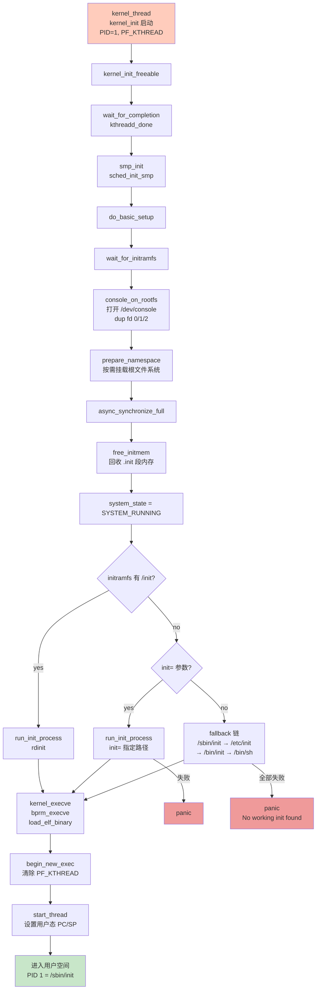

# 7.6.1 kernel_init线程的执行路径

> 所属：第7章 系统启动全链路 > 7.6 init与用户空间的诞生
> 
> 难度：[I→E] | 预计阅读时间：40分钟

## <span class="blue"> 本节导读

7.5.4 末尾，`rest_init()` 用 `kernel_thread()` 把 PID 1 交给了 `kernel_init`。但此刻的 1 号还只是一个内核线程：跑在内核地址空间，没有用户态页表，而 `/sbin/init` 还躺在尚未挂载的根文件系统上。从"内核线程"到"用户空间 1 号进程"，它还要走过 `kernel_init_freeable()` 的收尾初始化、控制台打开、init 内存释放，最后靠一次 `kernel_execve()` 完成自我替换。嵌入式 bring-up 中最常见的 `No working init found` panic，全部根因都分布在这条路径上。<BR>
本节覆盖：`kernel_init_freeable()` 里还藏着哪些初始化、为什么必须先等异步任务收尾再释放 init 内存、fd 0/1/2 的来源、`do_execve()` 如何把内核线程变成用户进程、init 搜索优先级与 panic 排查路径。

---

## <span class="blue"> kernel_init 醒来时，内核其实还没初始化完 [E]

一个常见的现场：内核日志打印到 `Freeing unused kernel image memory` 之后系统 hang 住，再无任何输出；或者同一批板子，I2C 传感器有时能 probe 到、有时不能。这类"最后一里路"的故障，根因大多藏在 `kernel_init_freeable()` 与异步任务的时序里。

7.5.3 的八级 initcalls 是在 `start_kernel()` 上下文里跑完的，但并非所有初始化都能在那里完成——`start_kernel()` 阶段抢占还没使能、不能睡眠，凡是需要"等"的工作都得留到进程上下文。`kernel_init_freeable()` 就是这批"可延迟初始化"的集散地：

```c
/* init/main.c - Linux 6.x */
static noinline void __init kernel_init_freeable(void)
{
    /* 1. 等 kthreadd 就位（7.5.4 的 complete(kthreadd_done) 在这里等到） */
    wait_for_completion(&kthreadd_done);

    /* 2. 解除分配限制：此后允许阻塞式内存分配，可在全部 CPU 上调度 */
    gfp_allowed_mask = __GFP_BITS_MASK;
    set_mems_allowed(node_states[N_MEMORY]);
    set_cpus_allowed_ptr(current, cpu_all_mask);
    cad_pid = task_pid(current);          /* Ctrl-Alt-Del 的目标进程 */

    /* 3. SMP：启动其余 CPU 核 */
    smp_prepare_cpus(setup_max_cpus);
    workqueue_init();
    init_mm_internals();
    do_pre_smp_initcalls();
    lockup_detector_init();
    smp_init();
    sched_init_smp();

    /* 4. 设备模型与延迟 initcalls */
    padata_init();
    page_ext_init_flatmem_late();
    do_basic_setup();                     /* → driver_init() 等 */

    /* 5. 等 initramfs 解压完成（7.6.2 展开） */
    wait_for_initramfs();

    /* 6. 打开 /dev/console 作为 fd 0/1/2 */
    console_on_rootfs();

    /* 7. initramfs 里有 /init 就交给它，没有就挂载真实根文件系统 */
    if (!ramdisk_execute_command)
        ramdisk_execute_command = "/init";

    if (init_eaccess(ramdisk_execute_command) != 0) {
        ramdisk_execute_command = NULL;
        prepare_namespace();
    }

    integrity_load_keys();
}
```

表里每一项被留到这里的理由都一样：**它们需要进程上下文**——能睡眠、能被调度、能做文件操作。

| 初始化项 | 为什么必须在进程上下文 |
|---------|----------------------|
| `smp_init()` 启动其余核 | 每核上线要走完整的 CPU hotplug 流程，会睡眠等待 |
| `do_basic_setup()` | workqueue、devtmpfs 等子系统初始化需要完整的调度环境 |
| `wait_for_initramfs()` | 解压是异步任务，等它完成必须可睡眠 |
| `console_on_rootfs()` | 打开 `/dev/console` 是 VFS 文件操作 |
| `prepare_namespace()` | 挂载根文件系统是文件系统操作，7.6.2 展开 |

`kernel_init_freeable()` 返回后，`kernel_init()` 紧接着做两件事，顺序不能反：

```c
/* init/main.c - kernel_init() 中部 */
    kernel_init_freeable();

    /* 等所有 async 任务收尾，才能释放它们可能在用的 .init 代码 */
    async_synchronize_full();

    system_state = SYSTEM_FREEING_INITMEM;
    kcsan_shutdown();
    ftrace_free_init_mem();
    kgdb_free_init_mem();
    exit_boot_config();
    free_initmem();                       /* 打印 Freeing unused kernel memory */
    mark_readonly();

    system_state = SYSTEM_RUNNING;        /* 系统正式进入运行态 */
    numa_default_policy();
```

`async_synchronize_full()` 等待所有经 `async_schedule()` 提交的异步任务完成——异步驱动 probe、initramfs 异步解压都在其中。这些任务可能还在执行 `.init` 段里的代码，先释放内存就等于拆了他们脚下的地板。7.5.4 那行 `Freeing unused kernel memory` 日志，正是在这道闸门之后才打印的。

> 💡 调试 deferred probe 或异步 probe 的时序问题，两个现成入口：内核命令行加 `initcall_debug` 看每个 initcall 的耗时与返回值；看 `/sys/kernel/debug/devices_deferred` 拿到被延迟探测的设备清单。

---

## <span class="blue"> fd 0/1/2 从哪来：控制台打开的 VFS 一跃 [E]

另一个高频困惑：内核早期的 `printk()` 输出正常，用户空间的 `printf()` 却一个字都看不到。两条输出路径根本不是一回事，而接通用户态路径的动作就发生在 `console_on_rootfs()`：

```c
/* init/main.c */
void __init console_on_rootfs(void)
{
    struct file *file = filp_open("/dev/console", O_RDWR, 0);

    if (IS_ERR(file)) {
        pr_err("Warning: unable to open an initial console, err = %ld\n",
               PTR_ERR(file));
        return;
    }
    init_dup(file);    /* fd 0 - stdin  */
    init_dup(file);    /* fd 1 - stdout */
    init_dup(file);    /* fd 2 - stderr */
    fput(file);
}
```

三次 `init_dup()` 把同一个文件对象复制成 PID 1 的 0/1/2 号描述符。此后 init fork 出的所有用户进程天然继承这三个 fd——Unix 标准 stdio 继承链的起点就在这里，没有任何用户态代码参与。

为什么内核不直接操作 UART 寄存器，而要绕一圈走 VFS？三层理由：

1. **设备无关性**：`/dev/console` 背后可能是串口、帧缓冲终端或伪终端，VFS 统一了访问方式
2. **fd 语义**：stdin/stdout/stderr 是文件描述符层面的抽象，只有经 VFS 打开的对象才能被 dup、被继承
3. **与 printk 路径隔离**：`printk()` 走独立的 console 驱动回调，直接写硬件；用户态 write(1) 走 tty 层和行规程。内核态若绕过 VFS 直写硬件，会破坏终端语义

```
┌─────────────────────────────────────────────────────────┐
│                    用户空间路径                          │
│  write(1, "hello", 5)  →  fd 1 → /dev/console           │
│                              ↓                          │
│                     VFS (tty_write)                     │
│                              ↓                          │
│                    TTY line discipline                  │
│                              ↓                          │
│                    UART driver (serial)                 │
├─────────────────────────────────────────────────────────┤
│                    内核 printk 路径                      │
│  printk("hello") → console_drivers → serial_console_write│
│                     (直接调用驱动回调)                    │
└─────────────────────────────────────────────────────────┘
```

> 🔴 `/dev/console` 对应的设备号是 5:1，这个节点必须真实存在于根文件系统（或 initramfs）中。静态 rootfs 里漏了 `mknod /dev/console c 5 1`，`console_on_rootfs()` 静默失败，用户空间全部输出消失——内核日志却一切正常，极具迷惑性。

> ⚠️ `console=ttyS0,115200` 这类命令行参数只影响 `printk()` 的输出路径，与 `/dev/console` 的 VFS 打开是两回事。printk 正常而用户态无输出时，先查设备节点与对应 tty 驱动的 probe 状态，而不是去改 console 参数。

---

## <span class="blue"> kernel_execve：同一个 task_struct 的灵魂替换 [E]

初始化全部收尾，1 号线程来到最后一个问题：它自己是个内核线程，而 `/sbin/init` 是一个用户态 ELF 程序。怎么"变成"它？答案是 exec 族系统调用的内核版本——`kernel_execve()`。它解决的问题和普通 `execve()` 完全相同：**让一个已存在的进程放弃当前的程序映像，加载并改换为另一个程序**，进程本身（PID、task_struct）不变。

```c
/* init/main.c */
static int run_init_process(const char *init_filename)
{
    const char *const *p;

    argv_init[0] = init_filename;
    pr_info("Run %s as init process\n", init_filename);   /* 名场面日志 */
    pr_debug("  with arguments:\n");
    for (p = argv_init; *p; p++)
        pr_debug("    %s\n", *p);
    pr_debug("  with environment:\n");
    for (p = envp_init; *p; p++)
        pr_debug("    %s\n", *p);
    return kernel_execve(init_filename, argv_init, envp_init);
}
```

`kernel_execve()` 经由 `bprm_execve()` → `search_binary_handler()` → `load_elf_binary()` 完成蜕变，关键步骤：

1. 分配 `linux_binprm`，把 argv/envp 复制到新的用户栈顶
2. `search_binary_handler()` 遍历注册的二进制格式处理器，ELF 格式命中 `load_elf_binary()`
3. 创建全新的 `mm_struct` 和用户态页表，映射 ELF 的 LOAD 段
4. `begin_new_exec()` 正式切换 credentials，**清除 `PF_KTHREAD` 标志**
5. `start_thread()` 设置寄存器：PC 指向 ELF 入口，SP 指向用户栈顶
6. 沿异常返回路径进入用户态，init 程序的第一条指令开始执行

```
┌────────────────────────────────────────────────────────────┐
│                  转化前：kernel_init 内核线程                │
│  ┌─────────────┐    ┌──────────────────────────────────┐   │
│  │ task_struct │    │ mm = NULL（借用 active_mm）       │   │
│  │  PID = 1    │───→│ active_mm = &init_mm（内核空间）  │   │
│  │ PF_KTHREAD  │    │ 无用户空间页表                    │   │
│  └─────────────┘    └──────────────────────────────────┘   │
└────────────────────────────────────────────────────────────┘
                            │ kernel_execve() → load_elf_binary()
                            ▼
┌────────────────────────────────────────────────────────────┐
│                  转化后：/sbin/init 用户进程                 │
│  ┌─────────────┐    ┌──────────────────────────────────┐   │
│  │ task_struct │    │ mm = 新分配的 mm_struct           │   │
│  │  PID = 1    │───→│ 全新用户空间页表                  │   │
│  │  无PF_KTHREAD│   │ ELF 代码/数据段映射               │   │
│  └─────────────┘    │ 用户栈（argv/envp）               │   │
│                     └──────────────────────────────────┘   │
└────────────────────────────────────────────────────────────┘
```

成功时 `kernel_execve()` **不返回**——原 `kernel_init()` 的内核栈和执行上下文被整体丢弃。PID 1 还是同一个 `task_struct`，但内在已经换了一个世界。`kernel_init()` 里 `run_init_process()` 成功后的 `return 0`，是永远执行不到的"遗体上的最后一条语句"。

> ⚠️ **架构不匹配报 `-ENOEXEC` 时日志并不明显。** ARM64 内核配了 ARM32 的 init、或 init 用了错误的 ABI，`load_elf_binary()` 直接拒绝。主机端 `file /sbin/init` 核对 ELF 的 Machine 字段，是最快的验证手段。

---

## <span class="blue"> 全部失败之后：No working init found 怎么排查 [I→E]

`kernel_init()` 找 init 的顺序是一条严格的多级搜索链，每一级的失败语义不同：

| 优先级 | 搜索路径 | 控制方式 | 失败行为 |
|--------|---------|---------|---------|
| 1 | `/init`（initramfs 内） | `rdinit=` 参数 | 继续下一级 |
| 2 | `execute_command` | `init=` 参数 | **直接 panic** |
| 3 | `CONFIG_DEFAULT_INIT` | Kconfig 编译期配置 | 继续下一级 |
| 4 | `/sbin/init` | 硬编码 fallback | 静默跳过（ENOENT） |
| 5 | `/etc/init` | 硬编码 fallback | 静默跳过（ENOENT） |
| 6 | `/bin/init` | 硬编码 fallback | 静默跳过（ENOENT） |
| 7 | `/bin/sh` | 最后的救援 shell | 静默跳过（ENOENT） |
| — | 全部落空 | — | `panic("No working init found...")` |

第 2 级的语义值得单独记住：`init=` 是明确的人工指令，失败后内核**不做任何 fallback** 直接 panic——宁可停在原地，也不能让"指定路径被静默忽略"把系统带进不可预期的状态。相应地，`init=/bin/sh` 也是最常用的救援入口：绕过整个 init 系统直接拿到 root shell，常用于修复损坏的 rootfs。注意此时 shell 就是 PID 1，它不会响应 SIGINT 的默认退出语义，退出方式只剩 `exec` 真正的 init 或直接重启。

完整的执行路径汇总：


```mermaid
flowchart TD
    A[kernel_thread<br>kernel_init 启动<br>PID=1, PF_KTHREAD] --> B[kernel_init_freeable]
    B --> B1[wait_for_completion<br>kthreadd_done]
    B1 --> B2[smp_init<br>sched_init_smp]
    B2 --> B3[do_basic_setup]
    B3 --> B4[wait_for_initramfs]
    B4 --> B5[console_on_rootfs<br>打开 /dev/console<br>dup fd 0/1/2]
    B5 --> B6[prepare_namespace<br>按需挂载根文件系统]

    B6 --> C[async_synchronize_full]
    C --> D[free_initmem<br>回收 .init 段内存]
    D --> E[system_state = SYSTEM_RUNNING]

    E --> H{initramfs 有 /init?}
    H -->|yes| I[run_init_process<br>rdinit]
    H -->|no| J{init= 参数?}
    J -->|yes| K[run_init_process<br>init= 指定路径]
    J -->|no| L[fallback 链<br>/sbin/init → /etc/init<br>→ /bin/init → /bin/sh]

    I --> M[kernel_execve<br>bprm_execve<br>load_elf_binary]
    K --> M
    L --> M

    M --> N[begin_new_exec<br>清除 PF_KTHREAD]
    N --> O[start_thread<br>设置用户态 PC/SP]
    O --> P[进入用户空间<br>PID 1 = /sbin/init]

    K -->|失败| R[panic]
    L -->|全部失败| S[panic<br>No working init found]

    style A fill:#ffccbc
    style P fill:#c8e6c9
    style R fill:#ef9a9a
    style S fill:#ef9a9a
```

### panic 现场的五步排查

`No working init found` 的字面意思是"四个默认路径都试过了"，但真正的根因分布在整条链路上。按排查成本排序：

1. **查命令行**：`cat /proc/cmdline`（若能进救援 shell）或直接从 U-Boot 环境变量确认——`init=` 拼写错误会走第 2 级的直接 panic，报错文本里能看到 `Requested init ... failed`
2. **查根文件系统是否真的挂上了**：panic 之前的日志里应有 `VFS: Mounted root (...)`；没有这行，问题在 7.6.2 的挂载环节，与 init 无关
3. **查 init 文件本身**：把 rootfs 挂到主机上，`ls -l /sbin/init` 确认存在且有执行权限；符号链接还要确认目标可达
4. **查架构与链接方式**：`file /sbin/init` 核对 Machine 与 ABI；动态链接的 init 还要确认解释器（如 `/lib/ld-linux-aarch64.so.1`）和它依赖的库都在 rootfs 里——缺动态库同样报 `-ENOENT`，极具迷惑性
5. **查控制台**：日志停在 `Freeing unused kernel memory` 之后全无输出时，不一定是 init 失败，可能只是 `/dev/console` 打开失败导致后续输出不可见

### 案例复盘：日志停在 Freeing unused kernel memory 的假象

一块 ARM64 工控板，Buildroot rootfs，内核日志到 `Freeing unused kernel image memory: 108K` 为止，之后死寂。第一印象是 init panic，但 panic 本身也会打印——连 panic 都看不到，说明问题在更上游：**输出通道断了**。

用 JTAG 跟踪发现 `console_on_rootfs()` 的 `filp_open("/dev/console")` 返回 `-ENODEV`。根因是一个时序竞争：串口控制器依赖的时钟驱动与串口驱动同在 device 级 initcall，设备树依赖关系触发了 deferred probe，`console_on_rootfs()` 执行时串口尚未注册成 tty 设备。fix 的方向是把串口与时钟驱动的初始化提前（subsys 级），或在驱动中消除 defer 依赖。修复后日志出现 `Run /sbin/init as init process`，用户空间正常启动。

这个案例的教训可以推广：**`Freeing unused kernel memory` 之后的静默，优先怀疑控制台，其次才是 init。** panic 一定有输出，没输出就是没通道。

---

## <span class="blue"> 本节总结

| 要点 | 内容 |
|------|------|
| **kernel_init_freeable** | 收尾所有需要进程上下文的初始化：SMP、设备模型、initramfs 等待、控制台、根文件系统挂载 |
| **释放前的闸门** | `async_synchronize_full()` 必须在 `free_initmem()` 之前——异步任务可能还在执行 `.init` 段代码 |
| **fd 0/1/2** | `console_on_rootfs()` 经 VFS 打开 `/dev/console`（5:1）并 dup 三次；与 printk 的直写路径完全独立 |
| **kernel_execve** | 同一 `task_struct` 换 mm、换页表、清 `PF_KTHREAD`、设用户态 PC/SP；成功不返回 |
| **init 搜索链** | rdinit → `init=`（失败直接 panic）→ 编译期默认 → `/sbin/init` → `/etc/init` → `/bin/init` → `/bin/sh` |
| **panic 排查顺序** | 命令行 → rootfs 是否挂载 → init 文件与权限 → 架构/动态库 → 控制台通道 |
| **静默假象** | `Freeing unused kernel memory` 之后无输出，先查 `/dev/console` 与 tty 驱动 probe，panic 本身必有打印 |

> 💡 PID 1 的这条路径是"启动日志 ↔ 源码"映射最密集的一段：`Run /sbin/init as init process` 出自 `run_init_process()`，`Failed to execute` 出自失败分支，`No working init found` 出自 panic。记住这三个打印点，就拿到了定位一切 init 启动故障的坐标。

---

## <span class="blue"> 延伸阅读

- `init/main.c`：`kernel_init()`、`kernel_init_freeable()`、`console_on_rootfs()`、`run_init_process()`
- `fs/exec.c`：`kernel_execve()`、`bprm_execve()`、`begin_new_exec()`
- `fs/binfmt_elf.c`：`load_elf_binary()` 的 ELF 加载全流程
- `Documentation/admin-guide/init.rst`：`init=`、`rdinit=` 参数的官方说明
