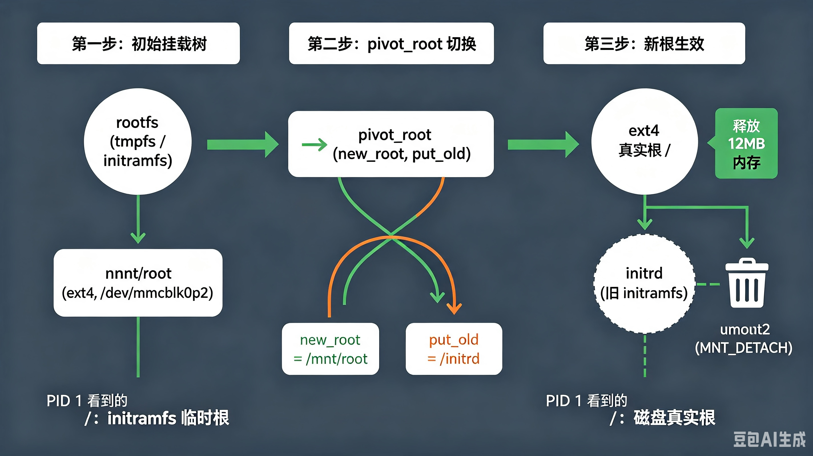

# 7.6.2 根文件系统的挂载过程

> 所属章节：第7章 启动链深度解析 > 7.6 init
> 
> 难度：[I→E] | 预计阅读时间：35分钟

## <span class="blue"> 本节导读

7.6.1 的末尾，`kernel_init` 要执行 `/sbin/init`——但 init 是一个文件，文件躺在根文件系统里，而此刻根文件系统还没挂载。这是启动链上最后一个鸡生蛋问题：执行 init 需要根文件系统，而访问任何文件之前得先有一个挂载好的根。内核破解它的入口是 `prepare_namespace()`，而嵌入式调试中最常见的一行卡死日志 `Waiting for root device`，就打印在这条路径上。<BR>
本节覆盖：`prepare_namespace()` 的挂载调用链、`Waiting for root device` 在等什么、initramfs 为什么总是先被挂载、`pivot_root` 如何切换整棵挂载树、挂载失败时设备名/驱动/设备树三类根因的区分方法。

---

## <span class="blue"> Waiting for root device 到底在等什么 [E]

某车机产品，eMMC 存根文件系统，内核启动后停在这行日志不再前进：

```
[    1.8xxxxx] Waiting for root device /dev/mmcblk0p2...
```

"等待"这个动作本身值得先拆开看。打印这行日志的不是挂载重试，而是挂载**之前**的等待循环 `wait_for_root()`：命令行带了 `rootwait` 时，内核在发起挂载前先等设备就绪——每 5ms 轮询一次，直到异步 probe 全部收尾、且 `root=` 字符串能解析出真实设备号，才往下走挂载。它在等的不是"设备"这个抽象概念，而是一个具体事件——**块设备驱动的异步 probe 完成、分区被内核枚举出来**。MMC 子系统的设备扫描跑在 `mmc_rescan` 工作队列里，与 `kernel_init` 是并发关系：执行到挂载路径时，eMMC 可能还没扫完。

挂载的完整调用链从 `prepare_namespace()` 开始：

```c
/* init/do_mounts.c - Linux v6.6，节录 */
void __init prepare_namespace(void)
{
    /* 1. rootdelay=N：无条件先睡 N 秒，等慢速设备（USB 存储等）就绪 */
    if (root_delay) {
        printk(KERN_INFO "Waiting %d sec before mounting root device...\n",
               root_delay);
        ssleep(root_delay);
    }

    /* 2. 等所有已发起的异步 probe 收尾 */
    wait_for_device_probe();

    /* 3. 把 root= 字符串解析成设备号（内部走 early_lookup_bdev） */
    if (saved_root_name[0])
        ROOT_DEV = parse_root_device(saved_root_name);

    /* 4. 有 initrd 先处理 initrd（遗留机制，initramfs 见下文） */
    if (initrd_load(saved_root_name))
        goto out;

    /* 5. rootwait：设备还没枚举出来，就在这里循环等 */
    if (root_wait)
        wait_for_root(saved_root_name);  /* Waiting for root device 在这里打印 */

    /* 6. 真正挂载根设备 */
    mount_root(saved_root_name);
out:
    devtmpfs_mount();                          /* 挂载 devtmpfs 到 /dev */
    init_mount(".", "/", NULL, MS_MOVE, NULL); /* 当前目录提升为 / */
    init_chroot(".");
}
```

`mount_root()` 按 `parse_root_device()` 的解析结果分派：`/dev/nfs` 走 `mount_nfs_root()`，mtd/ubi 走 `mount_root_generic()` 的 nodev 分支，其余块设备走 `mount_block_root()`——后者同样汇入 `mount_root_generic()`，逐个文件系统类型尝试。最终执行者是 `do_mount_root()`，它发起 `init_mount()` 并打印那行成功日志：

```c
/* init/do_mounts.c - v6.6 节录 */
static int __init do_mount_root(const char *name, const char *fs,
                                const int flags, const void *data)
{
    struct super_block *s;
    int ret = init_mount(name, "/root", fs, flags, data);
    if (ret)
        return ret;

    init_chdir("/root");
    s = current->fs->pwd.dentry->d_sb;
    ROOT_DEV = s->s_dev;
    printk(KERN_INFO "VFS: Mounted root (%s filesystem)%s on device %u:%u.\n",
           s->s_type->name, sb_rdonly(s) ? " readonly" : "",
           MAJOR(ROOT_DEV), MINOR(ROOT_DEV));
    return 0;
}
```

所有类型都试失败时，panic 不在 `do_mount_root()` 里，而在它的调用者 `mount_root_generic()`：先打印 `VFS: Cannot open root device`、列出全部可用分区（`printk_all_partitions()`），然后 `panic("VFS: Unable to mount root fs ...")`。末尾案例的 panic 现场就出自这里。

整条决策链：

```mermaid
graph TD
    A[kernel_init] --> B[prepare_namespace]
    B --> C{rootdelay 参数?}
    C -->|设置了| D[ssleep 死等 N 秒]
    C -->|未设置| E[wait_for_device_probe]
    D --> E
    E --> E2[parse_root_device<br>root= 字符串 → 设备号]
    E2 --> W{rootwait 且设备<br>还没枚举出来?}
    W -->|是| W2[wait_for_root<br>打印 Waiting for root device<br>每 5ms 轮询直到设备出现]
    W2 --> F
    W -->|否| F{root= 参数类型}
    F -->|/dev/mmcblk0p2 等| G[mount_block_root<br>→ mount_root_generic]
    F -->|/dev/nfs| H[mount_nfs_root<br>网络挂载]
    F -->|mtd/ubi| G2[mount_root_generic<br>nodev 挂载]
    G --> I{挂载成功?}
    H --> I
    G2 --> I
    I -->|成功| J[VFS: Mounted root<br>MS_MOVE + chroot]
    I -->|失败| L[VFS: Cannot open root device<br>列出可用分区后 panic]
    J --> M[/sbin/init]

    style J fill:#c8e6c9
    style W2 fill:#fff3e0
    style L fill:#ef9a9a
```

`rootwait` 与 `rootdelay` 经常混淆，分工其实很清楚：`rootdelay=N` 是无条件死等 N 秒，适合已知慢的设备；`rootwait` 是把挂载推迟到设备真正出现——`wait_for_root()` 每 5ms 轮询一次，设备枚举成功立刻继续，不等满任何固定时长。`rootwait` 还可带超时（`rootwait=30`），超时后放弃等待直接挂载，设备仍不在就按失败路径 panic。eMMC/SD 场景的正确选择是 `rootwait`。

> ⚠️ `rootwait` 能掩盖时序问题，但不能修复它。加了 `rootwait` 之后启动正常、去掉就 panic，说明驱动 probe 本身就慢或存在 deferred probe 重试——量产前应该查清这段延迟花在哪里，而不是把 `rootwait` 当永久创可贴。

---

## <span class="blue"> 鸡生蛋的另一面：initramfs 为什么总是先被挂载 [E]

块设备挂载解决的是"根在裸分区上"的简单情况。现实的存储栈经常更复杂：根文件系统在 LUKS 加密分区里，解密工具 cryptsetup 本身就是 rootfs 里的一个文件；或者根设备是 NVMe/SAS RAID，驱动以模块形式存在 rootfs 上——挂载根需要驱动，驱动又在根里。

initramfs 就是打破这类死锁的机制：**一个直接编进内核镜像的小型文件系统**，内核启动时它已经在内存里，不依赖任何块设备驱动就能展开，为真实根文件系统的准备提供早期用户态环境。

它"编进内核"的方式是在链接阶段占用一个专门的段：

```c
/* include/asm-generic/vmlinux.lds.h */
#define INIT_RAM_FS                                                     \
        . = ALIGN(4);                                                   \
        __initramfs_start = .;                                          \
        KEEP(*(.init.ramfs))                                            \
        . = ALIGN(8);                                                   \
        __initramfs_size = . - __initramfs_start;
```

构建时 `usr/Makefile` 把 `CONFIG_INITRAMFS_SOURCE` 指定的目录打成 cpio 归档（可再经 gzip/xz/lz4/zstd 压缩），链进 `.init.ramfs` 段。内核启动早期，`populate_rootfs()` 负责把它解压进 rootfs——一个挂载在 `/` 的 ramfs/tmpfs 内部实例。注意 v6.6 里这个动作是**异步**的：解压跑在 async 域里与后续 initcall 并发，这正是 7.6.1 中 `kernel_init_freeable()` 要用 `wait_for_initramfs()` 等它的原因：

```c
/* init/initramfs.c - v6.6 */
static int __init populate_rootfs(void)
{
    /* 解压提交为异步任务，与后续 initcall 并发执行 */
    initramfs_cookie = async_schedule_domain(do_populate_rootfs, NULL,
                                             &initramfs_domain);
    usermodehelper_enable();
    if (!initramfs_async)          /* initramfs_async=0 可关回同步模式 */
        wait_for_initramfs();
    return 0;
}
rootfs_initcall(populate_rootfs);
```

真正的解压与错误处理在异步任务的执行体里：内置 initramfs 损坏会直接 `panic_show_mem()`；如果内核镜像之外还挂了外部 initrd（bootloader 加载的那种），会接着尝试把它也按 initramfs 解开，解不开且配置了 `CONFIG_BLK_DEV_RAM` 时退回遗留的 initrd 块设备路径。

解压完成后，VFS 的 `/` 已经是一个可用文件系统——尽管只在内存里。随后 `kernel_init_freeable()` 检查其中有没有 `/init`（7.6.1 的搜索链第 1 级）：有就把控制权交给这个早期 init，由它完成解密、加载驱动、挂载真实根；没有才走上一节的 `prepare_namespace()` 直接挂块设备。

initramfs 的关键属性：

| 属性 | 说明 |
|------|------|
| **存储位置** | 内核镜像 `.init.ramfs` 段，随内核一起加载进内存 |
| **文件系统类型** | rootfs：ramfs 的内部实例（无 `root=` 且启用 TMPFS 时由 tmpfs 承载），挂载在 `/` |
| **归档格式** | newc 格式 cpio，支持 gzip/xz/lz4/zstd 压缩 |
| **访问条件** | 零驱动依赖，解压即可用 |
| **典型内容** | busybox、`/init` 脚本、必要的驱动模块与固件 |
| **生命周期** | 使命完成后经 `switch_root` 切换并卸载，内存归还 |
| **与 initrd 的区别** | initrd 是遗留机制：独立的内存块设备镜像，需要文件系统驱动；initramfs 直接是 cpio 解进 tmpfs，无块设备层 |

一个典型的加密盘启动流程里，initramfs 中的 `/init` 长这样：

```bash
#!/bin/busybox sh
# initramfs 中的 /init（简化版）

mount -t proc proc /proc
mount -t sysfs sysfs /sys
mount -t devtmpfs devtmpfs /dev

# 等加密分区出现（内核块设备 probe 是异步的）
while [ ! -e /dev/mmcblk0p2 ]; do
    sleep 0.1
done

cryptsetup luksOpen /dev/mmcblk0p2 rootfs_crypt
mount /dev/mapper/rootfs_crypt /mnt/root

# 切换挂载树，把控制权交给真实根上的 init
exec switch_root /mnt/root /sbin/init
```

`switch_root` 的最后一跳，就是下一节的机制。

---

## <span class="blue"> pivot_root：换掉整棵挂载树的根 [E]

initramfs 的使命完成时，真实根已挂载在 `/mnt/root`。最直接的切换想法是 `chroot("/mnt/root")`——不行。`chroot` 只改**当前进程**的根目录视图，挂载树本身纹丝不动：`/` 依然挂在 initramfs 的 rootfs 上，内存占用不会释放，后续挂载到 `/proc`、`/sys` 的操作也会落在错误的层次上。

这里需要先补一个概念：**挂载树与挂载命名空间**。内核里每次 `mount` 都在一棵全局的挂载树上挂接一个 `vfsmount`，进程看到的文件系统视图由它所在挂载命名空间中的这棵树决定。`chroot` 动的是进程的"视角指针"，`pivot_root` 动的才是树本身。要把系统从 initramfs 整体搬到真实根，必须操作挂载树——这正是 `pivot_root` 解决的问题：

1. 把当前的根挂载移动到指定位置（`put_old`）
2. 把新目录提升为 `/`
3. 所有进程随之落到新根上

```c
/* fs/namespace.c - SYSCALL_DEFINE2(pivot_root) 核心校验与动作（简化） */
    /* new_root 必须是挂载点；put_old 必须在 new_root 之下 */
    /* new_root 不能是当前根的祖先，两者不能在同一挂载上 */
    ...
    /* 交换两个 vfsmount 在挂载树中的位置 */
    attach_mnt(new_mnt, old_parent_mnt, old_mp);   /* 新根接到树顶 */
    attach_mnt(old_mnt, new_parent_mnt, new_mp);   /* 旧根移到 put_old */
```



`pivot_root` 与 `chroot` 的本质差异：

| 维度 | `pivot_root` | `chroot` |
|------|-------------|----------|
| **操作对象** | 挂载树（全局结构） | 单个进程的 `fs->root` 指针 |
| **对 `/` 的影响** | `/` 重新指向新挂载，所有进程可见 | 仅当前进程视角变化 |
| **旧根处理** | 移入 `put_old`，可随后 umount 释放 | 旧根仍挂在树上，root 可逃逸 |
| **典型用途** | initramfs → 真实根切换、容器 | FTP jail、简单隔离 |
| **安全强度** | 旧根卸载后无残留引用 | root 用户可 `chdir("..")` 类手法逃逸 |
| **调用权限** | `CAP_SYS_ADMIN` | `CAP_SYS_CHROOT` |

嵌入式里最常用的是 busybox 的 `switch_root`，它把这套动作封装成一条命令，等价逻辑：

```c
/* switch_root 等价逻辑（伪代码） */
int switch_root(const char *new_root, const char *init)
{
    mount(new_root, "/", NULL, MS_MOVE, NULL);   /* 新根移到 / 位置 */
    pivot_root(".", ".");                         /* 完成根交换 */
    umount2(".", MNT_DETACH);                     /* 卸载 initramfs，释放内存 */
    execl(init, init, NULL);                      /* 执行真实根上的 init */
}
```

三个高频陷阱都与"旧根的残留引用"有关：

1. **忘记卸载旧根**：不 `umount2(..., MNT_DETACH)`，initramfs 占用的几 MB 内存永远还不给系统
2. **文件描述符泄漏**：`/init` 脚本里打开的文件（日志、设备节点）若在 `exec` 前没关，引用计数不归零，旧根卸载报 `EBUSY`
3. **进程还在旧根上**：只有切换后 `chdir("/")` 的进程才真正落在新根；持有旧目录引用的残留进程同样挡住 umount

> 💡 内核自己的 `prepare_namespace()` 走的是另一套组合：`init_mount(".", "/", NULL, MS_MOVE, NULL)` 加 `init_chroot(".")`，而不是 `pivot_root`。原因是调用 `pivot_root` 时进程必须已经站在新根之下，而内核此刻还运行在初始 rootfs 的上下文里——MS_MOVE 把挂载点搬到位，chroot 再确认视角，效果等价。

一次完整切换在日志里的样子（示例时序）：

```
[    0.4xxxxx] initramfs: unpacking to rootfs...
[    1.3xxxxx] mmc0: new high speed MMC card at address 0001
[    1.4xxxxx] mmcblk0: mmc0:0001 8GTF4R 7.28 GiB
[    1.5xxxxx] EXT4-fs (mmcblk0p2): mounted filesystem with ordered data mode
[    1.5xxxxx] VFS: Mounted root (ext4 filesystem) on device 179:2.
[    1.6xxxxx] systemd[1]: systemd 247 running in system mode
```

initramfs 的生命周期通常只有一两秒：解压、等驱动、挂真实根、切换、退出。

---

## <span class="blue"> 挂载失败的三类根因与定位法 [I→E]

回到开头的车机案例。bootargs 里带的是 `rootwait=30`：`Waiting for root device /dev/mmcblk0p2` 等了三十秒，设备始终没枚举出来，超时放弃等待、挂载直接失败 panic（若是不带数字的 `rootwait`，表现则是无限等待、连 panic 都看不到）：

```
[   30.xxxxx] VFS: Cannot open root device "mmcblk0p2" or unknown-block(0,0): error -6
[   30.xxxxx] Please append a correct "root=" boot option; here are the available partitions:
[   30.xxxxx] b300         7634944 mmcblk1
[   30.xxxxx] b301           32768 mmcblk1p1
[   30.xxxxx] b302         1048576 mmcblk1p2
```

panic 信息里这份"可用分区列表"是定位的第一手证据，三类根因各对应一种列表形态：

| 根因类型 | 分区列表的形态 | 机制 |
|---------|--------------|------|
| **设备名错误** | 列表里有目标分区，但名字与 `root=` 不符（如 `mmcblk1p2` vs `mmcblk0p2`） | 设备编号由驱动枚举顺序决定，与原理图上的"第几个控制器"不必然一致 |
| **驱动未就绪/未编入** | 列表里根本没有目标设备的任何分区 | 对应控制器驱动没编进内核、probe 失败或严重 deferred |
| **设备树描述错误** | 设备出现在列表中但容量/分区不对，或时好时坏 | 设备树节点状态、总线时序、引脚配置与硬件不符 |

本例属于第一类：这块 RK3568 有两个 MMC 控制器，SD 卡接在第一个、eMMC 接在第二个，内核按 probe 顺序把 SD 编为 `mmcblk0`、eMMC 编为 `mmcblk1`。bootargs 里的 `root=/dev/mmcblk0p2` 是从另一块单板卡的方案抄来的——在那块板子上 eMMC 确实是 0 号。修复是把 bootargs 改成 `mmcblk1p2`，或者更稳妥地改用 `root=PARTUUID=xxxx`，彻底摆脱枚举顺序的依赖。

三类根因的排查动作：

```
# 1. 确认内核实际收到的参数（先排除 U-Boot 拼接错误）
cat /proc/cmdline

# 2. 确认内核枚举出的设备（与 panic 分区列表对照）
cat /proc/partitions
dmesg | grep -i mmc

# 3. 与 U-Boot 侧对照：U-Boot 的编号与内核编号是两套体系
=> mmc list
=> mmc dev 1; mmc info

# 4. 怀疑设备树时，确认内核拿到的节点状态
ls /sys/firmware/devicetree/base/soc/mmc*/
dmesg | grep -i "deferred"
```

> 🔴 **U-Boot 的 mmc 编号与内核的 mmcblk 编号没有任何对应关系。** U-Boot 按自己的设备树和初始化顺序编号，内核按自己的 probe 顺序编号。跨两套编号体系抄 `root=` 参数，是这类故障的头号来源。量产方案优先用 `PARTUUID` 或 `PARTLABEL` 指定根分区。

> 💡 `unknown-block(0,0)` 与 `unknown-block(179,2)` 的信息量不同：前者说明 `root=` 字符串连解析成设备号都没成功（名字格式或 `name_to_dev_t()` 不识别），后者说明设备号解析成功、但挂载时该设备不存在。看到 `(0,0)` 先查参数拼写，看到具体主从设备号再查设备本身。

---

## <span class="blue"> 本节总结

| 要点 | 内容 |
|------|------|
| **Waiting for root device** | `wait_for_root()` 在 `rootwait` 下的等待循环，等的是块设备异步 probe 完成、设备可解析；发生在挂载之前 |
| **rootwait vs rootdelay** | `rootdelay` 无条件睡固定秒数；`rootwait` 失败重试、设备就绪即继续，eMMC/SD 场景选后者 |
| **initramfs** | 编进内核 `.init.ramfs` 段的 cpio 归档，`populate_rootfs()` 解压进 tmpfs，零驱动依赖，破解"驱动在根上、根靠驱动"的死锁 |
| **initramfs vs initrd** | initramfs 直接解压进 tmpfs；initrd 是遗留的内存块设备镜像，需要文件系统驱动 |
| **pivot_root** | 操作挂载树本身完成根切换；`chroot` 只改进程视角，不能释放旧根 |
| **switch_root 三陷阱** | 忘卸旧根、fd 泄漏、进程残留旧目录引用——都表现为旧根 `EBUSY` 或内存不释放 |
| **三类根因** | 设备名错误（列表有分区名不符）/ 驱动未就绪（列表无设备）/ 设备树错误（信息不符或时好时坏） |
| **编号纪律** | U-Boot 编号 ≠ 内核编号；量产用 `root=PARTUUID=` 摆脱枚举顺序依赖 |

> 💡 根文件系统挂载是内核态与用户态的分界线：`VFS: Mounted root` 之前的问题在内核与设备树，之后的问题在 rootfs 内容。这行日志是启动排错中价值最高的一个坐标点。

---

## <span class="blue"> 下一步

根挂上了，init 跑起来了——但嵌入式产品的启动需求早就不止"跑起来"：服务要并行启动、崩溃要自动拉起、依赖要声明式管理。下一节看初始化系统从 sysvinit 到 systemd 的演进，以及嵌入式场景里 BusyBox init、systemd、自定义轻量 init 的取舍。

→ [7.6.3 从init到systemd：初始化系统的演进](7.6.3_从init到systemd_初始化系统的演进.md)

---

## <span class="blue"> 延伸阅读

- `init/do_mounts.c`：`prepare_namespace()`、`wait_for_root()`、`mount_root_generic()` 与 `parse_root_device()` 的完整实现
- `init/initramfs.c`：`populate_rootfs()`、`do_populate_rootfs()` 与 cpio 解压逻辑
- `fs/namespace.c`：`pivot_root` 系统调用的挂载树操作
- `Documentation/admin-guide/kernel-parameters.txt`：`root=`、`rootwait`、`rootdelay`、`rw` 参数说明
- `Documentation/filesystems/ramfs-rootfs-initramfs.rst`：initramfs 机制的官方文档
