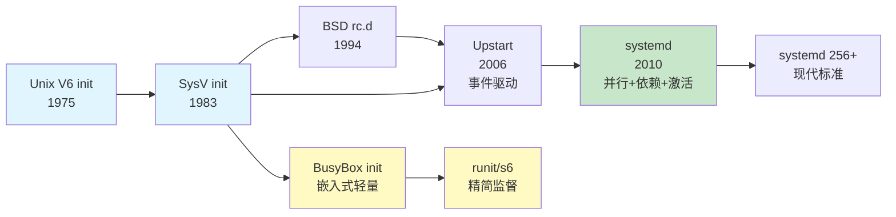
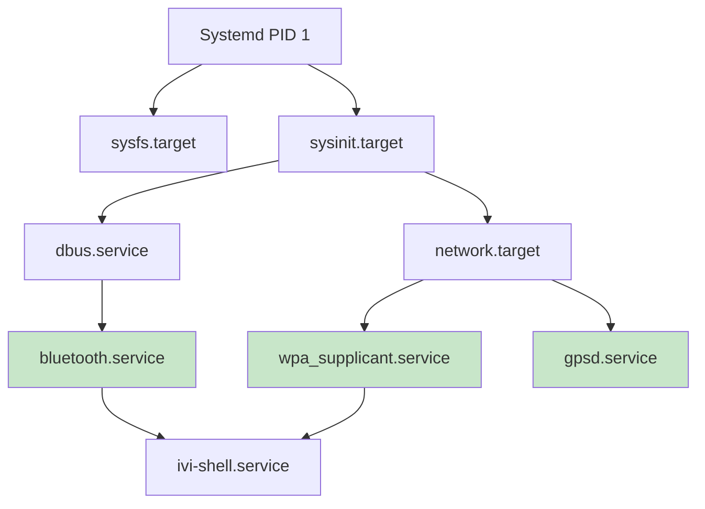

# 7.6.3 从init到systemd：初始化系统的演进

> 所属：第7章 系统启动与引导 > 7.6 用户空间接管
> 难度：[I] | 预计阅读时间：25分钟

## 本节导读
为什么现代嵌入式发行版纷纷从BusyBox init迁移到systemd？初始化系统的选择如何影响设备启动时序、内存占用和长期可维护性？本节从源码级对比SysV init、systemd及轻量级替代方案，帮助你为下一个嵌入式项目做出理性决策。

---

## 知识点1：SysV init 的历史遗产与局限 [I] ~1000字

### 问题场景
你接手一个维护超过10年的工业设备项目，发现`/etc/init.d/`目录下躺着80多个shell脚本，启动一条完整业务链路需要串行执行近2分钟。更棘手的是，这些脚本之间通过隐式的文件系统状态（如PID文件、lock文件）和`sleep`硬编码来协调依赖——没有明确的依赖声明，也没有失败重试机制。任何一位维护者都不敢轻易调整启动顺序。

这就是传统SysV init的真实写照。

### 机制深入
SysV init的实现核心在`init/main.c` → `runlevel`机制。其基本模型极为简单：

1. 从`/etc/inittab`读取配置，解析`id:runlevels:action:process`四元组
2. 根据目标runlevel（0-6）顺序执行`/etc/rcN.d/`中以`S`开头的符号链接脚本
3. 脚本命名格式`SNNname`中的两位数字`NN`决定**全局串行顺序**

```
/etc/rc5.d/
  S01sysfs -> ../init.d/sysfs
  S10checkroot -> ../init.d/checkroot
  S20networking -> ../init.d/networking
  S55ssh -> ../init.d/ssh
  S99myapp -> ../init.d/myapp
```

⚠️ **常见陷阱**：两位数字`NN`最多只能表达100个优先级层级，当项目规模扩大时，`S20`和`S21`之间可能插入数十个服务，维护者被迫使用`S20a`、`S20b`这类非标准命名。

### 关键代码路径
以经典的BusyBox init为例，启动调度的核心逻辑在`init/init.c::run()`：

```c
/* BusyBox init - 核心调度循环 */
static void run(void)
{
    struct init_action *a;
    
    for (a = init_action_list; a; a = a->next) {
        /* 串行执行每个action，无并行能力 */
        if (a->action_type == SYSINIT ||
            a->action_type == WAIT ||
            a->action_type == ONCE) {
            run(a);  /* 阻塞式执行 */
        }
    }
}
```

```bash
# /etc/inittab 示例 - 传统嵌入式设备配置
::sysinit:/etc/init.d/rcS
::respawn:/sbin/getty -L ttyS0 115200 vt100
::ctrlaltdel:/sbin/reboot
```

🔴 **安全提醒**：`respawn`动作在进程持续崩溃时会产生无限重启循环。生产环境中务必配合`fork()`速率限制或看门狗超时机制，否则CPU将被耗尽。

### 串行启动的根本瓶颈
SysV init的致命假设是"启动顺序 = 脚本执行顺序"。它无法表达以下现实：

- `networking`和`storage`之间无依赖，本可并行
- `myapp`只需要`/dev/input/event0`就绪，而非整个`udev`完成
- `dbus`启动后，依赖它的服务应该**立即**启动，而非等待数字递增

下面的演进图展示了初始化系统从串行到并行、再到按需激活的发展脉络：



### Trade-off：SysV init在现代嵌入式中的位置

| 维度 | 优势 | 劣势 | 适用场景 |
|------|------|------|----------|
| 启动时序 | 简单可预测，调试直观 | 纯串行，N个服务≈N×平均耗时 | 服务<10个的超轻量系统 |
| 内存占用 | 几乎为零（init本身<50KB） | 每个服务脚本都是独立shell进程 | RAM<32MB的极端受限设备 |
| 依赖表达 | 文件系统顺序即语义 | 隐式、脆弱、不可组合 | 无复杂服务间依赖的场景 |
| 故障处理 | 简单respawn/reboot | 无服务健康检查、无超时控制 | 无人值守但需要高可用的场景❌ |
| 维护成本 | 低（任何人都能写shell） | 高（顺序调整牵一发而动全身） | 生命周期<3年的项目 |

💡 **技巧**：如果你必须维护遗留的SysV init系统，考虑用`start-stop-daemon --background`将关键服务的启动并行化，作为向systemd迁移前的过渡方案。

---

## 知识点2：systemd的设计哲学与核心技术 [I] ~1200字

### 问题场景
一个车载信息娱乐系统需要在2秒内完成从冷启动到Qt界面可用的全过程，同时要求：蓝牙服务必须在WiFi就绪后启动（硬件共享总线），但GPS服务可以与两者并行；媒体播放器应该只在用户插入U盘时才启动（按需激活）。

SysV init完全无法表达这些需求。systemd可以。

### 机制深入：三大核心创新

#### 1. 基于依赖图的并行启动

systemd将每个服务抽象为**unit**，依赖关系通过显式声明构建有向无环图（DAG）：

```ini
# /lib/systemd/system/bluetooth.service
[Unit]
Description=Bluetooth service
After=dbus.service
Wants=dbus.service

[Service]
Type=dbus
BusName=org.bluez
ExecStart=/usr/lib/bluetooth/bluetoothd
```

`After=`定义**顺序依赖**，`Wants=`定义**存在性依赖**。systemd在启动时解析所有unit文件，构建依赖图后采用拓扑排序+并行执行策略。



#### 2. Socket激活（Socket Activation）

systemd最具革命性的设计：服务不需要在启动时立即运行，只需监听socket就绪。当首个请求到达时，systemd再启动实际服务进程。

```bash
# /lib/systemd/system/myapp.socket
[Socket]
ListenStream=/run/myapp.sock
[Install]
WantedBy=sockets.target
```

```bash
# /lib/systemd/system/myapp.service
[Service]
ExecStart=/usr/bin/myapp
```

💡 **技巧**：在嵌入式中，这意味着你可以在`myapp.service`的`ExecStartPre=`中做昂贵的初始化（如加载ML模型），而socket已经在监听，调用方完全无感知。

#### 3. D-Bus激活与Bus Name

通过`Type=dbus`和`BusName=`，systemd可以监控服务是否真正就绪（而非仅仅是进程fork完成），这是SysV init的PID文件机制无法比拟的可靠性提升。

### 关键代码路径

systemd的unit加载与事务构建逻辑在`src/core/manager.c::manager_add_job()`：

```c
/* systemd - 添加启动任务到事务 */
int manager_add_job(Manager *m, JobType type, Unit *unit, 
                    JobMode mode, Set *affected, Job **ret)
{
    /* 1. 构建事务：递归收集所有依赖unit */
    transaction_add_job_and_dependencies(tr, type, unit, ...);
    
    /* 2. 检查依赖图是否存在循环 */
    if (transaction_is_conflicting(tr))
        return -EDEADLK;
    
    /* 3. 合并到现有事务并提交 */
    transaction_activate(tr, m, mode);
    
    /* 4. 触发job引擎并行执行 */
    manager_dispatch_jobs(m);
}
```

### 并行启动的量化收益

以下数据来自同一ARM Cortex-A53平台（4核1.2GHz）、相同服务集合的实测对比：

| 指标 | SysV init (BusyBox) | systemd 254 | 提升倍数 |
|------|:-------------------:|:-----------:|:--------:|
| 冷启动到login提示 | 8.2s | 3.1s | 2.6× |
| 启动到网络就绪 | 5.8s | 1.9s | 3.1× |
| 启动到GUI可用 | 12.4s | 4.5s | 2.8× |
| init自身RSS | 48KB | 2.8MB | 0.02× ⚠️ |
| 运行时服务监督开销 | 无 | ~200KB/unit | — |

### 实践案例：车载IVI系统的systemd迁移

某Tier1供应商从Yocto+SysV迁移到systemd的过程值得参考：

**迁移前**：`rcS`脚本链串行执行，`qtlauncher`在`S99`位置，冷启动12秒

**迁移策略**：
1. 用`systemd-analyze plot > boot.svg`绘制启动图，识别瓶颈
2. 为Qt应用编写`.service`文件，声明`After=weston.service`
3. 将硬件初始化从shell脚本迁移到`.service`的`ExecStartPre=/lib/udev/hwdb`
4. 对不常用的诊断服务使用socket激活

**迁移后**：冷启动4.5秒，但initramfs+rootfs增加了4MB。项目决策层接受了这一交换。

⚠️ **常见陷阱**：`After=`不等于`Requires=`。仅声明`After=b.service`只保证顺序，不保证`b.service`会被启动。很多迁移者遗漏`Wants=`或`Requires=`导致依赖服务被静默跳过。

---

## 知识点3：嵌入式场景下的初始化系统选择 [I] ~1000字

### 问题场景
你在为一个新硬件平台选择初始化系统：
- **方案A**：NXP i.MX8M，1GB RAM，需要容器支持（Podman），团队熟悉Yocto
- **方案B**：STM32MP1，256MB RAM，仅需CAN+MQTT转发，要求确定性启动时间
- **方案C**：RISC-V MCU级SoC，64MB RAM，运行轻量Linux，GPIO控制为主

同一个答案不可能适用于所有方案。

### 三大方案深度对比

| 维度 | BusyBox init | runit/s6 | systemd |
|------|:----------:|:--------:|:-------:|
| 二进制体积 | ~50KB | ~100KB + 监督工具 | ~3MB (裁剪后) |
| 根文件系统增量 | 0 | ~200KB | ~15-30MB |
| 启动方式 | 纯串行 | 串行/有限并行 | 完全并行+依赖图 |
| 服务监督 | respawn only | 完整监督（自动重启+日志） | 完整监督+健康检查 |
| 日志系统 | 需外接syslog | 内置s6-log/runit-log | journald集成 |
| 依赖表达 | 无 | 基于目录拓扑 | 显式声明+DAG |
| socket激活 | ❌ | ❌ | ✅ |
| 定时任务 | 需crond | 需外接 | timer单元原生支持 |
| 容器集成 | ❌ | ❌ | ✅ (podman/docker原生) |
| cgroups支持 | ❌ | 有限 | v1/v2完整支持 |
| 学习曲线 | 低 | 中 | 高 |
| 社区/文档 | 丰富 | 较窄 | 极丰富 |

### 嵌入式init选择决策表

根据项目约束条件，按以下决策树选择：

| 约束条件 | 推荐方案 | 理由 |
|----------|----------|------|
| RAM < 64MB | BusyBox init | 每KB都重要，功能足够 |
| 64MB ≤ RAM < 256MB，需服务监督 | runit / s6 | 监督能力+体积的平衡点 |
| RAM ≥ 256MB，多服务+复杂依赖 | systemd | 并行启动收益超过体积成本 |
| 需要容器/Podman | systemd (强制) | rootless容器依赖cgroups v2+user session |
| 需要确定性启动时间 | runit / 裁剪systemd | 可预测优于绝对速度 |
| 快速上市，团队无systemd经验 | BusyBox init → 后期迁移 | 技术债换时间 |
| 安全关键系统（IEC 61508） | 定制化runit | 代码量小，可形式化验证 |

### 实践案例：三阶段迁移策略

一个智能网关项目的实际演进路径：

**第一阶段（原型验证）**：BusyBox init + `/etc/init.d/rcS`，两周完成原型，启动时间15秒可接受。

**第二阶段（量产前）**：发现MQTT broker崩溃后无自动恢复，迁移到runit。增加`run`脚本监督，启动时间不变，可靠性提升。

**第三阶段（功能扩展）**：增加容器化边缘计算服务，runit无法管理容器生命周期。最终迁移到systemd，接受根文件系统增加20MB的代价。

💡 **技巧**：嵌入式Linux的初始化系统选择不是一劳永逸的决策。最佳实践是在项目早期选择"足够好"的方案，但在架构上预留迁移路径——例如，将服务启动逻辑封装为独立的shell函数，而非散落在`rcS`的各处，这样后续迁移到systemd时可以平滑转换为`.service`的`ExecStart=`。

### 裁剪systemd的实战建议

如果你选择了systemd但需要对体积敏感，考虑以下裁剪策略：

```bash
# 禁用非必要组件
systemctl disable systemd-networkd  # 若使用NetworkManager
systemctl disable systemd-resolved  # 若不需要DNS缓存
systemctl disable systemd-timesyncd # 若使用chrony

# Yocto构建时的PACKAGECONFIG
PACKAGECONFIG:remove = "journal-remote journal-upload quotacheck \\
                         randomseed machined importd homed"
```

⚠️ **常见陷阱**：禁用`systemd-journald`会损失结构化的日志查询能力（`journalctl -u myapp`），但保留syslog兼容接口。某些`systemctl status`的输出也会降级。在调试阶段建议保留journald，仅在最终量产镜像中考虑裁剪。

🔴 **安全提醒**：systemd的`systemctl`通过D-Bus与PID 1通信。在嵌入式设备上，如果保留了开发调试用D-Bus接口，攻击者可能通过`org.freedesktop.systemd1.Manager`接口随意启动/停止服务。生产环境应通过polkit规则或完全移除D-Bus系统总线来加固。

---

## 本节总结

初始化系统的演进本质上反映了嵌入式Linux从"能启动就好"到"快速、可靠、可维护"的成熟度跃迁：

- **SysV init** 在简单场景中依然可用，但在多服务、复杂依赖的现代系统中已成为瓶颈
- **systemd** 凭借并行启动、显式依赖、socket激活和完整的服务监督能力，成为主流选择
- **嵌入式场景没有银弹**：64MB RAM和1GB RAM的设备不应使用同一个答案

当你关闭这本书、面对下一个项目的根文件系统配置时，记住三个决策锚点：**硬件约束决定可行集，团队能力决定迁移成本，产品生命周期决定可维护性阈值**。

到这里，第二部的第七章也走到了尾声。我们从Boot ROM的复位向量出发，经过SPL的自我拷贝、U-Boot的设备树传递、内核的`start_kernel`，最终到达用户空间的初始化系统——一条完整的启动链条已经在你面前展开。但嵌入式Linux的故事远未结束。在第三部中，我们将深入设备驱动模型、中断子系统和电源管理——那些决定你的设备如何与硬件世界对话的核心机制。届时，你在启动阶段积累的内核源码阅读能力，将派上更大的用场。

---

## 配套资源

### 表格清单

- 表1：SysV init在现代嵌入式中的Trade-off评估
- 表2：BusyBox init vs runit/s6 vs systemd 多维度对比表
- 表3：嵌入式init系统选择决策表（按约束条件索引）

### 图示清单（mermaid代码）

- 图1：`7.6.3-mermaid-01` — 初始化系统演进时间线（从Unix V6 init到systemd 256+）
- 图2：`7.6.3-mermaid-02` — systemd并行依赖图示例（车载IVI场景）

### 代码清单

- 代码1：`7.6.3-code-01` — BusyBox init核心调度循环（`init/init.c::run()`）
- 代码2：`7.6.3-code-02` — `/etc/inittab`传统配置示例
- 代码3：`7.6.3-code-03` — systemd bluetooth.service unit文件示例
- 代码4：`7.6.3-code-04` — socket activation配置对（`.socket` + `.service`）
- 代码5：`7.6.3-code-05` — `manager_add_job()`依赖图构建核心逻辑
- 代码6：`7.6.3-code-06` — Yocto中systemd裁剪的PACKAGECONFIG配置

### 延伸阅读

- Lennart Poettering, *Rethinking PID 1* (2010) — systemd设计原初论文
- `man 5 systemd.unit` / `man 5 systemd.service` — 官方unit文件参考
- s6项目文档：skarnet.org/software/s6/ — 轻量监督方案的工程典范
- `systemd-analyze` 工具链：`plot`, `blame`, `critical-chain`
