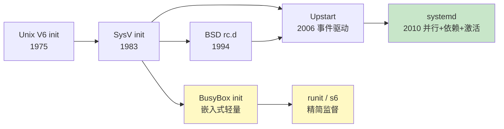
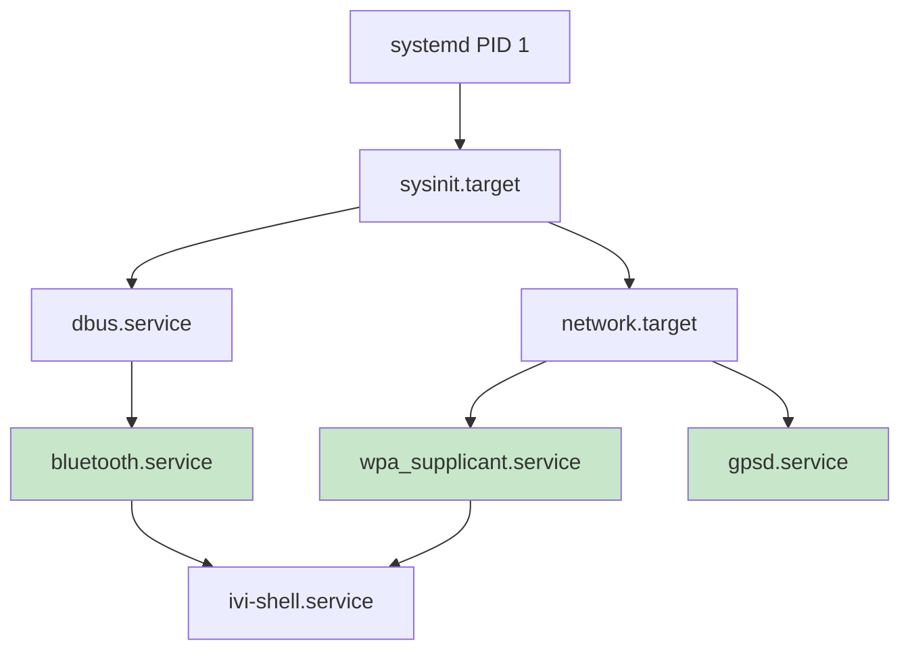
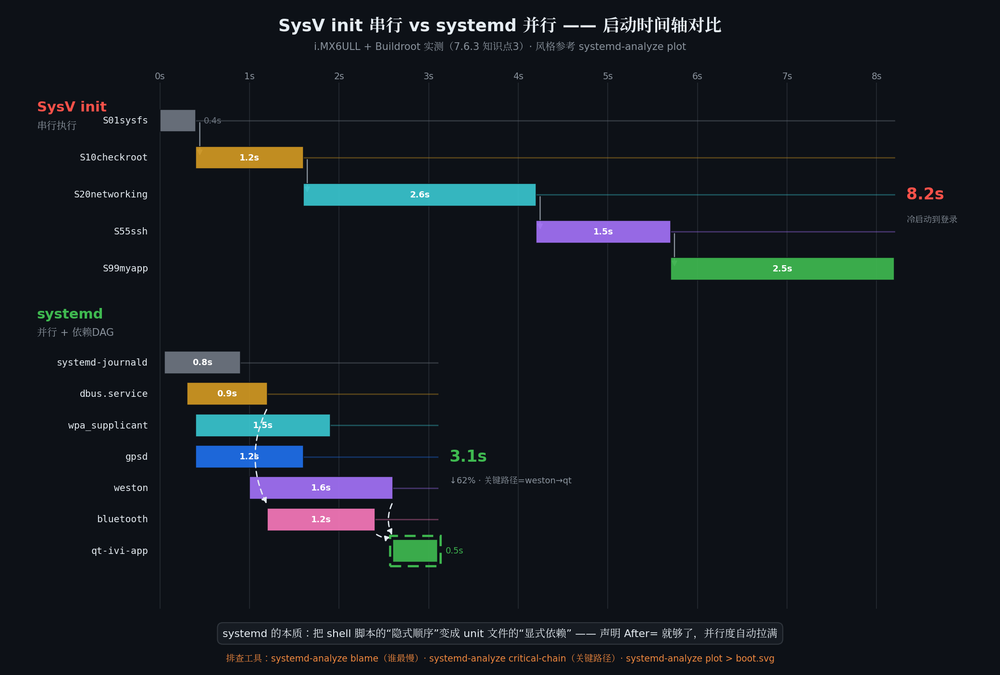

# 7.6.3 从init到systemd：初始化系统的演进

> 所属：第7章 系统启动全链路 > 7.6 init与用户空间的诞生
> 
> 难度：[I] | 预计阅读时间：35分钟

## <span class="blue"> 本节导读

7.6.2 的末尾，根文件系统就位，`kernel_execve()` 把 PID 1 交给了 `/sbin/init`——内核的接力到此结束。但在 Shell 提示符出现之前还有最后一棒：init 要把网络、日志、串口、业务应用这一批服务按正确的顺序拉起来，并在系统整个生命周期里看着它们。这一棒怎么跑，取决于初始化系统的选择：BusyBox init 的串行脚本、systemd 的依赖图并行，还是介于两者之间的轻量监督方案。嵌入式项目里"启动慢"和"服务起不来"两类问题，答案都藏在这一棒的组织方式里。<BR>
本节覆盖：SysV init 的串行模型及其结构性瓶颈、systemd 的 unit/target/依赖并行与 socket 激活、嵌入式场景 BusyBox init / runit·s6 / systemd 的选型逻辑与裁剪要点。

---

## <span class="blue"> init 拿到接力棒之后：SysV 的串行点名 [I]

先明确初始化系统要解决的问题。PID 1 自己不干任何业务，它的职责有两件：**按某个顺序拉起全部服务**，以及在此之后**监督这些进程**（挂掉了要不要重启、系统关机时怎么收尾）。"拉起"和"监督"这两件事的组织方式，就是各初始化系统的分水岭。

SysV init 的组织方式直白到近乎朴素：读 `/etc/inittab`，按 runlevel 执行 `/etc/rcN.d/` 下以 `S` 开头的脚本，脚本名里的两位数字决定全局串行顺序。

```
/etc/rc5.d/
  S01sysfs      -> ../init.d/sysfs
  S10checkroot  -> ../init.d/checkroot
  S20networking -> ../init.d/networking
  S55ssh        -> ../init.d/ssh
  S99myapp      -> ../init.d/myapp
```

```
# /etc/inittab - 传统嵌入式设备的典型配置
::sysinit:/etc/init.d/rcS
::respawn:/sbin/getty -L ttyS0 115200 vt100
::ctrlaltdel:/sbin/reboot
```

BusyBox init 的调度核心就是这个模型的直接体现——一张链表，挨个阻塞执行：

```c
/* BusyBox init/init.c - 核心调度（简化） */
static void run(const struct init_action *a)
{
    pid_t pid = fork();
    if (pid == 0) {
        /* 子进程：执行命令行 */
        execlp(a->command, ...);
        _exit(EXIT_FAILURE);
    }
    /* 父进程：WAIT 类型的动作要阻塞等子进程退出 */
    if (a->action_type & (SYSINIT | WAIT | ONCE))
        waitpid(pid, NULL, 0);
}
```

串行模型的瓶颈是结构性的，不是实现质量问题：

- **启动时间线性叠加**：N 个服务的总耗时约等于各自耗时之和，网络初始化的 3 秒里 CPU 大量时间在等 D-Bus、等 DHCP 应答，这些等待无法被利用
- **依赖靠隐式约定**：`S55ssh` 排在 `S20networking` 后面，靠的是命名数字而非声明；脚本之间再用 PID 文件、lock 文件、`sleep 2` 这类硬编码协调，改一个序号可能牵动一串
- **就绪语义粗糙**：脚本 fork 出守护进程就算"启动成功"，至于服务是否真的能响应请求，无人检查


```mermaid
graph LR
    A[Unix V6 init<br>1975] --> B[SysV init<br>1983]
    B --> C[BSD rc.d<br>1994]
    B --> D[Upstart<br>2006 事件驱动]
    C --> D
    D --> E[systemd<br>2010 并行+依赖+激活]
    B --> F[BusyBox init<br>嵌入式轻量]
    F --> G[runit / s6<br>精简监督]

    style E fill:#c8e6c9
    style F fill:#fff9c4
    style G fill:#fff9c4
```

SysV init 并没有因此一文不值，它的取舍在今天依然成立：

| 维度 | 优势 | 代价 | 适用场景 |
|------|------|------|---------|
| 启动时序 | 完全可预测，调试直观 | 纯串行，N 个服务耗时线性叠加 | 服务个位数的轻量系统 |
| 内存占用 | init 本体仅几十 KB | 每个脚本 fork 独立 shell | RAM 紧张的极简设备 |
| 依赖表达 | 文件顺序即语义，零学习成本 | 隐式、脆弱、不可组合 | 无复杂服务间依赖 |
| 故障处理 | respawn 一行搞定 | 无健康检查、无超时控制、无崩溃限速 | 功能固定的无人值守设备 |
| 维护成本 | 会写 shell 就能维护 | 顺序调整牵一发动全身 | 生命周期短的项目 |

> ⚠️ inittab 的 `respawn` 没有崩溃限速：服务进程启动即崩溃时，fork 循环会以全速耗尽 CPU。生产环境用 BusyBox init 时，关键服务的 respawn 要么配合脚本内的退避逻辑，要么交给带限速的监督方案（runit/s6/systemd 都内建）。

---

## <span class="blue"> systemd 凭什么并行：把启动脚本变成依赖图 [I→E]

一个车载信息娱乐系统的需求清单：冷启动到 Qt 界面可用要在数秒内完成；蓝牙必须在 WiFi 就绪后启动（共享射频总线）；GPS 可以与两者并行；媒体播放器只在插入 U 盘时才需要出现。串行点名表达不了"谁依赖谁"，更表达不了"按需出现"——systemd 的设计就是从回答这类问题出发的。

它的第一个概念是 **unit**：systemd 把一切被管理对象统一抽象为带类型的单元——service（服务）、socket（套接字）、target（同步点）、mount（挂载）、timer（定时器）等。第二个概念是 **target**：它解决"一批服务就绪"的标记问题，本身不干活，只是依赖图上的一个汇合节点，`multi-user.target` 大致对应 SysV 的多用户 runlevel。第三个概念是**显式依赖声明**，写在 unit 文件里：

```ini
# /lib/systemd/system/bluetooth.service
[Unit]
Description=Bluetooth service
After=dbus.service
Wants=dbus.service

[Service]
Type=dbus
BusName=org.bluez
ExecStart=/usr/lib/bluetooth/bluetoothd
```

`After=` 声明**顺序**（我在谁之后），`Wants=`/`Requires=` 声明**牵连**（我要谁也被拉起来）。systemd 启动时解析全部 unit 文件，构建一张有向无环图，然后按拓扑序**并行**执行——没有依赖关系的服务同时起跑，IO 等待互相重叠，串行模型里白白流走的时间被抢了回来。


```mermaid
graph TD
    systemd[systemd PID 1] --> sysinit[sysinit.target]
    sysinit --> dbus[dbus.service]
    sysinit --> net[network.target]
    dbus --> bt[bluetooth.service]
    net --> wifi[wpa_supplicant.service]
    net --> gps[gpsd.service]
    bt --> ui[ivi-shell.service]
    wifi --> ui

    style bt fill:#c8e6c9
    style gps fill:#c8e6c9
    style wifi fill:#c8e6c9
```



并行收益的本质是**等待重叠**：串行模型里服务的 IO 等待时间互相串烧，依赖图模型里这些等待彼此并行。同一块板子、同一组服务，从 SysV 迁到 systemd 后启动时间常见数倍量级的改善——但代价同样真实：systemd 本体加 journald、logind 等组件，rootfs 增量通常在 15~30MB 量级，init 自身的常驻内存也从几十 KB 涨到 MB 级。第三节的选型表会把这笔账摊开。

除了并行，systemd 还有两个嵌入式里同样有价值的设计。

**Socket 激活**：服务不必在启动时就运行，systemd 先替它把 socket 监听好，第一个请求到达时才拉起真正的进程。请求方完全无感。嵌入式里这意味着不常用的诊断服务、升级服务可以"零启动成本"存在，昂贵的初始化（加载模型、打开设备）挪到真正被调用的那一刻。

```ini
# /lib/systemd/system/myapp.socket
[Socket]
ListenStream=/run/myapp.sock

[Install]
WantedBy=sockets.target
```

**可靠的就绪语义**：SysV 用 PID 文件判断"服务起来了"，systemd 用 `Type=` 判断"服务能干活了"——`Type=dbus` 的服务要等它在 D-Bus 上注册出 `BusName` 才算就绪，`Type=notify` 的服务要自己调 `sd_notify()` 报 ready。依赖它的服务等到的是"可用"而不是"存在"，这是 PID 文件机制给不了的保证。

> ⚠️ `After=` 不等于 `Requires=`。只写 `After=b.service` 保证的是"如果 b 也启动，那我排在它后面"，并不保证 b 会被拉起来。迁移脚本时漏写 `Wants=`/`Requires=`，依赖服务被静默跳过，是最常见的 systemd 迁移事故。

> 🔴 `systemctl` 通过 D-Bus 与 PID 1 通信。设备上若保留开发期的 D-Bus 系统总线且未配 polkit 规则，拿到总线访问权的攻击者就能随意启停服务。量产固件应收敛 polkit 规则，高危场景直接移除系统总线。

---

## <span class="blue"> 嵌入式选型：没有银弹 [I]

三个真实场景，同一个问题：

- **方案 A**：i.MX8M，1GB RAM，要跑 Podman 容器，团队熟悉 Yocto
- **方案 B**：STM32MP1，256MB RAM，只做 CAN 转 MQTT，要求启动时间确定
- **方案 C**：RISC-V 小核，64MB RAM，GPIO 控制为主

三种约束，三个答案。把候选摊开比：

| 维度 | BusyBox init | runit / s6 | systemd |
|------|:----------:|:--------:|:-------:|
| init 本体体积 | ~50KB | ~100KB + 监督工具 | MB 级（裁剪后） |
| rootfs 增量 | ≈0 | ~200KB | 15~30MB |
| 启动方式 | 纯串行 | 串行为主 + 并行服务目录 | 依赖图并行 |
| 服务监督 | 仅 respawn（无限速） | 完整监督：自动重启、崩溃限速 | 完整监督 + 健康检查 + watchdog |
| 日志 | 依赖外部 syslog | 内置日志工具 | journald 集成 |
| 依赖表达 | 无 | 目录拓扑（简单） | 显式声明 + DAG |
| socket/timer 激活 | 无 | 无 | 原生支持 |
| cgroups/容器 | 无 | 有限 | v1/v2 完整支持 |
| 学习曲线 | 低 | 中 | 高 |

按约束条件查表：

| 约束条件 | 推荐方案 | 理由 |
|----------|----------|------|
| RAM < 64MB | BusyBox init | 每 KB 都重要，功能足够 |
| 64MB~256MB，需要服务监督 | runit / s6 | 监督能力与体积的平衡点 |
| RAM ≥ 256MB，多服务复杂依赖 | systemd | 并行收益超过体积成本 |
| 需要容器（Podman/Docker） | systemd | rootless 容器依赖 cgroups v2 与会话管理 |
| 要求确定性启动时间 | runit / 裁剪 systemd | 可预测优于绝对速度 |
| 安全关键（IEC 61508 类） | runit 或自研极简 init | 代码量小，可审查、可验证 |
| 快速上市、团队无 systemd 经验 | BusyBox init，预留迁移路径 | 技术债换时间 |

方案 A 选 systemd（容器生态是硬约束），方案 B 选 runit（确定性优先），方案 C 选 BusyBox init（资源硬约束）。

方案 C 还有一条没列进表里的路：**自研极简 init**。几十行 C 代码——挂载 `/proc`、`/sys`、`/dev`，直接 `exec` 业务主程序，把进程监督合并进业务进程自身。它放弃了全部通用性，换来极致的体积和完全可控的行为，MCU 级 Linux 和安全芯片场景里并不少见。前面 7.5.4 的 init 信任根讨论对这条路格外重要：自研 init 就是 PID 1，它的崩溃就是系统 panic，代码必须按这个标准写。

### 一个网关项目的三阶段演进

初始化系统的选择不是一次性决策，这个项目的演进路径有代表性：

1. **原型期**：BusyBox init + 一个 `rcS` 脚本，两周出原型，15 秒启动时间可接受
2. **量产前**：MQTT broker 崩溃后无人拉起，迁移到 runit，每个服务一个 `run` 脚本，启动时间不变，可靠性达标
3. **功能扩展期**：增加容器化边缘计算，runit 管不了容器生命周期，最终迁入 systemd，接受 rootfs 增大 20MB

预留迁移路径的做法很朴素：服务启动逻辑封装成独立脚本或函数，不散落在 `rcS` 各处。迁移到 systemd 时每个函数平移成一个 `.service` 的 `ExecStart=`，依赖关系再补声明。

### 选了 systemd 之后的裁剪要点

systemd 按组件裁剪，Yocto/Buildroot 都有现成开关：

```
# 运行期禁用用不到的组件
systemctl disable systemd-networkd     # 用 NetworkManager 时
systemctl disable systemd-resolved     # 不需要 DNS 缓存时
systemctl disable systemd-timesyncd    # 用 chrony 时

# Yocto 构建期裁剪
PACKAGECONFIG:remove = "journal-remote journal-upload quotacheck \
                         randomseed machined importd homed"
```

> ⚠️ 裁 `systemd-journald` 要慎重：失去 `journalctl -u myapp` 的结构化查询能力，`systemctl status` 的输出也会降级。调试期保留 journald，量产镜像再评估是否裁剪。

---

## <span class="blue"> 接力赛的终点：Shell 提示符出现 [I]

到这里，可以回看整条启动链了。从复位向量开始：BootROM 在 Mask ROM 里点完介质名单，SPL 在 SRAM 里初始化 DDR，U-Boot 重定位后修好设备树交棒，内核从 `head.S` 跑到 `start_kernel()` 再跑完八级 initcalls，`rest_init()` 裂变出三个 PID，1 号线程挂上根文件系统、完成 `kernel_execve()` 的自我替换——现在，初始化系统拉起最后一个 getty 或业务应用。

串口上那行 `login:` 或者 `#` 提示符，是这场接力赛的终点线。它的每一棒都对应本章的一节，也对应日志里的一段输出。启动排错的全部方法论由此收敛成一句话：**任何一行卡住的日志，都能映射回某一棒的某段源码**。

这条链上的每一段机制——调度、内存、驱动模型——在系统跑起来之后还在继续运转，后续章节会把它们从"初始化视角"切换到"运行时视角"重新审视。启动链是理解它们的最好入口：它是整个系统初始化的缩影。

---

## <span class="blue"> 本节总结

| 要点 | 内容 |
|------|------|
| **初始化系统的职责** | 按序拉起服务 + 全生命周期监督；组织方式是各方案的分水岭 |
| **SysV init** | inittab + `SNN` 脚本串行点名；可预测、零成本，但等待无法重叠、依赖靠隐式约定 |
| **systemd 三概念** | unit（统一抽象）、target（同步点）、显式依赖（`After=` 顺序 / `Wants=`·`Requires=` 牵连） |
| **并行收益本质** | 依赖图上无依赖服务的 IO 等待互相重叠；代价是 15~30MB rootfs 增量与 MB 级常驻内存 |
| **socket 激活** | 先监听后拉起，请求到达才启动服务；嵌入式里适合低频诊断/升级服务 |
| **就绪语义** | `Type=dbus`/`Type=notify` 保证"可用"而非"存在"，优于 PID 文件 |
| **嵌入式选型** | <64MB 用 BusyBox init，需监督用 runit/s6，多服务复杂依赖或容器用 systemd，极致精简可自研 init |
| **迁移纪律** | 启动逻辑封装成独立单元便于平移；`After=` 必须搭配 `Wants=`/`Requires=` |
| **全章主线** | BootROM → SPL → U-Boot → 内核 → init → Shell，每行启动日志都能映射回某一棒的源码 |

> 💡 下一项调试任务出现时，先问两个问题：卡在提示符出现之前（启动链问题，按本章分段定位），还是之后（运行时问题，去对应子系统章节）。这个分界能把排查范围直接减半。

---

## <span class="blue"> 延伸阅读

- Lennart Poettering, *Rethinking PID 1*（2010）：systemd 的设计原初论文
- `man 5 systemd.unit`、`man 5 systemd.service`：unit 文件官方参考
- `systemd-analyze plot/blame/critical-chain`：启动耗时分析三件套
- s6 项目文档（skarnet.org/software/s6/）：轻量监督方案的工程范本
- BusyBox `init/init.c`：最小可用的 PID 1 实现，适合通读
