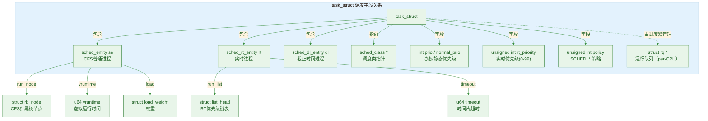
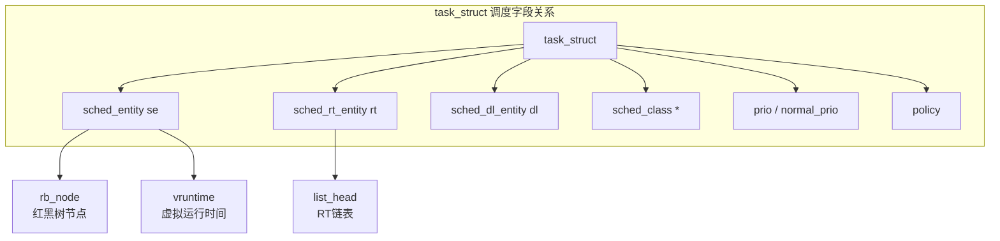

# 8.1.1 task_struct数据结构全景

> 所属：第8章 进程调度全景 > 8.1 调度基础设施
> 难度：[I→E] | 预计阅读时间：40分钟

## 本节导读

当你在内核代码中看到 `current->mm` 或 `current->pid` 时，是否意识到 `current` 指向的是一个超过8KB的庞大结构体？这个结构体就是 `task_struct`——Linux内核中每个进程/线程的唯一"身份证"。本节从源码级拆解 `task_struct` 的全貌：它有多大、包含哪些关键字段、如何被分配到内存、以及ARM64架构下 `current` 宏背后的寄存器魔法。掌握这些，是理解后续调度器行为的前提。

---

## 知识点1：task_struct是什么 — 进程的"身份证" [E] ~1200字

### 问题场景

你正在调试一个RK3568平台上的多线程应用，发现某个线程CPU占用率异常。你决定写一个小型内核模块来打印所有线程的优先级和虚拟运行时间。但你很快发现，`task_struct` 包含数百个字段，有的字段名相似（`prio` vs `normal_prio` vs `rt_priority`），有的字段指针嵌套多层（`task_struct → sched_entity → vruntime`）。你需要理解这个结构体的组织逻辑，才能写出正确的模块代码。

### 机制深入

#### 定义位置与规模

`task_struct` 定义在 `include/linux/sched.h`，是Linux内核中**最大、最核心**的数据结构之一。在ARM64平台上，其大小约为 **8KB**（x86_64上约6.7KB，可通过 `/sys/kernel/slab/task_struct/object_size` 读取精确值）。

这个差异主要来自：
- 架构特定的 `thread_struct` 字段（包含FPU状态、CPU上下文等）
- 各种 `CONFIG_*` 编译选项（如 `CONFIG_CGROUPS`、`CONFIG_NAMESPACES`、`CONFIG_SECCOMP`）
- 指针宽度（64位架构的指针占用8字节）

```c
/* include/linux/sched.h - task_struct 结构体（精简版） */
struct task_struct {
    struct thread_info        thread_info;      /* 架构相关底层信息 [E] */
    unsigned int              __state;          /* 进程状态（5个基本值） */
    void                      *stack;           /* 内核栈指针 */
    struct sched_entity       se;               /* CFS调度实体 */
    struct sched_rt_entity    rt;               /* RT调度实体 */
    struct sched_dl_entity    dl;               /* DL调度实体 */
    struct mm_struct          *mm;              /* 用户空间内存描述符 */
    struct mm_struct          *active_mm;       /* 活跃内存描述符 */
    pid_t                     pid;              /* 线程ID（TID） */
    pid_t                     tgid;             /* 线程组ID（PID） */
    struct task_struct        *parent;          /* 父进程 */
    struct list_head          children;         /* 子进程链表 */
    struct list_head          sibling;          /* 兄弟进程链表 */
    struct files_struct       *files;           /* 打开文件表 */
    struct fs_struct          *fs;              /* 文件系统信息 */
    struct signal_struct      *signal;          /* 信号处理信息 */
    struct sighand_struct     *sighand;         /* 信号处理函数表 */
    struct nsproxy            *nsproxy;         /* 命名空间代理 */
    struct cred               *cred;            /* 凭证（权限） */
    char                      comm[16];         /* 进程名（仅显示） */
    /* ... 数百个其他字段 ... */
};
```

#### 为什么task_struct必须这么大？

Linux内核将进程相关的**所有**信息集中在 `task_struct` 中，而不是像微内核那样分散到多个服务中。这种设计的Trade-off如下：

| 设计维度 | 集中式（Linux选择） | 分散式（微内核风格） |
|---------|-------------------|-------------------|
| 访问效率 | 高：一个指针即可访问进程所有信息 | 低：需要跨进程/服务通信 |
| Cache友好性 | 中等：热点字段分布在8KB范围内 | 低：跨多个页访问 |
| 内核复杂度 | 低：无IPC开销 | 高：需要RPC机制 |
| 内存占用 | 大：约8KB/进程 | 小：按需分配 |
| 扩展性 | 直接增删字段即可 | 需要修改接口 |

💡 **实践启示**：对嵌入式系统而言，每个进程8KB的固定开销意味着**100个进程仅task_struct就占用约800KB**。在RAM只有64MB的小系统上，设置合理的 `pid_max`（`/proc/sys/kernel/pid_max`）是必要的调优手段。

#### 进程vs线程：Linux的统一视角

Linux内核没有独立的"线程"数据结构。**线程就是共享资源的进程**。`task_struct` 中的 `mm` 字段是区分的关键：

- **独立进程**：`mm != NULL`，拥有独立地址空间
- **同进程内的线程**：`mm` 指向同一个 `mm_struct`，仅 `pid` 不同
- **内核线程**：`mm == NULL`，`active_mm` 借用上一个用户进程的（详见8.1.2节）

```c
/* 判断是否为内核线程 */
static inline int is_kthread(const struct task_struct *p)
{
    return p->mm == NULL;   /* 内核线程无自己的mm */
}
```

### 关键代码路径

获取当前进程的 `task_struct` 是内核中最频繁的操作之一。ARM64上的 `current` 宏实现：

```c
/* arch/arm64/include/asm/current.h */
static __always_inline struct task_struct *get_current(void)
{
    unsigned long cur;
    asm ("mrs %0, tpidr_el1" : "=r" (cur));  /* 从TPIDR_EL1读取 [E] */
    return (struct task_struct *)cur;
}
#define current get_current()
```

这里的 `TPIDR_EL1`（EL1 Thread Pointer）是ARM64的系统寄存器，**专门用于存储当前task_struct的指针**。在进程切换时（`__switch_to`），内核将新进程的 `task_struct` 地址写入 `TPIDR_EL1`：

```asm
/* arch/arm64/kernel/entry.S - cpu_switch_to */
ENTRY(cpu_switch_to)
    mov     x10, #THREAD_CPU_CONTEXT
    add     x8, x0, x10              /* x0 = prev */
    mov     x9, sp
    stp     x19, x20, [x8], #16      /* 保存 callee-saved 寄存器 */
    stp     x21, x22, [x8], #16
    stp     x23, x24, [x8], #16
    stp     x25, x26, [x8], #16
    stp     x27, x28, [x8], #16
    stp     x29, x9, [x8], #16       /* x29 + sp */
    str     lr, [x8]                 /* pc */
    add     x8, x1, x10              /* x1 = next */
    ldp     x19, x20, [x8], #16      /* 恢复 callee-saved 寄存器 */
    ldp     x21, x22, [x8], #16
    ldp     x23, x24, [x8], #16
    ldp     x25, x26, [x8], #16
    ldp     x27, x28, [x8], #16
    ldp     x29, x9, [x8], #16
    ldr     lr, [x8]
    mov     sp, x9
    msr     tpidr_el1, x1            /* 关键：TPIDR_EL1指向next task_struct */
    ret
ENDPROC(cpu_switch_to)
```

### Trade-off：current宏的架构选择

| 架构 | current获取方式 | 寄存器/机制 | 延迟（cycles） | 特点 |
|------|----------------|------------|---------------|------|
| ARM64 (4.x+) | TPIDR_EL1 | 专用系统寄存器 | ~3 | 安全性好，不依赖栈 |
| ARM64 (4.x前) | SP_EL0 masking | 栈指针掩码 | ~5 | 需要栈对齐，现已废弃 |
| x86_64 | GS段寄存器 | `%gs:current_task` | ~3 | 利用段机制寻址 |
| RISC-V | TP寄存器 | `tp` (x4) | ~2 | 最简洁，用通用寄存器 |
| 早期32位ARM | 栈底thread_info | `sp & ~(THREAD_SIZE-1)` | ~8 | 多级间接访问，最慢 |

### 常见陷阱

⚠️ **陷阱1**：`pid` 不等于用户态看到的PID。在 `task_struct` 中，`pid` 是**线程ID（TID）**，`tgid` 才是**进程ID（PID）**。主线程的 `pid == tgid`，子线程的 `tgid` 与主线程相同。

⚠️ **陷阱2**：不要在内核模块中直接 `sizeof(struct task_struct)`——它的大小随内核配置变化，跨版本不兼容。如需访问字段，使用内核提供的辅助函数（如 `task_pid_nr()`）。

🔴 **安全提醒**：`task_struct` 的 `comm` 字段只有16字节（包含`\0`），长进程名会被截断。在审计日志中不要依赖完整的 `comm` 做安全判定。

---

## 知识点2：关键字段分类 — 调度、内存、文件、信号、命名空间 [E] ~1500字

### 问题场景

你在移植CFS调度器到一款新的嵌入式芯片时，需要裁剪内核以节省内存。`task_struct` 中哪些字段是调度器绝对必需的？哪些可以在嵌入式场景下通过 `CONFIG` 选项关闭？你需要理解每个字段分类的依赖关系，才能做出正确的裁剪决策。

### 机制深入

`task_struct` 的数百个字段可以按功能分为六大类。下表列出每类的核心字段及其关键路径：

**表1：task_struct关键字段分类速查表**

| 类别 | 核心字段 | 路径/用途 | 可否裁剪 | 嵌入式建议 |
|------|---------|----------|---------|-----------|
| **状态** | `__state`, `exit_state`, `flags` | `schedule()` → `deactivate_task()` | 否 | 必须保留 |
| **调度** | `se`, `rt`, `dl`, `prio`, `normal_prio`, `rt_priority`, `policy`, `sched_class` | `pick_next_task()` → `update_curr()` | 否 | `dl`可关闭（无SCHED_DEADLINE需求时） |
| **内存** | `mm`, `active_mm` | `switch_mm()` → `context_switch()` | 否 | 必须保留 |
| **文件** | `files`, `fs` | `do_open()` → `fd_install()` | 是（CONFIG_HUICONFIG） | 无文件系统的系统可关闭 |
| **信号** | `signal`, `sighand`, `blocked`, `pending` | `do_signal()` → `handle_signal()` | 是（CONFIG_SIGNAL） | 纯嵌入式可关闭，但POSIX兼容性丢失 |
| **命名空间** | `nsproxy` | `copy_namespaces()` → `create_nsproxy()` | 是（CONFIG_NAMESPACES） | 无容器需求的系统建议关闭 |
| **进程关系** | `parent`, `children`, `sibling`, `group_leader` | `do_wait()` → `wait_consider_task()` | 否 | 必须保留 |
| **凭证** | `cred`, `real_cred` | `cap_capable()` → 权限检查 | 是（CONFIG_SECURITY） | 无多用户系统可简化 |
| **时间** | `utime`, `stime`, `start_time` | `account_user_time()` | 是（CONFIG_IRQ_TIME_ACCOUNTING） | 调试用，可关闭 |
| **性能** | `sched_info`, `ioac` | `schedstat_enabled()` | 是（CONFIG_SCHEDSTATS`） | 生产环境建议关闭 |

#### 深入：调度相关字段

调度是 `task_struct` 最重要的用途之一。Linux采用**调度类（sched_class）**的模块化设计，每个进程可能属于不同的调度类：



#### sched_entity：CFS的核心

`sched_entity` 是CFS（完全公平调度器）的核心数据结构，定义在 `include/linux/sched.h`：

```c
struct sched_entity {
    struct load_weight      load;           /* 权重（nice值映射） */
    struct rb_node          run_node;       /* CFS红黑树节点 */
    struct list_head        group_node;     /* 组调度链表节点 */
    unsigned int            on_rq;          /* 是否在运行队列上 */
    u64                     exec_start;     /* 本次运行起始时间 */
    u64                     sum_exec_runtime; /* 总运行时间 */
    u64                     vruntime;       /* 虚拟运行时间 [E] */
    u64                     prev_sum_exec_runtime;
    u64                     nr_migrations;  /* 迁移次数 */
    struct sched_avg        avg;            /* 负载追踪（PELT算法） */
#ifdef CONFIG_FAIR_GROUP_SCHED
    struct sched_entity     *parent;        /* 父调度实体（cgroups） */
    struct cfs_rq           *cfs_rq;        /* 所属CFS运行队列 */
    struct cfs_rq           *my_q;          /* 拥有的CFS运行队列 */
#endif
};
```

`vruntime` 是CFS的灵魂。它按以下公式更新（`kernel/sched/fair.c:update_curr()`）：

```
vruntime += delta_exec * NICE_0_LOAD / se.load.weight
```

- 高优先级进程（nice值小）→ weight大 → vruntime增长慢 → 更容易被选中
- 低优先级进程（nice值大）→ weight小 → vruntime增长快 → 更晚被选中

#### mm vs active_mm：理解两者的区别

| 场景 | `mm` | `active_mm` | 说明 |
|------|------|-------------|------|
| 普通用户进程 | 指向本进程 `mm_struct` | 与 `mm` 相同 | 拥有独立地址空间 |
| 同进程内的线程 | 共享指向同一 `mm_struct` | 与 `mm` 相同 | 共享地址空间 |
| 内核线程 | `NULL` | 借用最近用户进程的 `mm_struct` | 无用户态地址空间 |

内核线程需要 `active_mm` 的原因是：即使不访问用户空间，TLB也需要一个有效的ASID（Address Space ID）上下文。借用 `active_mm` 避免了频繁刷新TLB。

### 关键代码路径

```c
/* kernel/sched/core.c - __schedule() 中的核心逻辑 */
static void __sched notrace __schedule(bool preempt)
{
    struct task_struct *prev, *next;
    struct rq *rq;
    int cpu;

    cpu = smp_processor_id();
    rq = cpu_rq(cpu);                    /* 获取本CPU运行队列 */
    prev = rq->curr;                     /* 当前运行的进程 */

    /* ... 中断关闭 ... */

    if (!preempt && prev->__state) {     /* 如果当前进程需要睡眠 [E] */
        if (signal_pending_state(prev->__state, prev))
            prev->__state = TASK_RUNNING; /* 有信号等待，不睡眠 */
        else
            deactivate_task(rq, prev, DEQUEUE_SLEEP); /* 从运行队列移除 */
    }

    next = pick_next_task(rq, prev, &rf); /* 调度类选择下一个进程 */

    if (likely(prev != next)) {
        rq->nr_switches++;
        rq->curr = next;
        ++*switch_count;
        trace_sched_switch(preempt, prev, next);
        rq = context_switch(rq, prev, next, &rf); /* 上下文切换 */
    }
    /* ... */
}
```

### 实践案例：嵌入式系统的task_struct裁剪

**项目场景**：某工业网关（ARM Cortex-A53, 256MB RAM）运行自定义Linux，不需要多用户、不需要容器、不需要文件系统（ramdisk只读）。目标是最大化可用内存。

**优化措施与效果**：

| 优化项 | 配置变更 | task_struct节省 | 副作用 |
|--------|---------|----------------|--------|
| 关闭命名空间 | `CONFIG_NAMESPACES=n` | ~200字节 | 无法运行Docker |
| 关闭多用户审计 | `CONFIG_AUDIT=n` | ~120字节 | 无安全审计日志 |
| 关闭调度统计 | `CONFIG_SCHEDSTATS=n` | ~160字节 | 无法用schedstat |
| 关闭cgroup | `CONFIG_CGROUPS=n` | ~400字节 | 无法使用systemd限制资源 |
| 关闭信号 | `CONFIG_SIGNAL=n` ⚠️ | ~200字节 | **无法kill进程！** |
| **合计** | | **~1080字节（约13%）** | |

💡 **技巧**：使用 `pahole` 工具（`dwarves` 包）可以精确分析结构体布局：

```bash
# 在编译后的vmlinux上运行
pahole -C task_struct vmlinux | head -50
# 输出每个字段的偏移、大小、对齐padding
```

⚠️ **陷阱**：关闭 `CONFIG_SIGNAL` 后，进程将无法接收任何信号（包括SIGKILL），只能通过`reboot`终止。这是一个**不可逆的破坏性决策**，除非构建纯静态确定性系统，否则不建议关闭。

---

## 知识点3：task_struct的分配与thread_info的位置演变 [E] ~1200字

### 问题场景

你在排查一个RK3568平台上的内核panic：系统在高负载下偶尔触发 `Unable to handle kernel NULL pointer dereference`，崩溃栈显示发生在 `copy_process()` 中。你怀疑是 `task_struct` 分配失败。理解 `task_struct` 的内存分配机制和 `thread_info` 的历史演变，是定位这类问题的关键。

### 机制深入

#### slab分配：为什么不用kmalloc？

`task_struct` 通过专用的 **slab cache** 分配，而非通用的 `kmalloc`。这是因为在高频率的 `fork()`/`exit()` 路径上，slab分配器能：

1. **缓存对象**：释放的 `task_struct` 不立即归还页分配器，而是留在slab中复用
2. **硬件对齐**：按L1 Cache Line对齐，减少False Sharing
3. **快速分配**：O(1)时间复杂度，无伙伴系统搜索开销

```c
/* kernel/fork.c - task_struct的slab cache创建 [E] */
#ifndef CONFIG_ARCH_TASK_STRUCT_ALLOCATOR
static struct kmem_cache *task_struct_cachep;

void __init fork_init(void)
{
#ifndef ARCH_MIN_TASKALIGN
#define ARCH_MIN_TASKALIGN    L1_CACHE_BYTES
#endif
    /* 创建专用slab cache */
    task_struct_cachep = kmem_cache_create("task_struct",
                                             sizeof(struct task_struct),
                                             ARCH_MIN_TASKALIGN,
                                             SLAB_PANIC | SLAB_ACCOUNT,
                                             NULL);
    /* ... */
}

/* task_struct分配宏 */
#define alloc_task_struct()     kmem_cache_alloc(task_struct_cachep, GFP_KERNEL)
#define free_task_struct(tsk)   kmem_cache_free(task_struct_cachep, (tsk))
#endif
```

`SLAB_PANIC` 标志的含义是：**如果分配失败，直接panic**。这保证了 `fork()` 路径不需要处理 `NULL` 返回值——内核认为 `task_struct` 分配失败是不可恢复的系统级错误。

#### thread_info的位置演变：二十年三阶段

`thread_info` 是架构相关的结构体，包含最低层级的线程状态（如抢占计数、标志位）。它的位置经历了三次重大演变：

**表2：thread_info位置演变历史**

| 时期 | 内核版本 | thread_info位置 | task_struct位置 | current获取方式 | 内核栈关联 |
|------|---------|----------------|----------------|----------------|-----------|
| **第一阶段** | 2.4及之前 | 无此结构 | 内核栈**尾部** | `sp & ~(THREAD_SIZE-1)` | task_struct与栈绑定 |
| **第二阶段** | 2.6 - 3.x | 内核栈**底部**（起始地址），内含 `task` 指针 | **slab独立分配** | `sp & ~(THREAD_SIZE-1)` → `thread_info.task` | 解绑，栈仅含thread_info |
| **第三阶段** | 4.x - 6.x | **嵌入task_struct内部**（作为首个字段） | slab独立分配 | 直接读取 `TPIDR_EL1`/`GS` | 完全独立分配 |

#### 第一阶段的原理（Pre-2.6）

```c
/* 早期内核：task_struct存储在内核栈尾部 */
#define current \
    ((struct task_struct *)((unsigned long)sp & ~(THREAD_SIZE - 1)))
```

通过将栈指针按 `THREAD_SIZE`（通常是8KB或16KB）对齐，直接得到 `task_struct` 的基地址。**零额外寄存器开销**，但需要保证 `task_struct` 大小不超过 `THREAD_SIZE`。

#### 第二阶段的原理（2.6 - 3.x）

```c
/* 第二阶段内核：thread_info在栈底，内含task指针 */
struct thread_info {
    struct task_struct *task;     /* 指向slab分配的task_struct */
    unsigned long flags;           /* TIF_* 标志 */
    int preempt_count;             /* 抢占计数 */
    mm_segment_t addr_limit;       /* 地址限制 */
};

static inline struct thread_info *current_thread_info(void)
{
    return (struct thread_info *)
        ((unsigned long)current_stack_pointer & ~(THREAD_SIZE - 1));
}

#define current (current_thread_info()->task)  /* 两级间接访问 */
```

这一阶段引入 `thread_info` 的动机是：随着 `task_struct` 增长到超过 `THREAD_SIZE`，无法继续存放在栈内。将 `task_struct` 移到slab分配，`thread_info` 保留在栈底作为"桥头堡"。

#### 第三阶段的原理（4.x+）

```c
/* 现代内核：thread_info嵌入task_struct */
struct task_struct {
    struct thread_info thread_info;   /* 第一个字段，可直接通过current访问 */
    /* ... */
};

/* ARM64的thread_info（极简版） */
struct thread_info {
    unsigned long flags;              /* TIF_NEED_RESCHED, TIF_SIGPENDING等 */
    mm_segment_t addr_limit;
#ifdef CONFIG_ARM64_SW_TTBR0_PAN
    u64 ttbr0;                        /* TTBR0_EL1保存值 */
#endif
    int preempt_count;                /* 0=可抢占, <0=bug */
};

/* current宏直接读取专用寄存器 */
#define current get_current()  /* → 读取 TPIDR_EL1，即为task_struct指针 */
#define current_thread_info()  (&current->thread_info)
```

第三阶段的关键优势：

| 维度 | 第三阶段（现代） | 第二阶段（历史） |
|------|---------------|---------------|
| current延迟 | ~3 cycles（单次寄存器读） | ~8 cycles（掩码+两次内存访问） |
| 栈溢出保护 | task_struct不受栈溢出影响 | thread_info可能被栈溢出覆盖 |
| 寄存器使用 | 占用TPIDR_EL1/GS | 不占用 |
| 安全特性 | 支持STACKPROTECTOR、KASAN | 受限 |
| EL1线程模式 | 支持（SP_EL0独立） | 不支持 |

💡 **关键洞察**：第三阶段的设计使得 `current` 的获取与**内核栈完全无关**。这在处理栈溢出、内核panic等异常场景时尤为重要——即使栈已损坏，内核仍能正确识别当前进程。

#### ARM64的特殊演变：SP_EL0 → TPIDR_EL1

ARM64在4.x版本后还经历了一次内部变化：

- **4.x之前**：`SP_EL0` 保存 `current`（用户态栈指针寄存器在EL1下被挪用）
- **4.x之后（2017年合并）**：改用 `TPIDR_EL1` 保存 `current`，释放 `SP_EL0`

这次变更的动机是为了支持**EL1 Thread Mode**（使用 `SP_EL0` 作为EL1的栈指针），以及将 `SP_EL0` 用作临时寄存器优化。这也是 `get_thread_info` 宏从 `mrs rd, sp_el0` 改为 `mrs rd, tpidr_el1` 的原因。

### 关键代码路径

```c
/* kernel/fork.c - dup_task_struct()：fork时复制task_struct [E] */
static struct task_struct *dup_task_struct(struct task_struct *orig, int node)
{
    struct task_struct *tsk;
    unsigned long stack;

    /* 1. 从slab分配task_struct */
    tsk = alloc_task_struct_node(node);
    if (!tsk)
        return NULL;

    /* 2. 分配内核栈（THREAD_SIZE，通常16KB） */
    stack = alloc_thread_stack_node(tsk, node);
    if (!stack)
        goto free_tsk;

    /* 3. 复制task_struct内容 */
    setup_thread_stack(tsk, orig);   /* 实际为 memcpy(tsk, orig, sizeof(*tsk)) */

    /* 4. 清零需重新初始化的字段 */
    clear_tsk_need_resched(tsk);
    set_task_stack_end_magic(tsk);   /* STACK_END_MAGIC，用于栈溢出检测 */

    /* ... */
    return tsk;

free_tsk:
    free_task_struct(tsk);
    return NULL;
}
```

### 实践案例：高负载下的task_struct分配失败分析

**项目场景**：某边缘计算网关运行AI推理服务，频繁创建/销毁短生命周期子进程。长时间运行后，系统偶发 `fork: Cannot allocate memory`。

**排查过程**：

1. 检查 `/proc/slabinfo` 中 `task_struct` 的活跃对象数：
   ```bash
   cat /proc/slabinfo | grep task_struct
   # task_struct     2048   2048   6848   4   16   : tunables  0   0   0 : slabdata  128   128   0
   ```
   活跃对象2048个，占用约 `2048 * 6848 ≈ 14MB`。

2. 问题根因：`fork()` 过快导致slab分配器耗尽预分配的slab，需要向伙伴系统申请新页。在内存碎片化严重时，`kmalloc(sizeof(task_struct), GFP_KERNEL)` 可能失败。

3. **解决方案**：调整 `pid_max` 限制最大进程数 + 使用线程池替代短生命周期进程：
   ```bash
   # /etc/sysctl.conf
   kernel.pid_max = 1024          # 限制最大PID数
   ```

⚠️ **陷阱**：`SLAB_PANIC` 只在 **slab cache初始化时** 生效（`kmem_cache_create` 阶段）。运行时 `kmem_cache_alloc` 失败**不会panic**，而是返回 `NULL`。`dup_task_struct()` 中有 `if (!tsk) return NULL;` 的检查，最终会转化为用户态 `fork()` 返回 `-ENOMEM`。

🔴 **安全提醒**：在 `fork_init()` 中计算 `max_threads` 的公式：
```c
max_threads = mempages / (8 * THREAD_SIZE / PAGE_SIZE);
```
这个默认值在64KB大页 + 16KB栈的ARM64系统上可能过于保守。如果嵌入式系统需要大量轻量级线程，可通过 `/proc/sys/kernel/threads-max` 调整。

---

## 本节总结

`task_struct` 是Linux进程管理体系的核心节点。本节覆盖的三个核心认知：

1. **规模与组织**：约8KB（ARM64），包含数百个字段，按状态/调度/内存/文件/信号/命名空间六大类组织。`current` 宏通过架构专用寄存器（ARM64的 `TPIDR_EL1`）直接获取，延迟仅3个cycles。

2. **调度字段的层次**：CFS通过 `sched_entity` 中的 `vruntime` 实现公平调度；`mm` vs `active_mm` 的区分让用户进程和内核线程共存于同一调度框架。

3. **分配机制与历史演变**：通过专用slab cache分配，`SLAB_PANIC` 保证初始化不失败；`thread_info` 从栈底到嵌入 `task_struct` 的演变，反映了内核在性能、安全性、架构演进之间的持续权衡。

**给嵌入式工程师的三条建议**：
- 用 `pahole` 分析你的内核配置下 `task_struct` 的精确大小，评估进程数上限的内存开销
- 无容器需求的嵌入式系统，关闭 `CONFIG_NAMESPACES` 可节省约200字节/task
- 理解 `TPIDR_EL1` 在进程切换时的更新点（`__switch_to`），这是调试ARM64调度问题的关键锚点

---

## 配套资源

### 表格清单

| 表格编号 | 名称 | 位置 |
|---------|------|------|
| 表1 | task_struct关键字段分类速查表 | 知识点2 |
| 表2 | thread_info位置演变历史 | 知识点3 |
| 辅助表 | current宏的架构选择对比 | 知识点1 Trade-off |
| 辅助表 | mm vs active_mm场景对照 | 知识点2 |
| 辅助表 | 第三阶段vs第二阶段设计对比 | 知识点3 |

### 图示清单（mermaid代码）



### 代码清单

| 编号 | 代码片段 | 说明 | 路径 |
|------|---------|------|------|
| 代码1 | `task_struct` 精简定义 | 核心字段展示 | `include/linux/sched.h` |
| 代码2 | ARM64 `current` 宏实现 | TPIDR_EL1读取 | `arch/arm64/include/asm/current.h` |
| 代码3 | `cpu_switch_to` 切换汇编 | TPIDR_EL1更新点 | `arch/arm64/kernel/entry.S` |
| 代码4 | `sched_entity` 结构体 | CFS调度实体 | `include/linux/sched.h` |
| 代码5 | `__schedule()` 核心逻辑 | 调度主循环 | `kernel/sched/core.c` |
| 代码6 | `fork_init()` slab创建 | task_struct cache初始化 | `kernel/fork.c` |
| 代码7 | `dup_task_struct()` 分配 | fork时的复制流程 | `kernel/fork.c` |

### 推荐阅读

- [LKD] Robert Love, "Linux Kernel Development", 3rd Ed., Chapter 3: Process Management
- [ULK] Daniel P. Bovet & Marco Cesati, "Understanding the Linux Kernel", Chapter 3: Processes
- 内核源码：`include/linux/sched.h`（`task_struct` 完整定义）
- 内核源码：`kernel/sched/fair.c:update_curr()`（`vruntime` 更新逻辑）
- 内核文档：`Documentation/core-api/slab-info.rst`（slab分配器详解）
