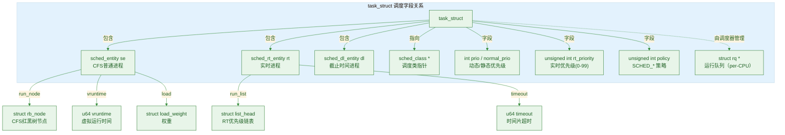
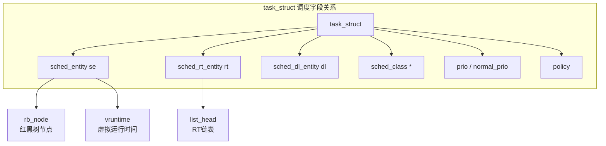

# 8.1.1 task_struct数据结构全景

> 所属章节：第8章 进程与调度 > 8.1 task_struct 与任务描述
>
> 难度：[I→E] | 预计阅读时间：40分钟

## <span class="blue"> 本节导读

内核代码里随处可见的 `current->mm`、`current->pid`，都指向同一个庞大的结构体——`task_struct`，Linux 内核中每个进程/线程的唯一描述符。调度器选择谁运行、fork 复制什么、进程退出释放什么，全都围绕它展开；读不懂它的字段组织，后续调度器源码就读不进去。<BR>
本节覆盖：`task_struct` 的规模与字段分类、进程/线程/内核线程的统一抽象、ARM64 上 `current` 宏的真实实现（SP_EL0 寄存器）、slab 分配机制与 `thread_info` 位置的三阶段演变。

---

## <span class="blue"> task_struct 是什么：进程的唯一描述符 [E]

### 问题场景

调试 RK3568 平台上的多线程应用时发现某个线程 CPU 占用率异常，想写一个小型内核模块打印所有线程的优先级和虚拟运行时间。但 `task_struct` 包含数百个字段，有的字段名相似（`prio` vs `normal_prio` vs `rt_priority`），有的指针嵌套多层（`task_struct → sched_entity → vruntime`）。不理解这个结构体的组织逻辑，模块代码就写不对。

### 机制深入

#### 定义位置与规模

`task_struct` 定义在 `include/linux/sched.h`，是Linux内核中**最大、最核心**的数据结构之一。在ARM64平台上，其大小约为 **8KB**（x86_64上约6.7KB，可通过 `/sys/kernel/slab/task_struct/object_size` 读取精确值）。

这个差异主要来自：
- 架构特定的 `thread_struct` 字段（包含FPU状态、CPU上下文等）
- 各种 `CONFIG_*` 编译选项（如 `CONFIG_CGROUPS`、`CONFIG_NAMESPACES`、`CONFIG_SECCOMP`）
- 指针宽度（64位架构的指针占用8字节）

```c
/* include/linux/sched.h - task_struct 结构体（精简版） */
struct task_struct {
    struct thread_info        thread_info;      /* 架构相关底层信息 [E] */
    unsigned int              __state;          /* 进程状态（5个基本值） */
    void                      *stack;           /* 内核栈指针 */
    struct sched_entity       se;               /* CFS调度实体 */
    struct sched_rt_entity    rt;               /* RT调度实体 */
    struct sched_dl_entity    dl;               /* DL调度实体 */
    struct mm_struct          *mm;              /* 用户空间内存描述符 */
    struct mm_struct          *active_mm;       /* 活跃内存描述符 */
    pid_t                     pid;              /* 线程ID（TID） */
    pid_t                     tgid;             /* 线程组ID（PID） */
    struct task_struct        *parent;          /* 父进程 */
    struct list_head          children;         /* 子进程链表 */
    struct list_head          sibling;          /* 兄弟进程链表 */
    struct files_struct       *files;           /* 打开文件表 */
    struct fs_struct          *fs;              /* 文件系统信息 */
    struct signal_struct      *signal;          /* 信号处理信息 */
    struct sighand_struct     *sighand;         /* 信号处理函数表 */
    struct nsproxy            *nsproxy;         /* 命名空间代理 */
    struct cred               *cred;            /* 凭证（权限） */
    char                      comm[16];         /* 进程名（仅显示） */
    /* ... 数百个其他字段 ... */
};
```

#### 为什么task_struct必须这么大？

Linux内核将进程相关的**所有**信息集中在 `task_struct` 中，而不是像微内核那样分散到多个服务中。这种设计的Trade-off如下：

| 设计维度 | 集中式（Linux选择） | 分散式（微内核风格） |
|---------|-------------------|-------------------|
| 访问效率 | 高：一个指针即可访问进程所有信息 | 低：需要跨进程/服务通信 |
| Cache友好性 | 中等：热点字段分布在8KB范围内 | 低：跨多个页访问 |
| 内核复杂度 | 低：无IPC开销 | 高：需要RPC机制 |
| 内存占用 | 大：约8KB/进程 | 小：按需分配 |
| 扩展性 | 直接增删字段即可 | 需要修改接口 |

> 💡 对嵌入式系统而言，每个进程约 8KB 的固定开销意味着 **100 个进程仅 task_struct 就占用约 800KB**。在 RAM 只有 64MB 的小系统上，设置合理的 `pid_max`（`/proc/sys/kernel/pid_max`）是必要的调优手段。

#### 进程vs线程：Linux的统一视角

Linux内核没有独立的"线程"数据结构。**线程就是共享资源的进程**。`task_struct` 中的 `mm` 字段是区分的关键：

- **独立进程**：`mm != NULL`，拥有独立地址空间
- **同进程内的线程**：`mm` 指向同一个 `mm_struct`，仅 `pid` 不同
- **内核线程**：`mm == NULL`，`active_mm` 借用上一个用户进程的（详见8.1.2节）

内核代码里的判断写法有两种，适用场景不同：

- 调度器视角：`p->mm == NULL` 即内核线程（无用户地址空间），`context_switch()` 里就是这么区分的；
- 标志位视角：`p->flags & PF_KTHREAD`（include/linux/sched.h:1748），kthread.c 用它识别「由 kthread 机制创建的内核线程」。

> ⚠️ 两个判据并不等价：`kernel_thread()` 创建后又 `exec()` 的任务（如调用用户态助手的 UMH 机制）带着 `PF_KTHREAD` 标志却拥有自己的 `mm`（kthread.c:88 的注释专门提醒了这一点）。判断「有没有用户地址空间」用 `mm`，判断「是不是 kthread 机制所生」用 `PF_KTHREAD`。

### 关键代码路径

获取当前进程的 `task_struct` 是内核中最频繁的操作之一。ARM64 上 `current` 宏的实现（v6.6 原文，arch/arm64/include/asm/current.h:15-24）：

```c
/* arch/arm64/include/asm/current.h */
static __always_inline struct task_struct *get_current(void)
{
	unsigned long sp_el0;

	asm ("mrs %0, sp_el0" : "=r" (sp_el0));

	return (struct task_struct *)sp_el0;
}

#define current get_current()
```

`SP_EL0` 是 ARM64 的 EL0 栈指针寄存器。用户态运行时它保存用户栈指针，进入内核后用户栈指针另有保存之处，内核运行期间 `SP_EL0` 被借用来存放**当前 task_struct 指针**——这是 arm64 从移植进主线起就采用的方案。进程切换时（`cpu_switch_to`），内核将新进程的 `task_struct` 地址写入 `SP_EL0`：

```asm
/* arch/arm64/kernel/entry.S:822 cpu_switch_to（v6.6，精简注释） */
SYM_FUNC_START(cpu_switch_to)
    mov     x10, #THREAD_CPU_CONTEXT
    add     x8, x0, x10              /* x0 = prev */
    mov     x9, sp
    stp     x19, x20, [x8], #16      /* 保存 callee-saved 寄存器 */
    stp     x21, x22, [x8], #16
    stp     x23, x24, [x8], #16
    stp     x25, x26, [x8], #16
    stp     x27, x28, [x8], #16
    stp     x29, x9, [x8], #16       /* x29 + sp */
    str     lr, [x8]                 /* pc */
    add     x8, x1, x10              /* x1 = next */
    ldp     x19, x20, [x8], #16      /* 恢复 callee-saved 寄存器 */
    ldp     x21, x22, [x8], #16
    ldp     x23, x24, [x8], #16
    ldp     x25, x26, [x8], #16
    ldp     x27, x28, [x8], #16
    ldp     x29, x9, [x8], #16
    ldr     lr, [x8]
    mov     sp, x9
    msr     sp_el0, x1               /* 关键：SP_EL0 指向 next 的 task_struct（entry.S:842） */
    /* v6.6 此处还有 ptrauth_keys_install_kernel 与 scs_save/scs_load_current
       （指针认证与影子调用栈），与切换主线无关，从略 */
    ret
SYM_FUNC_END(cpu_switch_to)
```

### Trade-off：current宏的架构选择

| 架构 | current 获取方式 | 机制 | 特点 |
|------|----------------|------|------|
| ARM64 | `SP_EL0` | EL0 栈指针寄存器在内核态的借用 | 单次系统寄存器读；从 arm64 进入主线起沿用至今 |
| x86_64 | GS 段基址 | per-cpu 变量 `%gs:current_task` | 利用段机制寻址 |
| RISC-V | `tp` 寄存器 | `register ... __asm__("tp")` 直接绑寄存器（arch/riscv/include/asm/current.h） | 用通用寄存器，最简洁 |
| 早期 32 位 ARM | 栈底 thread_info | `sp & ~(THREAD_SIZE-1)` 掩码取值 | 多级间接访问，已被专用寄存器方案取代 |

> ⚠️ `pid` 不等于用户态看到的 PID。在 `task_struct` 中，`pid` 是**线程 ID（TID）**，`tgid` 才是**进程 ID（PID）**。主线程的 `pid == tgid`，子线程的 `tgid` 与主线程相同。

> ⚠️ 不要在内核模块中依赖 `sizeof(struct task_struct)` 做跨版本假设——它的大小随内核配置变化。访问字段优先使用内核提供的辅助函数（如 `task_pid_nr()`）。

> 🔴 `task_struct` 的 `comm` 字段只有 16 字节（`TASK_COMM_LEN`，包含 `\0`），长进程名会被截断。审计日志中不要依赖完整的 `comm` 做安全判定。

---

## <span class="blue"> 六大类字段：调度、内存、文件、信号与其他 [E]

### 问题场景

裁剪嵌入式内核以节省内存时常见一个问题：`task_struct` 中哪些字段是调度器绝对必需的？关掉 `CONFIG_*` 选项能不能让它变小？回答这个问题需要先看清字段分类的依赖关系——以及一个反直觉的事实：**大部分字段是常驻的**，关掉 CONFIG 缩不掉它们（真实裁剪效果见本节末尾的实践案例）。

### 机制深入

`task_struct` 的数百个字段可以按功能分为六大类。下表列出每类的核心字段及其关键路径：

**表1：task_struct 关键字段分类速查表**（CONFIG 条件已对 v6.6 的 include/linux/sched.h 逐条核对）

| 类别 | 核心字段 | 用途 | 字段可否随 CONFIG 裁剪 |
|------|---------|------|----------------------|
| **状态** | `__state`, `exit_state`, `flags` | 调度器摘挂、退出管理 | 否，常驻 |
| **调度** | `se`, `rt`, `dl`, `prio`, `normal_prio`, `rt_priority`, `policy`, `sched_class` | 调度类选择与记账 | 否，常驻（`dl` 字段即使无 SCHED_DEADLINE 需求也保留） |
| **内存** | `mm`, `active_mm` | 地址空间切换 | 否，常驻 |
| **文件** | `files`, `fs` | 打开文件表、根目录与 umask | 否，常驻 |
| **信号** | `signal`, `sighand`, `blocked`, `pending` | 信号处理 | 否，常驻（内核没有 `CONFIG_SIGNAL` 这类开关） |
| **命名空间** | `nsproxy` | 容器隔离入口 | **字段常驻**（sched.h:1101 无 ifdef）；`CONFIG_NAMESPACES=n` 裁掉的是其背后的子系统代码 |
| **cgroup** | `cg_list`、`no_cgroup_migration` 等 | 资源控制挂载 | 是，随 `CONFIG_CGROUPS` 裁剪（sched.h:931、1223 两处条件段） |
| **审计** | `audit_context` | 系统调用审计 | 是，受 `CONFIG_AUDIT` + `CONFIG_AUDITSYSCALL` 控制（sched.h:1117-1119） |
| **统计** | `sched_info`, `ioac` | 调度与 I/O 记账 | 字段常驻；`CONFIG_SCHEDSTATS` 等只控制是否记账 |
| **进程关系** | `parent`, `children`, `sibling`, `group_leader` | 进程树维护、wait/孤儿回收 | 否，常驻 |
| **凭证** | `cred`, `real_cred` | 权限检查（uid/gid/capability） | 否，常驻（`CONFIG_SECURITY` 控制的是 LSM 钩子，不是这两个字段） |

#### 深入：调度相关字段

调度是 `task_struct` 最重要的用途之一。Linux采用**调度类（sched_class）**的模块化设计，每个进程可能属于不同的调度类：


```mermaid
%%{init: {'theme': 'base', 'themeVariables': { 'primaryColor': '#e8f5e9', 'primaryTextColor': '#1b5e20', 'primaryBorderColor': '#2e7d32', 'lineColor': '#388e3c', 'secondaryColor': '#fff3e0', 'tertiaryColor': '#e3f2fd'}}}%%
graph TD
    subgraph "task_struct 调度字段关系"
        TS["task_struct"]
        SE["sched_entity se<br/>CFS普通进程"]
        RT["sched_rt_entity rt<br/>实时进程"]
        DL["sched_dl_entity dl<br/>截止时间进程"]
        SC["sched_class *<br/>调度类指针"]
        PRIO["int prio / normal_prio<br/>动态/静态优先级"]
        RTPRIO["unsigned int rt_priority<br/>实时优先级(0-99)"]
        PLCY["unsigned int policy<br/>SCHED_* 策略"]
        RQ["struct rq *<br/>运行队列（per-CPU）"]
    end

    TS -->|"包含"| SE
    TS -->|"包含"| RT
    TS -->|"包含"| DL
    TS -->|"指向"| SC
    TS -->|"字段"| PRIO
    TS -->|"字段"| RTPRIO
    TS -->|"字段"| PLCY
    TS -.->|"由调度器管理"| RQ

    SE -->|"run_node"| RB["struct rb_node<br/>CFS红黑树节点"]
    SE -->|"vruntime"| VR["u64 vruntime<br/>虚拟运行时间"]
    SE -->|"load"| LW["struct load_weight<br/>权重"]

    RT -->|"run_list"| LL["struct list_head<br/>RT优先级链表"]
    RT -->|"timeout"| TO["u64 timeout<br/>时间片超时"]
```

#### sched_entity：CFS的核心

`sched_entity` 是CFS（完全公平调度器）的核心数据结构，定义在 `include/linux/sched.h`：

```c
/* include/linux/sched.h:548 struct sched_entity（v6.6，精简） */
struct sched_entity {
    struct load_weight      load;           /* 权重（nice值映射） */
    struct rb_node          run_node;       /* CFS红黑树节点 */
    u64                     deadline;       /* 虚拟截止期（EEVDF，见 8.3.2） */
    u64                     min_deadline;
    struct list_head        group_node;     /* 组调度链表节点 */
    unsigned int            on_rq;          /* 是否在运行队列上 */
    u64                     exec_start;     /* 本次运行起始时间 */
    u64                     sum_exec_runtime; /* 总运行时间 */
    u64                     prev_sum_exec_runtime;
    u64                     vruntime;       /* 虚拟运行时间 */
    s64                     vlag;           /* 虚拟滞后量（EEVDF） */
    u64                     slice;          /* 调度时间片 */
    u64                     nr_migrations;  /* 迁移次数 */
#ifdef CONFIG_FAIR_GROUP_SCHED
    int                     depth;
    struct sched_entity     *parent;        /* 父调度实体（cgroups） */
    struct cfs_rq           *cfs_rq;        /* 所属CFS运行队列 */
    struct cfs_rq           *my_q;          /* 拥有的CFS运行队列 */
#endif
#ifdef CONFIG_SMP
    struct sched_avg        avg;            /* 负载追踪（PELT算法） */
#endif
};
```

注意 v6.6 的新变化：CFS 的选择逻辑已引入 **EEVDF**（Earliest Eligible Virtual Deadline First），`deadline`/`vlag`/`slice` 三个字段由此而来。「选下一个任务」不再单纯取 vruntime 最小者，而是取「合格实体中虚拟截止期最早者」；vruntime 记账没有变，选择逻辑的细节在 8.3.2 展开。

`vruntime` 是 CFS 记账的核心。它按以下公式更新（`kernel/sched/fair.c` 的 `update_curr()`）：

```
vruntime += delta_exec * NICE_0_LOAD / se.load.weight
```

- 高优先级进程（nice值小）→ weight大 → vruntime增长慢 → 更容易被选中
- 低优先级进程（nice值大）→ weight小 → vruntime增长快 → 更晚被选中

#### mm vs active_mm：理解两者的区别

| 场景 | `mm` | `active_mm` | 说明 |
|------|------|-------------|------|
| 普通用户进程 | 指向本进程 `mm_struct` | 与 `mm` 相同 | 拥有独立地址空间 |
| 同进程内的线程 | 共享指向同一 `mm_struct` | 与 `mm` 相同 | 共享地址空间 |
| 内核线程 | `NULL` | 借用最近用户进程的 `mm_struct` | 无用户态地址空间 |

内核线程需要 `active_mm` 的原因是：即使不访问用户空间，TLB也需要一个有效的ASID（Address Space ID）上下文。借用 `active_mm` 避免了频繁刷新TLB。

### 关键代码路径

```c
/* kernel/sched/core.c:6576 __schedule() 核心逻辑（v6.6，精简） */
static void __sched notrace __schedule(unsigned int sched_mode)
{
    struct task_struct *prev, *next;
    struct rq *rq;
    int cpu;

    cpu = smp_processor_id();
    rq = cpu_rq(cpu);                    /* 获取本CPU运行队列 */
    prev = rq->curr;                     /* 当前运行的进程 */

    /* ... 关中断、持 rq 锁、更新时钟 ... */

    prev_state = READ_ONCE(prev->__state);
    if (!(sched_mode & SM_MASK_PREEMPT) && prev_state) {  /* 主动让出且需要睡眠 */
        if (signal_pending_state(prev_state, prev))
            WRITE_ONCE(prev->__state, TASK_RUNNING);   /* 有信号等待，不睡了 */
        else
            deactivate_task(rq, prev, DEQUEUE_SLEEP | DEQUEUE_NOCLOCK); /* 摘出运行队列 */
    }

    next = pick_next_task(rq, prev, &rf);  /* 调度类选择下一个进程 */

    if (likely(prev != next)) {
        rq->nr_switches++;
        RCU_INIT_POINTER(rq->curr, next);
        trace_sched_switch(sched_mode & SM_MASK_PREEMPT, prev, next, prev_state);
        rq = context_switch(rq, prev, next, &rf);  /* 上下文切换（顺带放 rq 锁） */
    }
    /* ... */
}
```

与旧版本读物对照时注意两个签名差异：v6.6 的 `__schedule()` 参数已从 `bool preempt` 改为 `unsigned int sched_mode`（抢占模式位掩码，core.c:6524-6534），状态读取用 `READ_ONCE(prev->__state)` 形成控制依赖（core.c:6625），防的是与唤醒路径 `ttwu()` 的竞态。

### 实践案例：嵌入式系统的内核裁剪——task_struct 能省多少？

**项目场景**：某工业网关（ARM Cortex-A53, 256MB RAM）运行自定义 Linux，不需要多用户、不需要容器。目标是最大化可用内存。

一个常见的预期是"关掉几个 CONFIG，task_struct 就小一圈"。对照前面的字段表会发现事实并非如此：**大多数字段常驻**，真正能裁掉的字段只有少数几个（cgroup 相关的若干标志位与链表、审计上下文）。裁剪的真实收益在别处：

| 优化项 | 配置变更 | 真实效果 | 副作用 |
|--------|---------|---------|--------|
| 关闭命名空间 | `CONFIG_NAMESPACES=n` | `nsproxy` 字段仍在；省掉 namespace 子系统的代码与数据结构实例 | 无法运行容器 |
| 关闭审计 | `CONFIG_AUDIT=n`、`CONFIG_AUDITSYSCALL=n` | `audit_context` 字段被裁（sched.h:1117-1119），省审计子系统 | 无安全审计日志 |
| 关闭调度统计 | `CONFIG_SCHEDSTATS=n` | 字段常驻但不再记账，省少量 CPU | schedstat 不可用 |
| 关闭 cgroup | `CONFIG_CGROUPS=n` | `cg_list` 等字段被裁（sched.h:931、1223），省整个 cgroup 子系统代码 | 无法用 systemd 限制资源 |

结论：**task_struct 本身的缩水以百字节计**，真正的内存收益来自不再实例化的子系统结构与代码段（cgroup 的 css_set、各 namespace 实例等）。把裁剪目标定在 task_struct 上会失望，定在子系统上才有量级可观的收益。

> 💡 用 `pahole` 工具（`dwarves` 包）可以精确分析当前内核配置下结构体的真实布局：
>
> ```bash
> # 在编译后的 vmlinux 上运行
> pahole -C task_struct vmlinux | head -50
> # 输出每个字段的偏移、大小、对齐 padding
> ```

> ⚠️ 信号机制无法通过 CONFIG 裁掉——内核没有 `CONFIG_SIGNAL` 这个选项，信号字段在 task_struct 中常驻。网上一些裁剪清单里的"关闭信号"说法是以讹传讹。

---

## <span class="blue"> task_struct 的分配与 thread_info 的位置演变 [E]

### 问题场景

排查 RK3568 平台上的内核 panic 时遇到这种现场：系统在高负载下偶尔触发 `Unable to handle kernel NULL pointer dereference`，崩溃栈停在 `copy_process()` 中，`task_struct` 分配失败是嫌疑之一。理解它的内存分配机制和 `thread_info` 的位置演变，是定位这类问题的前提。

### 机制深入

#### slab分配：为什么不用kmalloc？

`task_struct` 通过专用的 **slab cache** 分配，而非通用的 `kmalloc`。这是因为在高频率的 `fork()`/`exit()` 路径上，slab分配器能：

1. **缓存对象**：释放的 `task_struct` 不立即归还页分配器，而是留在slab中复用
2. **硬件对齐**：按L1 Cache Line对齐，减少False Sharing
3. **快速分配**：O(1)时间复杂度，无伙伴系统搜索开销

```c
/* kernel/fork.c:1041 fork_init()（v6.6，精简） */
#ifndef CONFIG_ARCH_TASK_STRUCT_ALLOCATOR
static struct kmem_cache *task_struct_cachep;

void __init fork_init(void)
{
#ifndef ARCH_MIN_TASKALIGN
#define ARCH_MIN_TASKALIGN    0
#endif
    int align = max_t(int, L1_CACHE_BYTES, ARCH_MIN_TASKALIGN);
    unsigned long useroffset, usersize;

    /* 计算 usercopy 白名单后，创建专用 slab cache */
    task_struct_whitelist(&useroffset, &usersize);
    task_struct_cachep = kmem_cache_create_usercopy("task_struct",
            arch_task_struct_size, align,
            SLAB_PANIC | SLAB_ACCOUNT,
            useroffset, usersize, NULL);
    /* ... */
}

/* task_struct 分配/释放宏 */
#define alloc_task_struct()     kmem_cache_alloc(task_struct_cachep, GFP_KERNEL)
#define free_task_struct(tsk)   kmem_cache_free(task_struct_cachep, (tsk))
#endif
```

与旧版读物对照有三处差异：缓存创建用的是 `kmem_cache_create_usercopy()`（带 usercopy 白名单，fork.c:1053），对象大小是 `arch_task_struct_size` 而非 `sizeof(struct task_struct)`，`ARCH_MIN_TASKALIGN` 的默认值是 0（对齐下界由 `max_t(int, L1_CACHE_BYTES, ...)` 兜住）。

`SLAB_PANIC` 的含义常被读错：它作用在**缓存创建**阶段——`kmem_cache_create_usercopy()` 失败才 panic（mm/slab_common.c:352），因为启动早期建不出 task_struct 缓存，系统根本无法运行。运行时的 `kmem_cache_alloc()` 失败**不会 panic**：SLUB 先走内存回收与 OOM 流程，仍失败则打印告警（`slab_out_of_memory()`，mm/slub.c:2983）并返回 `NULL`，最终表现为用户态 `fork()` 返回 `-ENOMEM`。

#### thread_info的位置演变：二十年三阶段

`thread_info` 是架构相关的结构体，包含最低层级的线程状态（如抢占计数、标志位）。它的位置经历了三次重大演变：

**表2：thread_info位置演变历史**

| 时期 | 内核版本 | thread_info位置 | task_struct位置 | current获取方式 | 内核栈关联 |
|------|---------|----------------|----------------|----------------|-----------|
| **第一阶段** | 2.4及之前 | 无此结构 | 内核栈**尾部** | `sp & ~(THREAD_SIZE-1)` | task_struct与栈绑定 |
| **第二阶段** | 2.6 - 3.x | 内核栈**底部**（起始地址），内含 `task` 指针 | **slab独立分配** | `sp & ~(THREAD_SIZE-1)` → `thread_info.task` | 解绑，栈仅含thread_info |
| **第三阶段** | 4.x - 6.x | **嵌入task_struct内部**（作为首个字段） | slab独立分配 | `SP_EL0`（arm64）/ GS（x86_64）专用寄存器直读 | 完全独立分配 |

#### 第一阶段的原理（Pre-2.6）

```c
/* 早期内核：task_struct存储在内核栈尾部 */
#define current \
    ((struct task_struct *)((unsigned long)sp & ~(THREAD_SIZE - 1)))
```

通过将栈指针按 `THREAD_SIZE`（通常是8KB或16KB）对齐，直接得到 `task_struct` 的基地址。**零额外寄存器开销**，但需要保证 `task_struct` 大小不超过 `THREAD_SIZE`。

#### 第二阶段的原理（2.6 - 3.x）

```c
/* 第二阶段内核：thread_info在栈底，内含task指针 */
struct thread_info {
    struct task_struct *task;     /* 指向slab分配的task_struct */
    unsigned long flags;           /* TIF_* 标志 */
    int preempt_count;             /* 抢占计数 */
    mm_segment_t addr_limit;       /* 地址限制 */
};

static inline struct thread_info *current_thread_info(void)
{
    return (struct thread_info *)
        ((unsigned long)current_stack_pointer & ~(THREAD_SIZE - 1));
}

#define current (current_thread_info()->task)  /* 两级间接访问 */
```

这一阶段引入 `thread_info` 的动机是：随着 `task_struct` 增长到超过 `THREAD_SIZE`，无法继续存放在栈内。将 `task_struct` 移到slab分配，`thread_info` 保留在栈底作为"桥头堡"。

#### 第三阶段的原理（4.x+）

```c
/* 现代内核：thread_info嵌入task_struct */
struct task_struct {
    struct thread_info thread_info;   /* 第一个字段，可直接通过current访问 */
    /* ... */
};

/* ARM64的thread_info（极简版） */
struct thread_info {
    unsigned long flags;              /* TIF_NEED_RESCHED, TIF_SIGPENDING等 */
    mm_segment_t addr_limit;
#ifdef CONFIG_ARM64_SW_TTBR0_PAN
    u64 ttbr0;                        /* TTBR0_EL1保存值 */
#endif
    int preempt_count;                /* 0=可抢占, <0=bug */
};

/* current宏直接读取专用寄存器 */
#define current get_current()  /* → 读取 SP_EL0，即为 task_struct 指针 */
#define current_thread_info()  (&current->thread_info)
```

第三阶段的关键优势：

| 维度 | 第三阶段（现代） | 第二阶段（历史） |
|------|---------------|---------------|
| current 延迟 | 单次寄存器读 | 栈指针掩码 + 一次内存访问 |
| 栈溢出保护 | task_struct 不受栈溢出影响 | thread_info 可能被栈溢出覆盖 |
| 寄存器使用 | 占用 SP_EL0（arm64）/ GS（x86_64） | 不占用 |
| 安全特性 | 支持 STACKPROTECTOR、KASAN | 受限 |

> 💡 第三阶段的设计使 `current` 的获取与**内核栈完全无关**。这在处理栈溢出、内核 panic 等异常场景时尤为重要——即使栈已损坏，内核仍能正确识别当前进程。

#### ARM64 的真实演变：变的是 thread_info，不是存 current 的寄存器

需要纠正一个流传很广的说法：ARM64 的 `current` **自始至终存放在 `SP_EL0`**——从 arm64 移植进入主线（2012 年，v3.7）到 v6.6 都是如此（`arch/arm64/include/asm/current.h` 的 `mrs %0, sp_el0` 与 `entry.S:842` 的 `msr sp_el0, x1` 可证）。`TPIDR_EL1` 并不用于保存 `current`。

ARM64 在这条线上真正的变化是 `thread_info` 的位置：随 `CONFIG_THREAD_INFO_IN_TASK` 的引入，`thread_info` 从内核栈底部搬进 `task_struct` 的首个字段，`current_thread_info()` 从「栈指针掩码取值」变成「`&current->thread_info`」。好处有两个：栈溢出不再可能覆盖 `thread_info` 里的标志位与抢占计数；`current` 的获取与内核栈彻底解耦。

### 关键代码路径

```c
/* kernel/fork.c:1103 dup_task_struct()（v6.6，精简） */
static struct task_struct *dup_task_struct(struct task_struct *orig, int node)
{
    struct task_struct *tsk;
    int err;

    /* 1. 从 slab 分配 task_struct */
    tsk = alloc_task_struct_node(node);
    if (!tsk)
        return NULL;

    /* 2. 整体复制——__weak 默认实现就是 *dst = *src（fork.c:1088） */
    err = arch_dup_task_struct(tsk, orig);
    if (err)
        goto free_tsk;

    /* 3. 分配内核栈（arm64 为 16KB） */
    err = alloc_thread_stack_node(tsk, node);
    if (err)
        goto free_tsk;

    /* 4. 修正 thread_info 回指、清调度标志、写栈尾魔数 */
    setup_thread_stack(tsk, orig);
    clear_tsk_need_resched(tsk);
    set_task_stack_end_magic(tsk);   /* STACK_END_MAGIC，用于栈溢出检测 */

    /* ... 引用计数、cpus_ptr 等字段重建（略） ... */
    return tsk;

free_tsk:
    free_task_struct(tsk);
    return NULL;
}
```

### 实践案例：高负载下的task_struct分配失败分析

**项目场景**：某边缘计算网关运行AI推理服务，频繁创建/销毁短生命周期子进程。长时间运行后，系统偶发 `fork: Cannot allocate memory`。

**排查过程**：

1. 检查 `/proc/slabinfo` 中 `task_struct` 的活跃对象数：
   ```bash
   cat /proc/slabinfo | grep task_struct
   # task_struct     2048   2048   6848   4   16   : tunables  0   0   0 : slabdata  128   128   0
   ```
   活跃对象2048个，占用约 `2048 * 6848 ≈ 14MB`。

2. 问题根因：`fork()` 过快导致 slab 缓存中的空闲对象耗尽，需要向伙伴系统申请新页。内存碎片化严重时，新 slab 页的申请可能失败，`alloc_task_struct_node()` 返回 `NULL`，向上表现为 `fork()` 返回 `-ENOMEM`（task_struct 不走 kmalloc，失败点就在 slab 扩页这一步；SLAB_PANIC 的准确语义见上文 fork_init 部分）。

3. **解决方案**：调整 `pid_max` 限制最大进程数 + 使用线程池替代短生命周期进程：
   ```bash
   # /etc/sysctl.conf
   kernel.pid_max = 1024          # 限制最大PID数
   ```

> 🔴 默认线程上限由 `set_max_threads()` 计算（fork.c:998）：`threads = totalram_pages() * PAGE_SIZE / (THREAD_SIZE * 8)`，即"全部内存的 1/8 用于线程结构"，再 clamp 到 `[MIN_THREADS=20, MAX_THREADS=FUTEX_TID_MASK]`（fork.c:117-122）。需要大量轻量级线程时通过 `/proc/sys/kernel/threads-max` 调整。

---

## <span class="blue"> 本节总结

`task_struct` 是 Linux 进程管理体系的核心节点。本节覆盖的三个核心认知：

1. **规模与组织**：ARM64 上约 8KB，包含数百个字段，按状态/调度/内存/文件/信号/命名空间等类别组织，且大多数字段常驻、不随 CONFIG 裁剪。`current` 宏通过架构专用寄存器（ARM64 的 `SP_EL0`）直接获取，单次系统寄存器读。

2. **调度字段的层次**：CFS 通过 `sched_entity` 中的 `vruntime` 记账实现公平，v6.6 起引入 EEVDF 的 `deadline`/`vlag`/`slice` 字段（选择逻辑见 8.3.2）；`mm` vs `active_mm` 的区分让用户进程和内核线程共存于同一调度框架。

3. **分配机制与历史演变**：通过专用 slab cache 分配（`kmem_cache_create_usercopy()`），`SLAB_PANIC` 只担保缓存创建、运行时失败返回 `-ENOMEM`；`thread_info` 从栈底到嵌入 `task_struct` 的演变，反映了内核在性能、安全性、架构演进之间的持续权衡。ARM64 存 `current` 的寄存器一直是 `SP_EL0`，未变过。

**给嵌入式工程师的三条建议**：
- 用 `pahole` 分析你的内核配置下 `task_struct` 的精确大小，评估进程数上限的内存开销
- 裁剪内核时把目标放在子系统（cgroup、namespace、audit）而非 task_struct 字段上——后者大多常驻
- 理解 `SP_EL0` 在进程切换时的更新点（`cpu_switch_to`，entry.S:842），这是调试 ARM64 调度问题的关键锚点

---

## 配套资源

### 表格清单

| 表格编号 | 名称 | 位置 |
|---------|------|------|
| 表1 | task_struct 关键字段分类速查表 | 「六大类字段」节 |
| 表2 | thread_info 位置演变历史 | 「分配与演变」节 |
| 辅助表 | current 宏的架构选择对比 | 「task_struct 是什么」Trade-off |
| 辅助表 | mm vs active_mm 场景对照 | 「六大类字段」节 |
| 辅助表 | 第三阶段 vs 第二阶段设计对比 | 「分配与演变」节 |

### 图示清单（mermaid代码）


```mermaid
graph TD
    subgraph "task_struct 调度字段关系"
        TS["task_struct"]
        SE["sched_entity se"]
        RT["sched_rt_entity rt"]
        DL["sched_dl_entity dl"]
        SC["sched_class *"]
        PRIO["prio / normal_prio"]
        PLCY["policy"]
    end
    TS --> SE --> RB["rb_node<br/>红黑树节点"]
    SE --> VR["vruntime<br/>虚拟运行时间"]
    TS --> RT --> LL["list_head<br/>RT链表"]
    TS --> DL
    TS --> SC
    TS --> PRIO
    TS --> PLCY
```

### 代码清单

| 编号 | 代码片段 | 说明 | 路径 |
|------|---------|------|------|
| 代码1 | `task_struct` 精简定义 | 核心字段展示 | `include/linux/sched.h:743` |
| 代码2 | ARM64 `current` 宏实现 | SP_EL0 读取 | `arch/arm64/include/asm/current.h:15` |
| 代码3 | `cpu_switch_to` 切换汇编 | SP_EL0 更新点（:842） | `arch/arm64/kernel/entry.S:822` |
| 代码4 | `sched_entity` 结构体 | CFS 调度实体（含 EEVDF 字段） | `include/linux/sched.h:548` |
| 代码5 | `__schedule()` 核心逻辑 | 调度主循环 | `kernel/sched/core.c:6576` |
| 代码6 | `fork_init()` slab 创建 | task_struct cache 初始化 | `kernel/fork.c:1041` |
| 代码7 | `dup_task_struct()` 分配 | fork 时的复制流程 | `kernel/fork.c:1103` |

### 推荐阅读

- [LKD] Robert Love, "Linux Kernel Development", 3rd Ed., Chapter 3: Process Management
- [ULK] Daniel P. Bovet & Marco Cesati, "Understanding the Linux Kernel", Chapter 3: Processes
- 内核源码：`include/linux/sched.h`（`task_struct` 完整定义，:743）
- 内核源码：`kernel/sched/fair.c` 的 `update_curr()`（`vruntime` 记账逻辑；EEVDF 选择逻辑见 8.3.2）
- 内核文档：`Documentation/core-api/slab-info.rst`（slab 分配器详解）

---

## <span class="blue"> 下一步

`task_struct` 的字段组织回答了"调度器眼中的任务长什么样"，其中最基础的字段是 `__state`——任务在哪些状态之间流转、每个状态位对应 `ps` 里的哪个字母、D 状态为什么杀不掉，是下一节（8.1.2 进程状态与生命周期）的内容。
