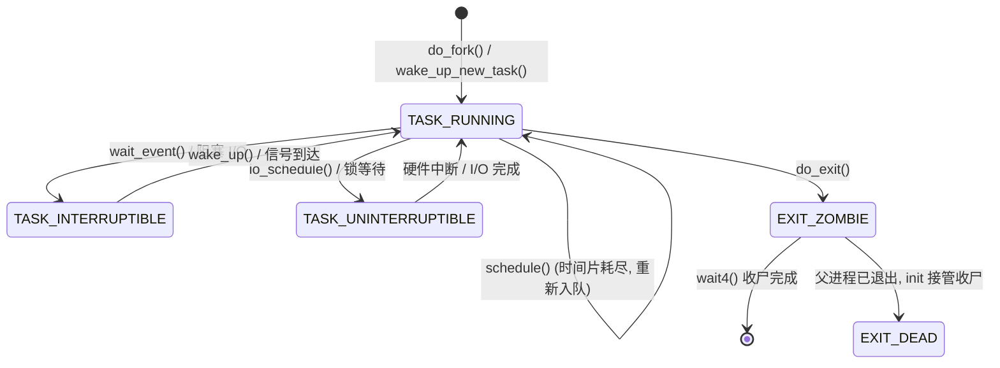

# 8.1.2 进程状态与生命周期

> 所属：第8章 进程管理与调度 > 8.1 进程基础
> 难度：[I→E] | 预计阅读时间：35分钟

## 本节导读

在嵌入式系统现场排错中，`ps` 输出里那些 `R`/`S`/`D`/`Z` 状态字母背后隐藏着调度器最核心的状态机逻辑。本节从 Linux 内核 `task_struct.state` 字段出发，深入每个状态位的语义、转换条件与代码路径，并围绕一个**量产设备因大量 D 状态进程导致系统负载飙升**的真实案例，建立可操作的排查思维模型。

---

## 知识点1：TASK_RUNNING — 不只是"在跑" [I] ~600字

### 问题场景

某工程师在 Cortex-A53 四核平台上观测到：8 个线程的 CPU 占用率统计显示每个都接近 100%，但实际业务吞吐极低。top 显示状态全部为 `R`，究竟是真的在运算，还是在空转？

### 机制深入

Linux 内核将"就绪"和"真正占用 CPU 执行"合并为单一状态 `TASK_RUNNING`（值为 `0x0000`）。这与其他 OS 将 Ready/Running 分离的设计形成鲜明对比：

```c
// include/linux/sched.h
#define TASK_RUNNING            0x0000
```

当线程处于 `TASK_RUNNING` 时，它要么正在被某个 CPU 执行，要么挂在该 CPU 的 **runqueue**（CFS 红黑树或 RT 优先级队列）中等待调度。区分二者的唯一依据是 `task_struct->on_cpu` 标志位：

```c
// kernel/sched/core.c
static inline int task_on_cpu(const struct task_struct *p)
{
    return task_cpu(p) == smp_processor_id() && p->on_cpu;
}
```

⚠️ **常见陷阱**：`top`/`ps` 显示 `R` 只能说明线程在 runqueue 中，不保证它此刻持有 CPU。高负载但低吞吐的典型根因是：大量线程在 `TASK_RUNNING` 状态下执行 `schedule()` 后又因时间片耗尽重新入队，形成**调度风暴（scheduling storm）**。

### 关键代码路径

```
do_fork() → wake_up_new_task() → activate_task() → enqueue_task()
                               ↓
                  task 进入对应 CPU 的 cfs_rq/runqueue
```

### Trade-off：Linux 为何合并 Ready 与 Running

| 设计方案 | 优点 | 缺点 | 适用场景 |
|---------|------|------|---------|
| **合并为 TASK_RUNNING（Linux）** | 状态机简单，调度路径无冗余判断 | 需额外 `on_cpu` 标志区分真正运行 vs 就绪 | 通用 OS，追求调度延迟可预测性 |
| Ready/Running 分离（传统 OS）** | 状态语义直观，调度统计清晰 | 状态转换增多，代码分支膨胀 | 硬实时系统，需要严格的调度证明 |

💡 **技巧**：在 `sched_debug` 输出中，若某 CPU 的 `nr_running` 远大于 `nr_context_switches`，说明 runqueue 积压严重，调度器并未有效选中被唤醒的任务。

---

## 知识点2：TASK_INTERRUPTIBLE vs TASK_UNINTERRUPTIBLE — 睡眠的双面性 [I] ~900字

### 问题场景

某存储设备在 I/O 压力测试中，系统负载（`loadavg`）突然飙升至 200+，但 `top` 的 CPU 利用率却很低。`ps aux` 显示数百个线程处于 `D` 状态——它们既不占 CPU，也不让系统空闲，这到底是为什么？

### 机制深入

睡眠态是进程主动放弃 CPU 的核心机制。Linux 提供两种睡眠状态：

```c
// include/linux/sched.h
#define TASK_INTERRUPTIBLE      0x0001  /* S状态：可中断睡眠 */
#define TASK_UNINTERRUPTIBLE    0x0002  /* D状态：不可中断睡眠 */
```

当进程调用 `wait_event_*()` 或执行阻塞 I/O 时，内核通过 `set_current_state()` 宏将其置为睡眠态，随后调用 `schedule()` 让出 CPU：

```c
// 典型睡眠路径（以 wait_event_interruptible 为例）
#define __set_current_state(state)      \
    smp_store_mb(current->__state, (state))

#define set_current_state(state)        \
    smp_store_mb(current->__state, (state))
```

🔴 **安全提醒**：`set_current_state()` 必须使用内存屏障语义（`smp_store_mb`），确保 `state` 写入在 `schedule()` 检查之前全局可见。直接用 `task->state = state` 是经典竞态条件，已在多个驱动模块的 CVE 中被利用。

**可中断睡眠（TASK_INTERRUPTIBLE）**：进程等待某事件（如 socket 可读、子进程退出），同时允许被信号唤醒。这是最常见的睡眠态——`accept()`、`read()`、`poll()` 的阻塞路径均走此状态。

**不可中断睡眠（TASK_UNINTERRUPTIBLE）**：进程等待硬件级事件完成，**必须忽略信号**。典型的代码路径是块设备层 `submit_bio()` → `io_schedule()`：

```c
// fs/buffer.c: __wait_on_buffer()
void __wait_on_buffer(struct buffer_head *bh)
{
    wait_on_bit_io(&bh->b_state, BH_Lock, TASK_UNINTERRUPTIBLE);
}
```

### 为什么存在 D 状态？核心原因有三：

1. **数据完整性**：若 `fsync()` 过程中进程被 `SIGKILL` 中断退出，文件系统元数据可能处于半提交状态，导致磁盘结构不一致。
2. **资源释放语义**：持有锁的线程若在锁等待期间被信号中断退出，将造成锁泄漏（lock leak）或死锁。
3. **硬件契约**：对 SCSI/NVMe 控制器的命令提交后，控制器层面的完成中断是异步且不可撤销的；用户层信号无法取消已下发的 DMA 传输。

### D 状态的代价：负载计算之谜

Linux 计算系统负载（`/proc/loadavg`）时，**TASK_UNINTERRUPTIBLE 的进程被计入运行队列长度**。这是设计如此——这些进程虽然不占 CPU，但它们代表"系统中未完成的工作单元"，阻塞了依赖它们的其他任务。大量 D 状态进程意味着 I/O 子系统（或锁竞争）已成为瓶颈。

⚠️ **常见陷阱**：`TASK_UNINTERRUPTIBLE` + `NFS` 挂载点不可达 = 系统级灾难。任何 `stat()` 被挂载目录下的路径都会使调用者进入 D 状态，且因 NFS 的超时机制（默认 600s），进程可能数分钟无法唤醒。

---

## 知识点3：TASK_DEAD 与 EXIT_ZOMBIE — 进程的身后事 [I] ~700字

### 问题场景

嵌入式设备长期运行后，内存持续下降，最终 OOM。`ps` 显示大量 `<defunct>` 进程堆积。父进程为何不收尸？如何避免僵尸泛滥？

### 机制深入

进程终止不是简单的 `exit()` 返回，而是内核精心设计的**两阶段退出协议**：

```c
// include/linux/sched.h
#define EXIT_DEAD               0x0010  /* 彻底死亡，task_struct 即将释放 */
#define EXIT_ZOMBIE             0x0020  /* 僵尸态：用户态资源已释放，等待父进程收尸 */
```

#### 阶段一：do_exit() — 释放用户态世界

当进程调用 `exit_group()`（C 库的 `exit()` 最终走向这里）或收到致命信号时，进入 `do_exit()`：

```c
// kernel/exit.c
void __noreturn do_exit(long code)
{
    struct task_struct *tsk = current;
    
    // 1. 设置 PF_EXITING 标志，防止信号再次投递
    tsk->flags |= PF_EXITING;
    
    // 2. 释放 mm_struct（用户态地址空间），但保留内核栈
    exit_mm();
    
    // 3. 关闭所有文件描述符
    exit_files(tsk);
    
    // 4. 脱离命名空间、信号处理表等
    exit_notify(tsk, group_dead);
    
    // 5. 设置 EXIT_DEAD 或 EXIT_ZOMBIE
    tsk->exit_state = EXIT_ZOMBIE;
    
    // 6. 主动调度出去，永不返回
    schedule();
    BUG();  /* 绝对不可达 */
}
```

💡 **技巧**：`PF_EXITING` 标志一旦设置，内核会拒绝向该进程投递新信号（`send_signal()` 路径会检查 `!(tsk->flags & PF_EXITING)`），避免退出过程中被信号风暴干扰。

#### 阶段二：wait4() — 父进程收尸

僵尸进程保留了 `task_struct` 和退出码（`exit_code`），供父进程通过 `wait()`/`waitpid()`/`wait4()` 查询。收尸完成时：

```c
// kernel/exit.c: release_task()
static void release_task(struct task_struct *p)
{
    // 从任务列表中移除
    list_del_rcu(&p->tasks);
    // 释放 task_struct（由 slab 分配器回收）
    free_task(p);
}
```

| 事件 | 进程状态 | 占用资源 | 可被观察 |
|------|---------|---------|---------|
| `do_exit()` 开始 | `EXIT_ZOMBIE` | `task_struct` + 内核栈 | `ps` 显示 `<defunct>` |
| `release_task()` 后 | `EXIT_DEAD` → 释放 | 无 | 不可见 |

⚠️ **常见陷阱**：若父进程永不调用 `wait()` 且未设置 `SIGCHLD` 信号处理，僵尸将永久存在。在嵌入式守护进程设计中，标准做法之一是 `signal(SIGCHLD, SIG_IGN)`——现代内核会自动为被忽略的 `SIGCHLD` 子进程执行收尸（`kernel/signal.c: do_notify_parent()` 路径检查 `sig_ignored`）。

🔴 **安全提醒**：`task_struct` 即使处于 `EXIT_ZOMBIE`，仍然占用 slab 内存（典型大小 8-16KB）。千级僵尸在内存紧张的嵌入式设备上是不可接受的。

---

## 知识点4：进程生命周期全景 — 从 fork 到尘埃 [I] ~800字

### 问题场景

如何向团队新人解释"为什么进程 fork 出来先 ready 而不是直接运行"？又如何量化一个典型 HTTP 请求在嵌入式网关上经历的完整状态转换？

### 机制深入

Linux 进程生命周期的完整状态机如下：



#### 状态转换的触发条件速查

| 状态转换 | 触发条件 | 关键函数 | 典型场景 |
|---------|---------|---------|---------|
| `* → RUNNING` | 新任务创建或唤醒 | `wake_up_new_task()` / `try_to_wake_up()` | fork() 后、I/O 完成 |
| `RUNNING → INTERRUPTIBLE` | 等待可中断事件 | `prepare_to_wait_event()` → `schedule()` | `read()` 阻塞、`epoll_wait()` |
| `RUNNING → UNINTERRUPTIBLE` | 等待不可撤销事件 | `io_schedule()` / `schedule_timeout_uninterruptible()` | 块设备 I/O、`mutex_lock()` |
| `INTERRUPTIBLE → RUNNING` | 事件达成或信号 | `wake_up()` / `signal_wake_up()` | socket 有数据、`SIGTERM` |
| `UNINTERRUPTIBLE → RUNNING` | 事件强制达成 | 硬件中断处理路径 | DMA 完成中断 |
| `RUNNING → ZOMBIE` | 进程主动退出或被杀 | `do_exit()` | `exit()` 调用、致命信号 |
| `ZOMBIE → DEAD` | 父进程收尸 | `wait4()` → `release_task()` | 父进程 `waitpid()` 返回 |

#### set_task_state() 宏的正确使用范式

```c
// include/linux/sched.h
/* 推荐的睡眠-唤醒模式（内核模块/驱动编程） */
set_current_state(TASK_INTERRUPTIBLE);  /* 或使用 TASK_UNINTERRUPTIBLE */
if (!condition)                           /* 必须再次检查条件，防止竞态 */
    schedule();                           /* 出让 CPU */
set_current_state(TASK_RUNNING);          /* 被唤醒后恢复状态 */
```

为什么 `set_current_state()` 之后、`schedule()` 之前必须检查条件？因为存在**唤醒丢失（lost wakeup）**竞态：若 `wake_up()` 恰好在 `set_current_state()` 和 `schedule()` 之间发生，`schedule()` 会让当前任务错过这次唤醒，永远睡下去。内核中的标准解决模式是 **prepare_to_wait() + finish_wait()** 封装，它们内部通过等待队列的锁确保原子性。

💡 **技巧**：在 `/proc/<pid>/status` 中，以十六进制读取 `SigPnd` 和 `ShdPnd` 字段，可判断一个 D 状态进程是否有待处理信号（虽然不会被响应，但信号已投递到该进程的 `shared_pending` 队列）。

---

## 实践案例：D 状态风暴导致系统负载飙升的排查

### 背景

某工业网关（ARM Cortex-A9，双核 1GHz，512MB RAM，运行内核 5.10）在连接 20+ 路 Modbus TCP 设备时，运行 3 天后 `uptime` 显示的负载从正常的 2-3 飙升至 150+，SSH 响应延迟达 30 秒以上，业务数据采集出现大量超时。

### 排查过程

**Step 1：确认问题性质**

```bash
# 观察负载与 CPU 的背离
$ uptime
 14:32:10 up 3 days,  2:15,  1 user,  load average: 152.3, 148.7, 145.1

$ top -bn1 | head -5
top - 14:32:15 up 3 days,  2:15,  1 user,  load average: 152.3, 148.7, 145.1
%Cpu(s):  3.2 us,  1.8 sy,  0.0 ni, 94.5 id,  0.5 wa
```

负载 150+ 但 CPU 空闲 94.5%，这说明瓶颈不在计算而在**等待**。`wa`（I/O wait）仅 0.5%，排除单纯磁盘 I/O。

**Step 2：定位 D 状态进程**

```bash
$ ps aux | awk '$8 ~ /^D/ {print $0}' | wc -l
138

$ ps aux | awk '$8 ~ /^D/ {print $2, $11}' | head -5
 2847 /usr/bin/modbus_poll
 2851 /usr/bin/modbus_poll
 2853 /usr/bin/modbus_poll
 2859 /usr/bin/modbus_poll
 2862 /usr/bin/modbus_poll
```

138 个 `modbus_poll` 线程处于 D 状态。进一步查看这些线程的等待内核栈：

```bash
# 读取 /proc/<pid>/stack（需 CONFIG_STACKTRACE）
$ for pid in $(ps aux | awk '$8~/^D/ {print $2}' | head -3); do
>   echo "=== PID $pid ==="
>   cat /proc/$pid/stack
done

=== PID 2847 ===
[<0>] __switch_to+0x94/0xe0
[<0>] io_schedule+0x12/0x40
[<0>] wait_on_page_bit_killable+0x11c/0x200
[<0>] __lock_page_killable+0x48/0x60
[<0>] generic_file_read_iter+0x68c/0xac0
```

所有 D 状态线程都卡在 `io_schedule()` → `wait_on_page_bit_killable()`，即等待页缓存（page cache）中的页被读入。

**Step 3：追溯 I/O 源头**

```bash
# 发现大量进程读取同一个 sysfs 节点
$ cat /proc/2847/cmdline
/usr/bin/modbus_poll --config /tmp/modbus.conf

$ ls -l /proc/2847/fd/
lrwx------ 1 root root 64 Jun 10 14:35 3 -> /sys/class/gpio/gpio47/value
```

根因定位：**Modbus poll 线程每 100ms 通过 sysfs GPIO 接口读取 GPIO 状态，而 sysfs GPIO 的 `value` 文件读取在内部经过 VFS → `kernfs` → `gpio_sysfs` → `sprintf()` → page cache 回写路径**。当大量并发读取时，页锁竞争导致线程大量进入 `TASK_UNINTERRUPTIBLE`。

### 解决方案与验证

| 方案 | 改动量 | 风险 | 效果 |
|------|-------|------|------|
| **将 sysfs GPIO 读取改为字符设备 `/dev/gpiochipN` 的 `GPIO_GET_LINEHANDLE_IOCTL`** | 中等（需修改 poll 逻辑） | 需验证 ioct 兼容性 | 彻底绕过 page cache，D 状态消失 |
| **降低轮询频率** | 低 | 可能错过 Modbus 事件边沿 | D 状态数量下降但根因仍在 |
| **启用 `CONFIG_NO_HZ_FULL` + 绑核** | 低 | 增加调度复杂度 | 减少跨核页锁竞争 |

实际采用方案一，修改后负载恢复至 2-3，D 状态线程数为 0。

---

## 本节总结

- `TASK_RUNNING`（`R`）涵盖就绪与执行两种子状态，判断真正占用 CPU 需看 `on_cpu` 标志，而非仅凭 `ps` 输出。
- `TASK_INTERRUPTIBLE`（`S`）与 `TASK_UNINTERRUPTIBLE`（`D`）的本质区别在于**是否响应信号**。D 状态的存在是内核为保证数据完整性和硬件契约而做出的设计抉择，代价是进程不可被强制终止。
- 进程退出通过 `do_exit()` 的两阶段机制实现：先释放用户态资源进入 `EXIT_ZOMBIE`，再由父进程 `wait4()` 完成最终收尸。僵尸泛滥的终极对策是确保父进程正确处理 `SIGCHLD`。
- 理解完整生命周期状态机的关键在于掌握**谁触发了状态转换**（`wake_up()`? `schedule()`? `do_exit()`?），而非仅仅记忆状态名称。

---

## 配套资源

### 表格清单

- **表1**：进程核心状态对照表（R/S/D/Z 的语义、资源占用、信号响应性）
- **表2**：生命周期完整状态转换事件表（触发条件、关键函数、典型场景）
- **表3**：D 状态风暴排查方案对比表（改动量、风险、效果）

### 图示清单（mermaid 代码）

- **图1**：进程生命周期完整状态机图（`stateDiagram-v2`，涵盖 R/S/D/Z/DEAD 五态及转换边）

### 代码清单

- **代码1**：`set_current_state()` 宏定义与内存屏障语义（`include/linux/sched.h`）
- **代码2**：`do_exit()` 关键路径注释版（`kernel/exit.c`）
- **代码3**：D 状态排查命令序列（`ps` + `/proc/<pid>/stack` 读取）
