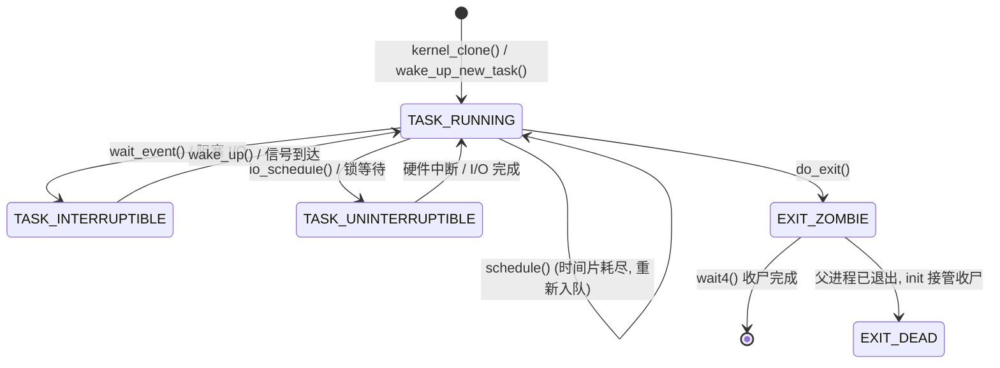

# 8.1.2 进程状态与生命周期

> 所属章节：第8章 进程与调度 > 8.1 task_struct 与任务描述
>
> 难度：[I→E] | 预计阅读时间：35分钟

## <span class="blue"> 本节导读

嵌入式现场排错时，`ps` 输出里的 `R`/`S`/`D`/`Z` 状态字母背后就是调度器最核心的状态机。本节从 `task_struct.__state` 字段出发，讲清每个状态位的语义、转换条件与代码路径，并以一个**量产设备因大量 D 状态进程导致负载飙升**的案例收束成可操作的排查思路。<BR>
本节覆盖：v6.6 全量状态宏速查、TASK_RUNNING 的"就绪/执行"合并设计、两种睡眠态的本质区别、两阶段退出协议（`do_exit()` → `wait4()`）、完整生命周期状态机。

### v6.6 状态速查：ps 字母对照表

排错时最先需要的是这张对照表（宏定义见 include/linux/sched.h:86-126）：

| 状态宏 | 位值 | ps 字母 | 含义 |
|--------|------|--------|------|
| `TASK_RUNNING` | 0x0000 | R | 运行中，或在 runqueue 中就绪 |
| `TASK_INTERRUPTIBLE` | 0x0001 | S | 可中断睡眠，信号可唤醒 |
| `TASK_UNINTERRUPTIBLE` | 0x0002 | D | 不可中断睡眠，计入 loadavg |
| `__TASK_STOPPED` | 0x0004 | T | SIGSTOP / 作业控制停止 |
| `__TASK_TRACED` | 0x0008 | t | 被 ptrace 停住（gdb/strace） |
| `TASK_PARKED` | 0x0040 | P | kthread 被 `kthread_park()` 停放（见 8.1.3） |
| `TASK_DEAD` | 0x0080 | — | `do_exit()` 最后调度前的标记，逃逸即 BUG |
| `EXIT_ZOMBIE` | 0x0020 | Z | `exit_state`：僵尸，等父进程收尸 |
| `EXIT_DEAD` | 0x0010 | X/x | `exit_state`：最终死亡，待释放 |

另有一组**组合宏**同样常见：`TASK_KILLABLE = TASK_WAKEKILL | TASK_UNINTERRUPTIBLE`（D 状态但响应 SIGKILL，`mutex_lock_killable()` 一类接口用它）、`TASK_IDLE = TASK_UNINTERRUPTIBLE | TASK_NOLOAD`（空闲注入等场景，ps 显示 I，**不计入 loadavg**）、`TASK_NEW`（fork 过程中置位，防止被过早唤醒）。注意状态是位掩码而非枚举——一个任务可以同时带多个位，`ps` 显示的是内核 `task_state_array` 映射后的代表字母。

---

## <span class="blue"> TASK_RUNNING：不只是"在跑" [I]

### 问题场景

Cortex-A53 四核平台上观测到：8 个线程的 CPU 占用率都接近 100%，但实际业务吞吐极低。`top` 显示状态全部为 `R`——究竟是真的在运算，还是在空转？

### 机制深入

Linux 内核将"就绪"和"真正占用 CPU 执行"合并为单一状态 `TASK_RUNNING`（值为 `0x0000`）。这与其他 OS 将 Ready/Running 分离的设计形成鲜明对比：

```c
// include/linux/sched.h
#define TASK_RUNNING            0x0000
```

当线程处于 `TASK_RUNNING` 时，它要么正在被某个 CPU 执行，要么挂在该 CPU 的 **runqueue**（CFS 红黑树或 RT 优先级队列）中等待调度。区分二者的依据是 `task_struct` 的 `on_cpu` 字段（include/linux/sched.h，`CONFIG_SMP` 下存在）：`context_switch()` 换入时置 1、换出时经 `smp_store_release()` 清 0——kernel/sched/core.c:516 附近有一整块注释专门讲这个标志的内存序协议，唤醒路径靠它判断"任务是否真的离开了 CPU"。

> ⚠️ `top`/`ps` 显示 `R` 只能说明线程在 runqueue 中，不保证它此刻持有 CPU。高负载但低吞吐的典型根因是：大量线程在 `TASK_RUNNING` 状态下执行 `schedule()` 后又因时间片耗尽重新入队，形成**调度风暴（scheduling storm）**。

### 关键代码路径

```
kernel_clone() → copy_process() → wake_up_new_task() → activate_task() → enqueue_task()
                                                       ↓
                                        task 进入对应 CPU 的 cfs_rq/runqueue
```

（`kernel_clone()` 是 v6.6 的 fork/vfork/clone 统一入口，kernel/fork.c:2868；旧读物中的 `do_fork()` 已被它取代。）

### Trade-off：Linux 为何合并 Ready 与 Running

| 设计方案 | 优点 | 缺点 | 适用场景 |
|---------|------|------|---------|
| **合并为 TASK_RUNNING（Linux）** | 状态机简单，调度路径无冗余判断 | 需额外 `on_cpu` 标志区分真正运行 vs 就绪 | 通用 OS，追求调度延迟可预测性 |
| Ready/Running 分离（传统 OS）** | 状态语义直观，调度统计清晰 | 状态转换增多，代码分支膨胀 | 硬实时系统，需要严格的调度证明 |

> 💡 在 `sched_debug` 输出中，若某 CPU 的 `nr_running` 远大于正常水平且持续不降，说明 runqueue 积压严重，调度器并未有效选中被唤醒的任务。

---

## <span class="blue"> TASK_INTERRUPTIBLE vs TASK_UNINTERRUPTIBLE：睡眠的双面性 [I]

### 问题场景

某存储设备在 I/O 压力测试中，系统负载（`loadavg`）突然飙升至 200+，但 `top` 的 CPU 利用率却很低。`ps aux` 显示数百个线程处于 `D` 状态——它们既不占 CPU，也不让系统空闲，这到底是为什么？

### 机制深入

睡眠态是进程主动放弃 CPU 的核心机制。Linux 提供两种睡眠状态：

```c
// include/linux/sched.h
#define TASK_INTERRUPTIBLE      0x0001  /* S状态：可中断睡眠 */
#define TASK_UNINTERRUPTIBLE    0x0002  /* D状态：不可中断睡眠 */
```

当进程调用 `wait_event_*()` 或执行阻塞 I/O 时，内核通过 `set_current_state()` 宏将其置为睡眠态，随后调用 `schedule()` 让出 CPU：

```c
/* include/linux/sched.h:212、218（v6.6）——注意两者的差别在屏障 */
#define __set_current_state(state_value)          \
    do {                                          \
        debug_normal_state_change((state_value)); \
        WRITE_ONCE(current->__state, (state_value));    /* 无屏障 */ \
    } while (0)

#define set_current_state(state_value)            \
    do {                                          \
        debug_normal_state_change((state_value)); \
        smp_store_mb(current->__state, (state_value));  /* 写后全屏障 */ \
    } while (0)
```

> 🔴 必须用带屏障语义的 `set_current_state()`，而不是直接写 `current->__state = TASK_UNINTERRUPTIBLE`。少了 `smp_store_mb` 这层写后屏障，唤醒方可能先读到旧状态、判断"无需唤醒"后离开，睡眠方随后才写入状态并 `schedule()`——这次唤醒就丢了（lost wakeup），任务可能永远睡下去。带双下划线的 `__set_current_state()` 正是无屏障版本，只准用在状态已无可竞争的场景（如刚被唤醒回写 `TASK_RUNNING`）。

**可中断睡眠（TASK_INTERRUPTIBLE）**：进程等待某事件（如 socket 可读、子进程退出），同时允许被信号唤醒。这是最常见的睡眠态——`accept()`、`read()`、`poll()` 的阻塞路径均走此状态。

**不可中断睡眠（TASK_UNINTERRUPTIBLE）**：进程等待硬件级事件完成，**必须忽略信号**。典型的代码路径是块设备层 `submit_bio()` → `io_schedule()`：

```c
/* fs/buffer.c:121 __wait_on_buffer()（v6.6 原文） */
void __wait_on_buffer(struct buffer_head * bh)
{
	wait_on_bit_io(&bh->b_state, BH_Lock, TASK_UNINTERRUPTIBLE);
}
EXPORT_SYMBOL(__wait_on_buffer);
```

### 为什么存在 D 状态？核心原因有三：

1. **数据完整性**：若 `fsync()` 过程中进程被 `SIGKILL` 中断退出，文件系统元数据可能处于半提交状态，导致磁盘结构不一致。
2. **资源释放语义**：持有锁的线程若在锁等待期间被信号中断退出，将造成锁泄漏（lock leak）或死锁。
3. **硬件契约**：对 SCSI/NVMe 控制器的命令提交后，控制器层面的完成中断是异步且不可撤销的；用户层信号无法取消已下发的 DMA 传输。

### D 状态的代价：负载计算之谜

Linux 计算系统负载（`/proc/loadavg`）时，**TASK_UNINTERRUPTIBLE 的进程被计入运行队列长度**。这是设计如此——这些进程虽然不占 CPU，但它们代表"系统中未完成的工作单元"，阻塞了依赖它们的其他任务。大量 D 状态进程意味着 I/O 子系统（或锁竞争）已成为瓶颈。

> ⚠️ `TASK_UNINTERRUPTIBLE` + NFS 挂载点不可达是系统级灾难组合：任何 `stat()` 到挂载目录下路径的调用者都会进入 D 状态。NFS 默认的 hard mount 语义是**无限重试**，服务端不恢复进程就一直醒不来；soft mount 或 `timeo`/`retrans` 挂载参数才有超时返回，但代价是应用可能读到错误码而非数据。

---

## <span class="blue"> 退出与收尸：EXIT_ZOMBIE 与 EXIT_DEAD [I]

### 问题场景

嵌入式设备长期运行后，内存持续下降，最终 OOM。`ps` 显示大量 `<defunct>` 进程堆积。父进程为何不收尸？如何避免僵尸泛滥？

### 机制深入

进程终止不是简单的 `exit()` 返回，而是内核精心设计的**两阶段退出协议**：

```c
// include/linux/sched.h
#define EXIT_DEAD               0x0010  /* 彻底死亡，task_struct 即将释放 */
#define EXIT_ZOMBIE             0x0020  /* 僵尸态：用户态资源已释放，等待父进程收尸 */
```

#### 阶段一：do_exit() — 释放用户态世界

当进程调用 `exit_group()`（C 库的 `exit()` 最终走向这里）或收到致命信号时，进入 `do_exit()`：

```c
/* kernel/exit.c do_exit()（v6.6，精简，行号对应各步骤） */
void __noreturn do_exit(long code)
{
    struct task_struct *tsk = current;
    ...
    exit_signals(tsk);             /* :830 内部设置 PF_EXITING，阻断后续信号投递 */
    ...
    exit_mm();                     /* :861 释放用户态地址空间 */
    ...
    exit_files(tsk);               /* :869 关闭全部文件描述符 */
    exit_fs(tsk);                  /* 释放根目录/pwd/umask */
    ...
    exit_notify(tsk, group_dead);  /* :894 通知父进程；内部置
                                      exit_state = EXIT_ZOMBIE（:739），
                                      父进程忽略 SIGCHLD 时直接 EXIT_DEAD（:754） */
    ...
    do_task_dead();                /* :926 最后一次调度，永不返回 */
}
```

注意两处与直觉不符的真实实现：`PF_EXITING` 不是在 `do_exit()` 开头直接置位，而是在 `exit_signals()` 内部设置；`exit_state = EXIT_ZOMBIE` 也不在 `do_exit()` 主干里，而是 `exit_notify()` 的职责。最后一步不是 `schedule(); BUG();`，而是专用的 `do_task_dead()`——它把 `__state` 置为 `TASK_DEAD` 后做最后一次调度，若控制流意外返回就 `BUG()`。

> 💡 `PF_EXITING` 一旦设置，信号投递路径就会为这一路进程让路（kernel/exit.c:577 等处检查 `!(t->flags & PF_EXITING)`），避免退出过程中被信号风暴干扰。

#### 阶段二：wait4() — 父进程收尸

僵尸进程保留了 `task_struct` 和退出码（`exit_code`），供父进程通过 `wait()`/`waitpid()`/`wait4()` 查询。收尸完成时：

```c
/* kernel/exit.c:239 release_task()（v6.6，精简） */
void release_task(struct task_struct *p)
{
    ...
    cgroup_release(p);
    write_lock_irq(&tasklist_lock);
    ptrace_release_task(p);
    __exit_signal(p);               /* 从 pid 哈希与任务链表摘除，累计资源记账 */
    ...
    write_unlock_irq(&tasklist_lock);
    proc_flush_pid(thread_pid);     /* 清 /proc 入口 */
    release_thread(p);              /* 架构相关收尾 */
    put_task_struct_rcu_user(p);    /* 引用计数归零后经 RCU 延迟释放 task_struct */
    ...
}
```

| 事件 | 进程状态 | 占用资源 | 可被观察 |
|------|---------|---------|---------|
| `exit_notify()` 之后 | `EXIT_ZOMBIE` | `task_struct` + 内核栈 + 退出码 | `ps` 显示 `<defunct>`（Z） |
| `release_task()` 之后 | RCU 延迟释放完成 | 无 | 不可见 |

> ⚠️ 若父进程永不调用 `wait()` 且未处理 `SIGCHLD`，僵尸将一直存在。嵌入式守护进程的标准做法之一是 `signal(SIGCHLD, SIG_IGN)`——`do_notify_parent()`（kernel/signal.c:2058）内部检查 `sig_ignored`（signal.c:103），发现父进程忽略 SIGCHLD 时返回真，`exit_notify()` 随即将子进程置为 `EXIT_DEAD` 自动收尸（kernel/exit.c:745-754）。

> 🔴 僵尸进程仍占用 `task_struct`（约 8KB）加内核栈（16KB）——两者都要等 `release_task()` 走完 RCU 延迟释放才归还。千级僵尸在内存紧张的嵌入式设备上是不可接受的。

---

## <span class="blue"> 生命周期全景：从 fork 到尘埃 [I]

### 问题场景

如何向团队新人解释"为什么进程 fork 出来先 ready 而不是直接运行"？又如何量化一个典型 HTTP 请求在嵌入式网关上经历的完整状态转换？

### 机制深入

Linux 进程生命周期的完整状态机如下：


```mermaid
stateDiagram-v2
    [*] --> TASK_RUNNING : kernel_clone() / wake_up_new_task()
    TASK_RUNNING --> TASK_RUNNING : schedule() (时间片耗尽, 重新入队)
    TASK_RUNNING --> TASK_INTERRUPTIBLE : wait_event() / 阻塞 I/O
    TASK_RUNNING --> TASK_UNINTERRUPTIBLE : io_schedule() / 锁等待
    
    TASK_INTERRUPTIBLE --> TASK_RUNNING : wake_up() / 信号到达
    TASK_UNINTERRUPTIBLE --> TASK_RUNNING : 硬件中断 / I/O 完成
    
    TASK_RUNNING --> EXIT_ZOMBIE : do_exit()
    EXIT_ZOMBIE --> [*] : wait4() 收尸完成
    EXIT_ZOMBIE --> EXIT_DEAD : 父进程已退出, init 接管收尸
```

#### 状态转换的触发条件速查

| 状态转换 | 触发条件 | 关键函数 | 典型场景 |
|---------|---------|---------|---------|
| `* → RUNNING` | 新任务创建或唤醒 | `wake_up_new_task()` / `try_to_wake_up()` | fork() 后、I/O 完成 |
| `RUNNING → INTERRUPTIBLE` | 等待可中断事件 | `prepare_to_wait_event()` → `schedule()` | `read()` 阻塞、`epoll_wait()` |
| `RUNNING → UNINTERRUPTIBLE` | 等待不可撤销事件 | `io_schedule()` / `schedule_timeout_uninterruptible()` | 块设备 I/O、`mutex_lock()` |
| `INTERRUPTIBLE → RUNNING` | 事件达成或信号 | `wake_up()` / `signal_wake_up()` | socket 有数据、`SIGTERM` |
| `UNINTERRUPTIBLE → RUNNING` | 事件强制达成 | 硬件中断处理路径 | DMA 完成中断 |
| `RUNNING → ZOMBIE` | 进程主动退出或被杀 | `do_exit()` | `exit()` 调用、致命信号 |
| `ZOMBIE → DEAD` | 父进程收尸 | `wait4()` → `release_task()` | 父进程 `waitpid()` 返回 |

#### set_task_state() 宏的正确使用范式

```c
// include/linux/sched.h
/* 推荐的睡眠-唤醒模式（内核模块/驱动编程） */
set_current_state(TASK_INTERRUPTIBLE);  /* 或使用 TASK_UNINTERRUPTIBLE */
if (!condition)                           /* 必须再次检查条件，防止竞态 */
    schedule();                           /* 出让 CPU */
set_current_state(TASK_RUNNING);          /* 被唤醒后恢复状态 */
```

为什么 `set_current_state()` 之后、`schedule()` 之前必须检查条件？因为存在**唤醒丢失（lost wakeup）**竞态：若 `wake_up()` 恰好在 `set_current_state()` 和 `schedule()` 之间发生，`schedule()` 会让当前任务错过这次唤醒，永远睡下去。内核中的标准解决模式是 **prepare_to_wait() + finish_wait()** 封装，它们内部通过等待队列的锁确保原子性。

> 💡 在 `/proc/<pid>/status` 中读取 `SigPnd` 和 `ShdPnd` 字段（十六进制位掩码），可判断一个 D 状态进程是否有待处理信号——虽然 D 状态下信号不会被响应，但已投递的信号会留在 pending 队列里，可作为"它是不是正在被反复 kill"的旁证。

---

## 实践案例：D 状态风暴导致系统负载飙升的排查

### 背景

某工业网关（ARM Cortex-A9，双核 1GHz，512MB RAM，运行内核 5.10）在连接 20+ 路 Modbus TCP 设备时，运行 3 天后 `uptime` 显示的负载从正常的 2-3 飙升至 150+，SSH 响应延迟达 30 秒以上，业务数据采集出现大量超时。

### 排查过程

**Step 1：确认问题性质**

```bash
# 观察负载与 CPU 的背离
uptime
 14:32:10 up 3 days,  2:15,  1 user,  load average: 152.3, 148.7, 145.1

top -bn1 | head -5
top - 14:32:15 up 3 days,  2:15,  1 user,  load average: 152.3, 148.7, 145.1
%Cpu(s):  3.2 us,  1.8 sy,  0.0 ni, 94.5 id,  0.5 wa
```

负载 150+ 但 CPU 空闲 94.5%，这说明瓶颈不在计算而在**等待**。`wa`（I/O wait）仅 0.5%——注意 wa 统计的是"CPU 空闲且有 I/O 未完成"的时间占比，D 状态线程堆得再多也不直接推高它，二者不矛盾。

**Step 2：定位 D 状态进程**

```bash
ps aux | awk '$8 ~ /^D/ {print $0}' | wc -l
138

ps aux | awk '$8 ~ /^D/ {print $2, $11}' | head -5
 2847 /usr/bin/modbus_poll
 2851 /usr/bin/modbus_poll
 2853 /usr/bin/modbus_poll
 2859 /usr/bin/modbus_poll
 2862 /usr/bin/modbus_poll
```

138 个 `modbus_poll` 线程处于 D 状态。进一步查看这些线程的内核栈：

```bash
# 读取 /proc/<pid>/stack（需内核开启栈回溯支持）
for pid in $(ps aux | awk '$8~/^D/ {print $2}' | head -3); do
    echo "=== PID $pid ==="
    cat /proc/$pid/stack
done

=== PID 2847 ===
[<0>] __switch_to+0x94/0xe0
[<0>] io_schedule+0x12/0x40
[<0>] wait_on_page_bit_killable+0x11c/0x200
[<0>] __lock_page_killable+0x48/0x60
[<0>] generic_file_read_iter+0x68c/0xac0
```

所有 D 状态线程都卡在 `generic_file_read_iter()` → `__lock_page_killable()` → `wait_on_page_bit_killable()`——这是**读普通文件时等待页缓存中的页从块设备读入**的标准栈。栈本身不会撒谎：它们在等存储。

**Step 3：追溯 I/O 源头**

```bash
cat /proc/2847/cmdline
/usr/bin/modbus_poll --config /var/data/modbus.conf

ls -l /proc/2847/fd/
lrwx------ 1 root root 64 Jun 10 14:35 3 -> /var/data/modbus.conf

df -h /var/data
/dev/mmcblk0p3   ...   /var/data

dmesg | tail -20
mmc0: timeout waiting for hardware interrupt
mmc0: error -110 whilst initialising SD card
blk_update_request: I/O error, dev mmcblk0, sector ...
```

根因定位：**modbus_poll 线程每 100ms 读取一次放在 eMMC 数据分区上的配置文件，而这块 eMMC 已经出现硬件故障**（dmesg 中的 mmc 超时与 I/O error）。读请求落到页缓存未命中的页上，进入 `generic_file_read_iter()` 的锁页等待；块层命令在故障 eMMC 上长期不完成，线程就以 `TASK_UNINTERRUPTIBLE` 堆积，推高 loadavg。

### 解决方案与验证

| 方案 | 改动量 | 风险 | 效果 |
|------|-------|------|------|
| **更换故障 eMMC / 修复存储**（根因修复） | 硬件改动 | 需停机窗口 | D 状态彻底消失 |
| **高频读取的配置/状态文件迁入 tmpfs** | 中等（调整部署） | 配置文件失去持久化，需启动时重建 | 读路径不再触碰故障介质，负载恢复 |
| **降低轮询频率 + 读路径加超时告警** | 低 | 可能错过事件边沿 | 缓解堆积速度，争取排查时间 |

实际采用"tmpfs 迁移 + 备件更换"组合，修改后负载恢复至 2-3，D 状态线程数为 0。

这个案例的方法论价值在于链条：`loadavg 高 + CPU 空闲` → 找 D 状态进程 → `/proc/<pid>/stack` 读等待点 → `/proc/<pid>/fd` 找它在读写什么 → dmesg 找介质层错误。每一步都有明确的工具出口，不依赖猜。

---

## <span class="blue"> 本节总结

- `TASK_RUNNING`（`R`）涵盖就绪与执行两种子状态，判断真正占用 CPU 需看 `on_cpu` 字段，而非仅凭 `ps` 输出。
- `TASK_INTERRUPTIBLE`（`S`）与 `TASK_UNINTERRUPTIBLE`（`D`）的本质区别在于**是否响应信号**。D 状态的存在是内核为保证数据完整性和硬件契约而做出的设计抉择，代价是进程不可被强制终止；`TASK_KILLABLE` 是"D 但能被杀"的折中变体。
- 进程退出通过两阶段机制实现：`do_exit()` 释放用户态资源并由 `exit_notify()` 置 `EXIT_ZOMBIE`，再由父进程 `wait4()` 走到 `release_task()` 完成收尸。僵尸泛滥的终极对策是父进程正确处理 `SIGCHLD`。
- 理解完整生命周期状态机的关键在于掌握**谁触发了状态转换**（`wake_up()`? `schedule()`? `do_exit()`?），而非仅仅记忆状态名称。

---

## 配套资源

### 表格清单

- **表1**：v6.6 状态速查表（状态宏位值与 ps 字母对照，导读后）
- **表2**：生命周期状态转换事件表（触发条件、关键函数、典型场景）
- **表3**：D 状态风暴排查方案对比表（改动量、风险、效果）

### 图示清单（mermaid 代码）

- **图1**：进程生命周期完整状态机图（`stateDiagram-v2`，涵盖 R/S/D/Z/DEAD 五态及转换边）

### 代码清单

- **代码1**：`__set_current_state()` / `set_current_state()` 宏定义与屏障差异（`include/linux/sched.h:212、218`）
- **代码2**：`do_exit()` 关键路径注释版（`kernel/exit.c:830-926`）
- **代码3**：`release_task()` 收尸流程（`kernel/exit.c:239`）
- **代码4**：D 状态排查命令序列（`ps` + `/proc/<pid>/stack` + `dmesg`）

---

## <span class="blue"> 下一步

状态机讲清了任务"在哪儿"，下一节（8.1.3）看一类没有用户空间的特殊任务——内核线程 kthread：它如何被创建、停放（对应速查表里的 `TASK_PARKED`）、唤醒，以及为什么 `mm == NULL`。
