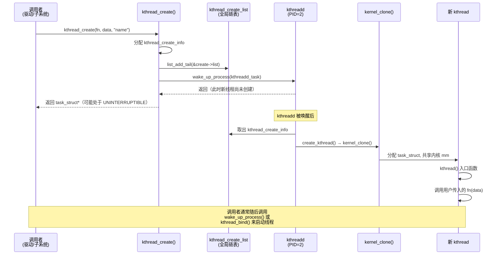

# 8.1.3 内核线程：kthread机制

> 所属：第8章 进程与调度 > 8.1 内核进程模型
> 难度：[I→E] | 预计阅读时间：35分钟

## 本节导读

当你在 `/proc` 下看到 `kworker/u16:1`、`ksoftirqd/3`、`kthreadd` 这些进程名时，是否想过它们不是普通的用户进程，而是内核自身创建的"线程"？本节深入 kthread 机制的完整生命周期，解答三个核心问题：**内核为什么需要线程**、**kthread 如何被创建**、**它与用户线程的本质区别是什么**。

---

## 知识点1：为什么需要内核线程 [I] ~600字

### 问题场景

假设你正在编写一个网络驱动，需要周期性地轮询（poll）网卡收包队列。方案A：在定时器中断（timer interrupt）中完成轮询。方案B：创建一个内核线程，在进程上下文中轮询。哪个正确？

答案是B。**内核中大量工作必须在进程上下文中执行**，这是理解 kthread 存在必要性的根本出发点。

### 机制深入

Linux 内核的执行上下文分为两类，二者有本质差异：

| 属性 | 中断上下文（Interrupt Context） | 进程上下文（Process Context） |
|:---|:---|:---|
| 调度能力 | ❌ 不可调度（不可阻塞） | ✅ 可以睡眠/阻塞 |
| 栈空间 | 固定大小中断栈（通常8KB-16KB） | 完整的内核栈（通常8KB-16KB per task） |
| `current` 宏 | 指向被中断的随机进程 | 指向当前 task_struct |
| 可用 API | 不可调用 `kmalloc(GFP_KERNEL)`、不可访问用户空间 | 完整内核 API |
| 执行时间 | 要求尽可能短（硬中断：μs级） | 可长期运行（ms 甚至 s 级） |
| 代表场景 | ISR（中断服务例程）、软中断（softirq） | 内核线程、系统调用处理 |

许多内核子系统的需求天然与中断上下文的限制冲突：

- **软中断负载过重时**：`ksoftirqd` 被唤醒，将软中断处理从硬中断上下文迁移到进程上下文
- **异步工作需要睡眠**：文件系统回写（`flush` 线程）、内存回收（`kswapd`）都需要在 I/O 等待时睡眠
- **需要独立调度的实体**：`kworker` 工作队列中的 work 可能长时间运行，必须能参与 CFS 调度

### 关键代码路径

`ksoftirqd` 的经典示例——当 `raise_softirq()` 发现软中断重复触发时，唤醒对应的 ksoftirqd：

```c
/* kernel/softirq.c */
static void wakeup_softirqd(void)
{
    struct task_struct *tsk = __this_cpu_read(ksoftirqd);

    if (tsk && tsk->state != TASK_RUNNING)
        wake_up_process(tsk);   /* 唤醒 ksoftirqd，转到进程上下文处理 */
}
```

### 常见陷阱

⚠️ **陷阱**：试图在中断上下文中调用 `schedule()` 或可能睡眠的函数（如 `mutex_lock()`、`kmalloc(GFP_KERNEL)`），将导致 **"scheduling while atomic"** 内核崩溃。`kthread` 的存在正是为了让你"把活交给线程去做"。

💡 **技巧**：在驱动中有一个判断当前上下文的标准范式：

```c
if (in_interrupt()) {
    /* 中断上下文：快速处理，或交给 kthread/workqueue */
    queue_work(my_wq, &my_work);
} else {
    /* 进程上下文：可以直接做重活 */
    do_heavy_work();
}
```

---

## 知识点2：kthread_create() 机制 [E] ~1200字

### 问题场景

你写了一个内核模块，需要在后台持续监控某个硬件状态。你调用 `kthread_create(monitor_fn, data, "hwmon");`——**这个调用之后，内核究竟发生了什么？新线程为什么不是直接创建的，而是 PID=2 的那个 `kthreadd` 来代劳？**

### 机制深入

#### kthreadd：内核线程的"工厂"

内核启动阶段，`rest_init()` 会创建两个特殊进程：

| 进程名 | PID | 创建函数 | 职责 |
|:---|:---|:---|:---|
| `swapper/0`（idle） | 0 | 静态定义 | 启动链、CPU空闲时执行 |
| `init` | 1 | `kernel_thread(kernel_init, ...)` | 用户空间祖宗，启动 systemd/init |
| **kthreadd** | **2** | `kernel_thread(kthreadd, ...)` | **所有内核线程的父进程** |

kthreadd 的核心逻辑是一个无限循环，从 `kthread_create_list` 链表中取出创建请求：

```c
/* kernel/kthread.c */
int kthreadd(void *unused)
{
    set_task_comm(tsk, "kthreadd");

    for (;;) {
        set_current_state(TASK_INTERRUPTIBLE);
        if (list_empty(&kthread_create_list))
            schedule();           /* 无事可做，睡眠等待 */

        __set_current_state(TASK_RUNNING);

        while (!list_empty(&kthread_create_list)) {
            struct kthread_create_info *create;

            create = list_entry(kthread_create_list.next,
                                struct kthread_create_info, list);
            list_del_init(&create->list);
            create_kthread(create); /* 真正创建线程 */
        }
    }
    return 0;
}
```

`create_kthread()` 底层调用 `kernel_thread()`，最终通过 `do_fork()`（或 `kernel_clone()` in v5.x+）创建一个新的 task_struct，共享内核地址空间。

#### kthread_create() 的完整调用链



关键数据结构 `kthread_create_info`：

```c
/* kernel/kthread.c */
struct kthread_create_info {
    unsigned long long stack;
    int (*threadfn)(void *data);
    void *data;
    int node;
    struct task_struct *result;
    struct list_head list;
    struct completion done;       /* 用于同步等待创建完成 */
};
```

### Trade-off：三种内核线程创建方式对比

| 创建方式 | API | 适用场景 | 复杂度 | 睡眠能力 | 绑定 CPU |
|:---|:---|:---|:---|:---|:---|
| 内核线程（kthread） | `kthread_create()` + `wake_up_process()` | 长期运行的后台任务 | 中 | ✅ 完整 | `kthread_bind()` |
| 工作队列（workqueue） | `alloc_workqueue()` + `queue_work()` | 一次性/间歇性异步任务 | 低 | ✅ 由 wq 类型决定 | `WQ_UNBOUND` / `WQ_CPU_INTENSIVE` |
| 软中断/tasklet | `open_softirq()` / `tasklet_schedule()` | 极短、高频、不可睡眠 | 低 | ❌ 不可 | 运行 CPU 即处理 CPU |

> 选型建议：如果你能用一个 `work_struct` 搞定，就不要创建专用 kthread——工作队列本质上是内核帮你管理的 kthread 池（`kworker`）。只有当需要**长期驻留**、**精细控制生命周期**、**特殊调度策略**时，才直接创建 kthread。

### 完整代码示例：驱动中创建内核线程

```c
/* my_driver.c — 内核线程创建与销毁的标准范式 */

struct task_struct *my_thread;
static atomic_t should_stop = ATOMIC_INIT(0);

static int my_kthread_fn(void *data)
{
    struct my_device *dev = data;

    set_freezable();            /* 支持系统休眠（suspend-to-ram） */

    while (!kthread_should_stop()) {
        if (kthread_freezable_should_stop(NULL))
            break;

        /* 核心业务逻辑 */
        do_periodic_work(dev);

        /* 睡眠等待，让出 CPU；可被 kthread_stop() 唤醒 */
        msleep_interruptible(1000);
    }

    pr_info("my_kthread: exiting\n");
    return 0;
}

static int __init my_driver_init(void)
{
    /* 第1步：创建（此时线程处于 stopped 状态） */
    my_thread = kthread_create(my_kthread_fn, my_dev,
                               "mydriver-%d", my_dev->id);
    if (IS_ERR(my_thread)) {
        pr_err("Failed to create kthread\n");
        return PTR_ERR(my_thread);
    }

    /* 第2步：绑定到特定 CPU（可选，NUMA/Affinity 场景） */
    kthread_bind(my_thread, smp_processor_id());

    /* 第3步：唤醒，真正开始执行 */
    wake_up_process(my_thread);

    return 0;
}

static void __exit my_driver_exit(void)
{
    /* 优雅地停止线程：设置标志 + 唤醒 + 等待退出 */
    kthread_stop(my_thread);
    /* kthread_stop 内部会发送信号唤醒线程，
     * 等待 kthread_fn 返回，然后回收资源
     */
}
```

### 常见陷阱

🔴 **安全提醒**：忘记调用 `kthread_stop()` 就在模块卸载时 `rmmod`，将导致**线程仍在运行但代码页已被卸载**——这是高危的 use-after-free 场景。务必在 `module_exit` 中等待线程完全退出。

⚠️ **陷阱**：`kthread_create()` 返回的 task_struct 初始状态是 `TASK_UNINTERRUPTIBLE`（即"stopped"），**必须显式调用 `wake_up_process()`** 才会开始执行。这是常见的新手错误。

⚠️ **陷阱**：在 `kthread_fn` 中使用不可中断睡眠（如 `mutex_lock()` 在极端竞争下），可能导致 `kthread_stop()` 长时间阻塞，影响模块卸载。使用 `kthread_should_stop()` 检查点，并在持锁路径上保持短暂。

💡 **技巧**：从内核 4.x 开始，可以使用 `kthread_run(fn, data, namefmt, ...)` 宏——它是 `kthread_create()` + `wake_up_process()` 的组合，一步到位。

```c
/* include/linux/kthread.h */
#define kthread_run(threadfn, data, namefmt, ...)              \
({                                                             \
    struct task_struct *__k                                    \
        = kthread_create(threadfn, data, namefmt, ##__VA_ARGS__); \
    if (!IS_ERR(__k))                                          \
        wake_up_process(__k);                                  \
    __k;                                                       \
})
```

---

## 知识点3：内核线程与用户线程的本质区别 [I] ~700字

### 问题场景

你在调试一个问题：`ps aux` 看到 `kworker/0:1H` 的 VSZ（虚拟内存大小）是 0。这正常吗？另一个问题：能在内核线程里调用 `open()` 或 `read()` 吗？

### 核心差异

| 属性 | 内核线程（Kernel Thread） | 用户线程（User Thread） |
|:---|:---|:---|
| **mm（内存描述符）** | `tsk->mm = NULL`，使用 `active_mm` 指向借用地址空间 | 指向独立的 `mm_struct`，包含完整用户页表 |
| **虚拟地址空间** | 仅内核空间（0xFFFF... 以上，64位） | 内核 + 用户空间完整 4/128TB |
| **用户空间访问** | ❌ 不能直接访问用户空间 | ✅ 可以 |
| **入口地址** | 内核函数指针（如 `my_kthread_fn`） | ELF 入口（如 `_start` → `main()`） |
| **创建路径** | `kernel_clone()` → `copy_process()`，跳过 `dup_mm()` | `do_fork()` → 完整复制/共享 mm |
| **系统调用** | 理论上在内核态，**不通过 syscall 门** | 通过 `int 0x80` / `syscall` / `svc` 陷入内核 |
| **优先级范围** | 0~139（可进入 RT 调度类） | 通常 100~139（用户可见 nice -20~19） |
| **`/proc/<pid>/` 可见性** | ✅ 可见，exe 指向空 | ✅ 可见，exe 指向实际二进制 |

### 关键代码路径

内核线程 mm 为 NULL 的底层原因——`copy_process()` 中的特殊处理：

```c
/* kernel/fork.c — copy_process() 简化逻辑 */
static __latent_entropy struct task_struct *copy_process(...)
{
    ...
    if (clone_flags & CLONE_VM) {
        /* 内核线程创建时传入 CLONE_VM | CLONE_UNTRACED */
        atomic_inc(&old_mm->mm_users);
        mm = old_mm;
        goto good_mm;
    }
    ...
good_mm:
    tsk->mm = mm;   /* 内核线程: mm == NULL (通过 init_mm 借用) */
    tsk->active_mm = mm;
    ...
}
```

🔴 **安全提醒**：内核线程 `tsk->mm = NULL` 意味着 `access_ok()` 检查会失败，**任何试图在内核线程中直接访问用户空间指针的操作（如 `copy_from_user()`）都会导致 oops**。如果你确实需要在内核线程中操作用户空间数据，必须使用 `use_mm()` 临时切换地址空间（这是 KVM、io_uring 等子系统的常用技巧）。

### 实践案例：嵌入式系统中的 watchdog kthread

**场景**：某工业控制器要求在主 CPU 上运行一个 10ms 周期的 watchdog 喂狗任务，不能依赖用户空间进程（因为用户进程可能因 OOM 被杀）。

**方案**：在平台驱动中创建一个 `SCHED_FIFO` 优先级的实时内核线程：

```c
static int __init watchdog_init(void)
{
    struct sched_param param = { .sched_priority = MAX_RT_PRIO - 1 };

    wdt_thread = kthread_create(watchdog_kthread_fn, NULL, "hw_wdt");
    if (IS_ERR(wdt_thread))
        return PTR_ERR(wdt_thread);

    /* 绑定到 CPU0，避免在 CPU 热插拔时漂移 */
    kthread_bind(wdt_thread, 0);

    /* 提升为实时调度，确保 10ms 周期不被普通任务抢占 */
    sched_setscheduler(wdt_thread, SCHED_FIFO, &param);

    wake_up_process(wdt_thread);
    return 0;
}

static int watchdog_kthread_fn(void *unused)
{
    while (!kthread_should_stop()) {
        pet_watchdog();                 /* 写硬件寄存器喂狗 */
        usleep_range(10000, 11000);     /* 10ms ± 1ms */
    }
    return 0;
}
```

**为什么不用用户空间进程？** 因为用户空间的实时进程（`SCHED_FIFO` + `chrt`）仍然受 OOM killer 威胁；而内核线程的 OOM score 不受用户空间策略影响，且能直接访问 I/O 寄存器（`iowrite32()`），无需 `mmap`/`devmem` 等额外开销。

💡 **技巧**：在 SMP 系统中，用 `kthread_create_on_cpu()` / `kthread_bind()` 将内核线程绑定到特定 CPU，配合 `sched_setscheduler()` 设置 RT 优先级，是构建**确定性时延**内核任务的常用组合。

---

## 本节总结

| 要点 | 一句话总结 |
|:---|:---|
| 为什么需要 kthread | 中断上下文不能睡眠，kthread 提供可阻塞的进程上下文 |
| kthread 如何创建 | 通过 `kthread_create()` → `kthreadd`（PID=2）→ `kernel_clone()` 的工厂模式 |
| kthread vs 用户线程 | `mm = NULL`、仅内核态、无用户空间，但仍是完整调度实体 |
| 选型原则 | 能用 workqueue 就不用 kthread；需要长期驻留/精确控制时才用 kthread |
| 生命周期安全 | 必须有 `kthread_stop()` 配对，模块卸载时等待线程退出 |

---

## 配套资源

### 表格清单

1. **中断上下文 vs 进程上下文对比表** — 知识点1，判断"何时需要 kthread"的决策依据
2. **常见内核线程速查表** — 知识点2（内嵌），列出 PID 0/1/2 及常见 kthread 的职责
3. **三种异步机制对比表（kthread / workqueue / tasklet）** — 知识点2，驱动开发选型参考
4. **内核线程 vs 用户线程全面对比表** — 知识点3，深入理解二者本质差异

### 图示清单（mermaid代码）

1. **kthread_create() 完整调用时序图** — 知识点2，展示调用者 → `kthread_create()` → `kthreadd` → `kernel_clone()` → 新线程的执行流程

### 代码清单

1. `wakeup_softirqd()` 源码 — 知识点1，展示软中断如何唤醒 ksoftirqd
2. `kthreadd()` 主循环 + `kthread_create_info` 结构体 — 知识点2，展示工厂模式核心逻辑
3. 驱动中创建/销毁 kthread 完整范式 — 知识点2，含 `set_freezable()`、`kthread_should_stop()`、`kthread_stop()`
4. `kthread_run` 宏定义 — 知识点2，简化创建+唤醒的一步到位写法
5. watchdog 实时内核线程实践 — 知识点3，含 `SCHED_FIFO` + `kthread_bind()` 组合

### 延伸阅读

- `Documentation/core-api/workqueue.rst` — 何时用 workqueue 替代 kthread
- `kernel/kthread.c` — kthread 核心实现，约 800 行，建议通读
- `kernel/softirq.c` — `ksoftirqd` 唤醒逻辑，理解"中断上下文减负"的经典案例
