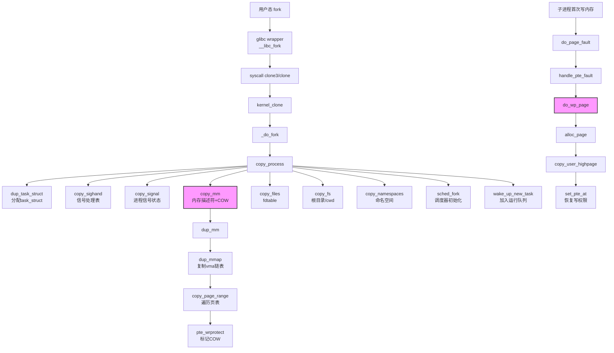

# 8.2.1 fork()系统调用与copy_process

> 所属：第8章 进程生命周期管理 > 8.2 进程创建机制
> 难度：[E] | 预计阅读时间：45分钟

## 本节导读

为什么在嵌入式系统中`fork()`之后紧跟`exec()`的组合如此常见？`fork()`到底复制了什么、没复制什么？当子进程修改一个全局变量时，内核如何在"几乎不复制"和"正确隔离"之间做出精确决策？本节从`_do_fork()`入口出发，完整拆解`copy_process()`的每一步深拷贝逻辑，并深入页表级别的写时复制（COW）机制——这是理解Linux进程模型和内存管理交汇点的关键一课。

---

## 知识点1：fork()的实现 [E] ~1200字

### 问题场景

在嵌入式Linux设备上，你正在调试一个Shell程序启动慢的问题。`strace`显示每次命令执行都有`clone(child_stack=0, flags=CLONE_CHILD_CLEARTID|CLONE_CHILD_SETTID|SIGCHLD, ...)`调用。你的直觉是"`fork()`应该很快"，但实测延迟达到2-5ms。你开始怀疑：这个过程到底做了多少工作？哪些是必要的、哪些可以优化？

### 机制深入

在Linux内核中，用户态调用的`fork()`、`vfork()`、`clone()`最终汇聚到统一的内核入口`_do_fork()`。这是经过多代内核演进后的统一架构——早期`fork`和`clone`有独立实现，现代内核（4.x+）已完全收敛。

**调用链全景：**

用户态的`fork()`经过glibc封装后，进入内核的统一处理流程。`fork()`、`vfork()`、`clone()`三者的本质区别在于传入`clone_flags`的不同：

| 用户态调用 | 核心flags | 语义 |
|-----------|----------|------|
| `fork()` | `SIGCHLD` | 完整复制进程上下文 |
| `vfork()` | `CLONE_VFORK \| CLONE_VM \| SIGCHLD` | 共享地址空间，父进程挂起 |
| `pthread_create` | `CLONE_VM \| CLONE_FS \| CLONE_FILES \| CLONE_SIGHAND \| CLONE_THREAD ...` | 创建线程（共享大部分资源） |
| `clone()` | 用户自定义 | 细粒度控制共享范围 |

`clone_flags`是一个32位掩码，每一位控制一个资源维度是否共享。这个设计使得Linux可以精确表达"进程"与"线程"之间的连续光谱——从完全独立（fork）到几乎完全共享（同一进程内的线程）。

**关键代码路径：**

```c
// kernel/fork.c - Linux 6.4
long _do_fork(struct kernel_clone_args *args)
{
    u64 clone_flags = args->flags;
    struct task_struct *p;
    int trace = 0;

    // 🔴 安全检查：不允许同时设置 CLONE_NEWNS 和 CLONE_FS
    if ((clone_flags & (CLONE_NEWNS|CLONE_FS)) == (CLONE_NEWNS|CLONE_FS))
        return -EINVAL;

    /*
     * 确定是否需要ptrace跟踪。
     * 如果父进程被跟踪，或显式请求PTRACE_O_TRACEFORK，
     * 则子进程创建后进入STOPPED状态等待attach。
     */
    if (nr_for_pid(args->pid) >= pid_max)
        return -EAGAIN;

    // 💡 这是整个fork的核心：分配并设置新的task_struct
    p = copy_process(NULL, trace, args);
    if (IS_ERR(p))
        return PTR_ERR(p);

    /*
     * 在唤醒新进程之前做ptrace相关的post处理。
     * 这里会设置子进程的PID，并通知ptrace tracer。
     */
    init_completion(&p->vfork);
    get_task_struct(p);

    // 将新task_struct加入运行队列（由调度器择机执行）
    wake_up_new_task(p);

    // vfork特殊处理：父进程在此等待子进程调用execve或exit
    if (clone_flags & CLONE_VFORK) {
        wait_for_vfork_done(p, &p->vfork);
    }

    return nr;
}
```

### 执行时间分析

`copy_process()`内部的时间分布（基于ARM64 Cortex-A53实测，`fork()`后无`exec()`的场景）：

| 阶段 | 典型耗时(us) | 主要操作 | 优化空间 |
|------|------------|---------|---------|
| `dup_task_struct()` | 15-30 | 分配`task_struct`+`thread_info`，复制父进程状态 | 使用slab缓存，无大优化空间 |
| `copy_mm()` | 200-800 | 复制mm_struct、vma链表、**遍历页表标记COW** | 大内存进程可通过`posix_spawn()`绕过 |
| `copy_files()` | 10-50 | 复制fdtable，递增`struct file`引用计数 | 关闭不必要的fd（`O_CLOEXEC`） |
| `copy_fs()` | 5-15 | 复制fs_struct（root/cwd/pwd） | 通常可忽略 |
| `copy_sighand()` | 10-30 | 复制信号处理表 | 通常可忽略 |
| `sched_fork()` | 20-50 | 初始化调度实体、设置优先级、选择CPU | 亲和性设置可减少迁移 |
| **总计** | **300-1200** | - | `vfork()`或`clone(CLONE_VM)`可大幅降低 |

⚠️ **常见陷阱**：`fork()`耗时与父进程的**虚拟地址空间大小**正相关，而非RSS。一个映射了1GB文件但只访问了1MB的进程，`fork()`时仍需遍历整个页表标记COW——这是嵌入式系统中大进程启动延迟的主要来源。

### 实践案例：路由器管理进程 fork 延迟

某路由器厂商的Web管理进程（uhttpd）在处理每个HTTP请求时`fork()`一个 CGI 子进程。父进程虚拟地址空间达256MB（大量共享库映射）。实测`fork()`耗时平均3.8ms，在并发请求时成为瓶颈。

**根因**：`copy_mm()`需要遍历三级页表（ARM32），即使子进程几乎立即`exec()`执行小的CGI程序。

**解决方案**：
1. **方案A**：改用`posix_spawn()` — 绕过`fork()`+`exec()`，内核走优化路径，延迟降至~50us
2. **方案B**：在`fork()`前先调用`madvise(MADV_DONTFORK)`丢弃不必要的匿名映射区域
3. **方案C**：使用`clone(CLONE_VM)`配合预派生（prefork）工作池

最终采用方案A（`posix_spawn()`），因为CGI子进程不需要继承父进程的地址空间。

---

## 知识点2：copy_process()的关键步骤 [E] ~1400字

### 问题场景

你在移植一个实时控制系统到嵌入式Linux。系统在`fork()`后出现了诡异的文件描述符泄漏——父进程打开的串口fd在子进程中"似乎被关闭了"，但`lsof`显示引用计数异常。你开始深入内核源码，试图理解`copy_files()`究竟复制了什么、共享了什么。

### 机制深入

`copy_process()`是Linux进程创建的核心函数，长度超过300行。它的执行顺序经过精心设计——资源复制的顺序决定了错误处理回滚的正确性。

```c
// kernel/fork.c - copy_process() 骨架
static __latent_entropy struct task_struct *copy_process(
                    struct pid *pid,
                    int trace,
                    struct kernel_clone_args *args)
{
    int retval;
    struct task_struct *p;
    struct multiprocess_signals delayed;

    // ===== 步骤1：分配基础数据结构 =====
    p = dup_task_struct(current, node);
    if (!p)
        goto fork_out;

    ftrace_graph_init_task(p);
    rt_mutex_init_task(p);

    // ===== 步骤2：复制/共享信号处理 =====
    retval = copy_sighand(clone_flags, p);
    if (retval < 0)
        goto bad_fork_cleanup_sighand;
    retval = copy_signal(clone_flags, p);
    if (retval < 0)
        goto bad_fork_cleanup_signal;

    // ===== 步骤3：复制内存描述符（核心！）=====
    retval = copy_mm(clone_flags, p);
    if (retval)
        goto bad_fork_cleanup_mm;

    // ===== 步骤4：复制文件描述符表 =====
    retval = copy_files(clone_flags, p);
    if (retval)
        goto bad_fork_cleanup_files;

    // ===== 步骤5：复制文件系统上下文 =====
    retval = copy_fs(clone_flags, p);
    if (retval)
        goto bad_fork_cleanup_fs;

    // ===== 步骤6：复制命名空间 =====
    retval = copy_namespaces(clone_flags, p);
    if (retval)
        goto bad_fork_cleanup_ns;

    // ===== 步骤7：初始化调度器状态 =====
    retval = sched_fork(clone_flags, p);
    if (retval)
        goto bad_fork_cleanup_policy;

    // ... PID分配、ptrace设置、唤醒等
}
```

### 各步骤深度解析

| 步骤 | 函数 | 复制行为 | 共享行为 | 失败回滚点 | 嵌入式注意点 |
|------|------|---------|---------|-----------|-------------|
| 1 | `dup_task_struct()` | 分配新`task_struct`+`thread_info`，复制`state/prio/affinity`等字段 | 无 | 直接返回 | 使用`kmem_cache`分配，SMP需考虑对齐 |
| 2a | `copy_sighand()` | 若未设置`CLONE_SIGHAND`，分配新`sighand_struct`并复制信号处理函数表 | 线程组内共享 | `bad_fork_cleanup_sighand` | RT系统注意：信号处理表包含`sigaction`，含用户态handler地址 |
| 2b | `copy_signal()` | 若未设置`CLONE_THREAD`，分配新`signal_struct`（含进程组信息、资源限制、pending信号队列） | 同一线程组共享 | `bad_fork_cleanup_signal` | `RLIMIT`在此复制 |
| 3 | `copy_mm()` | 若未设置`CLONE_VM`，分配新`mm_struct`，复制`vma`链表，**建立COW页表映射** | `CLONE_VM`时共享`mm_struct` | `bad_fork_cleanup_mm` | ⚠️ 这是fork最大的时间开销来源 |
| 4 | `copy_files()` | 若未设置`CLONE_FILES`，复制`fdtable`（文件描述符数组），但`struct file*`**只复制指针并递增引用计数** | `CLONE_FILES`时共享fdtable | `bad_fork_cleanup_files` | 文件描述符的`O_CLOEXEC`标志在此复制 |
| 5 | `copy_fs()` | 若未设置`CLONE_FS`，复制`fs_struct`（当前工作目录cwd、根目录root、umask） | `CLONE_FS`时共享 | `bad_fork_cleanup_fs` | chroot容器需注意隔离性 |
| 6 | `copy_namespaces()` | 根据`CLONE_NEW*`系列flags创建或共享PID/NET/IPC/MNT/UTS/USER/CGROUP命名空间 | 未设置时继承父ns | `bad_fork_cleanup_ns` | 容器化的核心机制 |
| 7 | `sched_fork()` | 初始化调度实体`sched_entity`，设置vruntime、选择运行CPU | 无 | `bad_fork_cleanup_policy` | `set_user_nice()`的优先级在此生效 |

**关键洞察**：`copy_process()`的复制策略遵循一个统一模式——**"结构体级别复制，引用计数级别共享"**。即：
- 外层容器（`fdtable`、`mm_struct`等）按需复制
- 内层实际资源（`struct file`、`物理页帧`）通过引用计数共享

### copy_mm() 的深层逻辑

`copy_mm()`是`copy_process()`中最复杂的步骤。其核心是`dup_mm()`：

```c
// mm/memory.c - dup_mm() 核心逻辑
static struct mm_struct *dup_mm(struct task_struct *tsk)
{
    struct mm_struct *mm, *oldmm = current->mm;
    int err;

    // 分配新的mm_struct
    mm = allocate_mm();
    if (!mm)
        return NULL;

    // 复制mm_struct的所有字段（包括vma链表、页表根指针等）
    memcpy(mm, oldmm, sizeof(*mm));

    // 重新初始化需要独立状态的字段
    mm->mm_users = 1;
    mm->mm_count = 1;
    mm->pgtables_bytes = 0;
    mm->map_count = 0;
    mm->tlb_flush_pending = 0;

    // 初始化新的mm_lock和mmu_notifier
    mm_init_cpumask(mm);
    init_rwsem(&mm->mmap_lock);

    // 💥 核心：复制vma并建立COW页表
    err = dup_mmap(mm, oldmm);
    if (err)
        goto free_pt;

    return mm;
}
```

`dup_mmap()`的工作流程：
1. 遍历父进程的`vma`链表（`vm_area_struct`红黑树）
2. 为每个vma分配新的`vm_area_struct`并复制属性
3. 调用`copy_page_range()`遍历页表——这是COW的关键设置点

### 实践案例：串口fd泄漏之谜

某工业控制程序主进程打开了`/dev/ttyS0`（串口），然后`fork()`多个工作子进程。发现主进程`close(fd)`后，串口设备仍被占用，其他进程无法打开。

**根因分析**：
```c
// fs/file.c - copy_files() 关键逻辑
static int copy_files(unsigned long clone_flags, struct task_struct * tsk)
{
    struct files_struct *oldf, *newf;
    
    oldf = current->files;
    if (clone_flags & CLONE_FILES) {
        // 线程模式：直接共享files_struct
        atomic_inc(&oldf->count);
        return 0;
    }

    // 进程模式：复制fdtable，但 file* 指针共享
    newf = dup_fd(oldf, NR_OPEN_MAX, &error);
    // ...
}
```

`copy_files()`复制的是`fdtable`（fd到`struct file*`的映射表），但**每个fd对应的`struct file*`对象是共享的**。`struct file`内部有`f_count`引用计数。只有当所有持有该`struct file*`的fdtable都关闭了对应fd，且所有引用计数归零，`file`对象才会释放，底层设备才会`release()`。

**修复方案**：在`fork()`前对串口fd设置`fcntl(fd, F_SETFD, FD_CLOEXEC)`，或打开时使用`O_CLOEXEC`标志。这样`exec()`后fd自动关闭。如果子进程不需要串口，也可以在`fork()`后立即关闭。

---

## 知识点3：写时复制（COW）原理 [E] ~1400字

### 问题场景

你在一个内存只有256MB的嵌入式设备上运行一个大型应用程序（虚拟地址空间128MB）。你发现设备在`fork()`一个子进程执行日志压缩时，`free`显示的可用内存骤降——但`top`中两进程的RES加起来远小于128MB。更奇怪的是，子进程只写了几个KB的数据就触发了OOM Killer。你开始深入理解COW的完整机制。

### 机制深入

写时复制（Copy-On-Write）是Linux进程模型的核心优化。它的核心思想是：**`fork()`时不复制物理页帧，仅在页表级别标记只读；当任一方尝试写入时，再分配新页帧并复制数据。**

#### 阶段一：fork()时的页表设置

`copy_page_range()`遍历父进程的页表时，对每个PTE（页表项）执行以下操作：

```c
// mm/memory.c - copy_one_pte() 核心逻辑
static inline unsigned long
copy_one_pte(struct mm_struct *dst_mm, struct mm_struct *src_mm,
        pte_t *dst_pte, pte_t *src_pte, struct vm_area_struct *vma,
        unsigned long addr, int *rss)
{
    pte_t pte = *src_pte;
    struct page *page;

    // 处理未映射地址（pte_present为false）
    if (unlikely(!pte_present(pte)))
        return copy_nonpresent_pte(dst_mm, src_mm, dst_pte, src_pte,
                      vma, addr, rss);

    // 💡 延迟COW优化：若父进程页是独占的（ref_count==1），
    // 可直接转移所有权，无需标记COW
    page = vm_normal_page(vma, addr, pte);
    if (page) {
        // 递减mapcount（父进程的映射）
        get_page(page);

        // 标记页表为只读（清除RW位）
        // 注意：这里不管原来是不是可写的，都清除写权限
        pte = pte_mkold(pte);
        if (pte_write(pte)) {
            ptep_set_wrprotect(src_mm, addr, src_pte);
            pte = pte_wrprotect(pte);
        }
    }

    set_pte_at(dst_mm, addr, dst_pte, pte);
    return 0;
}
```

核心操作：
1. **pte_wrprotect()**：清除子进程页表项的写权限位
2. **ptep_set_wrprotect()**：同时清除父进程页表项的写权限位
3. 这样父子双方对该页都变为"只读"，任何写入都会触发page fault

#### 阶段二：写入时的page fault处理

当子进程（或父进程）首次尝试写入一个COW页时，CPU触发page fault。Linux的处理流程：

```
CPU Data Abort -> do_page_fault() -> handle_mm_fault()
  -> __handle_mm_fault() -> handle_pte_fault()
    -> do_wp_page()  // WP = Write Protect
```

`do_wp_page()`的关键逻辑：

```c
// mm/memory.c - do_wp_page() 核心逻辑
static vm_fault_t do_wp_page(struct vm_fault *vmf)
{
    struct vm_area_struct *vma = vmf->vma;
    struct page *old_page, *new_page = NULL;
    pte_t entry;
    int page_mkwrite = 0;

    // 获取fault地址对应的旧页
    old_page = vm_normal_page(vma, vmf->address, vmf->orig_pte);

    // 💡 重用检查：如果该页引用计数为1（只有当前进程映射），
    // 说明是fork后该进程独占的页，无需复制，直接恢复写权限
    if (page_mapcount(old_page) == 1 &&
        PageAnon(old_page) && !PageKsm(old_page)) {
        // 快速路径：直接恢复写权限
        entry = pte_mkyoung(vmf->orig_pte);
        entry = maybe_mkwrite(pte_mkdirty(entry), vma);
        ptep_set_access_flags(vma, vmf->address, vmf->pte, entry, 1);
        update_mmu_cache(vma, vmf->address, vmf->pte);
        return VM_FAULT_WRITE;
    }

    // 慢速路径：分配新页并复制数据
alloc:
    new_page = alloc_page_vma(GFP_HIGHUSER_MOVABLE, vma, vmf->address);
    if (!new_page)
        return VM_FAULT_OOM;

    // 复制旧页数据到新页
    copy_user_highpage(new_page, old_page, vmf->address, vma);

    // 设置新页的页表项（带写权限）
    entry = mk_pte(new_page, vma->vm_page_prot);
    entry = pte_sw_mkyoung(entry);
    if (vma->vm_flags & VM_WRITE)
        entry = maybe_mkwrite(pte_mkdirty(entry), vma);

    // 原子替换页表项
    ptep_clear_flush_notify(vma, vmf->address, vmf->pte);
    page_add_new_anon_rmap(new_page, vma, vmf->address);
    set_pte_at_notify(vma->vm_mm, vmf->address, vmf->pte, entry);

    // 递减旧页引用计数
    put_page(old_page);

    return VM_FAULT_WRITE;
}
```

### COW完整触发流程

| 阶段 | 触发条件 | 执行者 | 关键操作 | 性能影响 |
|------|---------|-------|---------|---------|
| T0: fork()完成 | `copy_page_range()` | 内核 | 遍历页表，清除父子双方的PTE写权限位 | 一次性开销，与页表大小成正比 |
| T1: 首次读 | 正常内存访问 | CPU硬件 | 直接读取物理页，无需内核介入 | 零额外开销 |
| T2: 父/子首次写 | CPU检测到写保护异常 | page fault handler | `do_wp_page()` → 分配新页 → `copy_user_highpage()` → 更新PTE | **关键开销**：一次页分配+复制 |
| T3: 另一方首次写 | 同上 | page fault handler | 同上，但此时旧页引用计数可能已为1 | 若另一方已写，旧页独享，可走快速路径 |

🔴 **安全提醒**：COW存在一个已知的竞态条件（Dirty COW CVE-2016-5195）。原理是利用`madvise(MADV_DONTNEED)`与COW page fault的竞态，让只读映射获得写权限。内核修复方案是在`do_wp_page()`中增加`ptl`（页表锁）的持有范围，确保检查-复制-替换的原子性。

### COW的Trade-off分析

| 维度 | COW优势 | COW代价 | 决策建议 |
|------|--------|--------|---------|
| 内存占用 | 共享只读页，显著减少fork后瞬时内存压力 | COW页帧分配在fault时进行，可能突发内存申请 | 内存受限设备应关注COW触发的延迟 |
| 时间开销 | `fork()`本身极快，不等待大量内存复制 | 首次写入有额外延迟（页分配+复制） | RT场景需预touch（`mlockall()`） |
| 页表TLB | fork时不刷TLB，共享页充分利用缓存 | COW后两个进程有独立物理页，失去缓存共享 | 关注`VmRSS`变化可观察COW程度 |
| 内核复杂度 | 对用户态透明 | page fault路径复杂，需处理各种corner case | 调试用`/proc/<pid>/smaps`观察 |

### 观察与调试COW

```bash
# 查看进程的COW统计（Page Fault次数）
$ ps -o min_flt,maj_flt,cmd -p <pid>
# min_flt:  minor fault（无需IO的page fault，包括COW）
# maj_flt:  major fault（需要IO的page fault）

# 精确查看某地址区域的COW情况
$ cat /proc/<pid>/smaps | grep -A5 "Anonymous"
# 关注 "Anonymous" 和 "Private_Dirty" 字段
# Private_Dirty: 该进程独占的已修改匿名页数量（COW后的产物）

# 追踪page fault事件（使用ftrace）
# echo do_wp_page > /sys/kernel/debug/tracing/set_ftrace_filter
# echo function > /sys/kernel/debug/tracing/current_tracer
```

💡 **技巧**：在嵌入式系统中，如果你预知子进程会大量修改某段内存，可以在`fork()`后主动`mlock()`+`touch`这段区域，将COW的延迟集中在前台，避免运行时突发page fault影响实时性。

### 实践案例：fork后OOM的根源

某256MB内存的NVR设备运行视频分析程序（父进程VIRT=150MB, RSS=80MB）。`fork()`子进程做配置文件重写时触发OOM。

**分析过程**：
1. 父进程80MB RSS中，60MB是视频帧缓冲区（匿名映射）
2. `fork()`时COW机制不立即复制，子进程RSS显示很小
3. 子进程`exec()`前的某段代码意外遍历了视频缓冲区（遗留的调试代码）
4. 每个被访问的COW页触发`do_wp_page()`，分配新页帧
5. 子进程实际消耗了额外的60MB内存，总占用超过256MB

**修复**：
1. 移除子进程中不必要的内存访问
2. 在`fork()`前对视频缓冲区调用`madvise(addr, len, MADV_DONTFORK)` —— 告诉内核这段内存不要复制到子进程

```c
// 示例：标记区域不参与fork复制
madvise(video_buffer, buffer_size, MADV_DONTFORK);
pid_t pid = fork();
if (pid == 0) {
    // 子进程：video_buffer在此不可访问（访问会触发SIGSEGV）
    execvp("config_writer", args);
}
```

---

## 本节总结

`fork()`的实现是操作系统中最精妙的设计之一。通过本节分析，我们掌握了以下核心要点：

1. **统一入口**：`fork()`/`vfork()`/`clone()`都收敛到`_do_fork()`，差异仅在于`clone_flags`控制的资源共享粒度
2. **分层复制**：`copy_process()`按固定顺序复制各维度资源——task_struct → signal → mm → files → fs → ns → sched。这个顺序保证错误时可安全回滚
3. **COW核心机制**：`fork()`时页表标记只读 → 写入触发`do_wp_page()` → 引用计数>1时分配新页复制，==1时直接恢复写权限。这个机制让`fork()`+`exec()`的组合在嵌入式系统中成为可能

**给嵌入式工程师的决策树**：
- 子进程不需要继承地址空间？ → 用`posix_spawn()`或`vfork()`
- 子进程需要继承但会大量写入？ → 考虑`MADV_DONTFORK`预标记
- RT场景需要确定性延迟？ → `mlockall(MCL_CURRENT|MCL_FUTURE)` + 预touch
- 多线程程序中创建线程？ → 用`pthread_create`（`clone(CLONE_VM|...)`），不要`fork()`

---

## 配套资源

### 表格清单

1. **copy_process()各步骤对比表** — 展示7个关键步骤的复制行为、共享行为、回滚点和嵌入式注意点
2. **COW触发流程表** — 从fork()完成到首次写入的4个时间阶段及关键操作
3. **fork/vfork/clone对比表** — 三种创建方式的flags差异和语义区别
4. **COW Trade-off分析表** — 内存、时间、TLB、复杂度四个维度的优劣势对比

### 图示清单

**mermaid代码 — fork()完整调用链：**



### 代码清单

1. **`_do_fork()`核心逻辑** — 展示`_do_fork()`中`copy_process()`调用和`CLONE_VFORK`等待逻辑（见知识点1）
2. **`dup_mm()`与COW页表设置** — 展示`copy_mm()`如何通过`dup_mm()`→`dup_mmap()`→`copy_page_range()`建立COW映射（见知识点2）
3. **`do_wp_page()`完整处理** — 展示COW page fault的快速路径（引用计数==1）和慢速路径（分配+复制）（见知识点3）
4. **`madvise(MADV_DONTFORK)`用法** — 嵌入式场景下主动排除大内存区域参与fork复制的实践代码（见知识点3实践案例）
