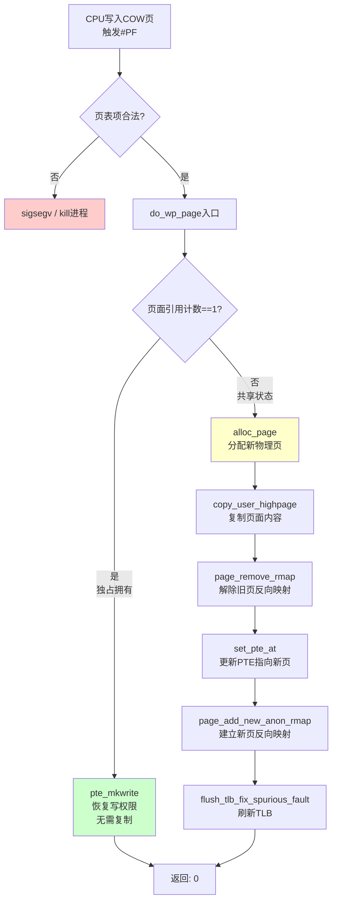

# 8.2.2 COW深度解析与页表机制

> 所属：第8章 内存管理 > 8.2 进程地址空间
> 难度：[I→E] | 预计阅读时间：35分钟

## 本节导读

为什么 `fork()` 能快速创建新进程而无需复制整个地址空间？当父子进程首次写入共享页时，内核如何精确介入并完成"懒复制"？本节从页表项的位级操作出发，深入 `do_wp_page()` 的完整执行路径，揭示 COW 机制在性能与复杂性之间的微妙平衡，并剖析多线程环境下 `fork()` 的致命陷阱。

---

## 知识点1：页表项的COW标记 [E] ~1200字

### 问题场景

在Linux内核中，`fork()` 调用链最终到达 `copy_process()` → `copy_mm()` → `dup_mmap()` → `copy_page_range()`。当内核复制父进程的页表时，面临一个关键抉择：是立即分配新物理页并完整复制内容，还是延迟到写入时才复制？COW选择了后者，但**延迟复制的核心技术问题**在于：如何通过页表项（PTE）的位级操作，让CPU在首次写入时自动触发page fault，从而使内核获得介入机会？

### 机制深入：PTE的位级操控

Linux内核通过精确操控PTE的访问权限位来实现COW标记。以x86_64架构为例，页表项的结构中，第1位（R/W位）控制页面的读写权限，第2位（U/S位）控制用户/超级用户访问。

COW标记的核心操作发生在 `copy_one_pte()` 函数中。当复制一个可写的私有映射页时，内核执行以下位操作：

```c
// 代码示例1：copy_one_pte() 中的COW标记设置
// mm/memory.c (Linux 5.x)
static inline unsigned long
copy_one_pte(struct mm_struct *dst_mm, struct mm_struct *src_mm,
             pte_t *dst_pte, pte_t *src_pte, struct vm_area_struct *vma,
             unsigned long addr, int *rss)
{
    pte_t pte = *src_pte;
    struct page *page;

    // ... 前期检查：处理swap、特殊映射等 ...

    page = vm_normal_page(vma, addr, pte);
    if (page) {
        /*
         * 关键决策点：如果是可写页面，且是私有映射（VMA非共享），
         * 则清除写权限，强制后续写入触发page fault
         */
        if (!vma_is_anonymous(vma) && page_is_shared(page))
            // 共享页面特殊处理
            
        if (pte_write(pte)) {
            ptep_set_wrprotect(src_mm, addr, src_pte);  // 清除父进程PTE的写权限
            pte = pte_wrprotect(pte);                    // 清除子进程PTE的写权限
        }
    }

    set_pte_at(dst_mm, addr, dst_pte, pte);
    return 0;
}
```

上述代码中有两个关键操作：

1. **`ptep_set_wrprotect(src_mm, addr, src_pte)`**：清除**父进程**页表中对应PTE的R/W位，将其标记为只读
2. **`pte_wrprotect(pte)`**：清除**子进程**页表中对应PTE的R/W位

这产生了一个关键结果：**父子进程的页表项都指向同一个物理页，但双方的PTE都被标记为只读**。当任何一方尝试写入时，CPU的页级保护检查会触发一个`#PF`（Page Fault）异常。

### 页表项状态变迁

下表展示了COW机制中页表项的完整状态变迁过程：

**表1：COW过程中页表项（PTE）与页面状态变迁**

| 阶段 | 父进程PTE | 子进程PTE | 物理页引用计数 | R/W位状态 | 物理页状态 |
|------|-----------|-----------|----------------|-----------|------------|
| ① fork前 | R/W=1, 指向物理页P | — | ref_count=1 | 可写 | 独占 |
| ② fork刚完成 | R/W=0, 指向P | R/W=0, 指向P | ref_count=2 | 双方只读 | COW共享 |
| ③ 父进程首次写入 | R/W=1, 指向新页P' | R/W=0, 指向P | ref_count=1 | 父可写子只读 | 已分离 |
| ④ 子进程首次写入 | R/W=1, 指向P' | R/W=1, 指向P'' | ref_count=1 | 双方可写 | 完全分离 |
| ⑤ 仅读不触发COW | R/W=0, 指向P | R/W=0, 指向P | ref_count=2 | 双方只读 | 持续共享 |

阶段②是整个COW机制的精髓：双方页表指向同一物理页，但R/W位均为0。这种"逻辑上可写、物理上受保护"的状态设计，使得内核能够在不追踪额外元数据的情况下，通过硬件MMU自动捕获写入事件。

### 关键代码路径：pte_write() 与 pte_wrprotect()

```c
// 代码示例2：PTE位操作的架构相关实现
// arch/x86/include/asm/pgtable.h (Linux 5.x)

/* 检查PTE是否允许写入 */
static inline int pte_write(pte_t pte)
{
    return pte_flags(pte) & _PAGE_RW;
}

/* 清除PTE的写权限，返回新的pte_t */
static inline pte_t pte_wrprotect(pte_t pte)
{
    return pte_clear_flags(pte, _PAGE_RW);
}

/* 设置PTE的写权限 */
static inline pte_t pte_mkwrite(pte_t pte)
{
    return pte_set_flags(pte, _PAGE_RW);
}

/* 清除页表中指定地址的PTE写权限（带TLB刷新） */
static inline void ptep_set_wrprotect(struct mm_struct *mm,
                                       unsigned long addr, pte_t *ptep)
{
    clear_bit(_PAGE_BIT_RW, (unsigned long *)ptep);
    /* 隐含：需要TLB无效化以同步硬件页表缓存 */
}
```

💡 **技巧**：`_PAGE_RW` 在x86上对应页表项的第1位。`ptep_set_wrprotect()` 直接操作内存中的页表项，但**不会自动刷新TLB**。在 `copy_one_pte()` 的调用路径中，TLB刷新通过后续的 `mmu_notifier` 机制或显式的 `flush_tlb_mm()` 来保证。

### COW标记的架构差异

**Trade-off表格：不同架构COW实现对比**

| 架构 | COW标记方式 | 页表项结构 | 特殊考量 |
|------|-------------|------------|----------|
| x86_64 | 清除PTE的R/W位 (bit 1) | 64位，含NX位 | 需处理PCID、TLB shootdown |
| ARM64 | 清除PTE的AP[2]位 (DBM) | 64位，含AF/DBM | 使用Dirty Bit Modifier简化COW |
| RISC-V | 清除PTE的W位 (bit 2) | 64位Sv39/Sv48 | 需处理SFENCE.VMA同步 |
| MIPS | 清除EntryLo的D位 | 32/64位 | 软件管理D位，COW开销更高 |

ARM64的DBM（Dirty Bit Modifier）特性值得特别关注：当硬件支持DBM时，内核对COW页使用只读权限但不设置软件模拟的"脏"标记，首次写入通过权限违例触发COW，后续的写权限管理则由硬件自动处理脏位追踪，显著降低了软件开销。

---

## 知识点2：COW的Page Fault处理 [E] ~1500字

### 问题场景

当父子进程之一尝试写入COW页时，CPU触发page fault。此时内核需要回答三个问题：
1. 这个page fault是否是COW导致的（而非非法访问）？
2. 如果是COW，是否需要分配新物理页？
3. 如何在并发环境下安全地完成页面复制和页表更新？

### do_wp_page() 完整流程

COW page fault的处理入口是 `do_wp_page()` 函数，其调用链如下：

```
do_page_fault()           // arch-specific entry
  └── handle_mm_fault()   // mm/memory.c
       └── handle_pte_fault()
            └── do_fault() / do_anonymous_page() / do_wp_page()
                 └── do_wp_page()   // COW处理核心
```



**图1：COW Page Fault处理流程**

### 关键代码：do_wp_page() 核心逻辑

```c
// 代码示例3：do_wp_page() 核心逻辑
// mm/memory.c (Linux 5.15+)
static vm_fault_t do_wp_page(struct vm_fault *vmf)
    __releases(vmf->ptl)
{
    struct vm_area_struct *vma = vmf->vma;
    struct page *old_page, *new_page = NULL;
    pte_t entry;
    int page_copied = 0;
    const bool unshare = vmf->flags & FAULT_FLAG_UNSHARE;

    vmf->page = old_page = vm_normal_page(vma, vmf->address, vmf->orig_pte);

    /*
     * 快速路径①：如果页面引用计数为1，说明当前进程是
     * 唯一拥有者（其他进程已释放或从未共享），
     * 直接恢复写权限即可，无需分配新页。
     */
    if (page && trylock_page(page)) {
        int mapcount;

        mapcount = page_mapcount(page);  // 获取映射计数
        if (mapcount == 1 && PageAnon(page)) {
            pte_t pte;
            
            /* 独占页面，直接恢复写权限 */
            pte = pte_mkyoung(vmf->orig_pte);
            pte = pte_mkwrite(pte);
            if (ptep_set_access_flags(vma, vmf->address, vmf->pte, 
                                      pte, 1))
                update_mmu_cache(vma, vmf->address, vmf->pte);
            unlock_page(page);
            return VM_FAULT_WRITE;
        }
        unlock_page(page);
    }

    /*
     * 慢速路径：页面被多个进程共享，必须执行
     * "真正的"COW复制
     */

    /* 步骤1：分配新的匿名页 */
    new_page = alloc_page_vma(GFP_HIGHUSER_MOVABLE, vma, vmf->address);
    if (!new_page)
        goto oom;

    /* 步骤2：复制旧页内容到新页（关抢占，防止竞态） */
    copy_user_highpage(new_page, old_page, vmf->address, vma);
    __SetPageUptodate(new_page);

    /* 步骤3：获取页表锁（ptl），准备更新页表 */
    vmf->ptl = pte_lockptr(vma->vm_mm, vmf->pmd);
    spin_lock(vmf->ptl);

    /* 步骤4：重新读取PTE，检查是否被其他CPU修改（竞态检查） */
    if (unlikely(!pte_same(*vmf->pte, vmf->orig_pte))) {
        /* 其他CPU已经处理了这个COW，放弃当前操作 */
        spin_unlock(vmf->ptl);
        new_page = NULL;  /* 新页将被释放 */
        goto unlock;
    }

    /* 步骤5：构建新PTE条目 */
    entry = mk_pte(new_page, vma->vm_page_prot);
    entry = pte_sw_mkyoung(entry);
    entry = maybe_mkwrite(pte_mkdirty(entry), vma);

    /* 步骤6：建立反向映射（RMAP） */
    page_add_new_anon_rmap(new_page, vma, vmf->address, false);
    lru_cache_add_inactive_or_unevictable(new_page, vma);

    /* 步骤7：原子更新页表项 */
    set_pte_at_notify(vma->vm_mm, vmf->address, vmf->pte, entry);

    /* 步骤8：更新MMU缓存（架构相关，如x86的PCID） */
    update_mmu_cache(vma, vmf->address, vmf->pte);

    spin_unlock(vmf->ptl);

unlock:
    if (old_page) {
        unlock_page(old_page);
        put_page(old_page);  /* 递减引用计数 */
    }
    if (new_page)
        put_page(new_page);
    return VM_FAULT_WRITE;

oom:
    return VM_FAULT_OOM;
}
```

### 关键决策分析

**1. 快速路径 vs 慢速路径**

`do_wp_page()` 内部存在两个执行路径：

- **快速路径**（`mapcount == 1`）：当前进程已是页面的唯一映射者。这种情况发生在：其他共享该页的进程已经退出，或之前已完成COW分离。此时仅需恢复写权限，无需内存分配和页面复制，**延迟可忽略**。
- **慢速路径**（`mapcount > 1`）：需要完整的内存分配+复制+RMAP更新流程。在DDR4-3200上复制一个4KB页面约需 **2-3μs**，加上页表锁竞争和TLB刷新，总延迟约 **5-10μs**。

**2. pte_same() 竞态检查**

⚠️ **关键陷阱**：`do_wp_page()` 在持有 `ptl`（页表锁）后**必须**重新读取PTE并与 `orig_pte` 比较。为什么？考虑以下并发场景：

```
CPU 0                    CPU 1
--------                 --------
进入do_wp_page()         进入do_wp_page()
读取orig_pte = 0x10007   读取orig_pte = 0x10007
分配new_page A           分配new_page B
                         获取ptl, 更新PTE → B
获取ptl
pte_same()返回FALSE!
释放A, 重试
```

如果没有 `pte_same()` 检查，CPU 0会用页面A覆盖CPU 1已经写入的PTE，导致内存泄漏和数据不一致。这是一种经典的"检查-然后-行动"（Check-Then-Act）竞态。

**3. reverse mapping（RMAP）的同步**

COW完成后，新页面需要建立反向映射：`page_add_new_anon_rmap()` 将新页插入到匿名页的RMAP数据结构中。这是`try_to_unmap()`（页面回收时用于解除所有映射）能够正确追踪该页面的前提。

---

## 知识点3：COW的优缺点与陷阱 [I] ~1000字

### 优点分析

**表2：COW机制优缺点综合评估**

| 维度 | 优点 | 缺点/风险 | 适用场景 |
|------|------|-----------|----------|
| **内存占用** | fork()时零内存复制，RSS增长延迟到首次写入 | 如果写入覆盖率高，最终仍需复制全部页面 | 读多写少的工作负载（如Web服务器prefork模型） |
| **fork()延迟** | 典型<1ms，与地址空间大小无关 | 大地址空间进程fork后密集写导致"延迟爆发" | 需要快速创建子进程的场景（shell、CGI） |
| **共享页利用** | 未修改的代码段/数据段完全共享（如libc.so） | 与KAISER/KPTI等安全特性冲突，增加TLB开销 | 大量进程共享相同二进制文件 |
| **swap效率** | COW前无需为共享页分配swap空间 | COW后新匿名页增加swap压力 | 内存紧张的嵌入式系统 |

### Thundering Herd 问题

🔴 **严重性能陷阱**：当 `fork()` 创建大量子进程后，如果所有子进程**同时**尝试写入同一个共享页（例如，每个子进程都修改全局配置变量），会触发COW的"惊群"效应：

```
父进程P: 持有物理页X (R/W=0)
          ↓ fork() × N
子进程1~N: 均映射页X (R/W=0)
          ↓ 同时写入
N个CPU同时触发#PF
  → N-1个CPU竞争ptl锁
  → N次page分配 + N次memcpy
  → 只有1个子进程"赢得"页X（mapcount减为1时快速路径）
  → 其余N-1个子进程各自获得副本
```

在N=100的场景下，这可能导致**数百毫秒的突发延迟**，并且浪费 (N-1) × 4KB 的物理内存。解决方案包括：

- **预复制策略**：fork前将关键数据标记为私有（`mprotect(PROT_READ)` 明确分离）
- **线程替代进程**：使用 `pthread_create()` 替代 `fork()`，共享地址空间天然避免COW
- **vfork() + exec()**：如果子进程立即执行新程序，使用 `vfork()` 完全避免COW

### 案例：多线程程序fork()后死锁排查

**场景描述**：某嵌入式设备上的日志服务（多线程架构）在子进程执行日志压缩时随机卡死。

```c
/* 简化的问题代码 */
static pthread_mutex_t log_mutex = PTHREAD_MUTEX_INITIALIZER;

void *background_flush(void *arg)
{
    while (1) {
        pthread_mutex_lock(&log_mutex);   // 线程T1持有锁
        /* 写入日志缓冲区 ... */
        pthread_mutex_unlock(&log_mutex);
        usleep(100000);
    }
}

int main() {
    pthread_t t1;
    pthread_create(&t1, NULL, background_flush, NULL);
    
    /* 主线程fork()创建子进程进行日志压缩 */
    pid_t pid = fork();
    if (pid == 0) {
        /* 子进程 */
        pthread_mutex_lock(&log_mutex);   // ← 死锁！
        compress_logs();
        pthread_mutex_unlock(&log_mutex);
        exit(0);
    }
    waitpid(pid, NULL, 0);
    return 0;
}
```

**死锁根因分析**：

`fork()` 只复制调用线程（主线程），不复制其他 `pthread`。但**它复制了完整的内存空间，包括 `pthread_mutex_t` 的状态**。如果在 `fork()` 发生的瞬间，线程T1正持有 `log_mutex`，那么：

1. 子进程继承了 `log_mutex` 的"已锁定"状态
2. 子进程中没有T1线程来执行解锁
3. 子进程的 `pthread_mutex_lock(&log_mutex)` **永远阻塞**

🔴 **安全提醒**：这个问题与COW直接相关——`pthread_mutex_t` 所在的内存页在 `fork()` 后被标记为COW共享。子进程对该页的写入（如尝试修改mutex状态）会触发COW复制，但mutex的**逻辑状态**（锁定/持有者）已被不一致地复制。

**排查方法**：

```bash
# 1. 使用strace确认子进程卡在futex
$ strace -f -p $(pgrep log_service)
[pid  2845] futex(0x7f3a8c20a040, FUTEX_WAIT_PRIVATE, 2, NULL
# 返回值显示卡在mutex等待，mutex的futex word = 2（已锁定，可能有等待者）

# 2. 使用 /proc/[pid]/maps 确认COW页状态
$ cat /proc/2845/smaps | grep -A5 "Anonymous"
Anonymous:        4 kB    # 子进程已COW分离的匿名页
AnonHugePages:    0 kB

# 3. 使用lockdep（如内核编译时启用）检测潜在死锁
```

**正确修复方案**：

```c
/* 使用pthread_atfork()注册fork清理回调 */
static void prepare_fork(void) {
    pthread_mutex_lock(&log_mutex);  /* 在fork前获取锁 */
}

static void parent_fork(void) {
    pthread_mutex_unlock(&log_mutex); /* 父进程释放 */
}

static void child_fork(void) {
    /* 子进程：重新初始化mutex（丢弃旧的锁定状态） */
    pthread_mutex_init(&log_mutex, NULL);
}

int main() {
    pthread_atfork(prepare_fork, parent_fork, child_fork);
    /* ... 后续代码 ... */
}
```

💡 **更优方案**：在多线程程序中需要 `fork()` 时，**优先使用 `vfork()` + 立即 `exec()`**，或使用 `posix_spawn()`。如果必须在fork后执行非exec代码，考虑使用 `clone(CLONE_VM)`（即pthread模型）或预先隔离资源。

⚠️ **常见陷阱清单**：

| 陷阱 | 现象 | 检测方法 | 修复策略 |
|------|------|----------|----------|
| fork()时其他线程持有锁 | 子进程随机卡死 | strace抓futex | `pthread_atfork()` |
| COW后大量写触发OOM | fork后RSS暴涨 | `ps -o rss,vsz` | 预 `mprotect()` 分离 |
| 文件描述符+fork继承 | fd泄漏/竞态写 | `ls /proc/[pid]/fd` | `O_CLOEXEC` 或显式关闭 |
| malloc arena在fork后损坏 | 子进程崩溃 | gdb backtrace | 使用 `malloc_atfork()` 钩子 |

---

## 本节总结

COW机制通过**页表项R/W位的精细操控**实现了"懒复制"的内存语义，是Linux进程创建高性能的关键支柱。三个核心要点：

1. **标记阶段**：`copy_one_pte()` 清除父子双方PTE的写权限，使硬件MMU自动捕获首次写入
2. **处理阶段**：`do_wp_page()` 通过快速路径（独占页）和慢速路径（真正复制）的分层设计，在性能和复杂度间取得平衡
3. **风险阶段**：多线程+fork的组合是COW场景下最危险的反模式，必须通过 `pthread_atfork()` 或架构重构来规避

对于嵌入式系统工程师，理解COW不仅是掌握fork()的实现细节，更是深入理解虚拟内存、MMU硬件、内核并发三者交互的绝佳切入点。

---

## 配套资源

### 表格清单

- **表1**：COW过程中页表项（PTE）与页面状态变迁
- **表2**：COW机制优缺点综合评估
- **表3**（内嵌）：多线程fork常见陷阱清单
- **表4**（内嵌）：不同架构COW实现对比

### 图示清单（mermaid代码）

- **图1**：COW Page Fault处理流程（`do_wp_page()` 完整流程图）

### 代码清单

- **代码1**：`copy_one_pte()` 中的COW标记设置（mm/memory.c）
- **代码2**：PTE位操作宏定义（arch/x86/include/asm/pgtable.h）
- **代码3**：`do_wp_page()` 核心逻辑含快速/慢速路径（mm/memory.c）
- **案例代码**：多线程fork死锁问题代码与 `pthread_atfork()` 修复方案

### 延伸阅读

- `mm/memory.c: do_wp_page()` — COW处理主逻辑
- `mm/memory.c: copy_one_pte()` — 页表复制与COW标记
- `mm/rmap.c: page_add_new_anon_rmap()` — 反向映射建立
- `Documentation/vm/page_table.rst` — Linux页表架构文档
- Drepper, U. "Parallel Programming with Memory-Mapped Files", 2011 — 多线程与fork的深入分析
