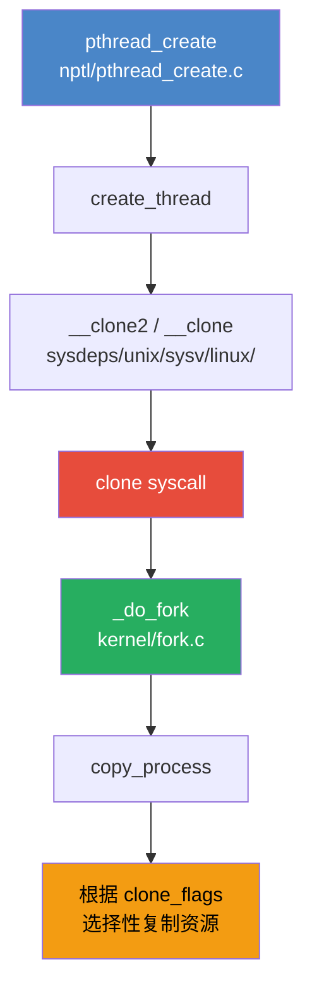
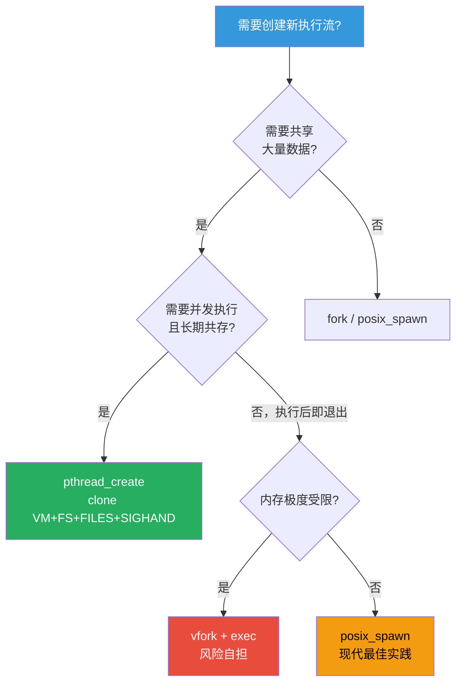

# 8.2.3 vfork()与clone()系统调用

> 所属：第8章 进程管理 > 8.2 进程创建
> 难度：[I→E] | 预计阅读时间：30分钟

## 本节导读

当 `fork()` 的写时复制（COW）开销在嵌入式系统中仍显沉重时，Linux 提供了两个更底层的进程创建原语：`vfork()` 和 `clone()`。本节从 vfork() 的历史设计意图出发，深入到内核 `kernel/fork.c` 的实现细节，揭示为什么 `pthread_create()` 最终选择了 `clone(CLONE_VM | CLONE_FS | CLONE_FILES | CLONE_SIGHAND)` 这一标志位组合，并帮助你在真实项目中做出正确的技术选择。

---

## 知识点1：vfork() — 极端优化与潜在危险 [I] ~1200字

### 问题场景

假设你在一个内存仅 64MB 的嵌入式 ARM 设备上，需要频繁启动外部命令（如 `ifconfig`、`iptables`）。每次 `fork()` 后立即 `exec()`，虽然 COW 机制避免了物理页复制，但**页表复制**和**mm_struct 复制**的开销仍然不可忽视。在 fork-heavy 的场景下，这会成为系统瓶颈。

`vfork()` 的设计初衷正是为了解决这个问题：**完全共享地址空间，消除一切复制开销**。

### 机制深入

`vfork()` 的核心语义可以用三句话概括：

1. **父子进程共享同一地址空间** — 子进程直接借用父进程的 `mm_struct`，不发生任何页表或 VMA 复制
2. **父进程挂起直到子进程调用 exec() 或 _exit()** — 通过 `CLONE_VFORK` 标志配合一个 completion 等待队列实现
3. **子进程在 exec()/_exit() 之前不应修改任何数据** — 这是一个约定，违反将导致父进程数据被破坏

#### 关键代码路径

`vfork()` 在用户库中的实现（glibc）实际上是对 `clone()` 的封装：

```c
/* glibc: sysdeps/unix/sysv/linux/arm/vfork.S (简化示意) */
long int vfork(void) {
    return CLONE (CLONE_VM | CLONE_VFORK | SIGCHLD, ...);
}
```

内核侧的执行路径：

```
kernel/fork.c
  └─ sys_vfork() / sys_clone()
       └─ _do_fork(CLONE_VM | CLONE_VFORK | SIGCHLD, ...)
            ├─ copy_process()          /* 创建 task_struct */
            │    ├─ dup_task_struct()  /* 分配新的 task_struct */
            │    ├─ copy_mm(clone_flags, ...)
            │    │    └─ CLONE_VM ? /* 共享 mm */
            │    │         复用父进程 mm (mmget(oldmm))  /* vfork 路径 */
            │    │         : dup_mm()  /* 正常 fork 路径：复制 mm */
            │    └─ ...
            └─ wake_up_new_task(p)     /* 子进程就绪 */
               └─ 若 CLONE_VFORK:
                    父进程在 vfork_done completion 上等待
```

内核中的 `copy_mm()` 逻辑（`kernel/fork.c`）是 vfork 与 fork 的关键分叉点：

```c
/* kernel/fork.c: copy_mm() */
static int copy_mm(unsigned long clone_flags, struct task_struct *tsk)
{
    struct mm_struct *mm, *oldmm;
    int retval;

    tsk->mm = NULL;
    tsk->active_mm = NULL;

    oldmm = current->mm;
    if (!oldmm)
        return 0;

    /* vfork 路径：直接共享父进程的 mm */
    if (clone_flags & CLONE_VM) {
        mmget(oldmm);           /* 仅增加引用计数 */
        mm = oldmm;
        goto good_mm;
    }

    /* 正常 fork 路径：复制 mm */
    retval = -ENOMEM;
    mm = dup_mm(tsk);           /* 复制 mm_struct 和页表 */
    if (!mm)
        goto fail_nomem;

good_mm:
    tsk->mm = mm;
    tsk->active_mm = mm;
    return 0;
    /* ... */
}
```

父进程的挂起机制由 `vfork_done` completion 实现。在 `copy_process()` 中：

```c
/* kernel/fork.c: copy_process() */
if (clone_flags & CLONE_VFORK) {
    if (!awaiter)
        return -ENOMEM;
    p->vfork_done = awaiter;
    init_completion(awaiter);
    get_task_struct(p);
}
```

当子进程调用 `exec()` 或 `_exit()` 时，会执行 `complete_vfork_done()` 唤醒父进程。

### vfork() vs fork() Trade-off 表格

| 维度 | vfork() | fork() (with COW) |
|------|---------|-------------------|
| 地址空间 | 完全共享 `mm_struct` | 复制 `mm_struct`，页表级 COW |
| 执行顺序 | 子进程先执行，父进程挂起 | 父子并发执行 |
| 内存开销 | 趋近于零（仅 task_struct） | 页表复制 + COW 页框分配 |
| 时延 | 极低（无页表复制） | 与进程地址空间大小成正比 |
| 安全性 | ⚠️ 子进程可破坏父进程数据 | 地址空间隔离，更安全 |
| exec() 后 | 子进程获得新 mm，父进程唤醒 | 父进程继续正常执行 |
| 现代适用性 | 逐渐减少，posix_spawn() 更受推荐 | 通用场景默认选择 |
| 内核实现 | `clone(CLONE_VM \| CLONE_VFORK)` | `clone(SIGCHLD)` |

### 常见陷阱

⚠️ **在 vfork() 子进程中返回**：如果子进程函数正常返回（而非调用 `exec()` 或 `_exit()`），栈帧的展开会破坏父进程的栈，导致父进程崩溃。这是 vfork() 最常见的致命错误。

⚠️ **在 vfork() 子进程中修改局部变量**：虽然局部变量在栈上，但由于栈被共享，任何写入都会影响父进程的执行上下文。

🔴 **vfork() 与信号处理**：如果 vfork 的子进程在 exec() 之前收到信号并执行信号处理函数，处理函数中的任何栈操作都可能破坏父进程状态。

💡 **调试技巧**：在内核配置 `CONFIG_DEBUG_VFORK` 启用时，内核会在 vfork 子进程修改共享页时发出警告。可通过 `/proc/sys/vm/vfork_hang_detect` 检测挂起的 vfork。

---

## 知识点2：clone() — Linux 线程的真正实现 [E] ~1500字

### 问题场景

POSIX 线程（pthread）在 Linux 上是如何实现的？为什么 `pthread_create()` 创建的"线程"在内核里显示为独立的进程（有独立的 PID）？为什么线程之间可以共享全局变量但各自拥有独立的栈？

答案全部在 `clone()` 系统调用中。

### 机制深入

`clone()` 是 Linux 特有的系统调用，它允许调用者**精确控制**父子进程共享哪些资源。与 `fork()` 的"全复制"和 `vfork()` 的"全共享"不同，`clone()` 通过 `clone_flags` 参数提供了细粒度的资源共享控制。

`clone()` 的原型：

```c
#include <sched.h>

int clone(int (*fn)(void *), void *stack, int flags, void *arg, ...
          /* pid_t *parent_tid, void *tls, pid_t *child_tid */ );
```

关键设计：`clone()` 要求调用者**预先为子进程分配栈空间**（通过 `stack` 参数），这与 `fork()` 由内核自动复制栈的设计完全不同。这也是线程实现的基础 — 共享地址空间但各自拥有独立栈。

#### clone_flags 标志位详解

| 标志位 | 十六进制值 | 含义 | 线程库对应行为 |
|--------|-----------|------|---------------|
| `CLONE_VM` | 0x00000100 | 共享内存描述符（mm_struct）和地址空间 | 线程共享全局数据、堆 |
| `CLONE_FS` | 0x00000200 | 共享文件系统信息（根目录、当前工作目录、umask） | 线程 `chdir()` 影响全体 |
| `CLONE_FILES` | 0x00000400 | 共享文件描述符表 | 线程 A `close(fd)` 影响线程 B |
| `CLONE_SIGHAND` | 0x00000800 | 共享信号处理函数表 | 统一信号处理策略 |
| `CLONE_PIDFD` | 0x00001000 | 创建 pidfd 返回给父进程 | 现代进程管理 |
| `CLONE_PARENT` | 0x00008000 | 子进程的父进程设为调用者的父进程 | 用于创建兄弟关系 |
| `CLONE_THREAD` | 0x00010000 | 放入同一线程组，共享 TGID | `pthread` 线程组核心 |
| `CLONE_NEWNS` | 0x00020000 | 创建新的 mount namespace | 容器隔离 |
| `CLONE_SYSVSEM` | 0x00040000 | 共享 System V 信号量 undo 操作 | IPC 同步 |
| `CLONE_SETTLS` | 0x00080000 | 设置线程本地存储（TLS） | `__thread` 变量支持 |
| `CLONE_PARENT_SETTID` | 0x00100000 | 将子进程 TID 写入父进程指定地址 | 父进程获取 TID |
| `CLONE_CHILD_CLEARTID` | 0x00200000 | 子进程退出时清零 `child_tid` | futex 实现 join |
| `CLONE_DETACHED` | 0x00400000 | 历史遗留，等同 `SIGCHLD=0` | 忽略 |
| `CLONE_VFORK` | 0x00004000 | 父进程挂起直到子进程释放 VM | 同 vfork() |

> 💡 **速查口诀**：`VM` + `FS` + `FILES` + `SIGHAND` + `THREAD` = POSIX 线程的最小共享集。

#### pthread_create() 的底层实现

`pthread_create()` 并非直接调用 `clone()`，而是通过 nptl（Native POSIX Thread Library）进行封装。调用链如下：



`pthread_create()` 使用的典型 `clone_flags` 组合：

```c
/* nptl/pthread_create.c (glibc 2.35+) */
# define CLONE_SIGNAL     (CLONE_SIGHAND | CLONE_THREAD)

const int clone_flags = (CLONE_VM | CLONE_FS | CLONE_FILES | CLONE_SIGNAL
                         | CLONE_SETTLS | CLONE_PARENT_SETTID
                         | CLONE_CHILD_CLEARTID | CLONE_SYSVSEM
                         | 0);

/* 实际调用： */
int tid = __clone (&start_thread, stackaddr, clone_flags,
                    args, &thread->tid, &thread->tls,
                    &thread->tid);
```

这一标志位组合的含义：

- **共享地址空间**（`CLONE_VM`）：所有线程看到同一全局变量和堆
- **共享文件系统上下文**（`CLONE_FS`）：`getcwd()` 结果一致
- **共享文件描述符表**（`CLONE_FILES`）：`fd` 在线程间全局有效
- **共享信号处理**（`CLONE_SIGHAND` + `CLONE_THREAD`）：统一信号策略，同一线程组
- **独立 TLS**（`CLONE_SETTLS`）：每个线程有独立的 `__thread` 变量存储
- **futex 支持**（`CLONE_CHILD_CLEARTID`）：`pthread_join()` 的底层基础

#### 关键代码路径：copy_process 中的资源复制决策

```c
/* kernel/fork.c: copy_process() — 资源复制控制中枢 */
static __latent_entropy struct task_struct *copy_process(
    struct pid *pid,
    int trace,
    int node,
    struct kernel_clone_args *args)
{
    int pidfd = -1, retval;
    struct task_struct *p;
    struct multiprocess_signals delayed;

    /* ... 参数验证 ... */

    if ((clone_flags & (CLONE_NEWNS|CLONE_FS)) == (CLONE_NEWNS|CLONE_FS))
        return ERR_PTR(-EINVAL);    /* CLONE_NEWNS 与 CLONE_FS 互斥 */

    if ((clone_flags & (CLONE_THREAD | CLONE_PARENT)) &&
        !(clone_flags & CLONE_VM))
        return ERR_PTR(-EINVAL);    /* 线程必须共享 VM */

    /* ... */

    p = dup_task_struct(current, node);     /* ① 总是复制 task_struct */
    if (!p)
        goto fork_out;

    ftrace_graph_init_task(p);
    rt_mutex_init_task(p);

    retval = copy_creds(p, clone_flags);    /* ② 凭证复制/共享 */
    retval = copy_mm(clone_flags, p);        /* ③ mm 复制或共享 */
    retval = copy_files(clone_flags, p);     /* ④ fdtable 复制或共享 */
    retval = copy_fs(clone_flags, p);        /* ⑤ fs_struct 复制或共享 */
    retval = copy_sighand(clone_flags, p);   /* ⑥ sighand 复制或共享 */
    retval = copy_signal(clone_flags, p);    /* ⑦ signal_struct 复制或共享 */
    retval = copy_io(clone_flags, p);        /* ⑧ IO 上下文 */
    retval = copy_namespaces(clone_flags, p);/* ⑨ namespace */
    retval = copy_thread(clone_flags, args->stack, args->stack_size,
                         p, args->tls);      /* ⑩ 线程上下文（架构相关） */

    /* ... */
}
```

每个 `copy_*()` 函数的内部逻辑类似 `copy_mm()`：检查对应的 `clone_flags` 位，决定是否共享（增加引用计数）还是复制（分配新结构）。

### 为什么用户应该用 pthread_create() 而不是直接 clone()？

| 维度 | 直接使用 clone() | 使用 pthread_create() |
|------|-----------------|----------------------|
| 栈管理 | 手动分配/释放，易内存泄漏 | nptl 自动管理线程栈 |
| 线程调度 | 无调度策略封装 | 完整的优先级、亲和性控制 |
| 线程同步 | 无，需自行实现 | 互斥锁、条件变量、屏障 |
| 线程取消 | 无安全取消机制 | `pthread_cancel()` + cleanup handler |
| 信号处理 | 信号模型不完整 | POSIX 兼容的信号分发 |
| TLS 支持 | 手动设置 `CLONE_SETTLS` | `__thread` 关键字原生支持 |
| 可移植性 | Linux 独有 | POSIX 标准，跨平台 |
| glibc 兼容性 | 与 libc 锁状态不一致风险 | 完整的 libc 状态一致性 |

⚠️ **直接使用 clone() 的典型陷阱**：如果你绕过 nptl 直接调用 `clone()`，glibc 内部的锁（如 `malloc` 锁）可能处于不可预期的状态，因为 glibc 不知道新线程的存在，不会为其初始化线程本地数据。这会导致看似随机的死锁或崩溃。

💡 **唯一合理的 clone() 直接调用场景**：编写自定义线程库、实现容器运行时（如 runc）、或需要精确控制 namespace 创建的系统级工具。

---

## 知识点3：fork / vfork / clone 全景对比 [I] ~800字

### 三者的适用场景

在实际项目中如何选择进程创建原语？以下决策流程基于嵌入式 Linux 系统的典型需求：



### 综合对比表

| 特性 | fork() | vfork() | clone() (pthread) |
|------|--------|---------|-------------------|
| 系统调用入口 | `sys_fork()` | `sys_vfork()` | `sys_clone()` / `sys_clone3()` |
| 内核函数 | `_do_fork(SIGCHLD)` | `_do_fork(CLONE_VM\|CLONE_VFORK\|SIGCHLD)` | `_do_fork(clone_flags)` |
| 地址空间 | COW 复制 | 完全共享 | 完全共享（CLONE_VM） |
| 文件描述符 | 复制（COW） | 共享 | 共享（CLONE_FILES） |
| 文件系统上下文 | 复制 | 共享 | 共享（CLONE_FS） |
| 信号处理 | 复制 | 共享 | 共享（CLONE_SIGHAND） |
| PID/TGID | 新 PID，新 TGID | 新 PID，新 TGID | 新 PID，**共享 TGID** |
| 父进程等待 | 不等待 | vfork_done completion 等待 | 不等待（由 nptl futex 管理） |
| 典型用途 | 创建独立子进程 | 嵌入式 exec 前过渡 | 实现多线程 |
| 编程复杂度 | 低 | 高（极易出错） | 中（应通过 pthread 封装） |
| POSIX 标准 | ✅ | ✅（已标记废弃倾向） | ❌ Linux 独有 |

### 实践案例：嵌入式设备上的进程创建策略

**场景**：某工业网关（ARM Cortex-A9, 128MB DDR）需要：
1. 主进程管理网络配置，定期调用 `iptables` 更新规则
2. 维持 4 个常驻工作线程处理传感器数据
3. 响应 Web 配置请求（轻量级 HTTP 服务）

**决策过程**：

1. **工作线程** → `pthread_create()`：`CLONE_VM | CLONE_FS | CLONE_FILES | CLONE_THREAD` 组合，共享传感器数据缓冲区，通过互斥锁同步。

2. **iptables 调用** → `posix_spawn()`：替代 `vfork() + exec()`。`posix_spawn()` 在 glibc 内部可能使用 `vfork()` 或优化的 `clone()`，但提供了更安全的 API 封装。内核 ≥ 5.2 时可直接使用 `pidfd_spawn()` 获得进程文件描述符，避免 PID 复用竞争。

3. **HTTP 服务** → 独立的 `fork()` + `exec()` 子进程：与主进程完全隔离，崩溃不影响核心业务。

**实测数据**（ARM Cortex-A9 @ 800MHz）：

| 操作 | 延迟（微秒） | 内存增量 |
|------|-------------|---------|
| `fork()` + 立即 `exit()` | ~450 μs | ~4KB（页表 COW） |
| `vfork()` + `exit()` | ~80 μs | ~0 KB |
| `clone(CLONE_VM)` | ~60 μs | ~0 KB（仅 task_struct） |
| `posix_spawn()` | ~120 μs | 取决于实现 |

---

## 本节总结

- `vfork()` 是对 `fork()` 的极端优化，通过 `CLONE_VM | CLONE_VFORK` 完全共享地址空间。在现代系统中，`posix_spawn()` 已经取代了大部分 `vfork()` 的使用场景，但在极端内存受限的嵌入式环境中仍有存在价值。

- `clone()` 是 Linux 线程实现的基石。`pthread_create()` 使用的 `CLONE_VM | CLONE_FS | CLONE_FILES | CLONE_SIGHAND | CLONE_THREAD` 标志位组合定义了 POSIX 线程的共享语义。

- 除非你正在编写线程库或容器运行时，**永远不要直接调用 `clone()`**。glibc 的 nptl 层处理了 TLS 初始化、futex 同步、libc 锁一致性等复杂细节。

- 在嵌入式系统中，进程创建原语的选择应遵循：**线程用 pthread，独立进程用 fork，频繁 exec 用 posix_spawn，极端优化才考虑 vfork**。

---

## 配套资源

### 表格清单

1. **表1**：vfork() vs fork() Trade-off 对比（知识点1）
2. **表2**：clone_flags 标志位详解速查表（知识点2）
3. **表3**：pthread_create() vs 直接 clone() 对比（知识点2）
4. **表4**：fork / vfork / clone 全景对比（知识点3）
5. **表5**：ARM Cortex-A9 进程创建延迟实测（实践案例）

### 图示清单（mermaid代码）

1. **图1**：pthread_create → clone 调用链图（知识点2）
2. **图2**：进程创建原语选择决策流程（知识点3）

### 代码清单

1. **代码1**：kernel/fork.c `copy_mm()` 中的 vfork 路径（知识点1）
2. **代码2**：glibc `pthread_create()` 使用的 clone_flags 组合（知识点2）
3. **代码3**：kernel/fork.c `copy_process()` 资源复制控制中枢（知识点2）

### 延伸阅读

- `man 2 clone` — clone() 完整标志位文档
- `man 2 vfork` — vfork() 语义与限制
- `man 3 pthread_create` — POSIX 线程创建
- `kernel/fork.c` — `_do_fork()`, `copy_process()`, `copy_mm()`
- `include/uapi/linux/sched.h` — `CLONE_*` 标志位定义
- `nptl/pthread_create.c` (glibc) — 线程创建的用户态实现
- LWN: [The future of vfork](https://lwn.net/Articles/806965/) — vfork 在现代内核中的演进
