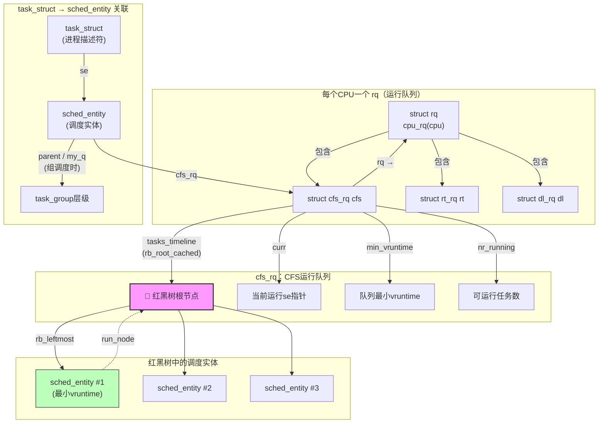

# 8.3.1 CFS调度器的设计哲学与核心数据结构

> 所属：第8章 进程调度全景 > 8.3 CFS完全公平调度器
> 难度：[I→E] | 预计阅读时间：45分钟

## 本节导读

为什么你的交互式应用在ARM64嵌入式板上偶尔出现200ms的卡顿？为什么`nice`值的调整有时达不到预期的CPU占用效果？这些问题的根因往往指向调度器核心——CFS（Completely Fair Scheduler）。本节从设计哲学出发，深入CFS的两大核心数据结构`sched_entity`与`cfs_rq`，拆解`vruntime`的计算机制，建立从理论公式到内核源码的完整认知链路。掌握这些，是后续分析调度延迟、负载均衡、组调度的必要前提。

---

## 知识点1：为什么需要CFS — O(1)调度器的终结 [I] ~1000字

### 问题场景

2007年以前的Linux 2.6内核使用O(1)调度器。它依赖两个优先级数组（active/expired）和固定时间片，理论上能在常数时间内选出下一个任务。但在一个典型的嵌入式场景中——比如同时运行一个GUI应用、一个采集数据的sensor线程和一个日志写入进程——你很快会发现：

- **交互进程响应迟钝**：文本编辑器在后台编译时，按键响应延迟明显
- **优先级反转难以调试**：`nice`值映射到固定时间片，但时间片用完后的处理过于粗暴
- **批处理进程饥饿**：高优先级任务持续占用CPU，低优先级任务长时间得不到执行

### 机制深入：O(1)调度器的结构性缺陷

O(1)调度器的核心问题是**它试图用离散的时间片模拟连续的公平性**，这在数学上就是不完美的。

| 缺陷维度 | O(1)调度器的表现 | 对嵌入式系统的影响 |
|---------|-----------------|-----------------|
| 时间片固定 | 每个优先级对应固定时间片（如100ms），用完即移入expired数组 | 交互进程必须等待完整时间片，导致200ms+的输入延迟 |
| 优先级映射粗糙 | 140个优先级映射到少量时间片档位，同档位内无区分 | 同nice值的sensor线程和日志进程被同等对待 |
| 批处理友好性差 | 进程用完时间片后被迫等待整个数组轮转 | 后台任务"突刺"式执行，影响实时性 |
| 负载估算缺失 | 没有累积运行时间的跟踪机制 | 无法进行精确的负载均衡决策 |

Ingo Molnár在2007年提出的CFS彻底改变了这一范式。CFS的设计目标可以概括为一句话：**让每个进程获得"公平的CPU时间份额"，且公平性可度量、可比较、可维持**。

CFS没有使用传统的时间片概念，而是引入了**虚拟运行时间（vruntime）**——一个精确到纳秒的64位计数器，将优先级、实际执行时间和理想公平模型统一到一个可比较的度量空间中。

### CFS的设计目标 vs O(1)的实践

```
# 嵌入式场景：3个进程竞争单个CPU
# O(1)行为：时间片轮转，每次100ms，交互进程必须等待
# CFS行为：按vruntime排序，交互进程（I/O密集）vruntime增长慢，
#          每次调度只执行几ms就能再次获得CPU
```

### Trade-off表格：调度器演进路径选择

| 设计选择 | O(1)调度器（已废弃） | CFS（当前主线） | 对嵌入式场景的适用性 |
|---------|-------------------|---------------|-----------------|
| 任务组织 | 优先级数组（140级） | 红黑树（按vruntime排序） | CFS的O(log n)插入在实际负载下与O(1)差异可忽略 |
| 时间分配 | 固定时间片 | 动态计算（目标延迟/任务数） | CFS更适应混合负载 |
| 优先级处理 | 时间片比例 | 权重反比影响vruntime增速 | CFS更平滑，无突变 |
| 交互性优化 | 启发式bonus机制 | vruntime自然反映I/O行为 | CFS无需启发式猜测 |
| 内存占用 | 两个数组 + bitmap | 红黑树节点 per task | CFS略高，但64位系统可忽略 |

💡 **设计启示**：CFS的核心洞察是——**公平调度不需要复杂启发式，一个正确的度量（vruntime）加上高效的数据结构（红黑树）就能自然产生理想行为**。交互进程因为频繁睡眠，其`vruntime`增长缓慢，自然排在红黑树左侧，获得更频繁的调度机会。

---

## 知识点2：CFS的核心思想 — vruntime与nice的权重游戏 [E] ~1200字

### 问题场景

你正在调试一个工业网关设备，上面同时运行：
- `data_collector`（nice 0）：高频采集传感器数据
- `cloud_uploader`（nice 5）：批量上传数据到云端
- `web_panel`（nice -5）：提供本地Web配置界面

你想让`web_panel`获得约40%的CPU，`data_collector`约40%，`cloud_uploader`约20%。但调整nice值后效果不理想。为什么？

要回答这个问题，必须深入理解`vruntime`的计算公式和nice值到权重的映射机制。

### 机制深入：vruntime的计算原理

CFS的核心规则：**总是选择`vruntime`最小的进程运行**。`vruntime`不是简单的执行时间，而是经过权重归一化的"虚拟时间"。

#### 关键公式

```
vruntime增量 = 实际执行时间(delta_exec) × (NICE_0_LOAD / 进程权重)
             = delta_exec × (1024 / weight)
```

其中`NICE_0_LOAD = 1024`，是nice 0（默认优先级）的基准权重。

```c
/* kernel/sched/fair.c - vruntime计算核心路径 */
static u64 calc_delta_fair(u64 delta_exec, struct sched_entity *se)
{
    /* 只有非nice 0的进程才需要权重缩放 */
    if (unlikely(se->load.weight != NICE_0_LOAD))
        delta_exec = __calc_delta(delta_exec, NICE_0_LOAD, &se->load);

    return delta_exec;
}

/* 更新当前运行进程的vruntime — 每次tick中断调用 */
static void update_curr(struct cfs_rq *cfs_rq)
{
    struct sched_entity *curr = cfs_rq->curr;
    u64 now = rq_clock_task(rq_of(cfs_rq));
    u64 delta_exec;

    if (unlikely(!curr))
        return;

    /* 计算本次实际执行了多久 */
    delta_exec = now - curr->exec_start;
    if (unlikely((s64)delta_exec <= 0))
        return;

    curr->exec_start = now;

    /* 核心：累加经过权重缩放后的vruntime */
    curr->vruntime += calc_delta_fair(delta_exec, curr);

    /* 更新cfs_rq的min_vruntime（用于新任务初始化和防溢出） */
    update_min_vruntime(cfs_rq);
}
```

#### nice值 → 权重映射表

内核通过一个预计算的数组`sched_prio_to_weight`将nice值（-20~19）映射到权重：

| nice值 | 权重 | 与nice 0的比例 | vruntime增速（相对nice 0） | 实际CPU占比（同竞争下） |
|-------|------|--------------|------------------------|---------------------|
| -20 | 88761 | 86.7× | 1.15% | ~46.3% |
| -10 | 9548 | 9.3× | 10.7% | ~25.4% |
| **0** | **1024** | **1.0×** | **100%** | **~7.7%** |
| +10 | 110 | 0.11× | 930% | ~0.9% |
| +19 | 15 | 0.015× | 6827% | ~0.13% |

⚠️ **关键陷阱**：上表的"实际CPU占比"是在**所有nice值同时竞争**的极端情况下的理论值。实际场景中，CPU占比取决于**所有可运行进程的权重比例**，而非nice值本身。计算公式为：

```
进程A的CPU占比 = weight_A / Σ(weight_of_all_runnable_tasks)
```

所以你的三个进程（nice -5/0/5）的实际权重比约为3124:1024:335 ≈ 3.04:1:0.33，在仅有这三个进程竞争时，`web_panel`获得约3124/(3124+1024+335) ≈ **69.7%**的CPU，而非直觉上的"稍多一点"。

### 从权重到目标延迟

CFS不直接分配时间片，而是定义一个**目标调度延迟**（`sched_latency_ns`，默认24ms）。在这个延迟内，每个可运行进程应该至少被调度一次。

```
单个进程的时间片 = sched_latency_ns × (进程权重 / 队列总权重)
```

当可运行进程数超过`sched_nr_latency`（默认8）时，CFS切换到**最小颗粒度**模式：

```
单个进程的时间片 = sched_min_granularity_ns（默认3ms）
```

这是为了防止进程过多时，每个进程的时间片过短导致上下文切换开销暴涨。

### 实践案例：工业网关nice值调优

回到开头的工业网关场景。你的目标是 web_panel 40%、data_collector 40%、cloud_uploader 20%。

**Step 1：理解权重反比关系**

想要CPU占比比例为 40:40:20 = 2:2:1，对应的权重比也应为 2:2:1。

**Step 2：查表或计算**

假设`data_collector`保持nice 0（weight=1024），则：
- `web_panel`需要weight≈1024 → nice 0或-1
- `cloud_uploader`需要weight≈512 → nice 约+2到+3

**Step 3：验证**

```bash
# 启动进程并绑定nice值
nice -n 0 ./data_collector &
nice -n -1 ./web_panel &
nice -n 3 ./cloud_uploader &

# 观察实际CPU分配（按权重比例计算验证）
# 权重和 = 1227 + 1024 + 335 = 2586
# web_panel: 1227/2586 ≈ 47.4%（-1的权重是1227）
# data_collector: 1024/2586 ≈ 39.6%
# cloud_uploader: 335/2586 ≈ 13.0%
```

发现`cloud_uploader`实际只得到13%而非目标的20%。这是因为nice值的权重映射是非线性的（指数关系）。想要精确控制，需要使用**cgroup的cpu.shares**（见8.3.4组调度）。

💡 **调优技巧**：在嵌入式系统中，如果只需要粗略的比例控制，nice值在±5范围内调整是有效的；如果需要精确的比例控制（如20% vs 40%），应使用cgroup v2的`cpu.weight`。

---

## 知识点3：sched_entity与cfs_rq — 数据结构的精密协作 [E] ~1200字

### 问题场景

你在分析一个内核崩溃dump，堆栈显示在`pick_next_task_fair()`中发生了NULL指针解引用。你怀疑红黑树 corruption。为了定位问题，你必须理解`sched_entity`、`cfs_rq`、`task_struct`三者之间的精确关系，以及`pick_next_entity()`的搜索路径。

### CFS数据结构关系全景



### sched_entity：CFS的基本调度单元

```c
/* include/linux/sched.h - 调度实体定义（Linux 6.x） */
struct sched_entity {
    /* === 负载与树节点 === */
    struct load_weight      load;           /* 权重（由nice值转换） */
    struct rb_node          run_node;       /* 红黑树节点，key = vruntime */
    unsigned char           on_rq;          /* 是否在某个运行队列上 */

    /* === 时间统计 === */
    u64                     exec_start;     /* 本次执行开始时间戳 */
    u64                     sum_exec_runtime; /* 累计实际执行时间 */
    u64                     vruntime;       /* 🔴 虚拟运行时间（核心字段） */
    u64                     prev_sum_exec_runtime; /* 上次调度时的sum */

    /* === 组调度层级（CONFIG_FAIR_GROUP_SCHED）=== */
#ifdef CONFIG_FAIR_GROUP_SCHED
    int                     depth;          /* 在 cgroup 层级中的深度 */
    struct sched_entity     *parent;        /* 父调度实体 */
    struct cfs_rq           *cfs_rq;        /* 所属CFS运行队列 */
    struct cfs_rq           *my_q;          /* 如果是任务组，指向子队列 */
#endif

    /* === PELT负载跟踪（单独cacheline，避免伪共享）=== */
    struct sched_avg        avg;            /* 负载/利用率追踪 */
};
```

#### 关键字段速查

| 字段 | 类型 | 作用 | 何时更新 |
|------|------|------|---------|
| `load.weight` | unsigned long | 调度权重，决定vruntime增速 | `set_load_weight()`在优先级变化时 |
| `run_node` | struct rb_node | 红黑树节点，嵌入到cfs_rq->tasks_timeline | `enqueue_entity()`/`dequeue_entity()` |
| `vruntime` | u64 | 虚拟运行时间，调度决策的唯一依据 | `update_curr()`每次tick |
| `on_rq` | unsigned char | 标记是否已在运行队列上（防重复入队） | 入队时=1，出队时=0 |
| `cfs_rq` | struct cfs_rq* | 指向当前所在的CFS运行队列 | `set_task_rq()`在迁移时 |
| `my_q` | struct cfs_rq* | 任务组拥有子队列时为非NULL | 组调度初始化时 |

### cfs_rq：CFS运行队列

```c
/* kernel/sched/sched.h - CFS运行队列定义 */
struct cfs_rq {
    struct load_weight      load;           /* 队列总权重 */
    unsigned int            nr_running;     /* 可运行调度实体数 */
    unsigned int            h_nr_running;   /* 包含组层级下的总数 */

    u64                     exec_clock;     /* 队列级执行时钟 */
    u64                     min_vruntime;   /* 🔴 队列最小vruntime */

    /* 红黑树：按vruntime排序的所有可运行实体 */
    struct rb_root_cached   tasks_timeline; /* 带缓存的红黑树根 */

    /* 调度实体指针 */
    struct sched_entity     *curr;          /* 当前运行的实体 */
    struct sched_entity     *next;          /* 预测的下一个（缓存友好） */
    struct sched_entity     *last;          /* 上一个运行的实体 */

#ifdef CONFIG_FAIR_GROUP_SCHED
    struct rq               *rq;            /* 所属的CPU运行队列 */
    struct task_group       *tg;            /* 拥有的任务组 */
#endif

#ifdef CONFIG_SMP
    struct sched_avg        avg;            /* PELT负载平均值 */
#endif
};
```

### pick_next_entity：选择下一个任务的精确路径

```c
/* kernel/sched/fair.c - 选择下一个调度实体 */
static struct sched_entity *__pick_next_entity(struct cfs_rq *cfs_rq)
{
    /* 直接取红黑树最左节点 = 最小vruntime的实体 */
    struct rb_node *left = rb_first_cached(&cfs_rq->tasks_timeline);

    if (!left)
        return NULL;

    return rb_entry(left, struct sched_entity, run_node);
}

/* 上层入口：处理组调度和buddy优化 */
pick_next_task_fair(struct rq *rq, struct task_struct *prev, struct rq_flags *rf)
{
    struct cfs_rq *cfs_rq = &rq->cfs;
    struct sched_entity *se;
    struct task_struct *p;

    /* ... 省略prev处理 ... */

    do {
        se = pick_next_entity(cfs_rq);      /* ← 核心：取最左节点 */
        set_next_entity(cfs_rq, se);         /* 从树中摘下，设为curr */
        cfs_rq = group_cfs_rq(se);           /* 如果是任务组，递归深入 */
    } while (cfs_rq);                        /* 直到找到实际任务 */

    p = task_of(se);                         /* container_of逆向转换 */
    return p;
}
```

🔴 **安全提醒**：`pick_next_entity()`在`cfs_rq->nr_running > 0`时理论上不会返回NULL。但在corrupted的rb_tree或并发竞争场景下（如SMP迁移和throttle同时发生），可能导致NULL指针。NXP社区曾记录过此类崩溃——`rb_leftmost`和`rb_root.rb_node`均为NULL但`nr_running`仍为1，表明树结构已被破坏。

### task_struct → se → cfs_rq 的关系链

```c
/* 从task_struct到cfs_rq的完整路径 */
struct task_struct *p = current;
struct sched_entity *se = &p->se;           /* task_struct包含se */
struct cfs_rq *cfs_rq = se->cfs_rq;          /* se指向所属cfs_rq */
struct rq *rq = rq_of(cfs_rq);               /* cfs_rq指向CPU rq */

/* 反向：从红黑树节点到task_struct */
struct sched_entity *se = __pick_next_entity(cfs_rq);
struct task_struct *p = task_of(se);         /* container_of(se, task_struct, se) */
```

⚠️ **常见陷阱**：`task_of()`宏只对**叶子实体**（即直接对应进程的`sched_entity`）有效。如果`se->my_q != NULL`，说明这是一个**任务组实体**，需要递归调用`pick_next_entity()`在其子队列中继续查找。直接对组实体调用`task_of()`会导致错误的`container_of`计算。

### 实践案例：分析NULL指针崩溃

回到开头的问题——`pick_next_task_fair()`中的NULL指针崩溃。

**排查清单**：

1. **检查`nr_running`和`rb_leftmost`的一致性**：
```bash
# 通过debugfs或printk输出
printk("nr_running=%u rb_leftmost=%p rb_root=%p\n",
       cfs_rq->nr_running,
       cfs_rq->tasks_timeline.rb_leftmost,
       cfs_rq->tasks_timeline.rb_root.rb_node);
```
如果`nr_running > 0`但`rb_leftmost == NULL`，说明红黑树已corrupted——可能是并发修改未加锁，或内存被踩。

2. **检查组调度层级**：如果启用了`CONFIG_FAIR_GROUP_SCHED`，确认`group_cfs_rq()`返回的指针是否有效。

3. **检查throttle状态**：CFS bandwidth control可能在`check_cfs_rq_runtime()`中将实体dequeue，但计数未正确更新。

---

## 本节总结

CFS调度器的设计哲学可以用三个关键词概括：**度量（vruntime）、结构（红黑树）、公平（权重比例）**。

| 核心概念 | 一句话总结 | 源码入口点 |
|---------|----------|----------|
| vruntime | 权重归一化的虚拟执行时间，值越小越优先 | `kernel/sched/fair.c: update_curr()` |
| 红黑树 | 按vruntime排序所有可运行实体，O(log n)操作 | `kernel/sched/fair.c: enqueue_entity()` |
| sched_entity | 调度基本单元，包含vruntime和树节点 | `include/linux/sched.h: struct sched_entity` |
| cfs_rq | 每个CPU的CFS运行队列，红黑树根在此 | `kernel/sched/sched.h: struct cfs_rq` |
| nice→权重 | 指数映射，每级差约1.25倍权重比 | `kernel/sched/core.c: sched_prio_to_weight[]` |

理解这些数据结构的关系后，你已经具备了分析以下高级主题的基础：
- **8.3.2** 任务入队/出队路径与`enqueue_entity()`的精确语义
- **8.3.3** `update_curr()`的调用时机与调度延迟计算
- **8.3.4** 组调度（`CONFIG_FAIR_GROUP_SCHED`）的层级调度机制
- **8.4.1** CFS负载均衡（`load_balance()`）的数据流

---

## 配套资源

### 表格清单
- **CFS vs O(1)调度器对比表**（知识点1，设计维度×5项对比）
- **nice值→权重映射表**（知识点2，nice -20~19关键值）
- **sched_entity关键字段速查表**（知识点3，字段/类型/作用/更新时机）

### 图示清单（mermaid代码）
- **CFS数据结构关系图**（task_struct / sched_entity / cfs_rq / rq / 红黑树的完整关联）

### 代码清单
- **代码示例1**：`calc_delta_fair()` + `update_curr()` — vruntime计算核心路径
- **代码示例2**：`sched_entity`结构体完整定义与字段注释
- **代码示例3**：`__pick_next_entity()` + `pick_next_task_fair()` — 任务选择路径
- **命令示例**：`nice`启动进程 + CPU占比验证计算

### 推荐阅读
- `Documentation/scheduler/sched-design-CFS.rst` — 官方CFS设计文档
- `kernel/sched/fair.c` — CFS全部实现（约8000行，建议配合本节阅读）
- Ingo Molnár的原始补丁：`[PATCH] CFS scheduler: v1`（LKML, 2007-04-13）
