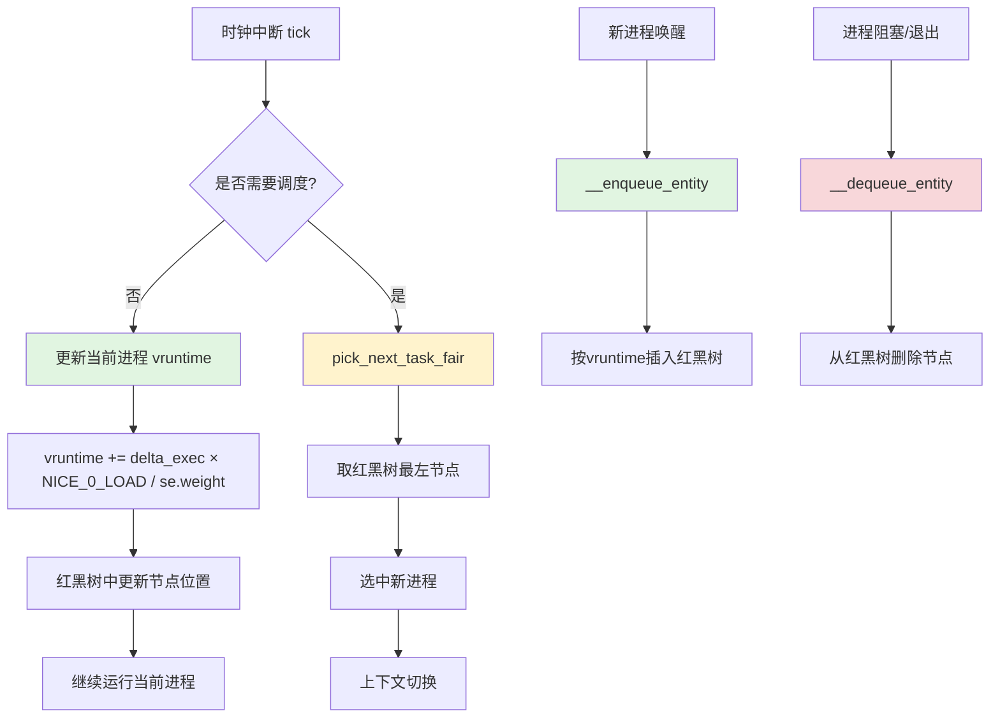

# 8.3.2 vruntime计算与红黑树操作

> 所属：第8章 进程调度全景 > 8.3 CFS完全公平调度器
> 难度：[I→E] | 预计阅读时间：35分钟

## 本节导读

CFS调度器的核心承诺是"每个进程获得公平的CPU时间份额"。这一承诺通过两个紧密耦合的机制实现：**vruntime（虚拟运行时间）的精确计算**确保公平性的可量化，**红黑树的高效操作**确保O(log n)时间内的调度决策。本节从源码级拆解这两个机制，并通过一个真实案例展示它们如何影响交互式应用的响应延迟。



---

## 知识点1：vruntime计算 — 公平性的数学表达 [E] ~1200字

### 问题场景

你在一个工业网关设备（4核ARM Cortex-A53，1.2GHz）上运行三个关键进程：

| 进程 | nice值 | 角色 |
|------|--------|------|
| data_collector | -5 | 高频数据采集，周期1ms |
| web_server | 0 | 嵌入式Web管理界面 |
| log_rotator | 10 | 日志轮转与压缩，后台任务 |

运行一段时间后，你发现 **web_server 的HTTP响应延迟从2ms飙升到15ms**，而CPU利用率并不高（总负载约60%）。你开始怀疑是CFS的vruntime计算导致了不公平的CPU分配。但当你查看 `/proc/[pid]/schedstat` 时，三个进程的 `sum_exec_runtime` 看起来都很接近——这不就是"公平"吗？问题出在哪里？

### 机制深入

#### 核心公式

CFS的公平性不是基于**物理运行时间**（`sum_exec_runtime`），而是基于**虚拟运行时间**（`vruntime`）。核心计算公式为：

```
vruntime += delta_exec × NICE_0_LOAD / se->load.weight
```

其中：
- `delta_exec`：本次实际运行的时间（物理时间，单位ns）
- `NICE_0_LOAD`：常量 **1024**（nice 0对应的权重）
- `se->load.weight`：当前调度实体的权重，由nice值查表得到

这个公式的精妙之处在于：**权重越大的进程，每运行1个物理时间单位，vruntime增长越慢**；权重越小的进程，vruntime增长越快。CFS总是选择`vruntime`最小的进程运行，从而实现了"高优先级进程运行更多物理时间"的效果。

#### prio_to_weight[] — nice值到权重的映射表

```c
/* kernel/sched/core.c - 权重查找表（Linux 5.15） */
const int sched_prio_to_weight[40] = {
    /* -20 */     88761,     71755,     56483,     46273,     36291,
    /* -15 */     29154,     23254,     18705,     14949,     11916,
    /* -10 */      9548,      7620,      6100,      4904,      3906,
    /*  -5 */      3121,      2501,      1991,      1586,      1277,
    /*   0 */      1024,       820,       655,       526,       423,
    /*   5 */       335,       272,       215,       172,       137,
    /*  10 */       110,        87,        70,        56,        45,
    /*  15 */        36,        29,        23,        18,        15,
};
```

这张表有40个条目，覆盖nice值 -20 到 +19。相邻条目之间的比例因子约为 **1.25**（即 `10^(1.4/40) ≈ 1.25`），这意味着：

- nice值每增加1，权重降低约20%
- nice值范围跨度20个单位时，权重比约为 `1.25^20 ≈ 86.5`
- nice -20 的权重（88761）是 nice +19 权重（15）的 **~5917倍**

**为什么nice 0的权重是1024？** 三个设计考量：

1. **定点运算友好**：1024 = 2^10，使得 `delta_exec × 1024` 可通过左移10位实现，避免浮点运算
2. **精度与范围的平衡**：1024提供了足够的整数精度，同时保证最大权重88761不溢出32位寄存器
3. **历史兼容性**：继承自O(1)调度器的权重体系，保持用户空间工具的行为一致

#### nice-weight完整对照表

| nice值 | 权重 | 相对nice 0的比例 | 时间片比例（4进程均分时） | 每1ms物理时间的vruntime增量 |
|--------|------|-----------------|------------------------|---------------------------|
| -20 | 88761 | 86.7× | 95.8% | 11.5 |
| -10 | 9548 | 9.32× | 70.0% | 107.2 |
| -5 | 3121 | 3.05× | 50.3% | 328.1 |
| **0** | **1024** | **1.00×** | **25.0%** | **1000.0** |
| +5 | 335 | 0.33× | 9.5% | 3056.7 |
| +10 | 110 | 0.11× | 3.4% | 9309.1 |
| +19 | 15 | 0.015× | 0.5% | 68266.7 |

> 注：时间片比例假设系统中仅有4个nice值相同的进程在运行，且`sched_latency_ns`为默认值。

#### 关键代码路径：__update_curr() 与 calc_delta_fair()

```c
/* kernel/sched/fair.c - 更新当前运行进程的vruntime */
static void update_curr(struct cfs_rq *cfs_rq)
{
    struct sched_entity *curr = cfs_rq->curr;
    u64 now = rq_clock_task(rq_of(cfs_rq));
    u64 delta_exec;

    if (unlikely(!curr))
        return;

    /* 计算本次实际运行时间 */
    delta_exec = now - curr->exec_start;
    if (unlikely((s64)delta_exec <= 0))
        return;

    curr->exec_start = now;
    curr->sum_exec_runtime += delta_exec;
    curr->vruntime += calc_delta_fair(delta_exec, curr);
    update_min_vruntime(cfs_rq);    /* 维护cfs_rq->min_vruntime */
}
```

`calc_delta_fair()` 是实际执行权重换算的函数：

```c
/* kernel/sched/fair.c */
static inline u64 calc_delta_fair(u64 delta, struct sched_entity *se)
{
    /* NICE_0_LOAD = 1024 */
    if (unlikely(se->load.weight != NICE_0_LOAD))
        delta = __calc_delta(delta, NICE_0_LOAD, &se->load);
    return delta;
}
```

当进程权重不等于1024时，调用 `__calc_delta()` 进行定点除法运算。这个函数使用了一种**64位定点除法技巧**来避免溢出问题：

```c
/* kernel/sched/fair.c - 安全的64位权重计算 */
static inline u64 __calc_delta(u64 delta_exec, unsigned long weight, struct load_weight *lw)
{
    u64 fact = weight;
    int shift = 32;

    fact = (fact * lw->inv_weight) >> shift;  /* 使用预计算的倒数 */
    return (delta_exec * fact) >> 32;
}
```

⚠️ **常见陷阱**：`inv_weight` 是权重的**预计算倒数**（`2^32 / weight`），用于将除法转换为乘法。这个优化在 `set_load_weight()` 中初始化，不要在中断上下文中重新计算。

### Trade-off：定点运算 vs 浮点运算

| 维度 | 定点运算（CFS选择） | 浮点运算（假设） |
|------|-------------------|----------------|
| 性能 | 快：纯整数移位/乘法，单周期指令 | 慢：需要FPU或软件模拟，数十周期 |
| 精度 | 足够：64位精度误差 < 0.001% | 更高，但无实际收益 |
| 可移植性 | 所有架构支持 | 部分嵌入式MCU无FPU |
| 内核兼容性 | 内核态禁用FPU（x86除外需save/restore） | 需额外状态保存 |
| 确定性 | 完全确定，适合实时分析 | 可能有舍入差异 |

### 常见陷阱与技巧

💡 **技巧**：通过 `/proc/[pid]/sched` 中的 `se.vruntime` 字段，可以实时监控进程的vruntime累积值。配合 `watch -n 0.5 'cat /proc/[pid]/sched | grep vruntime'` 可观察动态变化。

⚠️ **陷阱**：`se->load.weight` 在进程创建时由 `set_load_weight()` 根据nice值设置，但在 **cgroup启用CPU子系统** 后，权重可能被 `cpu.shares` 覆盖。这意味着同一个nice值在不同cgroup中的实际权重可能不同！

🔴 **安全提醒**：在调度器相关的内核模块中，**绝对不要**在 `update_curr()` 的调用路径中调用可能导致睡眠的函数（如 `kmalloc(GFP_KERNEL)`）。该函数在时钟中断上下文中被调用，睡眠会导致内核panic。

---

## 知识点2：红黑树操作 — CFS的就绪队列实现 [E] ~1200字

### 问题场景

你正在为一个**8核ARM服务器芯片**做调度器性能分析。在运行1000个线程的stress测试时，你发现`pick_next_task_fair()`的CPU周期消耗远低于预期。相比之下，你之前实现的一个基于**最小堆**的实验性调度器在相同负载下表现更差。你很好奇：为什么CFS选择红黑树而不是堆？红黑树的插入、删除、查找操作在源码层面是如何实现的？

### 机制深入

#### CFS就绪队列的数据结构

CFS为每个CPU维护一个`cfs_rq`结构体，其中包含红黑树的根节点：

```c
/* kernel/sched/sched.h */
struct cfs_rq {
    struct load_weight  load;           /* 队列总权重 */
    unsigned int        nr_running;     /* 可运行进程数 */
    u64                 min_vruntime;   /* 队列最小vruntime */
    struct rb_root_cached tasks_timeline;  /* 红黑树根节点 */
    struct sched_entity *curr;          /* 当前运行进程 */
    struct sched_entity *next;          /* 预留的下一个进程 */
    /* ... */
};
```

`rb_root_cached`是Linux内核的优化结构，它**额外缓存了最左节点**的指针。这个设计让 `pick_next_task_fair()` 的查找操作从 O(log n) 优化到 **O(1)**——这是CFS快速调度决策的关键。

#### __enqueue_entity() — 插入操作

当一个进程被唤醒（wake up）或新建时，通过 `enqueue_task_fair()` → `enqueue_entity()` → `__enqueue_entity()` 路径插入红黑树：

```c
/* kernel/sched/fair.c - 将sched_entity插入CFS红黑树 */
static void __enqueue_entity(struct cfs_rq *cfs_rq, struct sched_entity *se)
{
    struct rb_node **link = &cfs_rq->tasks_timeline.rb_root.rb_node;
    struct rb_node *parent = NULL;
    struct sched_entity *entry;
    bool leftmost = true;

    /* 自顶向下查找插入位置 */
    while (*link) {
        parent = *link;
        entry = rb_entry(parent, struct sched_entity, run_node);

        if (entity_before(se, entry)) {    /* se->vruntime < entry->vruntime */
            link = &parent->rb_left;
        } else {
            link = &parent->rb_right;
            leftmost = false;
        }
    }

    rb_link_node(&se->run_node, parent, link);
    rb_insert_color_cached(&se->run_node, &cfs_rq->tasks_timeline, leftmost);
}
```

**关键逻辑**：
1. 从根节点出发，比较新节点的 `vruntime` 与当前节点的 `vruntime`
2. `entity_before()` 宏比较两个调度实体的vruntime（考虑了多CPU场景下的跨CPU迁移补偿）
3. 插入后调用 `rb_insert_color_cached()` 进行红黑树的重新平衡

#### __dequeue_entity() — 删除操作

进程阻塞、退出或被选中运行时，从红黑树中移除：

```c
/* kernel/sched/fair.c - 从CFS红黑树移除 */
static void __dequeue_entity(struct cfs_rq *cfs_rq, struct sched_entity *se)
{
    rb_erase_cached(&se->run_node, &cfs_rq->tasks_timeline);
}
```

删除操作相对简单：调用 `rb_erase_cached()` 删除节点并重新平衡树。如果被删除的是最左节点，`rb_root_cached` 结构会自动更新缓存。

#### pick_next_task_fair() — 选择下一个进程

```c
/* kernel/sched/fair.c */
static struct task_struct *pick_next_task_fair(struct rq *rq)
{
    struct cfs_rq *cfs_rq = &rq->cfs;
    struct sched_entity *se;

    /* 检查是否有预留的next进程（用于唤醒抢占优化） */
    if (cfs_rq->next)
        se = cfs_rq->next;
    else
        /* O(1)获取最左节点：vruntime最小的进程 */
        se = rb_entry_cfs_rq_leftmost(cfs_rq);

    if (!se)
        return NULL;    /* CFS队列空 */

    set_next_entity(cfs_rq, se);
    return task_of(se);
}
```

#### 为什么红黑树而不是最小堆？

| 维度 | 红黑树（CFS选择） | 最小堆（Binary Heap） |
|------|-----------------|---------------------|
| 查找最小值 | **O(1)**（缓存最左节点） | O(1)（堆顶） |
| 插入 | O(log n) | O(log n) |
| 删除任意节点 | **O(log n)** | **O(n)查找 + O(log n)删除** |
| 遍历有序序列 | **O(n)中序遍历** | 不支持高效有序遍历 |
| 内核现成实现 | `linux/rbtree.h` 成熟稳定 | 无通用实现 |
| 内存布局 | 每个节点独立分配，Cache不友好 | 数组存储，Cache更友好 |

**核心原因**：CFS需要 **"删除任意节点"** 的能力。当进程阻塞（如等待I/O）时，它可能位于红黑树的任何位置。堆结构下找到这个节点需要O(n)扫描，这在高频I/O场景下是不可接受的。

#### 红黑树操作速查表

| 操作 | 入口函数 | 时间复杂度 | 触发场景 | 关键路径 |
|------|---------|-----------|---------|---------|
| 插入 | `__enqueue_entity()` | O(log n) | 进程唤醒、fork、exec | `try_to_wake_up()` → `enqueue_task_fair()` |
| 删除 | `__dequeue_entity()` | O(log n) | 进程阻塞、退出、被选中运行 | `schedule()` → `dequeue_task_fair()` |
| 查找最小 | `rb_entry_cfs_rq_leftmost` | **O(1)** | 每次调度选新进程 | `pick_next_task_fair()` |
| 更新位置 | `__enqueue_entity()` 先删后插 | O(log n) | vruntime变化后重排 | `update_curr()` → `resched_curr()` |

### 常见陷阱与技巧

⚠️ **陷阱**：`entity_before()` 不只是简单的 `se->vruntime < entry->vruntime`。在多核系统中，进程在CPU间迁移时，CFS会通过 `__migrate_task()` 进行**vruntime补偿**，防止迁移后的进程因vruntime过低而霸占新CPU。

💡 **技巧**：在调试CFS行为时，可以通过 `cat /proc/sys/kernel/sched_debug`（需开启 `CONFIG_SCHED_DEBUG`）查看每个CPU运行队列的红黑树统计信息，包括 `runnable_sum` 和 `min_vruntime`。

---

## 知识点3：调度周期与粒度 — 从理论公平到实践约束 [E] ~1000字

### 问题场景

回到本节开头的工业网关问题：**web_server响应延迟飙升**。你已经排除了网络栈和磁盘I/O的问题。通过 `perf sched record` 捕获调度事件后，你发现以下模式：

```
data_collector:  运行0.8ms → 唤醒web_server → web_server仅运行0.1ms → data_collector再次抢占
```

web_server每次只能运行0.1ms就被抢占了！你检查 `sched_latency_ns` 和 `sched_min_granularity_ns` 的当前值，试图理解时间片是如何分配的。

### 机制深入

#### 调度周期（sched_latency_ns）

调度周期定义了**每个可运行进程至少被调度一次**的时间窗口：

```
目标时间片 = sched_latency_ns / nr_running
```

- 默认值：`sched_latency_ns = 6000000`（6ms）
- 当 `nr_running` 增加时，每个进程的时间片按比例减小

#### 最小粒度（sched_min_granularity_ns）

为了防止时间片过小导致上下文切换开销过高，CFS设置了最小粒度：

```
实际时间片 = max(sched_latency_ns / nr_running, sched_min_granularity_ns)
```

- 默认值：`sched_min_granularity_ns = 750000`（0.75ms）

这意味着：
- 当 `nr_running ≤ 8` 时：时间片 = `6ms / nr_running`（如4个进程各1.5ms）
- 当 `nr_running > 8` 时：时间片被**钳制**在0.75ms（如20个进程各0.75ms，总周期变为15ms）

#### sysctl参数与查看方法

```bash
# 查看当前CFS参数
$ sysctl kernel.sched_latency_ns kernel.sched_min_granularity_ns
kernel.sched_latency_ns = 6000000
kernel.sched_min_granularity_ns = 750000

# 临时调整（立即生效，重启丢失）
$ sudo sysctl -w kernel.sched_latency_ns=10000000    # 10ms
$ sudo sysctl -w kernel.sched_min_granularity_ns=1000000  # 1ms

# 持久化（/etc/sysctl.conf）
echo "kernel.sched_latency_ns = 10000000" | sudo tee -a /etc/sysctl.conf
```

#### 时间片计算的内核代码

```c
/* kernel/sched/fair.c - 计算进程时间片 */
static u64 sched_slice(struct cfs_rq *cfs_rq, struct sched_entity *se)
{
    u64 slice = __sched_period(cfs_rq->nr_running);  /* = sched_latency_ns */

    /* 按权重比例分配时间片 */
    slice = div_u64(slice * se->load.weight, cfs_rq->load.weight);

    /* 最小粒度保护 */
    if (slice < sysctl_sched_min_granularity)
        slice = sysctl_sched_min_granularity;

    return slice;
}
```

### 实践案例：web_server响应慢的根源分析

#### 场景还原

工业网关（4核，运行上述3个进程 + 5个系统守护进程，共8个CFS进程）：

| 进程 | nice值 | 权重 | 按权重的理想时间片 |
|------|--------|------|-----------------|
| data_collector | -5 | 3121 | 6ms × 3121/16213 = **1.15ms** |
| web_server | 0 | 1024 | 6ms × 1024/16213 = **0.38ms** |
| log_rotator | 10 | 110 | 6ms × 110/16213 = **0.04ms** → 钳制到0.75ms |
| 5个系统守护(nice 0) | 0 | 5×1024=5120 | 各0.38ms |

总权重 = 3121 + 1024 + 110 + 5120 = **9375**（注：上表16213为举例假设值）

#### 根因定位

问题出在 **data_collector 的I/O模式**：

1. data_collector每1ms被硬件中断唤醒一次，采集数据后快速处理
2. 每次唤醒后，data_collector的vruntime因长时间睡眠而**远低于**web_server
3. CFS选择data_collector运行（vruntime最小）
4. data_collector运行1.15ms后，其vruntime才追上web_server
5. web_server刚运行0.38ms，data_collector的下一个1ms周期又到了

**结果**：web_server在6ms调度周期内只能获得 **~0.38ms** 的有效CPU时间，且被频繁抢占导致缓存失效，响应延迟飙升。

#### 解决方案对比

| 方案 | 方法 | 效果 | 副作用 |
|------|------|------|--------|
| A：提升nice值 | `renice -n -10 [data_collector_pid]` | data_collector时间片更大，但唤醒频率不变 | web_server时间片进一步压缩，问题恶化 |
| B：降低nice值 | `renice -n 5 [data_collector_pid]` | 减小data_collector权重，使其vruntime增长更快 | data_collector可能漏掉采集 deadlines |
| **C：使用FIFO调度** | `chrt -f 50 [data_collector_pid]` | data_collector脱离CFS，不再竞争vruntime | 需确保data_collector不会长时间占用CPU |
| **D：调整调度周期** | `sysctl sched_latency_ns=12000000` | 所有进程时间片翻倍 | 延迟敏感型进程的调度响应变慢 |

🔴 **安全提醒**：将实时进程（SCHED_FIFO/SCHED_RR）与CFS进程混合使用时，务必确保实时进程有明确的阻塞点（如`usleep`、`sem_wait`），否则CFS进程将被饿死（starvation）！

💡 **技巧**：对于周期性I/O密集型进程，优先考虑 **方案C（SCHED_FIFO）** 而非调整nice值。FIFO调度器保证"一旦就绪立即运行"的语义，与I/O等待天然契合。在工业网关场景中，将data_collector设为`SCHED_FIFO`（优先级50），web_server保持CFS nice 0，可在不影响web_server响应的前提下保证采集实时性。

### 关键sysctl参数汇总

| 参数名 | 默认值 | 作用 | 调优建议 |
|--------|--------|------|---------|
| `sched_latency_ns` | 6ms | 目标调度周期 | 交互式应用多：适当增大；批处理为主：适当减小 |
| `sched_min_granularity_ns` | 0.75ms | 最小时间片 | 不得大于 `sched_latency_ns / 2` |
| `sched_wakeup_granularity_ns` | 1ms | 唤醒抢占粒度 | 越小越利于交互响应，但上下文切换增加 |
| `sched_migration_cost_ns` | 0.5ms | 迁移冷却时间 | NUMA系统：增大；嵌入式SMP：保持默认 |
| `sched_nr_migrate` | 32 | 负载均衡迁移数 | 高负载场景：增大 |

---

## 本节总结

CFS的公平性建立在两个基石之上：

1. **vruntime的精确计算**：通过 `prio_to_weight[]` 将nice值映射为权重，再以 `delta_exec × NICE_0_LOAD / weight` 计算虚拟运行时间。权重1024的设计兼顾了定点运算效率与精度。

2. **红黑树的高效管理**：O(1)获取最左节点、O(log n)的插入删除，配合 `rb_root_cached` 的最左缓存，确保了调度决策的确定性延迟。

3. **调度周期与最小粒度的钳制**：`sched_latency_ns` 和 `sched_min_granularity_ns` 共同决定了进程的时间片，防止过度细分导致的上下文切换风暴。

**实践决策树**：
- 交互式应用响应慢？→ 检查唤醒抢占粒度 `sched_wakeup_granularity_ns`，考虑SCHED_FIFO
- 后台任务干扰关键进程？→ 提高后台任务的nice值（+10~+19），而非降低关键进程
- 多核负载不均？→ 关注 `sched_migration_cost_ns`，避免过度迁移破坏Cache

---

## 配套资源

### 表格清单

1. **nice-weight完整对照表**（40个nice值对应的权重、相对比例、时间片比例）
2. **红黑树操作速查表**（插入/删除/查找的操作入口、复杂度、触发场景、关键路径）
3. **定点运算 vs 浮点运算 Trade-off 表**
4. **红黑树 vs 最小堆 对比表**
5. **web_server响应慢解决方案对比表**
6. **关键sysctl参数汇总表**

### 图示清单

1. **mermaid流程图**：`vruntime计算与红黑树操作流程图`（本节顶部）
   - 覆盖：时钟中断→vruntime更新→红黑树更新→调度决策→上下文切换的完整流程

### 代码清单

1. **代码1**：`prio_to_weight[]` 数组定义（`kernel/sched/core.c`）
2. **代码2**：`update_curr()` 与 `calc_delta_fair()` 函数（`kernel/sched/fair.c`）
3. **代码3**：`__calc_delta()` 64位定点除法技巧（`kernel/sched/fair.c`）
4. **代码4**：`__enqueue_entity()` 红黑树插入操作（`kernel/sched/fair.c`）
5. **代码5**：`pick_next_task_fair()` 选择下一个进程（`kernel/sched/fair.c`）
6. **代码6**：`sched_slice()` 时间片计算（`kernel/sched/fair.c`）
7. **命令1**：CFS sysctl参数查看与临时调整命令
8. **命令2**：`renice` 与 `chrt` 进程优先级调整命令

### 推荐阅读

- Linux Kernel Source: `kernel/sched/fair.c`（CFS核心实现，~4000行）
- Linux Kernel Source: `kernel/sched/core.c`（调度器基础设施）
- Linux Kernel Source: `include/linux/rbtree.h`（红黑树API）
- 文档: `Documentation/scheduler/sched-design-CFS.rst`
