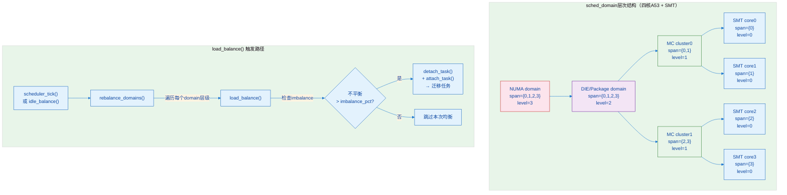
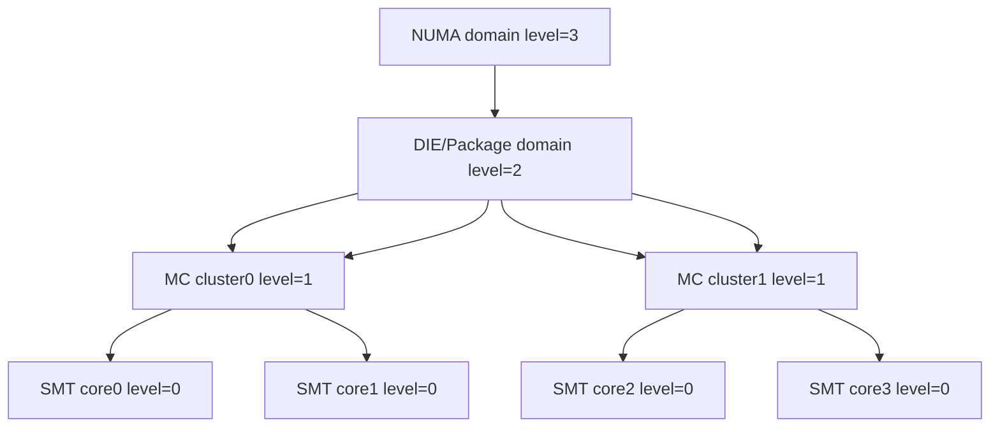

# 8.3.3 调度延迟与负载均衡

> 所属：第8章 进程调度全景 > 8.3 CFS调度器深度解析
> 难度：[I→E] | 预计阅读时间：35分钟

## 本节导读

你的嵌入式系统运行着一个50μs周期的实时控制任务，但偶尔出现200μs的响应尖峰——问题出在哪里？本节从源码级拆解Linux调度延迟的三类来源（唤醒延迟、上下文切换、负载迁移），深入CFS多核负载均衡的`load_balance()`核心逻辑与`sched_domain`层次结构，并给出可落地的sysctl调参与调度器选择决策框架。

---

## 知识点1：调度延迟来源 — 从唤醒到运行的三段延迟 [I] ~1200字

### 问题场景

你正在为工业网关设备（四核ARM Cortex-A53）调试一个MODBUS轮询任务，要求每1ms执行一次。大多数周期内任务都能在20μs内响应，但每隔数秒会出现一次150μs+的延迟尖峰。通过`ftrace`的`sched_wakeup`事件，你发现延迟并非来自驱动或中断，而是来自**调度器本身**。要解决这个问题，你必须先理解调度延迟的组成结构。

### 机制深入

调度延迟（Scheduling Latency）定义为：**从任务变为可运行状态（R状态）到任务真正获得CPU开始执行之间的时间差**。在CFS中，它由三段组成：

```
总调度延迟 = 唤醒延迟(wakeup latency) + 选核延迟(select_rq latency) + 上下文切换延迟(context switch latency)
```

#### 1. 唤醒延迟（Wakeup Latency）

当任务被`wake_up()`唤醒时，内核路径为：

```
try_to_wake_up() → ttwu_queue() → ttwu_do_activate() → enqueue_task()
```

`try_to_wake_up()`（`kernel/sched/core.c`）是唤醒路径的入口。在CFS中，它会调用`enqueue_task_fair()`将任务的`sched_entity`插入对应CPU的`cfs_rq`红黑树。整个过程需要：

- 读取`p->sched_class`确定调度类
- 计算任务的`vruntime`（涉及PELT负载更新）
- 获取目标CPU运行队列锁（`rq->lock`）

在ARM64平台上，**纯唤醒路径（无锁竞争）约消耗1-3μs**，但如果多个CPU同时操作同一个`rq`，`raw_spin_lock()`导致的缓存行乒乓（cache-line bouncing）可能将这个延迟放大到50μs以上。

#### 2. 上下文切换开销（Context Switch Overhead）

当`schedule()`选中新任务后，调用`context_switch()`完成切换：

```c
/* kernel/sched/core.c - context_switch() 核心逻辑 */
static __always_inline struct rq *
context_switch(struct rq *rq, struct task_struct *prev,
               struct task_struct *next, struct rq_flags *rf)
{
    /* 1. 切换mm_struct（页表） */
    if (!next->mm) {                    /* 内核线程 */
        next->active_mm = prev->active_mm;
        mmgrab(prev->active_mm);
        enter_lazy_tlb(prev->active_mm, next);
    } else {                            /* 用户进程 */
        switch_mm_irqs_off(prev->active_mm, next->mm, next);
    }

    /* 2. 切换寄存器上下文 */
    switch_to(prev, next, prev);        /* 展开为 __switch_to_asm */

    /* 3. 返回时，prev指向被切出的任务 */
    return finish_task_switch(prev);
}
```

上下文切换的硬件开销包括：
- **TLB刷新**：`switch_mm_irqs_off()` → `cpu_switch_mm()`，如果ASID（Address Space ID）不同，需要刷新TLB。ARM64的TTBR0_EL1更新约消耗数百ns。
- **缓存冷启动**：新任务的 working set 不在L1/L2 cache中，前几条指令的cache miss penalty可达1-5μs。
- **FPU/SIMD状态保存**：如果使用了`kernel_neon_begin()`或用户态FPU，`fpsimd_save()`保存32个128位寄存器，约消耗0.5-2μs。

**表1：调度延迟来源分析**

| 延迟来源 | 触发路径 | 典型值（ARM64四核） | 恶化场景 | 优化方向 |
|---------|---------|-------------------|---------|---------|
| 唤醒路径 | `try_to_wake_up()` → `enqueue_task_fair()` | 1-3μs | 多CPU竞争`rq->lock` | 减少跨核唤醒，绑核 |
| 选核延迟 | `select_task_rq()` → `find_idlest_cpu()` | 0.5-2μs | NUMA远端内存、负载波动大 | `sched_domain`裁剪 |
| 上下文切换 | `context_switch()` → `__switch_to()` | 1-5μs | TLB刷新、FPU保存 | ASID复用、避免FPU频繁切换 |
| 负载均衡迁移 | `load_balance()` → `detach_task()` | 5-50μs | 频繁任务迁移、大`nr_running` | 调整`sched_domain`层级 |
| 中断延迟 | `irq_exit()` → `invoke_softirq()` | 1-10μs | 关中断时间过长 | `threadirqs`、`preemptirqs` |

#### 3. 负载均衡迁移延迟（Migration Delay）

当负载均衡器决定将任务从CPU A迁移到CPU B时，路径为：

```
load_balance() → detach_task() → attach_task()
```

迁移不仅需要双CPU的`rq->lock`（引入锁竞争），还会导致：
- **缓存失效**：任务在CPU A的L1/L2缓存全部失效
- **PELT衰减重启**：`sched_avg`（负载追踪）在迁出CPU衰减、迁入CPU重建，短期内影响权重计算

### 如何测量调度延迟？

三种工具适用于不同精度需求：

**方法1：ftrace sched事件（推荐，无额外开销）**

```bash
# 启用sched tracer
echo sched_latency > /sys/kernel/debug/tracing/current_tracer
echo 1 > /sys/kernel/debug/tracing/events/sched/sched_wakeup/enable
echo 1 > /sys/kernel/debug/tracing/events/sched/sched_switch/enable

# 抓取后分析：从sched_wakeup到sched_switch的时间差即为调度延迟
cat /sys/kernel/debug/tracing/trace
```

**方法2：perf sched（统计级分析）**

```bash
# 记录10秒调度事件
perf sched record -- sleep 10
# 生成延迟直方图
perf sched latency --sort max
```

**方法3：BPF/bpftrace（动态追踪，最灵活）**

```bpftrace
/* sched_latency.bt - 测量指定PID的调度延迟 */
tracepoint:sched:sched_wakeup {
    @wakeup_time[args->pid] = nsecs;
}

tracepoint:sched:sched_switch /args->prev_pid != 0/ {
    $pid = args->next_pid;
    if (@wakeup_time[$pid]) {
        $latency = (nsecs - @wakeup_time[$pid]) / 1000;  /* μs */
        @latency_hist = hist($latency);
        delete(@wakeup_time[$pid]);
    }
}
```

### 常见陷阱

⚠️ **陷阱1**：`sched_wakeup`事件记录的是**进入`try_to_wake_up()`的时刻**，而非任务真正变为R状态的时刻。如果中断上下文中调用了`wake_up()`，实际调度还要等`irq_exit()`后的`need_resched`检查。

⚠️ **陷阱2**：在多核系统上，不要用`taskset -c`简单绑核就以为消除了迁移延迟。如果绑定的CPU上运行了多个高优先级任务，CFS的`sched_latency_ns`保证的是**每个任务的平均时间片**，不是响应时间。

💡 **技巧**：在`ftrace`中关注`sched:sched_migrate_task`事件，如果某个任务频繁迁移（`count > 10/秒`），说明负载均衡器对该任务的CPU选择不稳定，考虑用`sched_setaffinity()`固定绑核。

---

## 知识点2：负载均衡 — CFS的多核调度艺术 [E] ~1500字

### 问题场景

你的四核ARM Cortex-A72系统运行着视频编解码+网络转发的混合负载。通过`mpstat`发现CPU0利用率95%，CPU1-3仅30%。CFS的负载均衡器在做什么？为什么不对称？理解`sched_domain`层次结构和`load_balance()`的工作机制，才能做出正确的调优决策。

### 机制深入

#### sched_domain：层次化的调度域

Linux内核将CPU按照硬件拓扑组织为多层`sched_domain`（定义在`include/linux/sched/topology.h`）。每个`sched_domain`描述一组CPU，负载均衡器在同级domain内的CPU之间均衡负载。

典型的ARM64四核系统（两cluster，每cluster两核）层次结构：

```
DIE domain (domain level 0):  包含所有4个CPU [MC级别]
  ├── CLUSTER domain (domain level 1): CPU0, CPU1 [共享L2]
  └── CLUSTER domain (domain level 1): CPU2, CPU3 [共享L2]
```

对于支持SMT的x86或ARM系统，层次更深：

```
NUMA domain      [跨NUMA节点]
  └── DIE domain     [跨Socket]
        └── MC (Package) domain [跨物理核]
              └── SMT (Core) domain [跨超线程]
```

每个`sched_domain`通过`sdt::span`定义覆盖范围，关键字段：

```c
/* include/linux/sched/topology.h - sched_domain 关键字段 */
struct sched_domain {
    struct sched_domain *parent;     /* 上层domain */
    struct sched_domain *child;      /* 下层domain */
    unsigned long span[0];           /* 该domain覆盖的CPU位图（柔性数组） */
    unsigned int level;              /* 层次级别，0=最底层 */

    /* 负载均衡参数 */
    unsigned int imbalance_pct;      /* 触发均衡的不平衡阈值（默认125%） */
    unsigned int min_interval;       /* 最小均衡间隔（jiffies） */
    unsigned int max_interval;       /* 最大均衡间隔 */
    unsigned int busy_factor;        /* 忙时间隔乘数 */

    /* flags */
    unsigned int flags;              /* SD_* flags，如SD_LOAD_BALANCE */
};
```

🔴 **安全提醒**：`sched_domain`的`span`是柔性数组（zero-length array），分配时通过`sched_domain_alloc()`根据`cpumask_size()`计算总大小。直接`sizeof(struct sched_domain)`不会包含`span`空间，手写内核模块时不要犯此错误。

**mermaid图：sched_domain层次结构与负载均衡流程**



#### load_balance() 的核心逻辑

`load_balance()`（`kernel/sched/fair.c`）是CFS负载均衡的心脏。它在以下两种场景触发：

1. **周期性负载均衡（Periodic Balance）**：`scheduler_tick()` → `trigger_load_balance()` →  raise `SCHED_SOFTIRQ`
2. **空闲负载均衡（Idle Balance）**：CPU即将进入idle前，`balance_callback()` → `idle_balance()`

```c
/* kernel/sched/fair.c - load_balance() 核心逻辑（精简注释版） */
static int load_balance(int cpu, struct rq *this_rq,
                        struct sched_domain *sd, enum cpu_idle_type idle,
                        int *continue_balancing)
{
    unsigned long imbalance;
    struct rq *busiest;
    struct sched_group *busiest_group;
    struct sched_group *this_group;
    struct lb_env env = {
        .sd             = sd,
        .dst_cpu        = cpu,
        .dst_rq         = this_rq,
        .dst_grpmask    = sched_group_span(sd->groups),
        .idle           = idle,
        .imbalance      = &imbalance,
    };

    /* 1. 查找最忙的CPU组 */
    if (!update_pick_busiest(&env, sd, &busiest_group, &this_group))
        return sd_balanced;   /* 已经均衡，无需操作 */

    /* 2. 计算需要迁移的负载量 */
    env.imbalance = calculate_imbalance(&env, this_group, busiest_group);
    if (!env.imbalance)
        return sd_balanced;

    /* 3. 从busiest CPU上detach任务 */
    busiest = find_busiest_queue(&env, busiest_group);
    if (!busiest)
        return sd_balanced;

    /* 4. 加锁迁移 */
    raw_spin_lock_double(&busiest->lock, &this_rq->lock);
    detach_tasks(&env, busiest);      /* 从源rq摘出 */
    attach_tasks(&env, this_rq);       /* 挂入目标rq */
    raw_spin_unlock(&this_rq->lock);
    raw_spin_unlock(&busiest->lock);

    return sd_moved;   /* 成功迁移 */
}
```

#### Active Balance vs Idle Balance

| 维度 | Idle Balance（空闲均衡） | Active Balance（主动均衡） | Periodic Balance（周期均衡） |
|------|----------------------|------------------------|--------------------------|
| 触发时机 | CPU即将进入idle | 长时间不均衡（紧急补救） | `SCHED_SOFTIRQ`定期触发 |
| 调用路径 | `balance_callback()` → `idle_balance()` | `stop_one_cpu_nowait()` | `run_rebalance_domains()` |
| 严格程度 | 最激进：不接受不均衡 | 最激进：强制迁移 | 保守：仅当超过阈值 |
| 执行上下文 | 当前CPU的idle线程 | `migration/N`内核线程 | `softirq`上下文 |
| 延迟容忍 | 可承受较大延迟 | 必须快速完成 | 中等 |
| 适用场景 | 避免CPU空转 | 打破持续不均衡僵局 | 日常平滑均衡 |

💡 **关键洞察**：**Idle Balance是负载均衡最重要的路径**。当某个CPU空闲时，它愿意从最忙的CPU"抢"任务，即使这意味着锁竞争和缓存失效。这正是为什么在多核系统上，你很少看到某个CPU长期空闲而其他CPU忙炸——idle balance会快速填补空缺。

Active Balance是"最后的手段"：当某个domain长期不均衡（超过`2 * imbalance_pct`），负载均衡器通过`stop_one_cpu_nowait()`在目标CPU的`migration/N`线程上执行强制迁移。这不需要目标CPU配合，因此即使目标CPU一直在忙碌也能完成迁移。

### 负载均衡的Trade-off

**表2：负载均衡频率的权衡决策**

| 均衡频率 | 优点 | 缺点 | 适用场景 |
|---------|------|------|---------|
| 高频（`min_interval=1`） | 负载分布均匀，响应及时 | 锁竞争严重，缓存颠簸，功耗高 | 低延迟要求、短任务为主的交互式系统 |
| 低频（`max_interval=32`） | 减少锁竞争，缓存更稳定 | 负载分布滞后，可能堆积 | 吞吐量优先、长任务为主的批处理系统 |
| 关闭某层级（`SD_LOAD_BALANCE`清零） | 零迁移开销，绑核行为确定 | 手动分配不均导致空闲 | 硬实时系统、DPDK类独占应用 |

### 实践案例：异构多核（big.LITTLE）的负载均衡陷阱

在ARM big.LITTLE系统（如Cortex-A72 + Cortex-A53）上，`sched_domain`按MC层级分为两个cluster domain：

- **big cluster**（高性能核）：`sd->flags |= SD_ASYM_CPUCAPACITY`
- **LITTLE cluster**（能效核）：`sd->flags |= SD_ASYM_CPUCAPACITY`

`find_idlest_cpu()`在选择目标CPU时，会考虑`cpu_capacity_orig`：**如果任务的utilization超过LITTLE核的capacity，即使LITTLE核更空闲，也会被调度到big核**。

```c
/* kernel/sched/fair.c - select_task_rq_fair() 中的 capacity 检查 */
if (cpu_capacity(cpu) < task_util_est(p) &&
    cpu_capacity(cpu) < cpu_capacity(prev_cpu))
    continue;   /* 跳过capacity不足的CPU */
```

⚠️ **陷阱**：在big.LITTLE系统上，频繁在big和LITTLE cluster之间迁移任务会导致严重的性能抖动。原因是：
1. 跨cluster迁移需要经过MC层级以上的domain，锁路径更长
2. L2 cache完全不共享，迁移后cache miss rate骤增
3. `PELT`负载追踪的半衰期（32ms）意味着迁出核的负载衰减需要时间

**解决方案**：对延迟敏感的任务，使用`sched_setaffinity()`绑定到big cluster；对后台任务绑定到LITTLE cluster，避免跨cluster负载均衡。

---

## 知识点3：调度器调优 — sysctl参数与实时应用决策 [I] ~800字

### 问题场景

你的Linux系统需要同时运行一个10ms周期的数据采集任务（硬实时要求）和一个后台日志压缩任务（批处理特性）。如何调整CFS参数使得采集任务不被日志任务抢占过久？是否该放弃CFS改用SCHED_FIFO？本节给出可落地的调参方案和决策框架。

### CFS核心sysctl参数

**表3：CFS调度器sysctl关键参数**

| 参数名 | 默认值 | 含义 | 调优建议 |
|--------|--------|------|---------|
| `kernel.sched_latency_ns` | 24ms（NR_LATENCY_NS） | CFS调度周期：每个可运行任务至少被调度一次的保证时间窗口 | 降低→时间片更小、响应更快；升高→吞吐量更高、切换更少 |
| `kernel.sched_min_granularity_ns` | 4ms | 最小时间片：单个任务的最少运行时间 | 应 ≤ `sched_latency_ns / nr_cpus`，防止任务过多时时间片过碎 |
| `kernel.sched_wakeup_granularity_ns` | 6ms | 唤醒抢占粒度：新唤醒任务必须比当前任务`vruntime`领先多少才能抢占 | 降低→更容易抢占、响应更快；升高→减少不必要的抢占 |
| `kernel.sched_migration_cost_ns` | 0.5ms | 任务被认为"cache hot"的最小运行时间，小于此值不迁移 | 升高→减少迁移、cache更稳定；降低→负载更均匀 |
| `kernel.sched_nr_migrate` | 32 | 单次`load_balance`最多迁移的任务数 | 嵌入式系统可降至8-16，减少均衡开销 |
| `kernel.sched_tunable_scaling` | 1（logarithmic） | `sched_latency_ns`随CPU数缩放方式 | 0=不缩放，1=对数缩放，2=线性缩放；多核建议1 |

#### 参数之间的数学关系

```
时间片 = sched_latency_ns / nr_running
时间片 = max(时间片, sched_min_granularity_ns)
```

这意味着：
- 当`nr_running ≤ sched_latency_ns / sched_min_granularity_ns = 6`时，每个任务分得的时间片 ≥ 4ms
- 当`nr_running > 6`时，时间片开始线性缩小
- 如果`nr_running = 24`，时间片仅1ms

### 调优实践：两种典型场景

**场景A：低延迟交互式系统（工业HMI）**

```bash
# /etc/sysctl.d/99-low-latency.conf
# 目标：降低响应延迟，允许更多抢占
kernel.sched_latency_ns = 12000000       # 12ms（原24ms）
kernel.sched_min_granularity_ns = 1500000  # 1.5ms
kernel.sched_wakeup_granularity_ns = 2000000  # 2ms（更容易抢占）
kernel.sched_migration_cost_ns = 250000   # 0.25ms（更愿意迁移）
```

**场景B：吞吐量优先的批处理系统（边缘计算网关）**

```bash
# /etc/sysctl.d/99-throughput.conf
# 目标：减少上下文切换，最大化cache利用率
kernel.sched_latency_ns = 48000000       # 48ms
kernel.sched_min_granularity_ns = 6000000  # 6ms
kernel.sched_wakeup_granularity_ns = 8000000  # 8ms（更难抢占）
kernel.sched_migration_cost_ns = 1000000   # 1ms（更保守迁移）
kernel.sched_nr_migrate = 16              # 减少单次迁移数
```

### 实时应用：CFS vs RT调度类的决策

很多工程师面对实时需求时，第一反应是使用`SCHED_FIFO`或`SCHED_RR`。但这并非总是正确选择。

| 决策因素 | CFS（SCHED_OTHER） | RT（SCHED_FIFO/RR） |
|---------|-------------------|-------------------|
| 优先级范围 | nice值-20~19（40级） | 1~99（99级） |
| CPU占用保障 | 无（可能被饿死） | `SCHED_FIFO`可100%占用CPU |
| 延迟保证 | 统计保证，无硬上限 | 高优先级可立即抢占 |
| 多任务协作 | 内置公平性 | 需手动设计（低优先级可能饿死） |
| 内核配置要求 | 无 | 需`CONFIG_RT_GROUP_SCHED`，有栈溢出风险 |
| 适用场景 | 软实时（目标延迟的95%满足即可） | 硬实时（必须100%满足deadline） |

💡 **决策框架**：
1. **如果任务周期 > 100ms，且偶尔延迟可接受** → 保持CFS，调nice值至-10
2. **如果任务周期 1-100ms，且要求95%分位延迟达标** → CFS + `sched_latency_ns`调低 + nice=-10
3. **如果任务周期 < 1ms，或延迟尖峰会导致系统故障** → `SCHED_FIFO` + 绑核 + 隔离CPU（`isolcpus`）

⚠️ **陷阱**：`SCHED_FIFO`任务如果不主动yield或使用阻塞调用，会**永久占用CPU**，导致同核上所有CFS任务饿死。生产环境中务必：
- 通过`/sys/fs/cgroup/cpu/rtcpu.shares`限制RT任务总带宽（`cpu.rt_runtime_us`默认950ms/秒）
- 或确保`SCHED_FIFO`任务有阻塞点（`usleep()`、`poll()`、`read()`等）

🔴 **安全提醒**：`isolcpus`参数（如`isolcpus=2,3`）会将CPU从CFS负载均衡器中完全移除。这意味着即使隔离的CPU空闲，CFS也不会将任务调度上去。被隔离的CPU必须通过**显式`taskset`**将任务放上去，否则永远空闲。

---

## 本节总结

调度延迟与负载均衡是多核Linux系统的核心调优领域。本节覆盖的三个核心认知：

1. **调度延迟三段论**：唤醒延迟（`try_to_wake_up`路径，1-3μs）、上下文切换（`context_switch`，1-5μs）、负载均衡迁移（`load_balance`，5-50μs）。使用`ftrace sched`事件或`bpftrace`可以精确测量每个环节的耗时分布。

2. **负载均衡的层次化设计**：`sched_domain`按NUMA→DIE→MC→SMT四层组织，`load_balance()`在各级domain中自底向上遍历。Idle Balance填补空闲CPU，Active Balance打破不均衡僵局，Periodic Balance维持日常平滑。

3. **调优不是玄学**：`sched_latency_ns`直接决定CFS时间片大小，`sched_min_granularity_ns`设置下限。对于硬实时需求，`SCHED_FIFO` + `isolcpus`是终极方案，但要警惕RT任务饿死CFS的风险。

**给嵌入式工程师的三条建议**：
- 用`ftrace -e 'sched:*'`在目标硬件上实测调度延迟直方图，不要依赖理论值
- big.LITTLE系统上，用`sched_setaffinity()`将实时任务固定到big cluster，避免跨cluster迁移开销
- 在`sysctl.conf`中调整CFS参数前，先用`sysctl -w`临时生效并跑24小时压力测试，确认无退化再固化配置

---

## 配套资源

### 表格清单

| 表格编号 | 名称 | 位置 |
|---------|------|------|
| 表1 | 调度延迟来源分析 | 知识点1 |
| 表2 | 负载均衡频率权衡决策 | 知识点2 |
| 表3 | CFS调度器sysctl关键参数 | 知识点3 |
| 辅助表 | Idle vs Active vs Periodic Balance对比 | 知识点2 |
| 辅助表 | CFS vs RT调度类决策对照 | 知识点3 |

### 图示清单（mermaid代码）



### 代码清单

| 编号 | 代码片段 | 说明 | 路径 |
|------|---------|------|------|
| 代码1 | `context_switch()`核心逻辑 | 上下文切换函数 | `kernel/sched/core.c` |
| 代码2 | `load_balance()`核心逻辑 | CFS负载均衡主函数 | `kernel/sched/fair.c` |
| 代码3 | BPFTrace调度延迟测量脚本 | 动态追踪工具 | `sched_latency.bt` |
| 代码4 | `select_task_rq_fair()` capacity检查 | big.LITTLE选核逻辑 | `kernel/sched/fair.c` |
| 代码5 | `struct sched_domain`关键字段 | 调度域数据结构 | `include/linux/sched/topology.h` |

### 推荐阅读

- [LKD] Robert Love, "Linux Kernel Development", 3rd Ed., Chapter 4: Process Scheduling
- 内核源码：`kernel/sched/fair.c:load_balance()`（负载均衡核心实现）
- 内核源码：`kernel/sched/core.c:try_to_wake_up()`（唤醒路径入口）
- 内核文档：`Documentation/sysctl/kernel.rst`（sched_*参数说明）
- 工具：`man perf-sched`（perf sched详细文档）
