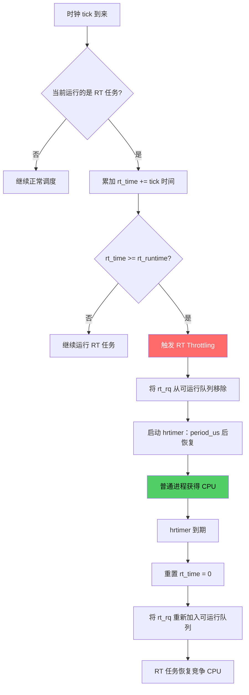

# 8.4.1 实时调度器：SCHED_FIFO 与 SCHED_RR

> 所属：第8章 进程调度与实时性 > 8.4 实时调度策略
> 难度：[I→E] | 预计阅读时间：35分钟

## 本节导读

当你的嵌入式系统需要在 100μs 内响应一个外部中断事件时，CFS（完全公平调度器）的"公平"哲学反而成为敌人。本节深入 Linux 实时调度器的两条核心策略——`SCHED_FIFO` 与 `SCHED_RR`，从内核源码级别剖析它们的调度机制、优先级体系、时间片管理以及那个让无数工程师栽过跟头的**RT 死循环陷阱**。读完本节，你将能够为自己的实时任务做出精确的调度策略决策，并理解为什么在 `SCHED_FIFO` 面前，`nice -20` 形同虚设。

---

## 知识点1：SCHED_FIFO — 先来先服务的绝对霸权 [E] ~1200字

### 问题场景

想象一个工业机械臂控制器：当安全传感器检测到障碍物时，紧急停止任务必须在最短时间内获得 CPU 并执行制动。这个任务不能容忍"公平竞争"——它要的是**一旦就绪，立即执行；一旦执行，绝不退让**（除非有更高优先级任务到来）。这正是 `SCHED_FIFO` 的设计哲学。

### 机制深入

`SCHED_FIFO`（First-In-First-Out）是 Linux 最古老、最直观的实时调度策略。其核心规则极其简单，但后果极为深远：

**三条铁律：**

1. **优先级铁律**：系统总是运行优先级最高的就绪实时进程。只要存在优先级为 80 的就绪 FIFO 任务，优先级 79 及以下的所有任务都**永远**无法获得 CPU。
2. **执行铁律**：一个 FIFO 任务一旦获得 CPU，将**一直运行直到主动放弃**——通过调用 `sched_yield()`、进入睡眠（sleep/阻塞）或被更高优先级任务抢占。
3. **同优先级队列**：相同优先级的 FIFO 任务构成一个队列，先就绪的先运行，但**不会**因时间片到期而被强制切换。

### 关键代码路径

FIFO 的调度逻辑集中在 `kernel/sched/rt.c` 中。理解以下三条路径，等于掌握了 RT 调度器的骨架：

**路径1：入队 — `__enqueue_rt_entity()`**

```c
/* kernel/sched/rt.c */
static void __enqueue_rt_entity(struct sched_rt_entity *rt_se, unsigned int flags)
{
    struct rt_rq *rt_rq = rt_rq_of_se(rt_se);
    struct rt_prio_array *array = &rt_rq->active;
    struct list_head *queue = array->queue + rt_se_prio(rt_se);

    if (flags & ENQUEUE_HEAD)
        list_add(&rt_se->run_list, queue);      /* 插到队首 */
    else
        list_add_tail(&rt_se->run_list, queue); /* 插到队尾 */

    __set_bit(rt_se_prio(rt_se), array->bitmap); /* 标记该优先级队列非空 */
    rt_se->on_list = 1;
    rt_se->on_rq = 1;
    inc_rt_tasks(rt_se, rt_rq);
}
```

`rt_prio_array` 是 RT 调度器的核心数据结构——一个包含 100 个 `list_head` 的数组（对应优先级 0~99）加上一个位图 `bitmap`。`sched_find_first_bit(bitmap)` 能以 O(1) 复杂度找到当前最高优先级，这是 RT 调度器低延迟的关键。

**路径2：选下一个任务 — `pick_next_rt_entity()`**

```c
static struct sched_rt_entity *pick_next_rt_entity(struct rt_rq *rt_rq)
{
    struct rt_prio_array *array = &rt_rq->active;
    struct list_head *queue;
    int idx;

    idx = sched_find_first_bit(array->bitmap);  /* O(1) 找最高优先级 */
    BUG_ON(idx >= MAX_RT_PRIO);

    queue = array->queue + idx;
    /* 同优先级 FIFO：取队列头部的第一个任务 */
    return list_first_entry(queue, struct sched_rt_entity, run_list);
}
```

**路径3：时钟 tick 处理 — `task_tick_rt()`**

```c
static void task_tick_rt(struct rq *rq, struct task_struct *p, int queued)
{
    update_curr_rt(rq);
    watchdog(rq, p);

    /*
     * RR tasks need a special form of time-slice management.
     * FIFO tasks have no timeslices.        ← 关键区别！
     */
    if (p->policy != SCHED_RR)
        return;  /* FIFO 任务直接返回，不做任何时间片处理 */
    ...
}
```

注意 `task_tick_rt()` 对 FIFO 任务的"冷漠"——时钟中断发生时不做任何事情。这意味着一个 FIFO 任务可以霸占 CPU 任意长时间。

### Trade-off 表格

| 维度 | SCHED_FIFO 选择 | 代价与风险 |
|------|----------------|-----------|
| **同优先级调度** | 不切换，当前任务一直运行 | 低优先级同优先级任务可能饥饿 |
| **响应延迟** | 最高优先级任务 → 立即抢占，延迟 ≈ 中断响应时间 | 无额外调度开销 |
| **CPU 独占** | 100% 占用直到主动放弃 | ⚠️ 死循环将锁死 CPU |
| **适用场景** | 简短、确定性的关键任务 | 不适合长时间计算任务 |
| **内核线程** | `watchdog/N`、`migration/N` 默认使用 | 用户任务不应设为 prio 99 |

### 常见陷阱

⚠️ **不要为用户实时任务设置优先级 99**：`watchdog` 和 `migration` 内核线程运行在最高优先级。如果你的用户任务也设为 99 且进入死循环，这些内核守护线程将无法运行，最终可能导致 soft-lockup 甚至系统崩溃。

💡 **建议**：用户实时任务从优先级 80 开始分配，预留 95~99 给内核关键线程。

---

## 知识点2：SCHED_RR — 带时间片的轮转调度 [E] ~1200字

### 问题场景

你有三个同等重要的数据采集线程，都需要以优先级 60 运行，且都必须持续执行而非一次性事件。如果用 `SCHED_FIFO`，第一个运行的线程将霸占 CPU 直到主动放弃，另外两个线程完全没有机会。你需要的是**同优先级之间的时间共享**——这就是 `SCHED_RR`（Round-Robin）。

### 机制深入

`SCHED_RR` 与 `SCHED_FIFO` 共享完全相同的基础设施：同一套优先级空间（1~99）、同一套 `rt_prio_array` 数据结构、同样的 O(1) 选路逻辑。二者的唯一区别在于**时间片（timeslice）管理**。

**RR 时间片机制：**

1. 每个 RR 任务拥有一个 `time_slice` 计数器，默认值为 `sched_rr_timeslice`（可通过 `/proc/sys/kernel/sched_rr_timeslice_ms` 查看，典型值 100ms = 10 jiffy@100Hz）。
2. 每次时钟 tick，`task_tick_rt()` 将 `time_slice` 减 1。
3. 当 `time_slice` 归零时，当前任务被移到同优先级队列的**尾部**，队列头部的下一个同优先级任务获得 CPU。
4. 被移走的任务重新获得完整的 `sched_rr_timeslice`。

**关键代码路径：**

```c
/* kernel/sched/rt.c - task_tick_rt() RR 分支 */
static void task_tick_rt(struct rq *rq, struct task_struct *p, int queued)
{
    struct sched_rt_entity *rt_se = &p->rt;

    update_curr_rt(rq);
    watchdog(rq, p);

    if (p->policy != SCHED_RR)
        return;

    if (--p->rt.time_slice)       /* 时间片未耗尽，继续运行 */
        return;

    p->rt.time_slice = sched_rr_timeslice;  /* 重置时间片 */

    /*
     * Requeue to the end of queue if we (and all of our ancestors)
     * are not the only element on the queue
     */
    for_each_sched_rt_entity(rt_se) {
        if (rt_se->run_list.prev != rt_se->run_list.next) {
            requeue_task_rt(rq, p, head=0);  /* 移到同优先级队列尾部 */
            resched_curr(rq);                  /* 触发调度 */
            return;
        }
    }
}
```

### Trade-off 表格：SCHED_FIFO vs SCHED_RR

| 对比维度 | SCHED_FIFO | SCHED_RR |
|---------|-----------|----------|
| **优先级范围** | 1 ~ 99 | 1 ~ 99 |
| **同优先级行为** | 不切换，当前任务一直运行 | 时间片轮转，同优先级共享 CPU |
| **时间片** | 无（`time_slice = 0`） | 默认 100ms（可配置） |
| **主动放弃场景** | `sched_yield()` / sleep / 阻塞 / 被高优先级抢占 | 同上 + 时间片耗尽 |
| **上下文切换开销** | 更少（无 tick 触发的切换） | 略多（每时间片一次可能的切换） |
| **适用模型** | 事件驱动、简短关键任务 | 持续运行的周期性任务 |
| **饥饿风险** | 同优先级队列头部任务可能饿死后续任务 | 同优先级任务公平分享 CPU |
| **延迟确定性** | 极高（无意外切换） | 较高（时间片到期保证轮到） |

### 代码示例：设置调度策略

```c
/* 用户空间程序：将当前线程设为 SCHED_FIFO，优先级 80 */
#define _GNU_SOURCE
#include <sched.h>
#include <stdio.h>
#include <unistd.h>

int main(void)
{
    struct sched_param param = { .sched_priority = 80 };

    /* 需要 CAP_SYS_NICE 权限（root 或对应 capability） */
    if (sched_setscheduler(0, SCHED_FIFO, &param) == -1) {
        perror("sched_setscheduler");
        return 1;
    }

    printf("PID %d now running under SCHED_FIFO, priority 80\n", getpid());

    /* 实时工作循环 */
    while (1) {
        /* ... 关键实时任务 ... */

        /* 周期性任务：主动让出 CPU，避免独占 */
        sched_yield();
    }

    return 0;
}
```

编译运行：
```bash
$ gcc -o rt_task rt_task.c
$ sudo chrt -f 80 ./rt_task    # 命令行方式：以 FIFO prio 80 运行
```

### 常见陷阱

⚠️ **RR 时间片不是"精度"**：`sched_rr_timeslice` 的 100ms 只是同优先级轮转周期，不要将其误解为任务响应时间的保证。真正的响应延迟取决于系统中是否有更高优先级的实时任务。

💡 **查看/修改 RR 时间片**：
```bash
# 查看当前 RR 时间片（毫秒）
$ cat /proc/sys/kernel/sched_rr_timeslice_ms
100

# 设为 50ms（需 root）
$ echo 50 > /proc/sys/kernel/sched_rr_timeslice_ms
```

---

## 知识点3：实时优先级与 nice 的关系 — 两个独立的世界 [I] ~800字

### 问题场景

新晋升的工程师小张遇到了一个困惑：他把一个普通任务的 `nice` 值设为了 -20（最高 nice 优先级），然后又启动了一个 `SCHED_FIFO` 优先级为 1（最低的 RT 优先级）的任务。他发现 RT 任务总是抢占 nice 为 -20 的普通任务。"-20 不是最高优先级吗？"他问道。

### 机制深入

Linux 的优先级体系是一个**统一但分层**的设计。理解它需要从内核内部优先级数值说起。

**内核优先级全景图：**

```
内核内部优先级 (p->prio)：
  0        99       100       139        140
  |---------|---------|---------|----------|
   DL/RT     RT      CFS/NORMAL   IDLE
  
  0~98:   Deadline 任务 (-1) 和 RT 任务 (prio = 99 - rt_priority)
  99:     RT 任务的最低内核优先级 (rt_priority = 0, 用户空间不可见)
  100~139: CFS 普通任务 (prio = 120 + nice)
  140:    IDLE 任务
```

**核心映射关系（关键代码）：**

```c
/* include/linux/sched/prio.h */
#define MAX_USER_RT_PRIO    100
#define MAX_RT_PRIO         MAX_USER_RT_PRIO       /* 100 */
#define MAX_PRIO            (MAX_RT_PRIO + 40)     /* 140 */
#define DEFAULT_PRIO        (MAX_RT_PRIO + 20)     /* 120 = nice 0 */

#define NICE_TO_PRIO(nice)  ((nice) + DEFAULT_PRIO)    /* [-20,19] → [100,139] */
#define PRIO_TO_NICE(prio)  ((prio) - DEFAULT_PRIO)
```

```c
/* kernel/sched/core.c - normal_prio() */
static inline int normal_prio(struct task_struct *p)
{
    int prio;

    if (task_has_dl_policy(p))
        prio = MAX_DL_PRIO - 1;              /* -1，最高 */
    else if (task_has_rt_policy(p))
        prio = MAX_RT_PRIO - 1 - p->rt_priority;  /* 99 - rt_priority */
    else
        prio = __normal_prio(p);             /* static_prio = 120 + nice */
    return prio;
}
```

### 优先级范围速查表

| 调度策略 | 用户空间参数 | 参数范围 | 内核 `p->prio` | 相对优先级 |
|---------|------------|---------|---------------|-----------|
| `SCHED_DEADLINE` | N/A | N/A | -1 | 最高（内核层） |
| `SCHED_FIFO` | `rt_priority` | 1 ~ 99 | 98 ~ 0 | 绝对高于所有普通进程 |
| `SCHED_RR` | `rt_priority` | 1 ~ 99 | 98 ~ 0 | 绝对高于所有普通进程 |
| `SCHED_OTHER` | `nice` | -20 ~ 19 | 100 ~ 139 | 低于所有 RT 进程 |
| `SCHED_BATCH` | `nice` | -20 ~ 19 | 100 ~ 139 | 同 OTHER |
| `SCHED_IDLE` | N/A | N/A | 140 | 最低 |

**关键洞察：**

- **rt_priority 数字越大，优先级越高**（99 最高），与 nice 值的方向相反。
- **RT 优先级 1 的内核表示 `prio = 98`**，仍然高于 `nice -20` 对应的 `prio = 100`。
- 只要系统中存在任何一个可运行的 RT 任务（包括优先级 1），所有 CFS 任务（`nice -20 ~ 19`）**几乎不可能获得 CPU**。调度器类的优先级链保证了这一点：

```
调度器类优先级链：stop_sched_class → rt_sched_class → fair_sched_class → idle_sched_class
```

`pick_next_task()` 的遍历逻辑：

```c
/* kernel/sched/core.c */
static inline struct task_struct *pick_next_task(struct rq *rq)
{
    const struct sched_class *class;
    struct task_struct *p;

    /* 按调度器类优先级从高到低遍历 */
    for_each_class(class) {
        p = class->pick_next_task(rq);
        if (p)
            return p;    /* rt_sched_class 有任务就绝不会走到 fair */
    }
    ...
}
```

### 实践案例：优先级误用导致的系统"假死"

某工业视觉检测系统上，工程师将图像采集线程设为 `SCHED_FIFO, prio 80`，将图像处理算法线程设为 `nice -20`（期望它"尽可能高"）。当采集线程以满负荷运行时，处理算法线程**数秒内完全得不到 CPU**，表现为帧缓冲区溢出、处理流水线崩溃。

**诊断过程：**

```bash
# 查看各线程的调度类和优先级
$ ps -eo pid,comm,class,rtprio,ni,pri | grep -E "(vision|capture)"
  PID COMMAND         CLS  RTPRI  NI PRI
  832 vision-capture   FF     80   -  19    ← RT 任务，prio=19(内核)
  833 vision-process   TS      - -20 100    ← nice -20，但 prio=100
```

**解决方案**：如果图像处理也需要实时性保证，必须同样使用 `SCHED_FIFO/SCHED_RR`，并根据任务的关键性分配不同的 RT 优先级（如采集 80，处理 70）。

---

## 专题：RT 死循环陷阱与 Throttling 安全网 [E] ~800字

### 问题场景

你为一个电机控制任务设置了 `SCHED_FIFO, prio 90`。某天代码中的一个边界条件 bug 导致控制循环进入了死循环。没有 `sleep()`、没有阻塞 I/O、没有 `sched_yield()`——CPU 被永久劫持，SSH 无法响应，系统 seemingly 死机。

这就是 RT 调度器最危险的陷阱：**一个高优先级实时任务的无限循环可以冻结整个系统**。

### 机制深入：RT Bandwidth Control

Linux 2.6.25 引入的 **RT Throttling** 机制是这个问题的主要安全网。其核心思想：**限制所有 RT 任务在每个周期内可消耗的 CPU 时间总量**，为普通进程预留生存所需的 CPU 带宽。

```
默认配置：
  sched_rt_period_us  = 1,000,000 μs = 1s  （周期长度）
  sched_rr_timeslice  = 100 ms             （RR 轮转片）
  sched_rt_runtime_us =   950,000 μs = 0.95s（每周期内 RT 最大运行时间）
  
  → RT 任务最多占用 95% 的 CPU，剩余 5% 预留给普通进程
```

**工作原理（Mermaid 流程图）：**



**关键代码路径：**

```c
/* kernel/sched/rt.c - 核心 throttling 逻辑 */
static void update_curr_rt(struct rq *rq)
{
    struct rt_rq *rt_rq = &rq->rt;
    struct task_struct *curr = rq->curr;
    u64 delta_exec;

    if (!rt_rq->rt_nr_running)
        return;

    delta_exec = rq_clock_task(rq) - curr->se.exec_start;
    if (unlikely((s64)delta_exec <= 0))
        return;

    curr->se.exec_start += delta_exec;
    curr->se.sum_exec_runtime += delta_exec;

    /* RT bandwidth accounting */
    if (rt_rq->rt_time > rt_rq->rt_runtime) {
        /* 超过配额，触发 throttle */
        if (!rt_rq->rt_throttled) {
            rt_rq->rt_throttled = 1;
            dequeue_rt_rq(rt_rq);     /* 将 RT 队列从 rq 移除 */
            sched_rt_rq_dequeue(rt_rq);
            start_rt_bandwidth(&rt_rq->rt_bandwidth);  /* 启动恢复定时器 */
        }
    }
}
```

### 检查与配置 Throttling

```bash
# 查看 RT throttling 状态
$ grep -r "rt" /proc/sched_debug | head -20

# 查看当前 RT bandwidth 配置
$ cat /proc/sys/kernel/sched_rt_period_us
1000000
$ cat /proc/sys/kernel/sched_rt_runtime_us
950000

# 临时调整：将 RT 配额提升到 99%（谨慎！）
$ echo 990000 > /proc/sys/kernel/sched_rt_runtime_us

# ⚠️ 极度危险：完全禁用 throttling（仅用于完全受控的硬实时系统）
$ echo -1 > /proc/sys/kernel/sched_rt_runtime_us
```

### 综合 Trade-off 表格

| 配置方案 | RT 可用 CPU | 普通进程可用 CPU | 适用场景 | 风险等级 |
|---------|-----------|----------------|---------|---------|
| 默认 (950ms/1s) | 95% | 5% | 通用嵌入式系统 | 🟢 低 |
| 保守 (800ms/1s) | 80% | 20% | 需要确保后台服务响应 | 🟢 低 |
| 激进 (990ms/1s) | 99% | 1% | 极致 RT 性能需求 | 🟡 中 |
| 禁用 (-1) | 100% | 0% | 硬实时、完全受控环境 | 🔴 极高 |

### 常见陷阱

🔴 **禁用 throttling 的代价**：在 `sched_rt_runtime_us = -1` 的情况下，一个优先级 99 的 FIFO 死循环将**永久冻结系统**，连 `watchdog` 都可能无法触发重启。除非你对所有 RT 代码有绝对的正确性保证，否则不要禁用。

⚠️ **检查 throttling 事件**：如果系统出现"RT 任务偶尔卡顿"的现象，检查是否被 throttle 了。

```bash
$ dmesg | grep -i throttle
[   45.312] sched: RT throttling activated    ← 你的 RT 任务被限速了！
```

💡 **生产环境建议**：在 `/etc/sysctl.conf` 中固化 RT bandwidth 配置，并配合 `ulimit -r` 限制普通用户可设置的 RT 优先级上限。

```bash
# /etc/sysctl.d/99-rt.conf
kernel.sched_rt_period_us = 1000000
kernel.sched_rt_runtime_us = 950000
```

---

## 实践案例：电机控制系统的调度策略设计

### 场景描述

一个三轴伺服电机控制系统，运行 Linux 5.15 + PREEMPT_RT 补丁，包含以下任务：

| 任务 | 周期 | 执行时间 | 关键性 |
|------|------|---------|--------|
| 急停处理 | 事件驱动 | < 50μs | 最高（安全相关） |
| 位置控制环 | 1kHz (1ms) | ~200μs | 高 |
| 速度环补偿 | 2kHz (500μs) | ~100μs | 高 |
| 日志记录 | 10Hz | ~5ms | 低 |
| 网络通信 | 事件驱动 | 可变 | 中 |

### 调度策略决策

```c
/* 急停处理：SCHED_FIFO, 优先级最高 */
struct sched_param estop_param = { .sched_priority = 95 };
sched_setscheduler(estop_tid, SCHED_FIFO, &estop_param);

/* 速度环补偿：SCHED_FIFO，次高优先级（比位置环更高，因为周期更短） */
struct sched_param vel_param = { .sched_priority = 85 };
sched_setscheduler(vel_tid, SCHED_FIFO, &vel_param);

/* 位置控制环：SCHED_FIFO */
struct sched_param pos_param = { .sched_priority = 80 };
sched_setscheduler(pos_tid, SCHED_FIFO, &pos_param);

/* 网络通信：SCHED_RR（需要与其他同优先级任务共享，避免阻塞） */
struct sched_param net_param = { .sched_priority = 60 };
sched_setscheduler(net_tid, SCHED_RR, &net_param);

/* 日志记录：普通 CFS 即可，nice 0 */
setpriority(PRIO_PROCESS, log_tid, 0);
```

### 关键设计决策

1. **急停用 FIFO**：最高优先级，事件驱动，简短执行——FIFO 的"立即抢占、绝不退让"完美契合。
2. **速度环比位置环优先级高**：虽然位置控制"更重要"，但速度环周期更短（500μs vs 1ms）。在 Rate-Monotonic 调度思想下，更短周期的任务应获得更高优先级。
3. **网络通信用 RR**：网络任务需要持续运行但不应独占 CPU，RR 的时间片机制确保即使同优先级有多个网络相关线程，也能公平轮转。
4. **日志用 CFS**：非关键任务，使用 CFS 即可。即使 RT throttling 触发，日志也能继续写入（预留的 5% CPU 足够）。

---

## 本节总结

- **`SCHED_FIFO`** 提供"运行直到主动放弃"的语义，适合简短、关键、事件驱动的实时任务。同优先级任务按 FIFO 队列排列，但**不**因时间片到期而切换。
- **`SCHED_RR`** 在 FIFO 基础上增加了同优先级的时间片轮转，适合需要持续运行且同优先级共享 CPU 的场景。默认时间片 100ms。
- **RT 优先级（1~99）完全独立于 nice 值**。`prio = 99 - rt_priority` 的内核映射保证了任何 RT 任务（即使优先级 1）都绝对高于 `nice -20` 的普通任务。
- **RT Throttling** 是防止 RT 死循环锁死系统的安全网。默认配置（95% CPU 配额）适合大多数场景，禁用需极度谨慎。

---

## 配套资源

### 表格清单

1. **SCHED_FIFO vs SCHED_RR 对比表**（知识点2中）
2. **Linux 优先级范围速查表**（知识点3中）
3. **RT Bandwidth 配置方案对比表**（Throttling 专题中）
4. **电机控制系统任务表**（实践案例中）

### 图示清单（mermaid 代码）

1. **RT Throttling 决策流程图**（Throttling 专题中）

### 代码清单

1. `__enqueue_rt_entity()` — RT 入队核心逻辑（知识点1）
2. `task_tick_rt()` — RR 时间片处理（知识点2）
3. `normal_prio()` — 优先级映射关系（知识点3）
4. 用户空间 `sched_setscheduler()` 示例程序（知识点2）
5. RT bandwidth 配置命令（Throttling 专题）
6. 电机控制系统调度策略设计示例（实践案例）
