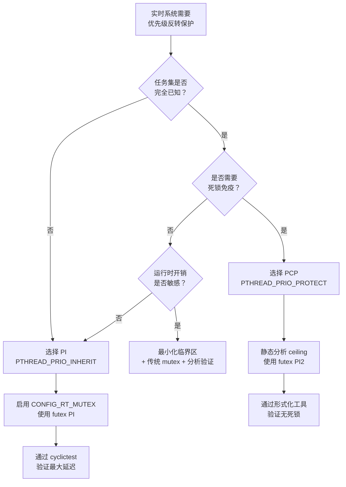

# 8.4.2 优先级继承与优先级反转

> 所属：第8章 实时调度与内核确定性 > 8.4 实时互斥与同步机制
> 难度：[I→E] | 预计阅读时间：35分钟

## 本节导读

实时系统的调度器可以按优先级做决策，但无法阻止**高优先级任务因同步原语而阻塞在低优先级任务上**——这就是优先级反转（Priority Inversion）。本节从火星探路者号的致命故障出发，深入解析 Linux 内核中优先级继承（PI）与优先级天花板（PCP）两种协议的实现机制、适用边界与工程决策。

---

## 知识点1：优先级反转问题 [I] ~800字

### 问题场景

1997年7月4日，火星探路者号（Mars Pathfinder）成功着陆火星。数天后，飞船出现**系统级复位**——任务调度器周期性丢失关键数据，导致看门狗触发整体重启。事后分析（JPL Lab Report, 1997）确认：根因是一个**优先级反转**bug。

在 Pathfinder 的软件架构中，存在三类任务共享一个互斥锁（mutex）：

| 任务 | 优先级 | 职责 | 对共享资源的访问 |
|------|--------|------|-----------------|
| `bc_dist`（气象数据分发） | 高（H） | 将气象数据通过总线分发 | 短暂持有 mutex，访问共享管道 |
| `bc_async`（异步通信） | 中（M） | 处理异步通信与控制指令 | **不访问** mutex |
| `ASI/MET`（传感器采集） | 低（L） | 采集气象传感器数据 | 长时间持有 mutex，写入共享管道 |

**故障时序**：

1. 时刻 t0：L 获取 mutex，开始写入传感器数据
2. 时刻 t1：H 就绪，抢占 CPU，但很快也需要同一 mutex → **H 阻塞，等待 L 释放**
3. 时刻 t2：M 就绪（如地面控制指令到达）→ **M 抢占 L 的 CPU**
4. 时刻 t3：M 运行很长时间（通信协议栈处理），L 无法推进 → **H 间接等待 M**
5. 结果：H 被阻塞的时间 = L 剩余临界区 + M 的整个执行时间 → 超出 deadline，看门狗复位

这就是**无界优先级反转（Unbounded Priority Inversion）**：高优先级任务的阻塞时间不受自身控制，取决于任意中优先级任务的执行时长。

### 优先级反转场景分类

| 场景类型 | 触发条件 | 阻塞时间上限 | 是否需要处理 |
|---------|---------|------------|------------|
| **直接反转** | H 等待 L 持有的锁 | L 的临界区时长 | 不可避免，需最小化临界区 |
| **间接反转（传递性）** | H 等待 L，L 等待 M（已持有另一锁） | 链上所有临界区之和 | PI 协议可处理传递链 |
| **无界反转** | H 被 L 阻塞，L 被 M 抢占 | M 的完整执行时间（**无界**） | 🔴 **必须消除** |
| **死锁引发的反转** | 循环等待导致永久阻塞 | ∞ | 需死锁检测或避免协议 |

### 机制深入

优先级反转的**根本原因**在于：调度器仅根据任务的独立优先级做抢占决策，而忽略任务之间因同步原语产生的**依赖关系**。当 L 持有 H 需要的锁时，L 实际上是 H 的"代理执行者"——H 的执行进度间接绑定在 L 的 CPU 时间上。

从调度理论角度，优先级反转违反了实时系统的**优先级可调度性假设**：如果任务 τ_i 的优先级高于 τ_j，则 τ_i 不应被 τ_j 延迟任意长时间。

### 关键代码路径

在 Linux 内核中，传统的 `mutex` 和 `spinlock` 不具备优先级继承能力。当高优先级任务阻塞在 `mutex_lock()` 时，等待路径为：

```c
/* kernel/locking/mutex.c —— 传统 mutex 的 slowpath */
__mutex_lock_slowpath(struct mutex *lock)
{
    /* ... */
    for (;;) {
        /* 将当前任务加入 wait_list，设置状态为 UNINTERRUPTIBLE */
        set_current_state(TASK_UNINTERRUPTIBLE);
        
        /* 🔴 传统 mutex：不做任何优先级调整！ */
        /* 锁持有者继续以原优先级运行 */
        
        if (__mutex_trylock(lock))
            goto acquired;
        schedule_preempt_disabled();  /* 主动放弃 CPU */
    }
acquired:
    __set_current_state(TASK_RUNNING);
}
```

⚠️ **关键陷阱**：`mutex` 与 `rt_mutex` 是两套独立实现。前者用于内核通用路径，后者专用于实时场景。很多工程师在写驱动时混用两者，导致实时性分析失效。

### 案例：火星探路者号的技术复盘

Pathfinder 使用的 VxWorks 系统当时已支持优先级继承选项，但**该互斥锁的创建标志未启用 PI**。修复方法极其简单——在 `mutexCreate()` 调用中加入 `SEM_INVERSION_SAFE` 标志，启用优先级继承。

💡 **工程启示**：这是一个典型的"机制存在但配置遗漏"事故。实时系统的正确性不仅取决于选择了正确的 OS，还取决于每个同步原语的参数配置是否经过形式化分析。

---

## 知识点2：优先级继承协议（PI） [E] ~1200字

### 问题场景

PI（Priority Inheritance）协议由 Sha, Rajkumar 和 Lehoczky 在 1990 年的经典论文中提出。核心思想是**临时提升（priority boosting）**：当高优先级任务 H 阻塞在任务 L 持有的锁上时，将 L 的有效优先级提升到 H 的优先级，使得 L 尽快完成临界区释放锁。

PI 解决的是"无界"问题——将阻塞时间从"M 的完整执行时间"压缩到"L 的临界区时间"。

### 机制深入

#### 单锁场景

延续上面的三任务模型，启用 PI 后的时序变化：

1. t0：L 获取 mutex（优先级 = L）
2. t1：H 尝试获取同一 mutex → 阻塞；**L 的优先级临时提升至 H**
3. t2：M 就绪 → 尝试抢占，但 L 的有效优先级 = H > M → **抢占失败**
4. t3：L 以 H 的优先级运行，快速完成临界区，释放 mutex
5. t4：L 恢复原优先级 L；H 获取 mutex，立即执行

H 的最大阻塞时间 = L 的临界区时长（有界！）。

#### 多锁传递链（Priority Chain）

PI 支持**传递性**：若 H 等待 L₁ 持有的锁 A，而 L₁ 又在等待 L₂ 持有的锁 B，则 L₂ 的优先级会被提升到 H。Linux 内核的 `rt_mutex` 实现了完整的优先级继承链遍历。

#### 优先级恢复时机

锁释放时恢复原始优先级是直观的，但存在边界情况：

- **持有多个锁**：任务 L 同时持有 lockA 和 lockB，分别被 H1（优先级=10）和 H2（优先级=8）等待。L 的有效优先级 = max(10, 8) = 10。释放 lockA 后，L 仍持有 lockB，有效优先级保持为 8。
- **嵌套锁**：`lock(A); lock(B); unlock(B); unlock(A);` — 每释放一个锁重新计算有效优先级。

### 关键代码路径

#### futex 的 PI 支持（用户态 → 内核态）

Linux 通过 `futex` 系统调用为用户态实时应用提供 PI 能力。用户态应使用 `pthread_mutexattr_setprotocol(PTHREAD_PRIO_INHERIT)`：

```c
/* 用户态：启用 PI 的 pthread mutex */
pthread_mutexattr_t attr;
pthread_mutexattr_init(&attr);

/* 💡 关键：设置协议为 PRIO_INHERIT */
pthread_mutexattr_setprotocol(&attr, PTHREAD_PRIO_INHERIT);

/* 🔴 安全提醒：启用 PI 的 mutex 必须同时设置优先级上限 */
struct sched_param param = { .sched_priority = 80 };
pthread_mutexattr_setprioceiling(&attr, 80);

pthread_mutex_t mutex;
pthread_mutex_init(&mutex, &attr);

/* 加锁路径：进入内核 PI 流程 */
pthread_mutex_lock(&mutex);  /* → sys_futex(FUTEX_LOCK_PI) */
```

内核态 `futex_lock_pi` 的关键逻辑：

```c
/* kernel/futex/syscalls.c */
static int futex_lock_pi(u32 __user *uaddr, unsigned int flags,
                         ktime_t *time, int trylock)
{
    struct futex_hash_bucket *hb;
    struct futex_q q = futex_q_init;
    int res, ret;

    /* ... */
    
    /* Step 1: 尝试原子获取用户态 futex word */
    ret = futex_lock_pi_atomic(uaddr, hb, &q.key, &q.pi_state,
                               current, 0);
    if (!ret)
        goto out_unlock;  /* 快速路径：获取成功 */

    /* Step 2: 慢路径 — 进入 PI 等待 */
    /* rt_mutex 的优先级继承在这里生效 */
    ret = futex_wait_requeue_pi(uaddr, flags, &q, flags, 
                                NULL, 0, &q.pi_state);
    /* ... */
}
```

#### rt_mutex 的优先级继承实现

`rt_mutex` 是 Linux 内核中 PI 的核心载体，驱动了 futex PI、futex RT、`pthread_mutex` 的底层实现。

```c
/* kernel/locking/rtmutex.c —— 核心 PI 逻辑 */
static int __sched
rt_mutex_adjust_prio_chain(struct task_struct *task,
                           enum rt_mutex_adjust_prio_args reason,
                           struct rt_mutex *lock,
                           struct rt_mutex_waiter *waiter,
                           struct task_struct *top_task)
{
    /* 
     * 💡 这是 PI 的心脏函数。
     * 
     * 遍历优先级继承链：
     * top_task（H） → 等待 lock → task（L）持有 
     *   → task（L）又在等待 another_lock → ...
     * 
     * 将链上每个持有者的优先级提升到等待者中的最高值。
     */
    
    struct rt_mutex *next_lock;
    
    raw_spin_lock_irq(&task->pi_lock);
    
    /* 计算 task 应该继承的最高优先级 */
    int prio = waiter->prio;  /* 等待者 H 的优先级 */
    
    /* 如果 task 的当前有效优先级低于 prio，进行提升 */
    if (task->prio > prio) {
        /* 🔴 将 task 从运行队列摘出，按新优先级重新入队 */
        rt_mutex_dequeue_pi(task);
        task->prio = prio;
        rt_mutex_enqueue_pi(task);
        
        /* 若 task 正在另一个锁上等待，递归向上传递 */
        next_lock = task->pi_blocked_on;
        if (next_lock) {
            /* 递归调用，处理传递链 */
            rt_mutex_adjust_prio_chain(...);
        }
    }
    
    raw_spin_unlock_irq(&task->pi_lock);
}
```

#### rt_mutex 等待路径

```c
/* rt_mutex_slowlock —— 获取 rt_mutex 的慢路径 */
static int __sched
rt_mutex_slowlock(struct rt_mutex *lock, int state,
                  struct hrtimer_sleeper *timeout,
                  struct rt_mutex_waiter *waiter)
{
    /* 初始化 waiter */
    rt_mutex_init_waiter(waiter);
    
    /* 加入锁的 wait_list，wait_list 按优先级排序 */
    waiter->prio = current->prio;
    task_blocks_on_rt_mutex(lock, waiter, current);
    /*  ↑ 内部调用 rt_mutex_adjust_prio_chain，触发 PI 提升 */
    
    /* 调度出去，等待被唤醒 */
    set_current_state(state);
    for (;;) {
        if (try_to_take_rt_mutex(lock, current, waiter))
            break;
        schedule();
        /* ... */
    }
    
    /* 获取成功，清理 waiter，恢复链上优先级 */
    remove_waiter(lock, waiter);
    fixup_rt_mutex_waiters(lock);
}
```

### Trade-off：PI 的优势与代价

| 维度 | 优先级继承（PI） | 说明 |
|------|-----------------|------|
| **阻塞上界** | O(∑ 临界区时长) | 最坏情况下阻塞时间 = 链上所有临界区之和 |
| **运行时开销** | 中等 | 每次锁争用需遍历 PI 链、调整运行队列 |
| **实现复杂度** | 高 | 需维护 pi_waiters、pi_lock、递归链 |
| **传递性支持** | ✅ 完整支持 | `rt_mutex` 支持任意深度的 PI 链 |
| **死锁检测** | ❌ 不解决 | PI 不检测循环等待，死锁仍会发生 |
| **用户态可用性** | ✅ futex PI | `PTHREAD_PRIO_INHERIT` 通过 `futex(FUTEX_LOCK_PI)` |
| **内核态可用性** | ✅ rt_mutex | 驱动、内核线程可直接使用 `rt_mutex_*` API |

⚠️ **性能陷阱**：`rt_mutex_adjust_prio_chain()` 在锁高度争用时可能成为热点。每次优先级调整涉及：pi_lock 自旋锁 → 运行队列操作 → 可能的 IPI（处理器间中断）重调度。在 64+ CPU 的 NUMA 系统上，这个开销不可忽视。对于非实时路径，**不要**使用 `rt_mutex`。

💡 **调试技巧**：通过 `tracefs` 查看 PI 链：

```bash
# 开启 rt_mutex 的 tracepoint
echo 1 > /sys/kernel/debug/tracing/events/rt_mutex/rt_mutex_pi_chain/enable
cat /sys/kernel/debug/tracing/trace_pipe
# 输出示例：pi_chain: t[H:99] -> lockA -> t[L:5] -> lockB -> t[LL:1]
```

---

## 知识点3：优先级天花板协议（PCP） [E] ~1000字

### 问题场景

PI 协议虽然消除了无界阻塞，但存在两个固有问题：

1. **运行时开销**：每次锁争用都要动态计算和传递优先级
2. **死锁不免疫**：PI 只解决反转问题，不阻止死锁。A 持有 lock1 等 lock2，B 持有 lock2 等 lock1 — 两者都提升到对方优先级，但依然循环等待。

优先级天花板协议（Priority Ceiling Protocol, PCP）通过**静态分析 + 预先设定**来解决这些问题。

### 机制深入

#### 核心定义

每个锁在创建时被分配一个**优先级天花板（Priority Ceiling）** = 所有可能访问该锁的任务中的**最高优先级**。

协议规则：

1. ** ceilings 规则**：任务 T 只有在其优先级 **严格大于** 当前所有已被持有锁的优先级天花板之和（更准确地说，大于已被持有锁的最大 ceiling）时，才能获取新锁
2. **隐式提升**：一旦 T 获取锁 A，T 的优先级立即提升到 A 的 ceiling（无论是否有人在等待）

#### PCP 的防死锁原理

假设任务 T1（优先级 P1）和 T2（优先级 P2）需要锁 A（ceiling = max(P1, P2)）和 B（ceiling = max(P1, P2)）：

- 若 T1 先获取 A，T1 优先级提升到 ceiling。T2 尝试获取 A 或 B 时，因 T2 的优先级 ≤ ceiling，被阻塞。
- 这阻止了 T1 持有 A 同时等待 B、T2 持有 B 同时等待 A 的循环 — **死锁不可能发生**。

#### 自锁避免的代价

PCP 的一个副作用是**不必要的阻塞**：即使不存在实际的优先级反转风险，任务也可能因为 ceiling 规则而被阻塞。这称为"系统级阻塞开销"（System Blocking Overhead）。

### 关键代码路径

Linux 内核对 PCP 的支持通过 `PI-futex` 的扩展变体实现，用户态 POSIX 接口为 `PTHREAD_PRIO_PROTECT`：

```c
/* 用户态：启用 PCP（Priority Ceiling Protocol） */
pthread_mutexattr_t attr;
pthread_mutexattr_init(&attr);

/* 💡 设置协议为 PRIO_PROTECT（即 PCP） */
pthread_mutexattr_setprotocol(&attr, PTHREAD_PRIO_PROTECT);

/* 🔴 必须显式设置 ceiling 值 */
int ceiling = 80;  /* 等于可能访问此锁的最高任务优先级 */
pthread_mutexattr_setprioceiling(&attr, ceiling);

pthread_mutex_t mutex;
pthread_mutex_init(&mutex, &attr);

/* 获取锁时：
 * 1. 检查 current->prio > 当前所有被持锁的最大 ceiling
 * 2. 若通过，立即将 current->prio 提升到 ceiling
 * 3. 执行 lock
 */
pthread_mutex_lock(&mutex);  /* → sys_futex(FUTEX_LOCK_PI) + prioceiling 检查 */
```

内核中 `futex` 对 `PTHREAD_PRIO_PROTECT` 的处理路径：

```c
/* kernel/futex/pi_futex.c */
static inline int futex_lock_pi_ceiling(struct futex_hash_bucket *hb,
                                         u32 __user *uaddr,
                                         struct futex_q *q,
                                         int pi_ceiling)
{
    /* Step 1: ceiling 检查 */
    if (current->prio <= pi_ceiling) {
        /* 🔴 当前优先级不高于 ceiling，拒绝加锁 → 阻塞 */
        return -EAGAIN;  /* 任务被 system-level 阻塞 */
    }
    
    /* Step 2: 立即提升优先级到 ceiling */
    struct sched_param param = { .sched_priority = pi_ceiling };
    sched_setscheduler_nocheck(current, SCHED_FIFO, &param);
    
    /* Step 3: 进入标准 PI lock 流程 */
    return futex_lock_pi_atomic(uaddr, hb, &q->key, &q->pi_state,
                                current, 0);
}
```

### PI vs PCP：全维度对比

| 对比维度 | 优先级继承（PI） | 优先级天花板（PCP） |
|---------|-----------------|-------------------|
| **提升时机** | 动态：高优先级任务阻塞时才提升持有者 | 静态：获取锁即提升到预设 ceiling |
| **天花板计算** | 运行时计算等待者中的最高优先级 | 编译/初始化时：所有可能访问者的最高优先级 |
| **阻塞上界** | O(∑ 临界区) | O(单个临界区) |
| **传递阻塞** | 可能发生（transitive blocking） | 不发生 — 一次只受一个 ceiling 约束 |
| **死锁免疫** | ❌ 不免疫 | ✅ **免疫** |
| **运行时开销** | 较高（链遍历、动态调整） | 较低（仅比较和一次提升） |
| **利用率** | 更高（只在需要时阻塞） | 较低（可能因 ceiling 规则过度阻塞）|
| **设计期要求** | 低 — 运行时自适应 | **高** — 需预先知道所有任务优先级和资源需求 |
| **适用场景** | 动态系统、任务集不固定 | 静态设计、安全关键系统（DO-178C） |
| **Linux 支持** | ✅ `rt_mutex`, `FUTEX_LOCK_PI` | ✅ `FUTEX_LOCK_PI2`, `PTHREAD_PRIO_PROTECT` |
| **典型应用** | 工业控制、音视频处理 | 航空航天、汽车 ECU（AUTOSAR OS） |

### 嵌入式系统中的选择决策



💡 **工程决策框架**：

1. **如果系统使用 AUTOSAR OS 或类似静态 RTOS** → PCP 是标准选项（OSEK/VDX 规范原生支持）
2. **如果系统是 Linux + 动态加载任务** → 只能用 PI（PCP 需要预先知道所有访问者）
3. **如果死锁是绝对不能接受的（如刹车控制）** → PCP + 形式化分析，或 PI + 独立的死锁检测
4. **如果追求最高 CPU 利用率** → PI（PCP 的 ceiling 规则会造成不必要的阻塞）

### 混合策略：PI + 最高优先级上限

在 Linux 实时系统中，一种常见的工程实践是：

- 使用 PI 协议处理大多数锁
- 对**关键路径上的少数锁**（如传感器数据共享区），额外设置 `SCHED_FIFO` 的最高优先级上限
- 结合 `sched_setscheduler()` 的显式优先级管理

```c
/* 混合策略示例 */
#define SENSOR_PRIO_MAX  95

/* 传感器写任务 */
void sensor_writer_thread(void *data) {
    struct sched_param param = { .sched_priority = SENSOR_PRIO_MAX };
    sched_setscheduler(current, SCHED_FIFO, &param);
    
    /* PI mutex 自动处理与 reader 的优先级关系 */
    pthread_mutex_lock(&sensor_data.mutex);
    update_sensor_data();
    pthread_mutex_unlock(&sensor_data.mutex);
}

/* 控制任务（优先级更高，但需读取传感器） */
void controller_thread(void *data) {
    struct sched_param param = { .sched_priority = 98 };
    sched_setscheduler(current, SCHED_FIFO, &param);
    
    /* 当 controller 竞争锁时，writer 自动提升到 98 */
    pthread_mutex_lock(&sensor_data.mutex);
    read_sensor_data();
    pthread_mutex_unlock(&sensor_data.mutex);
}
```

---

## 本节总结

1. **优先级反转是实时系统的固有问题**：只要有优先级抢占 + 共享锁，反转就可能发生。关键不是"消除"，而是**将有界反转控制在可分析范围内**。

2. **PI 是 Linux 实时系统的默认选择**：`rt_mutex` 提供了完整的优先级继承链支持，通过 `futex(FUTEX_LOCK_PI)` 暴露到用户态。适用于动态任务集。

3. **PCP 提供更强的保证**：死锁免疫 + 更紧的阻塞上界，但代价是设计期工作量（需完整任务集分析）和可能的利用率损失。

4. **火星探路者号的教训**：即使操作系统支持 PI，每个锁也必须显式启用。实时系统的正确性 = 机制正确 × 配置正确 × 验证完整。

5. **调试与验证**：利用 `tracefs` 的 `rt_mutex` tracepoint 追踪 PI 链；使用 `cyclictest` 测量 PI 启用前后的最坏情况延迟；对安全关键系统使用模型检查工具（如 UPPAAL）形式化验证。

---

## 配套资源

### 表格清单

| 表格编号 | 内容 | 位置 |
|---------|------|------|
| 表1 | 优先级反转场景分类（直接/间接/无界/死锁） | 知识点1 |
| 表2 | 火星探路者号三任务优先级与职责 | 知识点1 |
| 表3 | PI 协议的优势与代价 Trade-off | 知识点2 |
| 表4 | PI vs PCP 全维度对比 | 知识点3 |

### 图示清单（mermaid代码）

**图1：PI vs PCP 选择决策树** —— 见知识点3，包含完整的嵌入式系统协议选择流程。

### 代码清单

| 编号 | 代码内容 | 类型 |
|------|---------|------|
| 代码1 | 传统 mutex slowpath —— `__mutex_lock_slowpath()` | 内核源码 |
| 代码2 | 用户态启用 PI 的 pthread mutex | 用户态示例 |
| 代码3 | `rt_mutex_adjust_prio_chain()` —— PI 核心实现 | 内核源码 |
| 代码4 | `futex_lock_pi_ceiling()` —— PCP 实现 | 内核源码 |
| 代码5 | PI + 最高优先级上限混合策略 | 工程实践 |
| 代码6 | tracefs 开启 rt_mutex PI 追踪 | 调试命令 |
