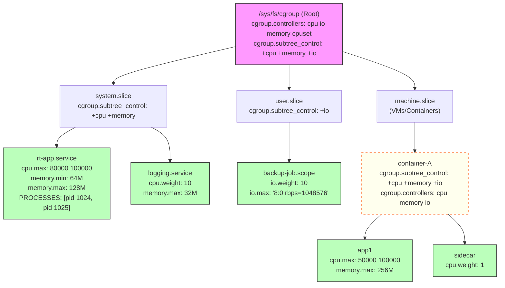

# 8.5.1 cgroups v2架构与资源控制哲学

> 所属：第8章 容器与虚拟化基础 > 8.5 资源隔离：cgroups深度解析
> 难度：[I→E] | 预计阅读时间：35分钟

## 本节导读

当你在一个4核嵌入式设备上同时运行容器化AI推理服务、实时数据采集线程和Web后台时，为什么某个容器的内存泄漏会导致整个系统OOM重启？为什么CPU绑定的日志压缩任务会让控制回路的延迟飙升到不可接受？本节从cgroups的设计哲学出发，深入解析v2统一架构如何解决v1的历史包袱，并为嵌入式场景的资源硬隔离提供决策依据。

---

## 知识点1：为什么需要cgroups [I] ~600字

### 问题场景

在Linux内核早期，进程管理只有两大维度：`fork()`/`exec()` 创建的进程树，以及`uid`/`gid`提供的权限隔离。资源（CPU、内存、IO）对所有进程一视同仁地开放。这在嵌入式多应用共置场景中引发了三个致命问题：

**场景A：资源饥饿（Starvation）**。某第三方库在后台触发内存泄漏，直到触发系统级OOM Killer，选中的是你的实时控制进程而非泄漏者——因为OOM Killer的`oom_score`算法只考虑内存用量比例，不考虑业务优先级。

**场景B：优先级反转的放大**。一个低优先级的批处理任务（如日志压缩）耗尽磁盘带宽，导致高优先级的传感器数据持久化操作阻塞，进而反压到上游采集线程。

**场景C：可见性污染**。`free`命令显示系统剩余2GB内存，但你的进程申请50MB却失败了——因为两个同行的容器已经通过内核缓存和匿名页占走了绝大部分可用内存，而`/proc/meminfo`的全局统计对此毫无感知。

cgroups（Control Groups）的核心使命就是**将资源管理从全局视角转换为组视角**：把一组进程组织成控制组，以组为单位进行资源计量、限制、优先级控制和审计。

### 关键代码路径

cgroups的入口点是`cgroup_init_early()`和`cgroup_init()`，在启动时由`init/main.c`中的`start_kernel()`调用：

```c
// init/main.c
start_kernel()
  ├── cgroup_init_early()   // 早期初始化，设置root cgroup
  └── cgroup_init()         // 注册所有controller，挂载cgroupfs
      └── cgroup_mq_init()  // v2的per-cgroup workqueue初始化
```

进程加入cgroup的关键路径在`kernel/cgroup/cgroup.c`中的`cgroup_attach_task()`：

```c
// kernel/cgroup/cgroup.c
int cgroup_attach_task(struct cgroup *dst_cgrp, struct task_struct *leader,
                       bool threadgroup)
{
    // 1. 验证目标cgroup的权限（ns_capable）
    // 2. 检查进程状态（PF_EXITING的进程不能迁移）
    // 3. 遍历线程组（threadgroup=true时）
    // 4. 对每个task：css_set_migration() 更新 css_set 关联
    // 5. 更新任务的 cgroup_subsys_state 指针数组
    // 6. 同步通知所有关联的 controller（cpuacct、memory等）
}
```

⚠️ **常见陷阱**：`cgroup_attach_task()`会遍历整个线程组（当`threadgroup=true`），这意味着迁移一个拥有100+线程的进程可能在持有`cgroup_mutex`期间产生毫秒级延迟。在实时嵌入式系统中，避免在关键时间窗口迁移重线程进程。

### Trade-off表格

| 方案 | 隔离粒度 | 开销 | 嵌入式适用性 | 关键局限 |
|------|---------|------|------------|---------|
| 无cgroups（纯nice/rlimit） | 进程级 | 最低 | ⚠️ 不适用 | `rlimit`无法限制共享资源（如页缓存）；nice值在CFS下只影响时间片比例，无法硬限制 |
| cgroups v1 | 控制器独立树 | 中 | 可用但有坑 | 层次结构碎片化；controller间协作困难 |
| cgroups v2 | 统一树 | 中 | ✅ 推荐 | 旧版容器工具链兼容性；某些控制器（net_prio）尚未移植 |
| 硬分区（CPU affinity + membind） | 物理隔离 | 高 | 极端场景 | 资源利用率低；NUMA场景下配置复杂 |

---

## 知识点2：cgroups v1 vs v2 [I] ~800字

### 问题场景

v1在2007年随Linux 2.6.24合入主线，解决了"有没有"的问题，但在生产实践中积累了大量设计债务。典型痛点来自一个工业网关项目：你需要同时限制一个Python应用的CPU使用（`cpu`控制器）、内存用量（`memory`控制器），并为其设置IO优先级（`blkio`控制器）。在v1中，这三个控制器各自维护独立的层次结构（hierarchy）：

```
/sys/fs/cgroup/cpu/         <-- CPU控制器独立树
  ├── system.slice/
  └── user.slice/

/sys/fs/cgroup/memory/      <-- memory控制器独立树
  ├── system.slice/
  └── user.slice/

/sys/fs/cgroup/blkio/       <-- blkio控制器独立树
  ├── system.slice/
  └── user.slice/
```

你的进程需要同时属于这三个树中对应的cgroup。管理脚本必须保持三棵树的同步，任何配置不一致（如`memory`树中创建了子组但`cpu`树中遗漏）都会导致资源控制出现盲区。

### 机制深入

v2（Linux 4.5合入，Linux 5.x全面成熟）通过一个根本性的架构决策解决了这个问题：**所有控制器挂载到单一统一层次结构**（Single Unified Hierarchy）。

```
/sys/fs/cgroup/             <-- 唯一的cgroup v2根
  ├── cgroup.subtree_control  <-- 启用控制器："+cpu +memory +io"
  ├── system.slice/
  │   ├── cgroup.subtree_control
  │   └── app.service/
  │       ├── cpu.max           <-- CPU硬/软限制
  │       ├── memory.max        <-- 内存硬限制
  │       └── io.weight         <-- IO权重
  └── user.slice/
```

v2的关键设计改进包括：

**1. 进程位置的单一性**

每个进程在系统中只出现在一个cgroup中（位于统一树的一个节点）。`task->css_set`指向一个`css_set`结构，该结构聚合了所有已启用控制器的`cgroup_subsys_state`指针。对比v1中每个控制器树各自维护`task->cgroups`指针数组的混乱，v2的代码路径清晰得多：

```c
// include/linux/cgroup.h
struct css_set {
    // v2：单一css_set聚合所有subsys的状态
    struct cgroup_subsys_state *subsys[CGROUP_SUBSYS_COUNT];
    struct cgroup *dfl_cgrp;   // v2 default hierarchy中的cgroup
    struct list_head tasks;      // 本css_set关联的所有task
    struct list_head mg_tasks;   // 迁移中的task
    // ...
};
```

**2. 委托模型（Delegation Model）**

v2引入了对命名空间友好的委托机制：父cgroup可以通过`cgroup.subtree_control`决定哪些控制器授权给子树。这允许非特权用户（在user namespace内）安全地管理其子cgroup，而不会干扰父层的资源策略。这对容器嵌套场景至关重要。

**3. 保护边界（Protection Boundary）**

v2区分两类资源控制：
- **保护**（Protection）：`memory.min`、`cpu.uclamp.min`——保证下限，防止系统过度回收
- **限制**（Limit）：`memory.max`、`cpu.max`——设定上限，防止资源耗尽

v1中这种语义是模糊的。例如`memory.limit_in_bytes`既可以是目标也可以是硬墙，取决于`memory.oom_control`的设置，行为不一致。

### 完整对比表格

| 维度 | cgroups v1 | cgroups v2 | 嵌入式影响 |
|------|-----------|-----------|-----------|
| **层次结构** | 每个控制器独立一棵树 | 单一统一树 | v2降低管理复杂度，避免配置漂移 |
| **进程归属** | 同一进程可在不同树中属于不同组 | 每个进程只在一个cgroup中 | v2消除跨树一致性问题 |
| **控制器数量** | 10+（含已废弃的） | 精简为core控制器 | v2去掉`net_cls`/`net_prio`，网络控制改用eBPF |
| **根权限要求** | 需要root才能创建/管理 | 支持user namespace委托 | v2更安全地支持非特权容器 |
| **线程模型** | 进程级（线程共享） | 支持`cgroup.threads`线程级控制 | v2允许精确控制多线程应用的个别线程 |
| **资源模型** | 以限制为主 | 限制+保护双模型 | v2的`memory.min`可保护关键任务的working set |
| **内核接口** | 每个控制器独立文件集 | 统一接口规范 | v2降低自动化工具的开发成本 |
| **eBPF集成** | 无原生支持 | `bpf_cgroup_*`辅助函数 | v2允许自定义资源调度策略 |
| **实时支持** | RT调度器独立实现 | `cpu.rt.max.us`统一在cpu控制器 | v2便于集成SCHED_FIFO任务管理 |

💡 **技巧**：在嵌入式系统中，如果内核版本≥5.2且用户空间工具链支持，应优先选择v2。唯一需要回退到v1的场景是：你依赖的第三方容器运行时（如旧版本Docker）尚未支持v2——此时建议升级工具链而非降级cgroups。

---

## 知识点3：cgroups v2的核心概念 [E] ~1000字

### 问题场景

你已经决定采用cgroups v2，现在需要在项目中实际配置。打开`/sys/fs/cgroup/`看到一堆伪文件，应该如何理解每个文件的语义？`cgroup.procs`和`cgroup.threads`有何区别？`cgroup.subtree_control`和`cgroup.controllers`分别代表什么？本节建立完整的心智模型。

### 核心概念详解

#### 概念一：cgroup（控制组）

cgroup是统一树中的一个节点，表现为一个目录，包含一组接口文件。每个cgroup：
- 属于一棵树（根cgroup或某个子cgroup）
- 包含一组进程（`cgroup.procs`）和可选的线程（`cgroup.threads`）
- 拥有一组启用的控制器接口文件（如`cpu.max`、`memory.current`）

⚠️ **关键陷阱**：v2中，**只有当父cgroup在`cgroup.subtree_control`中启用了某个控制器，子cgroup才会出现该控制器的接口文件**。这是最常见的配置错误来源：

```bash
# 错误示范：直接在子组设置cpu.max，但未在父组启用cpu控制器
$ mkdir /sys/fs/cgroup/myapp
$ echo "50000 100000" > /sys/fs/cgroup/myapp/cpu.max
bash: echo: write error: No such file or directory  # cpu.max文件不存在！

# 正确流程：先启用控制器，再配置限制
$ echo "+cpu" > /sys/fs/cgroup/cgroup.subtree_control
$ mkdir /sys/fs/cgroup/myapp
$ ls /sys/fs/cgroup/myapp/cpu.*  # 现在cpu接口文件已存在
$ echo "50000 100000" > /sys/fs/cgroup/myapp/cpu.max
```

#### 概念二：controller（控制器/子系统）

控制器是内核子系统，负责将cgroups框架的通用操作转化为具体资源控制策略。v2核心控制器及其在嵌入式场景的用途：

| 控制器 | 接口文件示例 | 嵌入式典型用途 | 关键注意点 |
|--------|------------|--------------|-----------|
| **cpu** | `cpu.max`, `cpu.weight`, `cpu.uclamp.min/max` | 限制非实时任务的CPU占用；为关键任务预留算力 | `cpu.max`是硬墙（throttle），`cpu.weight`是CFS相对权重 |
| **memory** | `memory.max`, `memory.min`, `memory.high` | 防止容器OOM导致整机重启；保护关键进程working set | `memory.min`是保护下限，不会被回收 |
| **io** | `io.weight`, `io.max` | 隔离eMMC/NAND上的IO竞争；限制日志写入带宽 | 设备格式为`major:minor`；需配合BFQ/_mq-deadline |
| **cpuset** | `cpuset.cpus`, `cpuset.mems` | 绑定任务到指定CPU核心；NUMA感知调度 | 嵌入式多核常用；注意`cpuset.cpus.partition` |
| **pid** | `pids.max` | 防止fork炸弹拖垮系统 | 简单有效；建议所有容器都设置 |
| **rdma** | `rdma.max` | 限制RDMA设备HCA资源 | 高端嵌入式网络设备场景 |
| **perf_event** | `perf_event.active` | 允许/禁止性能事件监控 | 安全审计相关 |
| **hugetlb** | `hugetlb.2MB.max` | 限制大页内存分配 | 配合DPDK/AI推理框架 |
| **misc** | `misc.max` | 控制对misc设备的访问 | 特定加速器设备 |

🔴 **安全提醒**：**`devices`控制器在v2中被移除**，代之以eBPF程序（`BPF_CGROUP_DEVICE` hook）或特权检查。如果你从v1迁移依赖`devices.allow/deny`的安全策略，必须重新实现为eBPF程序。这是v1→v2迁移中最容易被遗漏的安全缺口。

#### 概念三：hierarchy（层次结构）——统一树模型

v2的统一树有以下关键规则：

**规则1：进程只能在一个叶子节点**

一个进程不能同时存在于两个同级cgroup中。迁移操作是原子的：写入目标`cgroup.procs`时，进程从源cgroup自动移除。

**规则2：子cgroup的资源受父cgroup约束**

子cgroup的`memory.max`不能超过父cgroup的`memory.max`。这是自然的树形约束，但在v1中由于多棵树的存在，这种约束是松散的。

**规则3："no internal tasks"规则**

🔴 **这是v2最容易被忽视的规则**：如果一个cgroup启用了任何控制器（即`cgroup.subtree_control`非空），则**该cgroup不能包含进程**——进程只能存放在叶子cgroup中。这一规则保证了资源统计的清晰性：父层负责控制器管理，叶子层负责承载实际工作负载。

```bash
# 演示"no internal tasks"规则
$ mkdir /sys/fs/cgroup/parent
$ echo "+cpu +memory" > /sys/fs/cgroup/parent/cgroup.subtree_control
$ echo $$ > /sys/fs/cgroup/parent/cgroup.procs
bash: echo: write error: Device or resource busy  # 失败！parent已启用控制器

$ mkdir /sys/fs/cgroup/parent/leaf
$ echo $$ > /sys/fs/cgroup/parent/leaf/cgroup.procs  # 成功，叶子节点可承载进程
```

### cgroups v2 层次架构图



💡 **图示解读**：粉色节点为内部节点（只能管理控制器，不能直接放进程）；绿色节点为叶子节点（承载实际进程）；黄色虚线框展示了容器嵌套委托的能力——父容器将控制器权限下传给子树。

### 关键代码路径

cgroups v2的读写接口通过cgroup文件系统（`cgroup2_fs_type`）暴露。当用户空间写入`cpu.max`时，完整路径如下：

```
sysfs/write(cpu.max)
  └── cgroup_file_write()
      ├── kernfs_fop_write()
      │   └── cgroup_file_write()
      │       ├── cft->write()  // cgroup_base_files或controller-specific
      │       └── cpu_cfs_quota_write()  // cpu控制器处理函数
      │           ├── sched_group_set_quota()
      │           └── update_rq_clock() + resched
```

这个写入操作最终会修改`task_group`的CFS quota参数，并在下一个调度tick生效。

---

## 实践案例：工业网关的资源硬隔离

**场景**：ARM64四核工业网关，运行以下工作负载：
- **PLC通信服务**（SCHED_FIFO，必须保证1ms响应）
- **AI异常检测容器**（TensorFlow Lite，CPU密集型，可限制）
- **日志收集服务**（后台IO，低优先级）
- **系统守护进程**（sshd、systemd等）

**配置脚本**：

```bash
#!/bin/bash
# /usr/local/bin/setup-cgroups.sh
# 在systemd-less的嵌入式系统上直接配置cgroups v2

CGROUP_ROOT="/sys/fs/cgroup"

# 1. 确保v2挂载（如果尚未通过/etc/fstab或init脚本挂载）
if ! mountpoint -q "$CGROUP_ROOT"; then
    mount -t cgroup2 none "$CGROUP_ROOT"
fi

# 2. 根节点启用所需控制器
echo "+cpu +memory +io +cpuset" > "$CGROUP_ROOT/cgroup.subtree_control"

# 3. 创建隔离组
mkdir -p "$CGROUP_ROOT/system"
mkdir -p "$CGROUP_ROOT/plc"
mkdir -p "$CGROUP_ROOT/ai-inference"
mkdir -p "$CGROUP_ROOT/logging"

# 4. 配置PLC通信服务（硬隔离+CPU亲和性）
echo "+cpu +cpuset" > "$CGROUP_ROOT/plc/cgroup.subtree_control"
mkdir -p "$CGROUP_ROOT/plc/worker"
echo "1-2" > "$CGROUP_ROOT/plc/worker/cpuset.cpus"       # 绑定到CPU1-2
echo "0" > "$CGROUP_ROOT/plc/worker/cpuset.mems"
echo "max 100000" > "$CGROUP_ROOT/plc/worker/cpu.max"    # 不设上限，但纳入统计
# 将PLC服务迁移至此（假设PID从systemd或supervisor获取）
echo $(pgrep -x plc-bridge) > "$CGROUP_ROOT/plc/worker/cgroup.procs"

# 5. 配置AI推理容器（严格CPU限制+内存上限）
echo "+cpu +memory" > "$CGROUP_ROOT/ai-inference/cgroup.subtree_control"
mkdir -p "$CGROUP_ROOT/ai-inference/container"
echo "50000 100000" > "$CGROUP_ROOT/ai-inference/container/cpu.max"  # 50% CPU硬限制
echo "200M" > "$CGROUP_ROOT/ai-inference/container/memory.max"        # 200MB内存硬墙
echo "150M" > "$CGROUP_ROOT/ai-inference/container/memory.high"       # 提前触发回收
# 假设容器init PID为1500
echo 1500 > "$CGROUP_ROOT/ai-inference/container/cgroup.procs"

# 6. 配置日志服务（IO带宽限制）
echo "+io" > "$CGROUP_ROOT/logging/cgroup.subtree_control"
mkdir -p "$CGROUP_ROOT/logging/worker"
# 限制eMMC(179:0)写入带宽为2MB/s，读取为5MB/s
echo "179:0 wbps=2097152 rbps=5242880" > "$CGROUP_ROOT/logging/worker/io.max"
echo $(pgrep -x log-collector) > "$CGROUP_ROOT/logging/worker/cgroup.procs"

echo "cgroups v2 configured successfully"
```

**验证要点**：

```bash
# 检查控制器是否生效
$ cat /sys/fs/cgroup/ai-inference/container/cpu.stat
usage_usec 1234567
user_usec 987654
system_usec 246913
nr_periods 100
nr_throttled 15          # <- 被限制的次数
throttled_usec 150000    # <- 被限制的时间

# 检查内存当前使用
$ cat /sys/fs/cgroup/ai-inference/container/memory.current
134217728

# 检查进程归属
$ cat /sys/fs/cgroup/ai-inference/container/cgroup.procs
1500
1501
1523
```

---

## 本节总结

cgroups v2通过**统一层次结构**这一根本性架构决策，消除了v1多棵树的管理碎片化问题。三个核心概念构成了理解v2的基础：

1. **cgroup**是统一树中的节点，承载进程；内部节点（启用了控制器的节点）遵守"no internal tasks"规则，只能委托给子节点
2. **controller**是实现具体资源控制的子系统，通过`cgroup.subtree_control`显式启用，实现了细粒度的权限委托
3. **hierarchy**的单一树结构保证了进程位置的确定性，消除了跨树一致性问题

对于嵌入式工程师，关键决策是：**内核≥5.2时无条件使用v2**；迁移的最大障碍不是技术而是工具链兼容性（容器运行时、监控agent）。v2的保护模型（`memory.min`、`cpu.uclamp.min`）特别适合需要"保证关键任务资源下限"的嵌入式场景。

---

## 配套资源

### 表格清单

| 表格编号 | 标题 | 所在位置 |
|---------|------|---------|
| 表1 | 资源隔离方案Trade-off对比 | 知识点1-Trade-off |
| 表2 | cgroups v1 vs v2 完整对比 | 知识点2-完整对比表格 |
| 表3 | v2核心控制器清单 | 知识点3-controller表格 |

### 图示清单（mermaid代码）

| 图编号 | 标题 | 类型 |
|-------|------|------|
| 图1 | cgroups v2 统一层次架构图 | 树形图（含根节点、内部节点、叶子节点、控制器委托关系） |

### 代码清单

| 代码编号 | 标题 | 类型 |
|---------|------|------|
| 代码1 | `cgroup_attach_task()`关键路径 | 内核源码注释（kernel/cgroup/cgroup.c） |
| 代码2 | `css_set`数据结构 | 内核源码（include/linux/cgroup.h） |
| 代码3 | v2控制器启用与配置命令 | 命令行示例（bash） |
| 代码4 | 工业网关cgroups v2完整配置脚本 | 实践案例脚本 |

### 延伸阅读

- [Step 8/60] Kernel文档：`Documentation/admin-guide/cgroup-v2.rst`
- [Step 9/60] `tools/cgroup/cgroup_stats.c` — 内核源码树中的cgroups统计示例程序
- [Step 10/60] systemd.resource-control(5) man page — systemd对v2接口的封装映射
