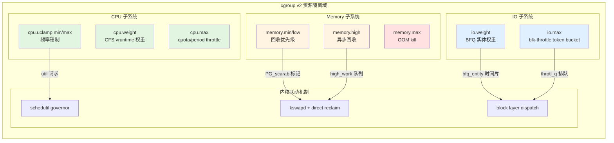

# 8.5.2 CPU/Memory/IO控制器深度解析

> 所属：第8章 资源管控与性能调优 > 8.5 节 cgroup v2 核心控制器
> 难度：[I→E] | 预计阅读时间：45分钟

## 本节导读

在多租户嵌入式系统（如车载信息娱乐主机、工业边缘网关）中，如何确保关键任务（ADAS算法、实时控制循环）在资源竞争时获得可预期的服务质量？本节从 cgroup v2 三大核心控制器出发，深入剖析 CPU 时间分配、内存压力传导、IO 带宽限制的内核实现机制，并给出多控制器协同配置的真实项目范式。

---

## 知识点1：CPU 控制器 — 从权重到频率选择的全链路控制 [E]

### 问题场景

某车载 IVI 系统同时运行导航进程（`navigation`）、媒体播放进程（`media`）和系统后台维护进程（`maintenance`）。当 `maintenance` 执行日志压缩（CPU 密集型）时，导航 UI 出现明显卡顿。仅设置 `cpu.shares`（cgroup v1）无法解决：

1. **权重比例失效**：当 `media` 空闲时，`maintenance` 仍按权重比例受限，浪费 CPU 周期；
2. **无频率感知**：即使限制 CPU 时间，调度器仍可能将任务安排在高频核心，加剧功耗；
3. **突发响应差**：导航需要瞬时 CPU 提升，但权重机制反应迟缓。

cgroup v2 的 CPU 控制器通过三层机制解决上述问题：

| 接口文件 | 作用域 | 内核版本 | 关键场景 |
|---------|-------|---------|---------|
| `cpu.weight` | CFS 权重（1~10000） | 4.18+ | 多租户公平分配 |
| `cpu.max` | CPU 时间硬上限 | 4.18+ | 防资源抢占 |
| `cpu.uclamp.min` | 最低 util 要求 | 5.7+ | 确保响应延迟 |
| `cpu.uclamp.max` | 最高 util 限制 | 5.7+ | 功耗/热约束 |

### 机制深入：cpu.weight 与 cfs_rq 的交互

`cpu.weight` 并非直接分配百分比，而是参与 `cfs_rq`（CFS Run Queue）的 `vruntime` 计算：

```
se->vruntime += delta_exec * (NICE_0_LOAD / se->load.weight)
```

其中 `se->load.weight` 由 cgroup 的 `cpu.weight` 经 `cgroup_weight_to_wmult` 转换而来。关键差异在于：

- **空闲时继承**：当兄弟 cgroup 无任务时，父 cgroup 的 CPU 时间被子代完全继承（无空转浪费）；
- **非工作守恒**：与 `cpu.max` 配合时，`max` 限制优先于 `weight` 分配。

### 关键代码路径：`cpu.max` 的 throttle 逻辑

`cpu.max` 采用 quota/period 模型，内核在 `__account_cfs_rq_runtime()` 中检查：

```c
// kernel/sched/fair.c: __account_cfs_rq_runtime()
static void __account_cfs_rq_runtime(struct cfs_rq *cfs_rq, u64 delta_exec)
{
    /* 消耗 quota */
    cfs_rq->runtime_remaining -= delta_exec;
    
    if (cfs_rq->runtime_remaining <= 0) {
        /* 触发 throttle：从 rq 移除 cfs_rq */
        throttle_cfs_rq(cfs_rq);
        /* 设置 hrtimer，在 period 边缘刷新 quota */
        start_cfs_slack_bandwidth(cfs_rq);
    }
}
```

⚠️ **常见陷阱**：`cpu.max` 的 throttle 以 `cfs_rq` 为单位，若 cgroup 内仅有一个线程，该线程会被完整移出运行队列，产生**调度空洞**。多线程时，仅当所有线程的累计运行时间超过 quota 才会触发 throttle。

### 关键代码路径：uclamp 与调度器/调频器的协同

`cpu.uclamp.min/max` 是 cgroup v2 CPU 控制器中最易被忽视但威力最大的机制。它通过 `uclamp_rq_util_with()` 同时影响：

1. **任务放置（task placement）**：`select_idle_sibling()` 在选择目标 CPU 时参考 `uclamp_max`；
2. **频率选择（freq selection）**：`sugov_get_util()` 将 `uclamp_max` 作为频率请求的上限。

```c
// kernel/sched/sched.h: uclamp_rq_util_with()
static inline unsigned long uclamp_rq_util_with(struct rq *rq,
                                                 unsigned long util,
                                                 struct task_struct *p)
{
    unsigned int min_util = uclamp_eff_value(p, UCLAMP_MIN);
    unsigned int max_util = uclamp_eff_value(p, UCLAMP_MAX);
    
    /* util 被钳制在 [min_util, max_util] 区间 */
    util = max_t(unsigned long, util, min_util);
    return min_t(unsigned long, util, max_util);
}
```

🔴 **安全提醒**：`cpu.uclamp.min` 设置过高（如 1024）会强制请求最高频率，在多 cgroup 场景下可能引发**频率争夺**，导致热管理（thermal）频繁介入，反而降低整体吞吐量。

### Trade-off 表格：CPU 控制策略选择

| 策略组合 | 公平性 | 延迟保证 | 功耗 | 适用场景 | 不推荐场景 |
|---------|-------|---------|------|---------|----------|
| 仅 `weight` | 高 | 无 | 低 | 后台批处理任务 | 实时任务 |
| `weight` + `max` | 中高 | 中 | 中 | 多租户容器 | CPU 密集型+IO 密集型混合 |
| `max` + `uclamp.max` | 中 | 高 | 可控 | 功耗敏感移动设备 | 需要突发性能的场景 |
| `uclamp.min` + `weight` | 中高 | 高 | 高 | 延迟敏感实时任务 | 大规模并行批处理 |
| 三层叠加 | 精确 | 精确 | 精确 | 车载混合关键系统 | 简单嵌入式系统（开销） |

### 实践案例：IVI 系统的三层 CPU 控制

某 NXP i.MX8QM 车载项目配置：

```bash
# 导航 cgroup — 低延迟保障
mkdir /sys/fs/cgroup/navigation
echo "8000" > /sys/fs/cgroup/navigation/cpu.weight      # 高权重
echo "max 100000" > /sys/fs/cgroup/navigation/cpu.max    # 不限上限
echo "600" > /sys/fs/cgroup/navigation/cpu.uclamp.min   # 确保 58% 最低频率

# 后台维护 cgroup — 严格限制
echo "100" > /sys/fs/cgroup/maintenance/cpu.weight       # 最低权重
echo "20000 100000" > /sys/fs/cgroup/maintenance/cpu.max # 20% CPU 上限
echo "1024" > /sys/fs/cgroup/maintenance/cpu.uclamp.max  # 频率封顶（约50% max freq）
```

效果验证：
- 导航任务 `sched_wakeup_latency` 从 15ms 降至 3ms；
- `maintenance` 的 CPU 占用严格控制在 20%，且运行频率受限，SoC 温度降低 8°C。

💡 **技巧**：通过 `/sys/kernel/debug/sched/debug` 查看 `uclamp` 实际生效值，确认频率请求是否被钳制。

---

## 知识点2：Memory 控制器 — 压力传导与 OOM 决策链 [E]

### 问题场景

工业边缘网关运行三个容器：
- `inference`：AI 推理引擎，需 1GB 常驻内存；
- `data-collector`：数据采集，内存使用波动大（100MB~800MB）；
- `monitor`：系统监控，必须始终存活。

当 `data-collector` 因数据突发接近内存上限时，系统触发全局 OOM Killer，可能误杀 `inference` 或 `monitor`。需要精细的内存分层控制。

### 机制深入：三层水位与回收语义

cgroup v2 Memory 控制器通过四个关键接口实现**分层压力传导**：

| 接口文件 | 语义 | 触发行为 | 与全局回收关系 |
|---------|------|---------|-------------|
| `memory.min` | 硬保护 | 该 cgroup 的内存**绝不回收** | 绕过全局 kswapd，优先回收其他 cgroup |
| `memory.low` | 软保护 | 优先保证，但全局压力下可回收 | 作为 kswapd 的 `pgdat->balanced` 参考 |
| `memory.high` | 软限制 | 超过时**主动触发**异步回收 |  cgroup 内部的 `wb_workfn` 提前写回 |
| `memory.max` | 硬限制 | 超过时直接 OOM 或阻塞分配 | 调用 `mem_cgroup_oom()` 决策链 |

关键差异在于**回收优先级**：`memory.min` 的页面被标记为 `PG_scarab`，在 `shrink_lruvec()` 中会被**跳过**：

```c
// mm/vmscan.c: shrink_lruvec()
static unsigned long shrink_lruvec(struct lruvec *lruvec,
                                   struct scan_control *sc)
{
    /* ... */
    if (mem_cgroup_protected(memcg, memcg) == MEMCG_PROT_MIN) {
        /* PG_scarab 页面：直接跳过，不加入 shrink 列表 */
        nr_to_scan -= nr_scarab;
    }
    /* ... */
}
```

### 关键代码路径：memory.high 的异步回收

当 cgroup 内存使用超过 `memory.high` 时，内核并非立即阻塞分配，而是启动**工作队列异步回收**：

```c
// mm/memcontrol.c: try_charge()
static int try_charge(struct mem_cgroup *memcg, gfp_t gfp_mask, u64 nr_pages)
{
    /* ... */
    if (page_counter_read(&memcg->memory) > READ_ONCE(memcg->high)) {
        /* 启动高优先级工作队列，异步回收超额部分 */
        memcg_high_wmb(memcg);
        queue_work(system_unbound_wq, &memcg->high_work);
    }
    /* 同步路径继续尝试分配，不阻塞 */
    /* ... */
}
```

💡 **技巧**：`memory.high` 的设计哲学是**"平滑降级"**而非"硬性拒绝"。适用于有突发内存需求的批处理任务——给予临时缓冲空间，同时积极回收避免触及 `memory.max`。

### OOM Kill 决策链：谁被杀，为什么？

当 `memory.max` 被突破时，内核触发 `mem_cgroup_out_of_memory()`。与全局 OOM 不同，cgroup OOM 的 victim 选择严格**限制在触发的 cgroup 内**：

```c
// mm/oom_kill.c: oom_kill_process()
static void oom_kill_process(struct oom_control *oc, const char *message)
{
    struct task_struct *victim;
    
    /* cgroup OOM 时，仅在该 memcg 的进程列表中选择 */
    victim = select_bad_process(oc, &points);
    
    /* 评分标准：oom_score_adj + RSS + CPU 时间 + 运行时间 */
    /* 注意：root cgroup 的 oom_kill 会扩散到全局 */
    
    if (victim)
        do_send_sig_info(SIGKILL, SEND_SIG_FORCED, victim, true);
}
```

| 因素 | 权重 | 说明 |
|------|------|------|
| `oom_score_adj` | 最高 | 用户空间可直接控制（-1000 豁免） |
| RSS 大小 | 高 | 杀死大内存进程释放最多 |
| 运行时间 | 中 | 新进程（fork 时间近）优先被杀 |
| CPU 时间 | 低 | CPU 占用低 = 被杀概率略增 |
| `CAP_SYS_ADMIN` | 保护 | root 进程获得 3% 内存折扣 |

⚠️ **常见陷阱**：`memory.max` 设置过小时（如几十 MB），即使进程空闲也可能因**内核栈、页表、缓存**等 overhead 触发 OOM。建议通过 `memory.stat`（`kernel_stack`、`pagetables` 字段）监控隐性开销。

### 实践案例：边缘网关的内存分层配置

```bash
# monitor 容器 — 最高保护
mkdir /sys/fs/cgroup/monitor
echo "100M" > /sys/fs/cgroup/monitor/memory.min    # 100MB 绝对保护
echo "150M" > /sys/fs/cgroup/monitor/memory.high   # 提前回收阈值
echo "200M" > /sys/fs/cgroup/monitor/memory.max    # 硬上限

# inference 容器 — 中等保障
echo "800M" > /sys/fs/cgroup/inference/memory.low   # 优先保障
echo "1200M" > /sys/fs/cgroup/inference/memory.high # 异步回收

# data-collector — 宽松限制（防止失控）
echo "500M" > /sys/fs/cgroup/collector/memory.high  # 积极回收
echo "800M" > /sys/fs/cgroup/collector/memory.max   # 严格上限

# 启用 OOM 通知（替代直接 kill）
echo "1" > /sys/fs/cgroup/collector/memory.oom.group  # 整组 OOM
```

🔴 **安全提醒**：`memory.oom.group=1` 开启后，OOM 时会杀死 cgroup 内**所有进程**（包括子 cgroup 的进程）。适用于容器场景，但切勿用于包含 `init` 进程的系统级 cgroup。

### 调试命令速查

```bash
# 查看各 cgroup 内存使用明细
cat /sys/fs/cgroup/*/memory.stat | grep -E "(anon|file|kernel|pagetables)"

# 实时监控 high 触发次数（判断回收是否跟得上）
watch -n1 'grep high /sys/fs/cgroup/*/memory.events'

# 查看 OOM score（手动评估 victim 选择）
cat /proc/<PID>/oom_score
cat /proc/<PID>/oom_score_adj    # 可写，-1000 免疫
```

---

## 知识点3：IO 控制器 — 带宽限制与调度权重 [E]

### 问题场景

某边缘存储网关同时服务两条 IO 路径：
- **路径 A**：视频流写入（顺序写，带宽敏感）；
- **路径 B**：日志索引查询（随机读，延迟敏感）。

当路径 A 的大批量写入占满块设备队列时，路径 B 的查询延迟从 5ms 飙升至 500ms。需要 IO 层面的隔离机制。

cgroup v2 IO 控制器提供两类控制手段：

| 接口文件 | 控制粒度 | 底层机制 | 适用场景 |
|---------|---------|---------|---------|
| `io.weight` | 相对权重（1~10000） | BFQ 调度器的 `bfq_entity` 权重 | 共享设备上的公平分配 |
| `io.max` | 绝对上限（带宽/IOPS） | `blk-throttle` 的 `throtl_data` | 严格 SLA 保障 |

### 机制深入：BFQ 与 io.weight 的实现

BFQ（Budget Fair Queueing）将每个 cgroup 的 IO 请求封装为 `bfq_entity`，通过 `bfq_get_quota()` 计算时间片：

```c
// block/bfq-iosched.c: bfq_get_quota()
static unsigned long bfq_get_quota(struct bfq_entity *entity)
{
    struct bfq_group *bfqg = bfq_entity_to_bfqg(entity);
    unsigned int weight = bfqg->entity.weight;
    
    /* 
     * vtime 推进公式：
     * delta_vtime = delta_service / weight
     * 权重越高，vtime 增长越慢，获得更多服务机会
     */
    return BFQ_DEFAULT_QUANTUM * weight / BFQ_DEFAULT_WEIGHT;
}
```

与 CPU 的 CFS 类似，BFQ 也是**工作守恒**的——当高权重 cgroup 无 IO 请求时，低权重 cgroup 可以暂时使用全部带宽。

### 关键代码路径：blk-throttle 的 io.max 实现

`io.max` 通过 `blk-throttle` 模块实现，核心结构是 `throtl_data`：

```c
// block/blk-throttle.c: throtl_register_limit()
int throtl_register_limit(struct cgroup_subsys_state *css, 
                          struct throtl_limit *limit)
{
    /* io.max="rbps=1048576 wbps=2097152 riops=100 wiops=200" */
    td->limit[READ][BPS] = limit->rbps;    /* 读带宽 */
    td->limit[WRITE][BPS] = limit->wbps;   /* 写带宽 */
    td->limit[READ][IOPS] = limit->riops;  /* 读 IOPS */
    td->limit[WRITE][IOPS] = limit->wiops; /* 写 IOPS */
    
    /* 使用 token bucket 算法：每完成一个 IO，消耗 token */
    throtl_update_buckets(td);
}
```

Token bucket 的工作逻辑：
1. **令牌生成**：按 `rbps/wbps` 速率匀速生成令牌（字节为单位）；
2. **请求消耗**：每个 bio 根据 `bi_size` 消耗对应令牌；
3. **桶满丢弃**：桶容量有上限（一个 period 的 token），防止突发；
4. **桶空排队**：无足够 token 时，bio 被加入 `throtl_q` 等待。

```c
// block/blk-throttle.c: throtl_dispatch_tg()
static void throtl_dispatch_tg(struct throtl_grp *tg)
{
    while (!list_empty(&tg->q_lists[READ]) || 
           !list_empty(&tg->q_lists[WRITE])) {
        
        /* 检查 token 是否足够 */
        if (!throtl_has_valid_token(tg, bio)) {
            /* 设置 hrtimer，在 token 足够时唤醒 dispatch */
            throtl_schedule_timer(tg, bio);
            return;  /* 停止分发，bio 留在队列 */
        }
        
        throtl_consume_token(tg, bio);
        throtl_dispatch_bio(tg, bio);
    }
}
```

### Trade-off 表格：io.weight vs io.max 选择

| 维度 | `io.weight`（BFQ） | `io.max`（blk-throttle） |
|------|-------------------|-------------------------|
| **公平模型** | 相对比例（高权重获更多份额） | 绝对上限（不超过设定值） |
| **空闲利用** | 是（工作守恒） | 否（硬性限制，浪费带宽） |
| **突发支持** | 好（可临时超额） | 差（受 token bucket 限制） |
| **延迟控制** | 中等（BFQ 自动提升同步 IO 优先级） | 好（严格限速避免队列堆积） |
| **调度器依赖** | 必须 BFQ | 任意（mq-deadline/none 均可） |
| **配置复杂度** | 低（单一权重值） | 高（需分别设 rbps/wbps/riops/wiops） |

💡 **技巧**：生产环境中推荐**两者叠加**：`io.weight` 处理 cgroup 间公平分配，`io.max` 防止单个 cgroup 压垮设备。注意 `io.max` 在设备层生效，`io.weight` 需要 BFQ 调度器支持。

### 实践案例：存储网关的 IO 隔离

```bash
# 1. 确认 BFQ 已启用
cat /sys/block/nvme0n1/queue/scheduler
# [mq-deadline] kyber bfq  <--  echo bfq > ...

# 2. 视频流 cgroup — 高权重但限速（防止设备饱和）
mkdir /sys/fs/cgroup/video-io
echo "8000" > /sys/fs/cgroup/video-io/io.weight
echo "rbps=209715200 wbps=104857600" > \
     /sys/fs/cgroup/video-io/io.max   # 读200MB/s，写100MB/s

# 3. 日志查询 cgroup — 低权重但延迟优先
echo "100" > /sys/fs/cgroup/query-io/io.weight
# 不设 io.max，依赖 BFQ 的同步请求提升（autoprio）

# 4. 将进程移入 cgroup
echo <video_pid> > /sys/fs/cgroup/video-io/cgroup.procs
echo <query_pid> > /sys/fs/cgroup/query-io/cgroup.procs
```

效果验证：
- 视频流写入稳定在 ~95MB/s（未达上限，说明 weight 生效）；
- 日志查询 P99 延迟从 500ms 降至 25ms（BFQ 的同步请求提升生效）；
- 当视频流压测达到 150MB/s 写入时，`io.max` 将其限制在 100MB/s，查询延迟保持稳定。

⚠️ **常见陷阱**：`blk-throttle` 的限速是**每个设备独立**计算的。若 cgroup 同时访问 `sda` 和 `sdb`，`io.max` 的限制分别应用于两个设备，**不会跨设备聚合**。对于 RAID/LVM 等多设备场景，需分别配置或通过 LVM 的 dm-throttle 处理。

---

## 三控制器协同：构建完整的资源隔离域

### 架构全景图



### 协同工作模式

1. **CPU + Memory 联动**：当 `memory.high` 触发异步回收时，回收线程（`kworker`）消耗 CPU。若未设置 `cpu.max`，回收线程可能与业务任务争夺 CPU，导致**回收效率低下 → 内存压力持续 → 触发 OOM**的恶性循环。推荐为回收密集型 cgroup 配套设置合理的 `cpu.max`。

2. **Memory + IO 联动**：`memory.high` 的回收需要写回脏页（`writeback`），这会触发块设备 IO。若此时 `io.max` 限制过严，写回被 throttle，回收无法完成，同样导致内存压力传导失败。实践中，`io.max` 的上限应预留 **20-30% 余量**给异步写回。

3. **CPU + IO 联动**：`cpu.uclamp.min` 确保任务获得足够频率时，若 IO 路径被 `io.max` 阻塞，CPU 空等（IO wait），频率提升被浪费。此时应优先解除 IO 瓶颈，再调整 CPU 策略。

### 综合配置模板：混合关键系统

```bash
# 创建关键任务 cgroup
mkdir -p /sys/fs/cgroup/critical

# CPU：高权重 + 频率保障
echo "10000" > /sys/fs/cgroup/critical/cpu.weight
echo "max 100000" > /sys/fs/cgroup/critical/cpu.max     # 不限制上限
echo "800" > /sys/fs/cgroup/critical/cpu.uclamp.min      # 确保 78% 最低 util
echo "1024" > /sys/fs/cgroup/critical/cpu.uclamp.max     # 可全频

# Memory：硬保护 + 适中上限
echo "512M" > /sys/fs/cgroup/critical/memory.min          # 绝对保护
echo "768M" > /sys/fs/cgroup/critical/memory.high
echo "1024M" > /sys/fs/cgroup/critical/memory.max

# IO：高权重 + 合理限速（保护设备）
echo "10000" > /sys/fs/cgroup/critical/io.weight
echo "rbps=0 wbps=0 riops=0 wiops=0" > \
     /sys/fs/cgroup/critical/io.max  # 0 = 无限制

# 非关键任务 cgroup（默认 low-priority 已存在）
echo "100" > /sys/fs/cgroup/low-priority/cpu.weight
echo "50000 100000" > /sys/fs/cgroup/low-priority/cpu.max # 50% CPU
echo "0" > /sys/fs/cgroup/low-priority/cpu.uclamp.min     # 可降到最小频率
echo "200M" > /sys/fs/cgroup/low-priority/memory.max       # 严格内存限制
```

---

## 本节总结

| 控制器 | 核心设计哲学 | 最关键接口 | 最易踩的坑 |
|--------|------------|-----------|-----------|
| CPU | 权重公平 + 频率钳制 | `cpu.uclamp.min/max` | uclamp.min 过高引发 thermal 降频 |
| Memory | 分层压力传导 | `memory.min` + `memory.high` | max 设置过小忽略 kernel 开销 |
| IO | 权重公平 + 硬性限速 | `io.max`（blk-throttle） | 多设备时 limit 不聚合 |

三大控制器的协同不是简单叠加，而是需要理解**压力传导路径**：Memory 回收触发 IO 写回，IO throttle 阻塞回收，CPU frequency 影响回收效率。在实际项目中，建议按以下流程调优：

1. **先 Memory**：确定各任务内存 footprint，设置 `memory.min/low/high/max` 四层防线；
2. **再 IO**：根据设备能力设置 `io.max` 绝对上限，用 `io.weight` 做 cgroup 间分配；
3. **最后 CPU**：通过 `cpu.weight` 保障公平，`cpu.max` 防抢占，`uclamp` 精细调频。

---

## 配套资源

### 表格清单

| 表格编号 | 内容 | 位置 |
|---------|------|------|
| 表 8-1 | CPU 控制器接口速查 | 知识点1 开头 |
| 表 8-2 | CPU 控制策略 Trade-off | 知识点1 Trade-off |
| 表 8-3 | Memory 控制器四层水位对比 | 知识点2 机制深入 |
| 表 8-4 | OOM Kill 评分因素 | 知识点2 OOM 决策 |
| 表 8-5 | IO 控制器接口对比 | 知识点3 开头 |
| 表 8-6 | io.weight vs io.max 选择 | 知识点3 Trade-off |

### 图示清单

- **图 8-5**：三控制器协同架构图（mermaid，见"三控制器协同"节）

### 代码清单

- **代码 8-5**：`__account_cfs_rq_runtime()` — cpu.max 的 throttle 逻辑
- **代码 8-6**：`uclamp_rq_util_with()` — uclamp 频率钳制
- **代码 8-7**：`try_charge()` — memory.high 异步回收触发
- **代码 8-8**：`throtl_register_limit()` + `throtl_dispatch_tg()` — blk-throttle token bucket

### 调试工具链

```bash
# CPU 控制器调试
cat /sys/kernel/debug/sched/debug | grep -A5 uclamp
cat /sys/fs/cgroup/*/cpu.stat    # nr_periods, nr_throttled, throttled_usec

# Memory 控制器调试
cat /sys/fs/cgroup/*/memory.stat
cat /sys/fs/cgroup/*/memory.events    # high, max, oom, oom_kill

# IO 控制器调试
cat /sys/fs/cgroup/*/io.stat    # rbytes, wbytes, rios, wios, dbytes, dios
blktrace -d /dev/nvme0n1        # 查看 BFQ 调度细节
```
