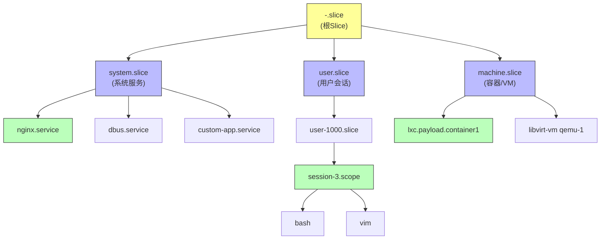

# 8.5.3 systemd与cgroups v2的集成

> 所属：第8章 进程、线程与调度管理 > 8.5 节 cgroups与资源控制
> 难度：[I→E] | 预计阅读时间：25分钟

## 本节导读

在嵌入式系统中，cgroups v2 提供了强大的资源隔离能力，但手写 cgroup 层级既繁琐又容易出错。systemd 作为现代 Linux 发行版的 PID 1，将 cgroup 管理深度集成到了 unit 模型中。本节从 systemd 的三层资源架构出发，深入分析其如何将 slice-unit-scope 语义映射到 cgroups v2 的层级树，揭示 `systemctl set-property` 背后的 D-Bus 调用与内核接口交互路径，帮助工程师在实际项目中做出合理的资源控制决策。

## 知识点1：systemd的slice-unit-scope层次 [I] ~800字

### 问题场景

想象一个典型的嵌入式网关设备：同时运行 Web 管理服务、数据采集进程、容器化的第三方应用以及用户的 SSH 会话。你需要确保：

- 容器应用崩溃不会耗尽全部内存，导致系统管理服务被 OOM killer 杀掉
- 用户的交互式会话不会抢占关键数据采集的 CPU 时间
- 整体资源分配有清晰的边界和可预测的层次

传统 cgroups v1 的做法是为每个子系统创建独立层级，手动将进程 PID 写入 `tasks` 文件。cgroups v2 统一了层级，但管理复杂度不降反升。systemd 的 slice-unit-scope 模型正是为解决这个问题而设计的。

### 机制深入

systemd 将资源控制抽象为三层实体：**slice**、**scope** 和 **service**，分别对应不同的生命周期管理和资源边界语义。

| 实体类型 | 文件扩展名 | 生命周期控制者 | 典型用途 | cgroups v2 映射 |
|---------|----------|-------------|---------|--------------|
| **slice** | `.slice` | 系统管理员 / PID 1 | 资源配额容器，用于分组 | 内部非叶子节点 |
| **service** | `.service` | systemd | 守护进程，fork-on-start | 叶子节点（含进程） |
| **scope** | `.scope` | 外部进程（如 logind） | 外部创建进程组 | 叶子节点（含进程） |

**Slice 的层次结构** 是 systemd 资源管理的核心创新。它模拟了文件系统目录的层次化组织：



**核心设计原则**：

1. **Slice 只分组，不直接包含进程**。`.slice` unit 在 cgroup 树中对应内部节点，其 `cgroup.procs` 为空。资源限制施加在 slice 上时，通过 cgroups v2 的递归统计（`memory.current` 等）和权重机制（`cpu.weight`）影响子树。

2. **Service 和 Scope 是叶子节点**。它们包含实际的进程。`.service` 由 systemd 根据 unit 文件 `fork()` 创建；`.scope` 则用于已经在运行的进程组（如 systemd-logind 将用户会话放入 `session-X.scope`）。

3. **层次命名即 cgroup 路径**。名为 `foo-bar-baz.slice` 的 unit 对应 cgroup 路径 `/sys/fs/cgroup/foo.slice/foo-bar.slice/foo-bar-baz.slice`。连字符 `-` 被解析为路径分隔符。

### 关键代码路径

systemd 在启动阶段通过 `mount_setup()` 挂载 cgroups v2 统一层级，源码位于 `src/core/mount-setup.c`：

```c
/* src/core/mount-setup.c */
int mount_setup(bool loaded_policy, bool leave_propagation) {
    /* 确保 /sys/fs/cgroup 以 tmpfs 挂载 */
    /* 然后挂载 cgroup2 到 /sys/fs/cgroup (unified hierarchy) */
    if (mount("cgroup2", "/sys/fs/cgroup", "cgroup2",
              MS_NOSUID|MS_NOEXEC|MS_NODEV, 
              "nsdelegate") < 0) {
        return log_error_errno(errno, "Failed to mount cgroup2");
    }
    /* 启用默认控制器: cpu io memory pids */
    cgroup_setup_controllers();
}
```

### 常见陷阱

⚠️ **层次命名陷阱**：自定义 slice 名称中的连字符 `-` 会被 systemd 解释为层级分隔符。命名 `system-foo.slice` 会自动成为 `system.slice` 的子 slice，而不是与 `system.slice` 同级。若需同级，应直接命名为 `foo.slice`。

⚠️ **Slice 中禁止直接放进程**：不要尝试手动将 PID 写入 `.slice` 对应的 cgroup 目录。systemd 会检测到这种"外部篡改"并在下次 daemon-reload 时将其清理。所有进程必须属于某个 `.service` 或 `.scope` 叶子单元。

💡 **技巧**：通过 `systemd-cgls` 命令直观查看当前 cgroup 树与 unit 的映射关系，这是排查资源隔离问题的首选工具。

---

## 知识点2：unit与cgroup的绑定 [E] ~1000字

### 问题场景

当你执行 `systemctl start myapp.service` 时，systemd 做了哪些事情来确保这个服务被放入正确的 cgroup？为什么有时 `systemctl status` 显示的 "CGroup:" 行与实际 `/sys/fs/cgroup` 下的路径一致，有时却不一致？理解 unit 与 cgroup 的绑定机制，是排查资源控制失效问题的关键。

### 机制深入

systemd 的 cgroup 管理核心实现在 `src/core/cgroup.c` 中。每个 `Unit` 对象在内存中维护一个 `CGroupContext` 结构，保存该 unit 的资源控制参数。当 unit 状态变化时，`unit_realize_cgroup()` 函数被调用，负责在 cgroups v2 中创建/更新对应的 cgroup 路径。

**绑定流程**：

1. **Unit 加载阶段**：解析 unit 文件中的 `[Resource Controls]` 段（如 `CPUWeight=`, `MemoryMax=`），填充 `CGroupContext`。

2. **Realize 阶段**：`unit_realize_cgroup()` → `cg_create_everywhere()` → `mkdir()` 在统一层级中创建 cgroup 目录。

3. **Attach 阶段**：服务主进程 `fork()` 后，systemd 通过 `cg_attach()` → `write()` PID 到 `cgroup.procs` 文件，将进程移入目标 cgroup。

4. **控制器启用**：systemd 在 slice 层级通过 `cg_enable_everywhere()` 写入 `+cpu +memory +io` 到 `cgroup.subtree_control`，确保子树可以使用这些控制器。

**关键数据结构**（`src/core/unit.h`）：

```c
/* src/core/unit.h — Unit 结构中的 cgroup 相关字段 */
typedef struct Unit {
    /* ... */
    CGroupContext cgroup_context;      /* 资源控制参数配置 */
    char *cgroup_path;                 /* 该 unit 对应的 cgroup 路径 */
    unsigned cgroup_realized:1;        /* 是否已在 cgroupfs 中创建 */
    unsigned cgroup_invalidated:1;     /* 标记需要在下次重新 realize */
    /* ... */
} Unit;
```

**D-Bus 接口控制路径**：当用户执行 `systemctl set-property` 时，实际控制流如下：

```
systemctl
  → bus: org.freedesktop.systemd1.Manager.SetUnitProperties()
    → systemd PID 1: bus_manager_set_unit_properties()
      → unit_set_properties()
        → cgroup_context_apply()
          → 写入 cgroup接口文件
```

systemd 通过 D-Bus 暴露的 `org.freedesktop.systemd1.Unit` 接口提供了 `GetProcesses()` 方法，可以直接查询某个 unit 中的进程列表，无需手动解析 `cgroup.procs`。

### Trade-off：systemd 管理 vs 手动管理 cgroups

| 维度 | systemd 集成管理 | 手动 cgroups v2 管理 | 决策建议 |
|------|-----------------|---------------------|---------|
| **配置持久化** | unit 文件纳入版本管理，重启生效 | 脚本或外部工具维护，易丢失 | 生产环境首选 systemd |
| **启动依赖** | 自动处理 slice/service 启动顺序 | 需自行保证 cgroup 先创建 | 有依赖场景选 systemd |
| **粒度控制** | 受限于 unit 文件语法 | 直接操作 cgroupfs，完全灵活 | 需要非常规控制选手动 |
| **运行时调整** | `systemctl set-property` 即时生效 | `echo` 写入接口文件 | 两者等价 |
| **嵌套深度** | 自动处理 slice 层次命名 | 手动 `mkdir` 创建层级 | 深度 >3 时 systemd 更可靠 |
| **内核兼容性** | 自动适配 cgroups v1/v2 差异 | 需自行处理版本差异 | 混合环境用 systemd 抽象 |
| **开销** | D-Bus 通信 + 内部状态管理 | 直接 syscall，无中间层 | 高频调整场景选手动 |

### 常见陷阱

⚠️ ** cgroup 路径不同步**：手动修改 `/sys/fs/cgroup` 下的文件后，systemd 的内存中 `CGroupContext` 并不会自动感知。下次 unit 重启时，systemd 会覆盖这些更改。正确的做法是通过 `systemctl set-property` 或修改 unit 文件后 `daemon-reload`。

🔴 **安全提醒**：在启用了 `Delegate=yes` 的 service 中（如容器运行时），systemd 会将 cgroup 子树的管理权委托给服务进程。此时 systemd 不再管理该子树下的控制器启用状态。若容器运行时配置不当，可能导致资源逃逸。

💡 **调试技巧**：`systemctl show myapp.service -p ControlGroup` 显示服务对应的 cgroup 路径；`cat /proc/$(pidof myapp)/cgroup` 验证进程实际所在的 cgroup。两者不一致说明 attach 阶段出了问题。

### 实践案例：嵌入式设备中的 cgroup 委托

某工业控制器运行 Docker 容器处理现场数据采集。容器需要管理自己的 cgroup 子树（启用 `cpuset` 控制器进行 CPU 核心绑定）。配置如下：

```ini
# /etc/systemd/system/docker.service.d/override.conf
[Service]
Delegate=yes
Delegate=cpu cpuset io memory
```

`Delegate=yes` 告诉 systemd 将 `/sys/fs/cgroup/system.slice/docker.service/` 下的 `cgroup.subtree_control` 管理权交给 Docker daemon。Docker 可以在此子树中自由创建子 cgroup 并启用 `cpuset` 控制器，而无需 root 权限操作整个 cgroup 层级。

**效果**：容器内部的进程只能看到被委托的子树，形成了有效的安全边界。若未启用 Delegate，Docker 尝试写入 `cgroup.subtree_control` 将报 `EACCES`（Permission Denied）。

---

## 知识点3：资源控制实践 [I] ~900字

### 问题场景

设备在压力测试中出现如下现象：批处理任务跑满 CPU 时，SSH 管理会话卡死无法操作；某服务内存泄漏后触发系统级 OOM，连 systemd 本身都受到影响。如何在不修改应用代码的前提下，通过 systemd 的资源控制参数快速解决这些问题？

### 机制深入

systemd 将 cgroups v2 的控制器语义封装为一组高层参数，通过 `systemctl set-property` 或 unit 文件 `[Service]` 段配置。下表列出了最常用的资源控制参数及其底层 cgroups v2 映射：

| systemd 参数 | cgroups v2 接口 | 语义说明 | 典型值示例 |
|-------------|----------------|---------|----------|
| `CPUWeight` | `cpu.weight` | CPU 权重（1-10000），按权重比例分配 | `CPUWeight=100`（默认） |
| `CPUQuota` | `cpu.max` | 硬上限百分比，支持小数 | `CPUQuota=50%` |
| `MemoryMax` | `memory.max` | 内存硬上限，超限触发 OOM | `MemoryMax=256M` |
| `MemoryHigh` | `memory.high` | 内存软上限，超限触发回收压力 | `MemoryHigh=200M` |
| `MemorySwapMax` | `memory.swap.max` | Swap 使用上限 | `MemorySwapMax=0`（禁用swap） |
| `IOWeight` | `io.weight` | IO 权重（1-10000） | `IOWeight=100` |
| `TasksMax` | `pids.max` | 最大进程/线程数 | `TasksMax=50` |
| `IPAccounting` | systemd 内部统计 | 网络流量统计 | `IPAccounting=yes` |

**关键差异**：`CPUWeight` 是权重值（相对分配），`CPUQuota` 是绝对上限。Weight 只在竞争时生效，Quota 则是硬性天花板。嵌入式系统中，对实时性要求高的服务（如数据采集）应使用 `CPUQuota` 为后台任务设上限，确保前台服务有可用 CPU。

### 代码示例：Unit 文件资源控制配置

```ini
# /etc/systemd/system/data-collector.service
[Unit]
Description=Real-time Data Collector
After=network.target

[Service]
Type=simple
ExecStart=/usr/bin/data-collector

# CPU: 保证至少有一定权重，同时设置绝对上限防止异常
CPUWeight=800
CPUQuota=40%

# Memory: 软上限预警 + 硬上限防泄漏
MemoryHigh=128M
MemoryMax=192M
MemorySwapMax=0

# IO: 降低后台日志写入对数据采集的干扰
IOWeight=50
IOReadBandwidthMax=/dev/mmcblk0 10M
IOWriteBandwidthMax=/dev/mmcblk0 5M

# 进程数限制，防止 fork 炸弹
TasksMax=32

# 启用 IP 流量统计
IPAccounting=yes

[Install]
WantedBy=multi-user.target
```

### 代码示例：运行时动态调整

```bash
# 查看当前资源配置
$ systemctl show data-collector.service -p CPUWeight -p MemoryMax
CPUWeight=800
MemoryMax=201326592   # 192MB in bytes

# 运行时动态调整（即时生效，无需重启服务）
$ sudo systemctl set-property data-collector.service CPUQuota=30% MemoryMax=100M

# 验证内核接口已更新
$ cat /sys/fs/cgroup/system.slice/data-collector.service/cpu.max
30000 100000    # 30ms / 100ms period = 30%
$ cat /sys/fs/cgroup/system.slice/data-collector.service/memory.max
104857600       # 100MB

# 持久化到 override.conf（--runtime 参数决定）
# 上述命令默认会生成 /etc/systemd/system/data-collector.service.d/50-CPUQuota.conf
```

### 常见陷阱

⚠️ **CPUWeight 默认值陷阱**：所有服务的 `CPUWeight` 默认都是 100。如果一个高优先级服务忘记调高 weight，它和系统中所有默认服务处于同一竞争级别。建议为关键服务显式设置 `CPUWeight=800` 或更高。

⚠️ **MemoryMax 与 OOM 行为**：`MemoryMax` 是硬性上限。当进程试图申请超过限制的内存时，cgroups v2 的内存回收机制会立即介入；若无法回收足够空间，将触发 cgroup-level OOM kill。这意味着该 cgroup 内的进程会被杀掉，**不会**触发系统级 OOM，从而保护系统其他部分。但如果该服务是 systemd 本身管理的关键服务，被杀掉后 systemd 会根据 `Restart=` 策略决定是否重启。

🔴 **安全提醒**：`systemctl set-property` 默认会创建持久化的 drop-in 配置。若只想做临时调试而不修改磁盘上的配置，必须显式添加 `--runtime` 标志：

```bash
$ sudo systemctl set-property --runtime data-collector.service CPUQuota=10%
```

不加 `--runtime` 时，配置会写入 `/etc/systemd/system/*.service.d/` 的 drop-in 文件，系统重启后仍然生效。

💡 **技巧**：在资源受限的嵌入式设备上，为 `user.slice` 设置合理的 `MemoryMax` 是防止用户空间行为影响系统服务的关键防线：

```bash
$ sudo systemctl set-property user.slice MemoryMax=64M MemorySwapMax=0
```

这确保了即使通过 SSH 登录的用户运行了内存密集型操作，也不会挤压 `system.slice` 中系统服务的内存空间。

---

## 本节总结

systemd 通过 slice-unit-scope 三层模型将 cgroups v2 的底层机制封装为易于管理的单元层次。`.slice` 提供资源分组的逻辑容器，`.service` 和 `.scope` 承载实际进程。systemd 在 unit 加载和进程启动阶段自动完成 cgroup 创建、控制器启用和进程 attach，通过 D-Bus 接口暴露运行时调整能力。

**核心决策要点**：

1. **层次设计**：嵌入式系统建议采用 `system.slice`（系统服务）+ `machine.slice`（容器）+ `user.slice`（会话）的经典划分，避免自定义过深的 slice 层级。
2. **资源参数选择**：使用 `CPUWeight` 做相对优先级分配，`CPUQuota` 做绝对上限控制；`MemoryHigh` + `MemoryMax` 形成梯度防护；`MemorySwapMax=0` 在嵌入式设备上通常是正确选择。
3. **委托决策**：仅当服务自身需要管理 cgroup 子树（如容器运行时）时才启用 `Delegate=yes`，普通服务不应开启，以免破坏 systemd 的资源控制完整性。

---

## 配套资源

### 表格清单

| 表格编号 | 名称 | 位置 |
|---------|------|------|
| 表1 | slice / service / scope 实体对比表 | 知识点1 |
| 表2 | systemd 资源控制参数与 cgroups v2 映射表 | 知识点3 |
| 表3 | systemd 集成 vs 手动管理 Trade-off | 知识点2 |

### 图示清单（mermaid代码）

| 图示编号 | 名称 | 位置 |
|---------|------|------|
| 图1 | systemd slice-unit-scope 层次结构图 | 知识点1 |

### 代码清单

| 代码编号 | 名称 | 位置 |
|---------|------|------|
| 代码1 | systemd cgroup 挂载关键代码路径 | 知识点1 |
| 代码2 | CGroupContext 数据结构定义 | 知识点2 |
| 代码3 | data-collector.service 完整配置 | 知识点3 |
| 代码4 | systemctl set-property 运行时调整命令 | 知识点3 |
