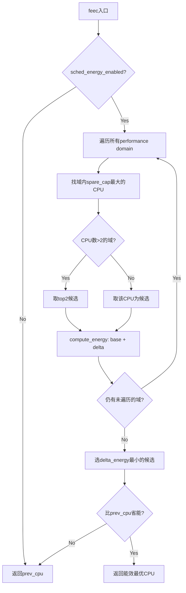

# 8.6.2 Energy Model与调度器协同机制

> 所属：第8章 动态功耗管理 > 8.6 Energy Aware Scheduling
> 难度：[E] | 预计阅读时间：35分钟

## 本节导读

EAS（Energy Aware Scheduling）并非魔法——它只是一套基于"查表+比较"的确定性决策系统。本节深入解析EAS依赖的Energy Model数据结构、`find_energy_efficient_cpu()`的能耗增量计算逻辑，以及over-utilized检测如何作为"安全阀"在高负载时退化为CFS行为。理解这三者的协同关系，是调试EAS异常行为（如"该省电时飙频"、"高负载时还在迁移"）的基础。

---

## 知识点1：EM数据结构——调度器的"功耗地图" [E] ~1000字

### 问题场景

假设你正在 bring-up 一颗新的移动SoC（如4×A55 + 2×A76的big.LITTLE架构）。CPUFreq驱动已通过OPP表注册了频率点，但EAS仍无法启用，dmesg中反复出现：

```
sched_energy_set: EAS not enabled, no EM found for CPU0
```

问题出在哪？EAS不直接读取OPP表——它依赖Energy Model（EM）框架提供**结构化的功耗数据**。OPP只描述"频率-电压"关系，而EM在OPP之上扩展了**功耗维度**，将其转化为调度器可理解的能效模型。

### 机制深入

#### 三层数据架构

EM框架采用三级数据结构组织能效信息，对应"单个状态→状态表→性能域"的聚合关系：

```
struct em_perf_state    ← 单个OPP的功耗描述
    ↓ 组成数组
struct em_perf_table    ← RCU保护的状态表
    ↓ 被引用
struct em_perf_domain   ← 一个性能域（同频CPU集合）
```

核心结构 `struct em_perf_state`（定义于 `include/linux/energy_model.h`）如下：

```c
struct em_perf_state {
    unsigned long performance;  /* capacity值（与PELT同量纲）*/
    unsigned long frequency;    /* KHz，与CPUFreq一致 */
    unsigned long power;        /* mW，静态+动态总功耗 */
    unsigned long cost;         /* 效率系数：power×max_freq/freq */
    unsigned long flags;        /* EM_PERF_STATE_INEFFICIENT等 */
};
```

其中 `cost` 字段是EAS做决策的核心依据。其计算公式（`em_dev_compute_costs()` 中实现）为：

```
cost = power × max_frequency / frequency
```

cost值越低，表示在该性能状态下完成单位工作的能效越高。注意这是一个**归一化指标**——它消除了频率差异的影响，使得不同OPP之间的效率可以直接比较。

#### EM与OPP的关系

| 维度 | OPP（Operating Performance Point） | EM（Energy Model） |
|------|-----------------------------------|-------------------|
| 数据来源 | DT（operating-points-v2）或固件 | OPP + 功耗测量/估算 |
| 核心内容 | (frequency, voltage) 元组 | (frequency, power, cost) 三元组 |
| 注册方式 | `dev_pm_opp_add()` 或DT自动解析 | `em_dev_register_perf_domain()` 或 `cpufreq_register_em_with_opp()` |
| 动态更新 | 支持（thermal压频时） | 支持RCU热替换（`em_dev_update_perf_domain()`） |
| 消费者 | CPUFreq、Devfreq | EAS、Thermal（IPA）、Powercap |

**OPP到EM的映射关系**：每个有效的OPP条目对应一个 `em_perf_state`。若SoC的A76簇有7个OPP（500MHz~2000MHz），则其EM表中将有7个按frequency升序排列的 `em_perf_state` 条目。

#### 调度器访问接口

EAS在唤醒路径上通过以下API获取EM数据：

```c
/* kernel/sched/fair.c — find_energy_efficient_cpu() 调用路径 */
struct em_perf_domain *pd;
pd = em_cpu_get(cpu);   /* 获取CPU所在性能域的EM表 */
if (!pd)
    return prev_cpu;    /* 无EM则回退到prev_cpu */
```

`em_cpu_get()` 内部通过per-cpu指针直接取 `em_perf_domain`，是**O(1)热点路径操作**，无锁（依赖RCU保证表项生命周期）。

### 关键代码路径

```c
/* include/linux/energy_model.h */
struct em_perf_domain {
    struct em_perf_table __rcu *em_table;  /* RCU保护，支持运行时更新 */
    int nr_perf_states;                     /* OPP/状态数 */
    int min_perf_state, max_perf_state;     /* thermal限制后的有效范围 */
    unsigned long cpus[];                   /* 该域覆盖的CPU mask */
};

/* em_cpu_energy() — EAS估算性能域能耗的核心API */
unsigned long em_cpu_energy(struct em_perf_domain *pd,
                            unsigned long max_util,   /* 域内最高单CPU util */
                            unsigned long sum_util,   /* 域内util总和 */
                            unsigned long allowed_cpu_cap);
```

`em_cpu_energy()` 的估算逻辑基于一个关键假设：**性能域的频率由域内util最高的CPU决定**（即schedutil的升频行为）。它会查找满足 `max_util` 的最小OPP，然后按 `sum_util / capacity` 的比例线性缩放功耗。

### Trade-off：Simple EM vs. Advanced EM

| 特性 | Simple EM（`cpufreq_register_em_with_opp`） | Advanced EM（`em_dev_register_perf_domain`） |
|------|--------------------------------------------|---------------------------------------------|
| 功耗模型 | `Power = C×V²×f` 理论公式 | 实测功耗数据回调 |
| 静态功耗（leakage） | ❌ 忽略 | ✅ 可包含 |
| 实现复杂度 | 驱动自动注册，零代码 | 需提供 `.get_power()` 回调 |
| 精度 | 低频点误差可达30-50% | 依赖测量质量，通常<10% |
| 适用场景 |  bring-up阶段、低成本平台 | 量产手机、功耗敏感设备 |
| DT依赖 | 需 `opp-microwatt` 属性 | 可完全由固件提供 |

💡 **实践建议**：即使是最简的Simple EM，也务必在DT中提供 `opp-microwatt` 属性。缺少该属性时，EM框架将拒绝注册，EAS永远无法启用。

### 常见陷阱

⚠️ **陷阱1**：`opp-microwatt` 的数值单位是微瓦（μW），但EM框架内部统一为毫瓦（mW）。若DT中填了 `100000`（意图100mW），实际被解析为100000mW=100W，会导致EAS做出荒谬的能效决策。

🔴 **安全提醒**：运行时可更新的EM表（thermal降功场景）通过RCU机制保护，但频繁更新（>1次/秒）会导致sched_domain级别的缓存抖动。实测显示，240核系统上rd->overutilized的缓存行竞争可使 `enqueue_task_fair` 消耗7% CPU（参见 kernel 6.8 `check_update_overutilized_status` 优化patch）。

---

## 知识点2：find_energy_efficient_cpu()——唤醒路径上的能效决策 [E] ~1200字

### 问题场景

你的手机在低负载浏览网页时，一个小任务（如JS定时器）从睡眠中唤醒。CFS会把它放到prev_cpu上以利用缓存局部性——但如果prev_cpu是一颗A76大核，且当前A55小核完全空闲，这不是明显的能效浪费吗？

`find_energy_efficient_cpu()`（以下简称feec）就是解决这个问题的：**在唤醒路径上，估算任务放到不同CPU/簇的能耗增量，选择能效最优的目标**。

### 机制深入

#### 调用路径与上下文

feec仅在以下条件下被调用（`select_task_rq_fair()` 中）：

```
try_to_wake_up() / wake_up_new_task()
    └── select_task_rq_fair()
            └── if (sched_energy_enabled())
                    find_energy_efficient_cpu()
```

关键前置条件（`sched_energy_enabled()` 判定）：
1. 平台为异构拓扑（`SD_ASYM_CPUCAPACITY` 标志存在）
2. 所有CPU由schedutil驱动
3. EM表已注册且复杂度在限制内
4. 当前root domain **未**处于overutilized状态

#### 核心算法流程

feec的算法可概括为"**找候选→算能耗→比增量**"三步：



*图1：find_energy_efficient_cpu()决策流程*

#### 能耗增量计算

这是feec的核心。`compute_energy()` 对每个候选CPU执行两次估算：

```
base_energy   = Σ em_cpu_energy(pd, max_util_pd, sum_util_pd)    /* 不含任务 */
new_energy    = Σ em_cpu_energy(pd, max_util_pd', sum_util_pd')  /* 含任务 */
delta_energy  = new_energy - base_energy
```

其中求和遍历**所有** performance domain（不只是目标域），因为任务迁移可能影响整个系统的频率决策（例如A76簇因此少升一档）。

**关键细节**：`compute_energy()` 中的 `eenv`（energy environment）结构会"模拟"任务迁移后的util分布：

```c
/* kernel/sched/fair.c — compute_energy 核心逻辑示意 */
static long compute_energy(struct task_struct *p, int dst_cpu,
                           struct perf_domain *pd)
{
    struct energy_env eenv = { .task = p };
    
    /* Step 1: 构建base场景（任务在prev_cpu） */
    eenv_cpu_util(&eenv, prev_cpu, /*sub=*/false);  /* 不减任务util */
    base_energy = _compute_energy(&eenv);
    
    /* Step 2: 构建delta场景（任务在dst_cpu） */
    eenv_cpu_util(&eenv, prev_cpu, /*sub=*/true);   /* 从prev减util */
    eenv_cpu_util(&eenv, dst_cpu,  /*sub=*/false);  /* 向dst加util */
    new_energy = _compute_energy(&eenv);
    
    return new_energy - base_energy;
}
```

⚠️ **陷阱2**：`compute_energy()` 的复杂度为 O(N_pd × N_ps)，其中 N_pd 是performance domain数，N_ps 是每个domain的状态数。在大型系统（如2P+8E的16核ARM服务器）上，若EM_MAX_COMPLEXITY超过2048，EAS将被禁用。内核6.7后此限制被移除，改为基于实际测时决定是否启用。

### 关键代码路径

```c
/* kernel/sched/fair.c — feec核心骨架（Linux 6.6） */
static int find_energy_efficient_cpu(struct task_struct *p, int prev_cpu)
{
    unsigned long prev_delta = ULONG_MAX;
    struct perf_domain *pd;
    int cpu, best_cpu = prev_cpu;
    
    /* 前提检查：EAS使能、任务可迁移 */
    if (!sched_energy_enabled() || p->nr_cpus_allowed == 1)
        return prev_cpu;
    
    rcu_read_lock();
    
    /* 遍历root_domain内所有performance domain */
    for_each_pd(rd, pd) {
        unsigned long cur_delta;
        int max_spare_cap_cpu = -1;
        unsigned long max_spare_cap = 0;
        
        /* 找域内spare capacity最大的CPU */
        for_each_cpu_and(cpu, perf_domain_span(pd), 
                         sched_domain_span(sd)) {
            unsigned long spare_cap;
            spare_cap = capacity_of(cpu) - cpu_util(cpu);
            if (spare_cap > max_spare_cap) {
                max_spare_cap = spare_cap;
                max_spare_cap_cpu = cpu;
            }
        }
        
        if (max_spare_cap_cpu < 0)
            continue;
        
        /* 计算迁移到此CPU的能耗增量 */
        cur_delta = compute_energy(p, max_spare_cap_cpu, pd, prev_cpu);
        
        /* 选择能耗增量最小的（最省能的） */
        if (cur_delta < prev_delta) {
            prev_delta = cur_delta;
            best_cpu = max_spare_cap_cpu;
        }
    }
    
    rcu_read_unlock();
    
    /* 若最优解比prev_cpu省能，则迁移；否则留在prev_cpu */
    return (prev_delta < 0) ? best_cpu : prev_cpu;
}
```

### 实践案例：big.LITTLE手机的任务放置决策

**场景**：2×A76@2GHz（性能域pd_big）+ 4×A55@1.5GHz（性能域pd_little）。当前系统负载：

- CPU0（A55）：util=200，运行后台sync
- CPU1-3（A55）：idle
- CPU4（A76）：util=400，运行渲染线程
- CPU5（A76）：idle

一个 `util_avg=150` 的CFS任务在CPU4上唤醒（prev_cpu=4）。feec决策过程：

1. **pd_little域**：CPU1的spare_cap = 1024 - 0 = 1024（最大）。
   - base_energy: pd_little需跑200+150=350util → 升频到约1GHz
   - 但pd_big因任务迁走，util从400降到0 → 可降频到500MHz
   - **delta ≈ (小核增量) - (大核节省) → 通常为负值（省能）**

2. **pd_big域**：CPU5的spare_cap = 1024 - 0 = 1024（最大）。
   - 任务留在大核，pd_big util=400+150=550 → 需保持1.5GHz+
   - pd_little不受影晌
   - **delta ≈ 正值（更耗能）**

3. **决策**：选择delta最小的候选（CPU1），任务迁移到小核执行。

💡 **调试技巧**：通过ftrace的 `sched_energy_diff` tracepoint可观测每次feec的决策细节：

```bash
echo 1 > /sys/kernel/debug/tracing/events/sched/sched_energy_diff/enable
cat /sys/kernel/debug/tracing/trace_pipe
# 输出示例：feec: dst_cpu=1 delta=184 base=1250 new=1066
```

### Trade-off：EAS迁移 vs. 缓存局部性

| 考量维度 | 留在prev_cpu | EAS能效迁移 |
|---------|-------------|------------|
| 缓存命中率 | ✅ 高（LLC数据热） | ❌ 可能冷启动 |
| 能效 | ❌ 可能浪费（大核跑小任务） | ✅ 最优 |
| 迁移延迟 | ✅ 零 | ❌ ~几十μs（上下文切换+TLB刷新） |
| 任务util大时 | 合理 | 可能因频繁迁移损害吞吐量 |
| 适用条件 | `prev_delta >= 0` | `prev_delta < 0` 且有显著省能 |

---

## 知识点3：over-utilized检测——EAS的"安全阀" [E] ~800字

### 问题场景

压测场景：你运行 `sysbench cpu --threads=8` 在4×A55+2×A76手机上。按理说所有核都应该满载运行，但EAS却**仍在尝试做能效迁移**——把负载从重载核移到轻载核，导致频繁的无效迁移和吞吐量下降。这正是over-utilized检测要解决的问题。

### 机制深入

#### 核心逻辑

EAS仅在系统有**空闲容量**时才有意义——此时可以通过"挤一挤"来降频省电。当系统满载时，能效优化会让位于吞吐量最大化。

```c
/* kernel/sched/fair.c — overutilized检测 */
static inline bool cpu_overutilized(int cpu)
{
    unsigned long rq_util_min, rq_util_max;
    
    if (!sched_energy_enabled())
        return false;
    
    rq_util_min = uclamp_rq_get(cpu_rq(cpu), UCLAMP_MIN);
    rq_util_max = uclamp_rq_get(cpu_rq(cpu), UCLAMP_MAX);
    
    /* 核心判定：CPU util是否超过其capacity */
    return !util_fits_cpu(cpu_util(cpu), rq_util_min, rq_util_max, cpu);
}
```

`util_fits_cpu()` 检查 `cpu_util(cpu) <= capacity_of(cpu)`（考虑uclamp约束）。一旦任一CPU不满足此条件，整个root domain被标记为overutilized：

```c
static inline void check_update_overutilized_status(struct rq *rq)
{
    if (!sched_energy_enabled())
        return;
    
    /* 只要有一个CPU overutilized，整个rd标记 */
    if (!READ_ONCE(rq->rd->overutilized) && cpu_overutilized(rq->cpu))
        set_rd_overutilized_status(rq->rd, SG_OVERUTILIZED);
}
```

#### EAS退化行为

| 状态 | 判定条件 | EAS行为 | 负载均衡 |
|------|---------|--------|---------|
| Under-utilized | 所有CPU `util < 80% capacity` | ✅ feec做能效放置 | ❌ 跳过（`nohz_idle_balance`足矣） |
| Over-utilized | 任一CPU `util >= capacity` | ❌ 禁用feec，回退到CFS | ✅ 强制load_balance |
| 解除overutilized | lb路径中检测所有CPU fit | ❌→✅ 恢复EAS | — |

注意阈值不是100%，而是 `SCHED_CAPACITY_SCALE`（1024）对应的归一化capacity。由于PELT的衰减速率，util追上capacity需要一定时间，因此阈值附近存在**滞后效应**（hysteresis）。

#### 为什么必须退化？三个根本原因

1. **能效优化的前提消失**：EAS的核心假设是"任务集中→频率降低→省能"。满载时所有CPU都在最高频，集中任务反而可能导致某些核过饱和，而其他核空闲却无法分担（因为feec只选spare_cap最大的核，而非做负载均衡）。

2. **负载均衡的优先级**：CFS的load_balance算法经过数十年优化，在公平性和吞吐量上远超feec的简化逻辑。overutilized时系统需要的是**均匀分布**，而非**能效集中**。

3. **唤醒路径复杂度**：feec的 `compute_energy()` 在大型系统上是μs级延迟。高负载下任务唤醒频率剧增，此开销不可接受。

### 关键代码路径

```c
/* kernel/sched/fair.c — load_balance中的overutilized更新 */
static inline void update_sd_lb_stats(struct lb_env *env, ...)
{
    /* ... 统计各sched group的util ... */
    
    if (!env->sd->parent) {  /* 顶层sched domain */
        /* 更新overload指示器 */
        WRITE_ONCE(rd->overload, sg_status & SG_OVERLOAD);
        
        /* 原子更新overutilized状态 */
        set_rd_overutilized_status(rd, sg_status & SG_OVERUTILIZED);
    }
    
    /* 注意：子domain若检测到过载，也会向上传播设置rd级别标志 */
}
```

🔴 **安全提醒**：`root_domain->overutilized` 与 `->overload` 位于同一cacheline。在大型SMP系统上，所有CPU的 `enqueue_task_fair` 都可能触及此字段，引发严重的缓存行竞争（false sharing）。Kernel 6.8的patch通过 `sched_energy_enabled()` 快速检查（静态分支预测，非EAS平台直接返回）将此热点从perf中消除。

### 常见陷阱

⚠️ **陷阱3**：`sched_energy_enabled()` 在编译时优化为静态分支（static_key）。若你在运行时通过 `echo 0 > /sys/kernel/debug/sched_energy_aware` 关闭EAS，实际需要通过workqueue重建sched_domain才能生效——不是即时切换！

💡 **调试技巧**：通过tracepoint观测overutilized状态转换：

```bash
echo 1 > /sys/kernel/debug/tracing/events/sched/sched_overutilized/enable
cat /sys/kernel/debug/tracing/trace_pipe
# 输出：overutilized=1 rd=0xc1084000  ← EAS已退化
# 输出：overutilized=0 rd=0xc1084000  ← EAS恢复
```

---

## 本节总结

EAS与EM的协同可概括为一张"分工表"：

| 组件 | 职责 | 输入 | 输出 | 关键限制 |
|------|------|------|------|---------|
| EM框架 | 提供结构化的功耗数据 | OPP + 功耗值 | `em_perf_domain` 表 | 必须配合schedutil |
| `em_cpu_get()` | O(1)查询CPU的EM | CPU号 | `em_perf_domain *` | RCU读端保护 |
| `em_cpu_energy()` | 估算域能耗 | max_util, sum_util | mJ级能量值 | 假设freq∝util |
| feec | 唤醒路径选核 | 任务util、系统负载 | 目标CPU | O(N_pd×N_ps)复杂度 |
| overutilized | 高负载安全阀 | per-CPU util vs capacity | rd级布尔标志 | cacheline竞争 |

**三句话记忆**：
1. EM是地图——告诉调度器每个性能状态的功耗代价；
2. feec是导航——基于地图找最省能的路径（CPU）；
3. overutilized是限速标志——堵车时别再看地图了，直接走最快路线（CFS）。

---

## 配套资源

### 表格清单
- 表1：OPP与EM的维度对比（知识点1）
- 表2：Simple EM vs. Advanced EM（知识点1）
- 表3：EAS迁移 vs. 缓存局部性（知识点2）
- 表4：over-utilized状态机与EAS行为（知识点3）
- 表5：EAS-EM协同分工总表（本节总结）

### 图示清单（mermaid代码）
- 图1：`find_energy_efficient_cpu()`决策流程图（知识点2）

### 代码清单
- 代码1：`struct em_perf_state` 核心字段解析（知识点1）
- 代码2：`em_cpu_get()` + `em_cpu_energy()` 接口声明（知识点1）
- 代码3：`find_energy_efficient_cpu()` 核心骨架（知识点2）
- 代码4：`cpu_overutilized()` 与 `check_update_overutilized_status()`（知识点3）
- 代码5：`compute_energy()` 逻辑示意（知识点2）

### 延伸阅读
- `Documentation/power/energy-model.rst` — EM框架官方文档
- `Documentation/scheduler/sched-energy.rst` — EAS调度器文档
- ARM Energy Aware Scheduling Overview and Integration Guide（r1p4）
- Kernel源码：`kernel/power/energy_model.c`、`kernel/sched/fair.c`（feec相关函数）
