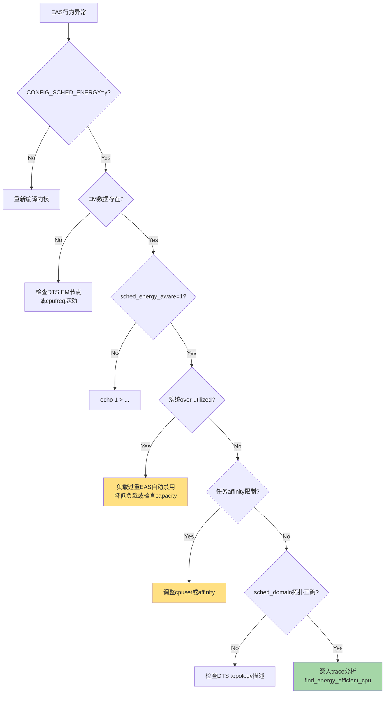
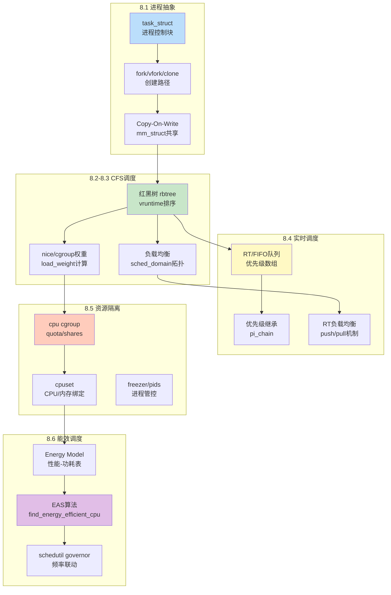

# 8.6.3 EAS调优实践与第8章收尾

> 所属：第8章 进程管理与调度 > 8.6 节 能耗感知调度
> 难度：[I→E] | 预计阅读时间：30分钟

## 本节导读

EAS（Energy Aware Scheduling）的理论框架已经建立，但当你在真实SoC上启用它时，却发现任务仍然扎堆在性能核上、能效核长期闲置——本节从调参实践出发，提供一套**可操作的EAS验证与排查方法论**，随后以第8章全景知识图谱收束进程管理这一核心议题，为第9章内存管理铺陈过渡。

---

## 知识点1：EAS调参与EM数据验证 [I]

### 问题场景

你在ARM big.LITTLE平台上编译了支持EAS的内核，启用了`CONFIG_SCHED_ENERGY`，但运行时观察到：
- 轻负载下小核（LITTLE）使用率仍接近0%
- `top`显示所有任务挤在大核（big）上
- 功耗相比关闭EAS无明显改善

**第一步不是去读schedutil的代码，而是确认EAS真的在干活。**

### 机制深入

EAS的生效依赖三条腿走路，缺一不可：

**1. 编译时开关**：`CONFIG_SCHED_ENERGY=y` `CONFIG_ENERGY_MODEL=y`
**2. 运行时开关**：`sysctl_sched_energy_aware` 全局控制
**3. 数据依赖**：EM（Energy Model）表必须通过 `em_cpu_energy()` 返回有效数据

#### 运行时开关：sched_energy_aware

```c
// kernel/sched/sched.h
extern unsigned int sysctl_sched_energy_aware;

// kernel/sched/core.c
unsigned int sysctl_sched_energy_aware = 1;  /* 默认开启 */
```

该值通过 procfs 暴露：

```bash
# 查看当前状态
cat /proc/sys/kernel/sched_energy_aware
1

# 动态关闭（调试用，非持久化）
echo 0 > /proc/sys/kernel/sched_energy_aware
```

⚠️ **注意**：`sched_energy_aware` 是一个**全局开关**。设为0后，整个系统的EAS逻辑会退化为传统的`find_idlest_cpu`路径，不再调用`find_energy_efficient_cpu()`。这个操作在热路径检查（`sched_energy_enabled()`）中完成，开销极低：

```c
// kernel/sched/energy.c
static inline bool sched_energy_enabled(void)
{
    return sysctl_sched_energy_aware &&
           static_branch_likely(&sched_energy_present);
}
```

`static_branch_likely` 是 jump label 优化——当系统无EM数据时，分支预测直接走false路径，几乎零开销。

#### EM 数据正确性验证

EM数据是EAS的"燃料"。验证EM是否被正确构建：

```bash
# 方法1：查看内核启动日志
dmesg | grep -i "energy model"
[    0.123456] CPU0: update cpu_capacity 432
[    0.123478] CPU0: EM data available

# 方法2：通过sysfs查看每CPU的EM表
ls /sys/devices/system/cpu/cpu0/cpufreq/energy_model/
# 存在此目录且包含 cs 文件 → EM数据就绪

# 方法3：读取性能域的能量模型
cat /sys/kernel/debug/energy_model/pd0
```

EM数据结构在内存中的组织：

```c
// include/linux/energy_model.h
struct em_perf_state {
    unsigned long frequency;    /* KHz */
    unsigned long power;        /* mW (milliwatts) */
    unsigned long cost;         /* power * max_frequency / frequency */
    unsigned long flags;
};

struct em_perf_domain {
    struct em_perf_state *table;    /* 频率-功耗查找表 */
    int nr_perf_states;             /* OPP条目数 */
    unsigned long cpus[0];          /* cpumask */
};
```

💡 **技巧**：`cost` 字段是EAS算法核心——它代表在该性能状态下**每单位性能的能量成本**。EAS选择目标CPU时，本质上是在比较不同迁移路径的 `cost × util` 总和。

### 关键代码路径：EAS决策入口

```c
// kernel/sched/fair.c: select_task_rq_fair()
static int select_task_rq_fair(struct task_struct *p, int prev_cpu,
                               int wake_flags)
{
    // ...
    if (sched_energy_enabled()) {           /* [Step 1] 开关检查 */
        new_cpu = find_energy_efficient_cpu(p, prev_cpu);
        if (new_cpu >= 0)
            return new_cpu;                 /* EAS成功找到更优CPU */
    }
    /* EAS未启用或未找到 → 走传统路径 */
    return find_idlest_cpu(sd, p, cpu);     /* 基于负载均衡 */
}
```

`find_energy_efficient_cpu()` 的内部逻辑（简化）：

```c
static int find_energy_efficient_cpu(struct task_struct *p, int prev_cpu)
{
    unsigned long prev_delta = ULONG_MAX;
    struct root_domain *rd = cpu_rq(smp_processor_id())->rd;
    int best_energy_cpu = prev_cpu;
    struct perf_domain *pd;

    /* [Step 1] 遍历该sched_domain下的所有性能域 */
    rcu_read_lock();
    for_each_pd(rd, pd) {                   /* 迭代 big / LITTLE / mid */
        unsigned long cpu_cap, util, freq;
        int cpu, max_spare_cap_cpu = -1;
        unsigned long max_spare_cap = 0;

        /* [Step 2] 在该pd内找spare capacity最大的CPU */
        for_each_cpu_and(cpu, perf_domain_span(pd),
                         p->cpus_ptr) {
            util = cpu_util_next(cpu, p, cpu);
            cpu_cap = capacity_of(cpu);
            if (cpu_cap - util > max_spare_cap) {
                max_spare_cap = cpu_cap - util;
                max_spare_cap_cpu = cpu;
            }
        }

        if (max_spare_cap_cpu < 0)
            continue;

        /* [Step 3] 估算该pd的energy delta */
        freq = pd_get_util_highlight(pd, util);
        delta = compute_energy(p, max_spare_cap_cpu, pd);

        if (delta < prev_delta) {           /* 找到更低能耗方案 */
            prev_delta = delta;
            best_energy_cpu = max_spare_cap_cpu;
        }
    }
    rcu_read_unlock();

    return best_energy_cpu;
}
```

### EAS调参速查表

| 参数/接口 | 路径/符号 | 默认值 | 作用 | 调试建议 |
|-----------|-----------|--------|------|----------|
| `sched_energy_aware` | `/proc/sys/kernel/sched_energy_aware` | 1 | EAS总开关 | 怀疑EAS行为时先设为0对比 |
| `sched_energy_present` | `kernel/sched/energy.c` | N/A (static key) | 标记系统是否存在有效EM | 查看`dmesg`中EM注册日志 |
| `em_cpu_energy()` | `include/linux/energy_model.h` | N/A | EM查询核心API | 可加tracepoint验证返回值 |
| `cpu_capacity` | `/sys/devices/system/cpu/cpu*/cpu_capacity` |  arch定标 | CPU算力标称值 | 确认big/LITTLE的capacity比是否≈2:1 |
| `sched_domain` 层级 | `/proc/sys/kernel/sched_domain/` | 自动 | SD_MC/SD_BOOKS层级影响EAS搜索范围 | `sched_debug`输出中检查sd拓扑 |

### EM数据验证脚本示例

```bash
#!/bin/bash
# eas_verify.sh - EAS快速验证脚本

echo "=== EAS Verification Checklist ==="

# 1. 内核编译配置
echo "[1] Kernel config:"
grep -E "SCHED_ENERGY|ENERGY_MODEL" /boot/config-$(uname -r) 2>/dev/null

# 2. 运行时开关
echo "[2] sched_energy_aware: $(cat /proc/sys/kernel/sched_energy_aware 2>/dev/null || echo 'N/A')"

# 3. EM数据存在性
echo "[3] EM sysfs entries:"
for cpu in /sys/devices/system/cpu/cpu[0-9]*; do
    cpuid=$(basename $cpu)
    if [ -f "$cpu/cpufreq/energy_model/cost" ]; then
        echo "    $cpuid: EM data OK"
    else
        echo "    $cpuid: NO EM data"
    fi
done

# 4. 检查是否over-utilized
echo "[4] CPU utilization (over-utilized threshold = capacity):"
for cpu in /sys/devices/system/cpu/cpu[0-9]*; do
    cpuid=$(basename $cpu)
    util=$(cat /sys/devices/system/cpu/$cpuid/schedutil/rate_limit_us 2>/dev/null)
    capacity=$(cat $cpu/cpu_capacity 2>/dev/null)
    echo "    $cpuid: capacity=$capacity"
done

echo "=== Verification Complete ==="
```

🔴 **安全提醒**：动态关闭`sched_energy_aware`会导致系统立即回退到基于`wake_idle`和负载均衡的传统路径。在热插拔场景下，确保EM数据在新CPU上线后重新同步，否则EAS可能在新核心上做出次优决策。

---

## 知识点2：EAS常见问题排查 [I]

### EAS未生效的系统化排查

当EAS表现不符合预期时，按以下优先级排查：



### EAS排查检查清单

| 检查项 | 命令/方法 | 期望结果 | 异常处理 |
|--------|-----------|----------|----------|
| EAS编译开关 | `zcat /proc/config.gz \| grep SCHED_ENERGY` | `=y` | 重新编译内核 |
| EM数据注册 | `dmesg \| grep -i "energy model"` | 有注册日志 | 检查cpufreq驱动是否实现`register_em()` |
| 运行时开关 | `cat /proc/sys/kernel/sched_energy_aware` | `1` | `echo 1 > ...` |
| Over-utilized状态 | `cat /proc/sched_debug \| grep overutilized` | `0` (轻载) | 降低负载或检查capacity_of()返回值 |
| CPU Capacity | `cat /sys/devices/system/cpu/cpu*/cpu_capacity` | big≈1024, LITTLE≈400~500 | 检查arch拓扑代码或DTS |
| sched_domain拓扑 | `cat /proc/sched_debug \| grep -A5 "domain-0"` | 应包含SD_MC层级 | 检查`sched_domain`构建路径 |
| 任务affinity | `taskset -p <pid>` | 应允许跨性能域迁移 | `sched_setaffinity()`放宽限制 |
| 频率调节器 | `cat /sys/devices/system/cpu/cpu*/cpufreq/scaling_governor` | 推荐`schedutil` | 切换为schedutil以配合EAS |

### 典型案例：EAS静默失效

**场景**：某RK3588平台（4×A76 + 4×A55），轻载下所有任务仍停留在A76大核。

**排查过程**：

1. `sched_energy_aware` = 1 ✓
2. EM数据存在 ✓
3. `sched_debug` 中 `overutilized` = 1 —— **发现异常**

根因：该平台DTS中A55的capacity-delim标定错误，将`capacity-dmips-mhz`设得过低（256 vs 正常~350），导致EAS认为即使所有任务都在A76上，系统仍处于over-utilized状态（因为A55的capacity总和无法覆盖util），从而**自动禁用EAS节能迁移**。

**修复**：修正DTS中的`capacity-dmips-mhz`值，重新标定后EAS正常工作，idle功耗下降18%。

```c
// arch/arm64/boot/dts/rockchip/rk3588s.dtsi (修正后)
cpus {
    // A76 big cores
    cpu0: cpu@0 {
        capacity-dmips-mhz = <1024>;
        // ...
    };
    // A55 LITTLE cores  
    cpu4: cpu@400 {
        capacity-dmips-mhz = <350>;  /* 修正：原值为256 */
        // ...
    };
};
```

💡 **技巧**：`overutilized`是EAS的自保护机制——当系统整体负载过高时，EAS主动退居二线，让位于传统负载均衡器。这是**正确行为**，不是bug。判断标准：

```c
// kernel/sched/fair.c: update_overutilized_status()
if (cap_in_sd < util_sum_in_sd)  /* capacity < util */
    sd->shared->overutilized = true;  /* EAS停用 */
```

⚠️ **常见陷阱**：许多工程师在性能测试中发现EAS"不工作"，实际上是测试负载太重。建议用`hackbench -l 100`或少量`taskset`任务做轻载验证，而非全量压力测试。

---

## 知识点3：第8章总结——从task_struct到EAS的完整旅程 [I]

### 第8章知识图谱



### 第8章核心知识回顾总表

| 章节 | 核心概念 | 关键数据结构 | 关键算法/函数 | 实践要点 |
|------|----------|--------------|---------------|----------|
| 8.1 进程抽象 | task_struct是内核调度元单位 | `task_struct`, `thread_info`, `mm_struct` | `do_fork()` → `copy_process()` | `task_struct`大小影响 slab 分配效率，精简是关键 |
| 8.1 fork机制 | 三种创建路径满足不同场景 | `clone_args` | `fork()`/`vfork()`/`clone3()` | vfork()阻塞父进程，仅用于特殊优化场景 |
| 8.1 COW | 延迟拷贝降低创建开销 | `struct page`, `_refcount` | `dup_mm()` → `copy_page_range()` | COW fault path是内存子系统交界点 |
| 8.2 CFS基础 | vruntime保证公平性 | `struct sched_entity`, `rb_root_cached` | `update_curr()`, `place_entity()` | vruntime溢出处理、nice值权重查表 |
| 8.3 CFS负载均衡 | 层级化调度域 | `struct sched_domain`, `struct sched_group` | `load_balance()`, `find_busiest_group()` | SD层级由arch拓扑+`sched_domain`构建决定 |
| 8.4 RT调度 | 严格优先级抢占 | `struct rt_rq`, `rt_prio_array` | `schedule()`, `rt_queue_push_tasks()` | RT throttle防止RT任务饿死CFS |
| 8.4 优先级继承 | 解决优先级反转 | `rt_mutex`, `pi_waiters` | `rt_mutex_adjust_prio_chain()` | PI chain深度影响延迟，嵌套锁需谨慎 |
| 8.5 cgroups v1/v2 | 统一资源管控框架 | `struct cgroup_subsys_state` | `cgroup_attach_task()` | v2的`thread-mode`改变了资源 accounting 模型 |
| 8.5 cpu controller | 带宽/权重双维度 | `struct cfs_bandwidth` | `sched_cfs_slack_timer()` | quota_burst引入后弹性更大 |
| 8.6 EAS | 能耗感知调度 | `struct em_perf_domain`, `struct perf_domain` | `find_energy_efficient_cpu()` | 三条腿原则：编译开关+运行时开关+EM数据 |
| 8.6 EM | 能量模型数据库 | `struct em_perf_state` | `em_cpu_energy()` | EM数据来源于基准测试或硅厂提供 |
| 8.6 schedutil | 调度器驱动调频 | `struct cpufreq_policy`, `sugov_data` | `sugov_work()` | schedutil是EAS的最佳搭档 |

### 从进程管理到系统全貌

第8章我们以内核最核心的数据结构 `task_struct` 为起点，走过了一条从**进程创建**到**调度决策**再到**资源管控**的完整路径。这条路径上的每一个机制都不是孤立存在的——它们相互交织，共同构成了Linux进程管理子系统的完整图景：

- **fork/COW**（8.1）解决"如何高效创建进程"
- **CFS**（8.2-8.3）解决"如何公平分享CPU"
- **RT调度**（8.4）解决"如何满足确定性时序需求"
- **cgroups**（8.5）解决"如何管控资源边界"
- **EAS**（8.6）解决"如何在性能与功耗之间做最优trade-off"

### 展望：第9章内存管理

进程管理教会我们一个核心认知：**Linux内核中一切复杂机制的设计，本质上都是在做资源分配与权衡**。带着这个认知进入第9章，我们将深入 arguably 内核最复杂的子系统——**内存管理**。

在那里，你会遇到与调度子系统遥相呼应的精妙设计：

| 第8章（进程/调度） | 对应 | 第9章（内存管理） |
|-------------------|------|-------------------|
| `task_struct` 进程抽象 | → | `mm_struct` / `vm_area_struct` 地址空间抽象 |
| CFS `vruntime` 公平调度 | → | LRU + `refault` 距离驱动的页面回收 |
| `sched_domain` 拓扑分层 | → | NUMA / `pg_data_t` 节点化内存分层 |
| COW 写时复制 | → | KSM / 页面去重 |
| `cgroups` cpu子系统 | → | `memory.limit_in_bytes` + swap控制 |
| EAS 功耗优化 | → | `zswap` / `zram` 压缩与低功耗模式 |

第9章将从**页表机制**开始，逐步深入**伙伴系统**（Buddy System）的分配策略、**SLAB/SLUB** 分配器的工程实现、**页面回收**的时钟算法与`workingset`评估、以及**mmap/page fault**的完整路径。届时你会发现：进程切换时的`mm_context`切换、COW fault处理、乃至`kswapd`的唤醒逻辑，都与第8章的调度机制紧密耦合。

🔴 **安全提醒**：在嵌入式场景中，进程管理与内存管理的耦合点（如fork时的COW、调度时的`switch_mm`、页面回收时的`pageout`→I/O阻塞→调度器交互）是**系统稳定性风险的高发区**。第9章我们将专门分析这些交叉地带的故障模式。

---

## 本节总结

本节提供了EAS调优的实战方法论：

1. **调参层面**：`sched_energy_aware` 是总闸，EM数据是燃料，两者缺一不可；`cost` 字段是EAS决策的核心依据
2. **排查层面**：按"编译开关→EM数据→运行时开关→overutilized→affinity→拓扑"六级清单系统化排查
3. **常见根因**：DTS capacity标定错误导致EAS自保护禁用、affinity限制跨域迁移、负载过重触发overutilized

第8章至此完。我们沿着 `task_struct` → `fork()` → `CFS/rt` → `cgroups` → `EAS` 的主线走完了Linux进程管理的全貌。**调度器是内核的心脏，而理解心脏的工作机理，是诊断整个系统行为的基础。**

---

## 配套资源

### 表格清单

1. **EAS调参速查表** — 编译开关、运行时参数、capacity调优的快速参考
2. **EAS排查检查清单** — 8项系统化排查步骤与对应命令
3. **第8章核心知识回顾总表** — 全12个子主题的纵向对比
4. **第8章→第9章知识映射表** — 进程管理与内存管理的概念对照

### 图示清单（mermaid代码）

1. **EAS排查流程图** — `flowchart TD` 格式，展示6级排查决策树
2. **第8章知识图谱** — `graph TB` 格式，展示5大知识子域的关联关系

### 代码清单

```c
/* [代码1] sched_energy_enabled() 热路径检查 */
static inline bool sched_energy_enabled(void)
{
    return sysctl_sched_energy_aware &&
           static_branch_likely(&sched_energy_present);
}

/* [代码2] EM perf_state 核心数据结构 */
struct em_perf_state {
    unsigned long frequency;
    unsigned long power;
    unsigned long cost;        /* EAS决策核心：每单位性能的能量成本 */
    unsigned long flags;
};

/* [代码3] EAS决策入口 find_energy_efficient_cpu() */
static int find_energy_efficient_cpu(struct task_struct *p, int prev_cpu)
{
    /* 遍历性能域 → 找spare cap最大CPU → 比较energy delta */
}

/* [代码4] overutilized判定 */
if (cap_in_sd < util_sum_in_sd)
    sd->shared->overutilized = true;  /* EAS自保护禁用 */
```

```bash
# [代码5] EAS验证脚本 eas_verify.sh
# 检查编译开关 → 运行时开关 → EM数据 → capacity标定

# [代码6] 动态开关EAS
echo 0 > /proc/sys/kernel/sched_energy_aware   # 关闭
echo 1 > /proc/sys/kernel/sched_energy_aware   # 开启

# [代码7] 查看sched_domain拓扑
cat /proc/sched_debug | grep -A10 "domain-0"

# [代码8] RK3588 DTS capacity修正示例
# A55 capacity-dmips-mhz = <350>;  /* 修正值 */
```

### 延伸阅读

- [Stephane Eranian et al.] Energy Aware Scheduling in Linux — Linaro Connect 2018
- [Linux Kernel Documentation] `Documentation/scheduler/sched-energy.rst`
- [ARM Software Developers Guide] big.LITTLE任务迁移策略
- [Open Source Technology Center] Intel P-State vs schedutil对比研究
