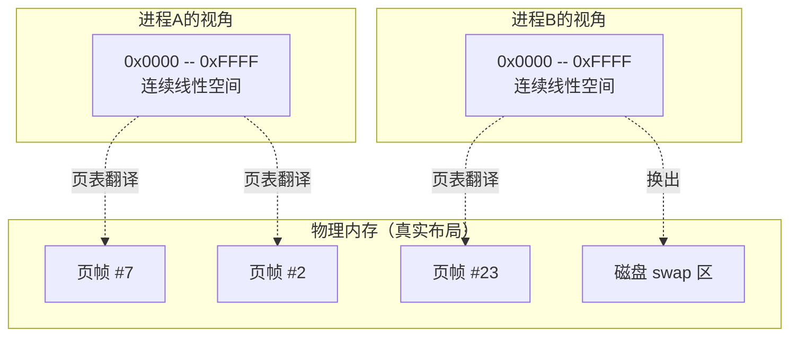

**知识点1 [I]**

> 从 malloc(1GB) 不报错的故事讲起：虚拟内存是"空头支票"

几年前我在一个嵌入式项目里遇到过这样一件事——客户的设备内存只有 512MB，但跑了一个第三方库，启动时 `malloc` 申请了整整 1GB。按常理说，这不该直接崩掉吗？结果程序不但没挂，还欢快地跑起来了。直到后来某个代码路径真正去读写那块内存里的某个页面，系统才 oom-killer 出击。

怎么回事？

这就是虚拟内存最反直觉的地方：**`malloc` 成功返回，不等于你真的拿到了物理内存。**

下面这段代码你可以在自己的 Linux 机器上跑一跑，体会一下：

```c
#include <stdio.h>
#include <stdlib.h>
#include <string.h>
#include <unistd.h>

#define SIZE (1024UL * 1024 * 1024)  /* 1GB */

int main()
{
    printf("PID: %d\n", getpid());
    printf("Before malloc, press Enter to continue...\n");
    getchar();

    char *p = malloc(SIZE);
    if (!p) {
        perror("malloc");
        return 1;
    }
    printf("After malloc(1GB), press Enter...\n");
    getchar();

    /* 逐页 touch，让 RSS 慢慢涨 */
    for (size_t i = 0; i < SIZE; i += 4096) {
        p[i] = 1;
        if ((i & 0x1FFFFFF) == 0)   /* 每 32MB 打印一次 */
            printf("Touched %zu MB\n", i / (1024 * 1024));
    }
    printf("Done. press Enter...\n");
    getchar();

    return 0;
}
```

跑的时候开另一个终端，用 `top -p $(pidof a.out)` 盯着看：

| 阶段 | `VIRT`（虚拟内存） | `RES`（物理驻留 RSS） | 说明 |
|------|--------------------|----------------------|------|
| malloc 前 | ~4KB | ~4KB | 进程刚起来 |
| malloc 后 | ~1GB+ | ~4KB（几乎没变） | 内核只画了张"地图"，没分配物理页 |
| touch 32MB 后 | ~1GB+ | ~32MB | 每页首次访问触发缺页中断，MMU 逐页映射 |
| touch 全部后 | ~1GB+ | ~1GB | 若物理内存够的话 |

这个实验揭示了一个核心事实：**虚拟地址空间和物理地址空间是两层完全独立的体系。** 程序看到的只是内核精心编排的"幻觉"。


MMU（Memory Management Unit）在这里扮演着"翻译官"的角色。CPU 发出的是虚拟地址，MMU 查页表翻译成物理地址，然后才能真正去读写内存条上的数据。如果页表里找不到这个虚拟地址对应的物理页，MMU 就会触发一个缺页异常（Page Fault），此时 CPU 跳到内核的缺页处理程序里，内核判断一下这个地址合不合法、该不该分配物理页、是不是要从磁盘 swap 进来，处理完再把控制权交回用户态。

所以 `malloc` 到底做了啥？说白了，它只是让内核在进程的虚拟地址空间里"圈了一块地"，标记为"这块地归你了"，但地上的砖（物理页）一块都没铺。这就是虚拟内存的"空头支票"本质——先承诺，后兑现，甚至有时候兑现不了（OOM）。

---

**知识点2 [I]**

> 虚拟内存的三大价值：隔离、超额、连续

上面讲的那个把戏可不是为了糊弄程序员用的。虚拟内存这套机制能成为现代操作系统的基石，靠的是三个核心能力，缺一不可：

**隔离（Isolation）**

每个进程都有自己的独立虚拟地址空间，A 进程里的 0x400000 和 B 进程里的 0x400000 是完全不同的两个物理位置。没有虚拟内存，一个野指针可能就会戳到内核或者其他进程的地盘，安全无从谈起。MMU 的页表权限位（R/W/X、用户态/内核态）让这种隔离不仅是地址层面的，更是访问权限层面的。

**超额（Over-commitment）**

32 位系统理论上每个进程有 4GB 虚拟空间，系统里跑几十个进程，虚拟地址加起来远超物理内存。内核允许你"超额申请"——所有进程的虚拟地址总量可以远大于实际物理 RAM，因为大家不可能同时把所有页都用满。Linux 的 overcommit 策略甚至默认允许 `malloc` 比物理内存大得多的空间（虽然可能最终 OOM，但那是另一个话题）。

**连续（Contiguity）**

程序视角里看到的地址空间是平坦连续的，但背后的物理页帧可以东一块西一块，甚至可以暂时落在磁盘 swap 上。内核通过页表把离散的物理资源整合成一个"看起来很美"的连续空间，编译器、链接器、应用开发者都不用操心物理布局。



说白了，虚拟内存就是操作系统给程序制造的**幻觉**——但这个幻觉太有用了，没有它，多任务、内存保护、swap 这些现代操作系统的基本能力都无从谈起。

---

**陷阱与常见误解**

- `malloc` 返回非 NULL 绝不等于内存申请一定成功。在 Linux 默认的 overcommit 模式下，OOM killer 可能会在真正使用内存时才出现。如果需要严格保证，要用 `mlock()` 或者修改 `vm.overcommit_memory`。
- 把虚拟地址直接当物理地址用的想法，在内核里也不行——内核虚拟地址（如 kmalloc 返回的）和物理地址之间同样需要转换，只是内核态的页表对所有进程共享而已。
- `memset(p, 0, SIZE)` 在 `malloc` 后立即执行，看似安全，实则会强制触发所有页的物理分配，可能瞬间把 OOM 的风险提前引爆。测试环境没事，生产环境可能暴雷。
