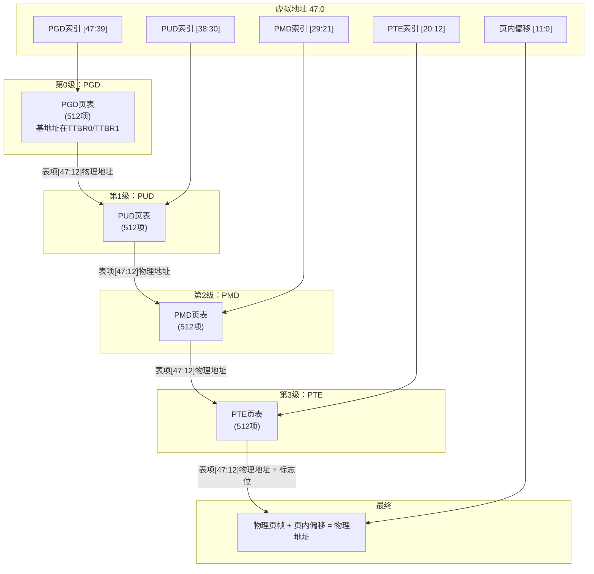

你知道为什么ARM64叫"AArch64"吗？因为地址是64位的——但虚拟地址真的用了64位吗？

说实话，并没有。ARMv8架构虽然顶着64位的大名，但主流的虚拟地址设计只用到48位，剩下那16位留着以后扩展。48位虚拟地址意味着用户可以访问256TB的空间——用户空间128TB，内核空间128TB，以47位为界。

好，问题又来了：这48位虚拟地址是怎么一步步映射到物理地址的？答案就是**4级页表查找（4-level page table lookup）**。

**知识点3 [I][M]**

ARM64把48位虚拟地址切成5段：前4段每段9位，分别作为4级页表的索引；最后一段12位，是页内偏移。9位索引意味着什么？512个表项。为什么是512？因为每级页表正好占一个4KB的页（512 × 8字节 = 4096字节）。这个设计不是随便定的——9位索引 + 12位页内偏移 = 48位，严丝合缝。

地址分解是这样的：

```
VA[47:0] 的分解（4KB页，4级页表）
┌────────┬────────┬────────┬────────┬────────────┐
│ PGD    │ PUD    │ PMD    │ PTE    │ 页内偏移   │
│ [47:39]│ [38:30]│ [29:21]│ [20:12]│  [11:0]    │
│  9bit  │  9bit  │  9bit  │  9bit  │   12bit    │
│ 512项  │ 512项  │ 512项  │ 512项  │   4KB页    │
└────────┴────────┴────────┴────────┴────────────┘
```

4级页表的名字要记住：**PGD**（Page Global Directory）、**PUD**（Page Upper Directory）、**PMD**（Page Middle Directory）、**PTE**（Page Table Entry）。Linux内核代码里全是这几个缩写，搞混了读代码会晕。

整个查找过程就像走迷宫，每一级根据索引找到一个门牌号，指向下一级的房间：



PGD的基地址存在哪里？用户空间的PGD指针放在**TTBR0_EL1**寄存器，内核空间的放在**TTBR1_EL1**寄存器。CPU做地址转换时，先看虚拟地址的最高位：如果是0，用TTBR0走用户空间页表；如果是1，用TTBR1走内核空间页表。这就是为什么ARM64的用户空间和内核空间各占128TB——最高位一劈两半，泾渭分明。

每个页表项占8个字节（64位），结构长这样：

```
┌──────────────────────────────────────────────────────┬────────────┐
│              下一级页表物理地址 [47:12]                │  标志位    │
│              (或物理页帧地址，末级PTE)                 │ [11:0]     │
│              36位，4KB对齐                            │            │
└──────────────────────────────────────────────────────┴────────────┘
```

注意这个物理地址只存了[47:12]，低12位永远为0（页表必须4KB对齐），省出来的12位用来放标志位。相关定义在`arch/arm64/include/asm/pgtable-hwdef.h`里：

```c
/* 页表项类型 */
#define PTE_TYPE_PAGE       (3 << 0)    /* 末级：指向4KB页 */
#define PTE_TYPE_BLOCK      (1 << 0)    /* 大块映射 */
#define PTE_TABLE_BIT       (1 << 1)    /* 指向下一级页表 */
#define PTE_AF              (1 << 10)   /* Access Flag */
#define PTE_AP_SHIFT        6           /* 访问权限位 */
#define PTE_SH_SHIFT        8           /* Shareability */
#define PTE_PXN             (1UL << 53) /* 特权态不可执行 */
#define PTE_UXN             (1UL << 54) /* 用户态不可执行 */
```

这里有个新手容易踩的坑：页表项里的物理地址是**已经右移了12位**的，只存高36位。取出来用的时候再左移回来。`pte_pfn()`和`pfn_pte()`这对宏就是干这个的。我见过一个驱动bug，有人把物理地址左移12位才填进去，结果映射全错位。

ARM64还允许PMD或PUD级别做**块映射（block mapping）**——表项类型位标记为block时，不指向下一级页表，而是直接包含一个2MB（PMD级）或1GB（PUD级）大页的物理基地址。省掉一级查找，TLB miss少读一次内存。内核镜像、huge page这些场景都爱用这个。

**知识点4 [I]**

快速过一遍页表项里决定"这页能不能读、写、执行"的标志位：

| 标志位 | 位域 | 含义 |
|--------|------|------|
| AF (Access Flag) | [10] | 访问标志。Linux默认清0，首次访问触发Permission fault后内核置位，避免`fork()`时遍历清零页表 |
| AP[2:1] | [7:6] | 访问权限。AP[2]=1只读，AP[1]=1用户态可访问 |
| SH[9:8] | [9:8] | Shareability。00=Non, 10=Outer, 11=Inner |
| UXN | [54] | 用户态不可执行 |
| PXN | [53] | 特权态不可执行。用户空间页默认设PXN，防内核误跳转 |

这些标志位和`/proc/<pid>/maps`的权限列直接对应。比如`r-xp`里的`r`对应AP允许读，`x`对应UXN/PXN允许执行，底层都体现在这些硬件位上。UXN/PXN是ARM64双向隔离的关键设计——用户页设PXN=1，内核页设UXN=1。早年间ARM32只有一个XN位，粒度太粗。排权限问题时`dmesg`看到"Permission fault"，先看UXN/PXN位，十有八九是权限标错了。
