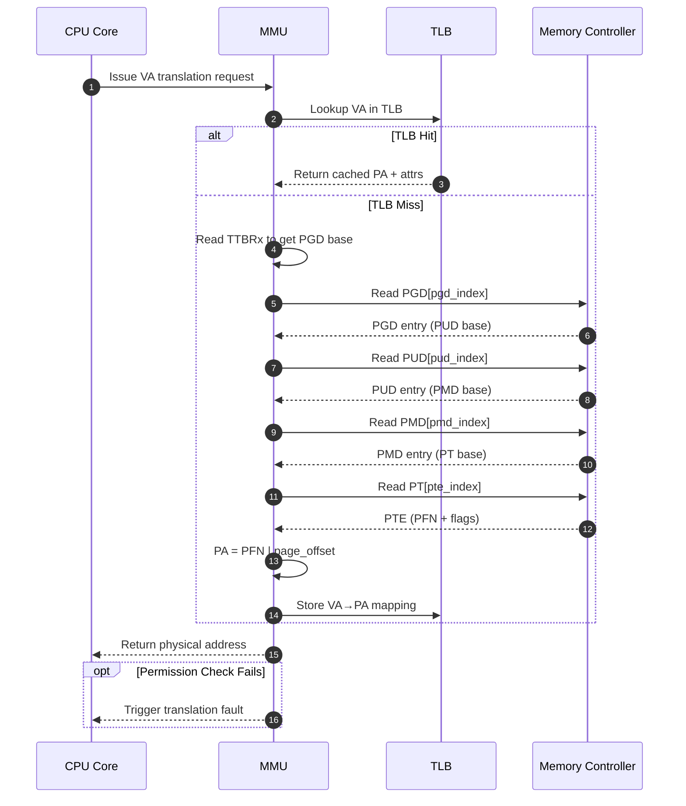

MMU是怎么找到物理地址的？想象你在图书馆找一本书。走进大门，墙上挂着"总目录柜"的牌子——这对应TTBR0/TTBR1寄存器，里面存放着PGD的基地址。接下来你的每一步查找，都是在目录柜里翻抽屉，从大类到小类，最终拿到书架上那本书的确切位置。

页表查找（page table walk）的本质就是这样一个逐级索引的过程。4级页表下，一个虚拟地址被切成了5段：PGD索引、PUD索引、PMD索引、PTE索引、页内偏移。MMU拿第一段去PGD里找，拿到下一级PUD的基地址；再用第二段去PUD里找……以此类推，直到PTE里挖出最终的物理页帧号，最后把页帧号和页内偏移拼在一起，就是完整的物理地址了。

听起来机械，实际上每一步都可能踩坑。比如某级页表项的valid位是0——这页还没分配——MMU就会触发缺页异常，把控制权扔给内核。又或者权限位检查发现用户态程序试图写只读的页面，同样的结局。

**知识点5 [I][M]**

咱们用一个简化版的Python模拟来直观感受整个walk过程。下面假设页表只有2级（类似早期ARM的粗粒度方案），虚拟地址16位，高8位是目录索引，低8位是页内偏移：

```python
#!/usr/bin/env python3
"""Simplified page table walk simulation."""

# Simulated physical memory: address -> value
phys_mem = {}

def phys_read(addr):
    """Read a 32-bit word from physical memory."""
    return phys_mem.get(addr, 0)

def page_table_walk(pgdir_phys, va):
    """
    2-level page table walk.
    pgdir_phys: PGD base physical address
    va: 16-bit virtual address
    """
    pgd_index = (va >> 8) & 0xFF    # 高8位: PGD索引
    offset    = va & 0xFF           # 低8位: 页内偏移

    # Step 1: Read PGD entry
    pgd_entry_addr = pgdir_phys + pgd_index * 4
    pgd_entry = phys_read(pgd_entry_addr)
    print(f"  [PGD] idx={pgd_index:#x}, entry@{pgd_entry_addr:#x} = {pgd_entry:#x}")

    if (pgd_entry & 1) == 0:        # valid bit check
        print("  --> FAULT: PGD entry not valid!")
        return None

    # Extract next-level table base (simplified: upper bits)
    pt_base = pgd_entry & 0xFFF0

    # Step 2: Page table is only 1 level below PGD in this simplified model
    #         So we use remaining bits to index into it
    pte_index = 0   # simplified: direct mapped
    pte_addr  = pt_base + pte_index * 4
    pte       = phys_read(pte_addr)
    print(f"  [PTE] idx={pte_index}, entry@{pte_addr:#x} = {pte:#x}")

    if (pte & 1) == 0:
        print("  --> FAULT: PTE not valid!")
        return None

    # Extract page frame number
    pfn   = pte & 0xFF00
    pa    = pfn | offset
    print(f"  --> PA = PFN({pfn:#x}) + offset({offset:#x}) = {pa:#x}")
    return pa


# ---- Setup test scenario ----
# PGD sits at physical address 0x1000, has 256 entries (4 bytes each)
PGD_BASE = 0x1000

# Map one entry: virtual page 0x05 -> physical page 0x3000
# PGD[5] points to a page table at 0x2000
phys_mem[PGD_BASE + 5 * 4] = 0x2001   # valid=1, pt_base=0x2000

# Page table at 0x2000: PTE[0] maps to physical page 0x3000
phys_mem[0x2000] = 0x3001              # valid=1, pfn=0x3000

# Test walk: VA = 0x0523  (pgd_index=5, offset=0x23)
print("Walking VA = 0x0523...")
pa = page_table_walk(PGD_BASE, 0x0523)
assert pa == 0x3023, f"Expected 0x3023, got {pa:#x}"
print("Success!\n")

# Test fault: unmapped VA
print("Walking unmapped VA = 0x0A00...")
pa = page_table_walk(PGD_BASE, 0x0A00)
assert pa is None
print("Fault caught as expected!")
```

跑一遍上面的代码，你会发现walk的核心逻辑出奇地直接：拆索引、读表项、检查valid位、拼地址。真正复杂的是隐藏在细节里的权限检查、缓存属性、大页处理、TLB交互这些旁支逻辑。

真实的ARM64 4级walk流程用序列图表示更清楚：



这个图里第2步的TLB lookup是关键优化。如果命中，一次地址转换只需要几个时钟周期；如果miss，最坏情况下要读4次内存，每次几十上百个周期。ARM v8.2推出的"连续页表项"（contiguous bit）就是用来减少这种惩罚的——把16个连续的PTE标记为一个整体，TLB可以一次缓存一大片。

walk过程中还有一个容易被忽略的细节：页表本身也是存在内存里的。这意味着每次查表都要做一次物理内存访问，而内存访问比寄存器操作慢好几个数量级。这就是为什么TLB如此重要，也是为什么Linux内核在切换进程时必须执行TLB flush——新进程的页表完全不同，旧的缓存映射只会制造混乱。

**知识点6 [E]**

Linux内核里也有一套手动walk页表的"工具链"。当你需要在缺页异常处理、内存迁移或debug场景下自己查页表时，下面这组宏就是你的工具箱：

| 宏/函数 | 作用 | 典型使用场景 |
|---------|------|-------------|
| `pgd_offset(mm, addr)` | 取指定地址对应的PGD表项 | 页表遍历入口 |
| `pud_offset(pgd, addr)` | 取PUD表项 | 4级/5级页表walk |
| `pmd_offset(pud, addr)` | 取PMD表项 | 检查大页映射 |
| `pte_offset(pmd, addr)` | 取PTE表项 | 最终物理页定位 |

这组宏在`arch/arm64/include/asm/pgtable.h`里定义，内部做了不少针对ARM64特化的处理。比如`pgd_offset`不只是简单做数组索引，还要处理`CONFIG_PGTABLE_LEVELS`不同配置下的差异。

内核里什么时候会手动walk页表呢？最常见的是`handle_mm_fault`处理缺页异常的时候——MMU抛了一个fault，内核得自己查页表看看到底是缺页、权限错误还是别的问题。另外在做内存迁移（`move_page_tables`）、/proc/meminfo信息收集、或者KASAN检查内存访问合法性时，也会用到这些宏。正常情况下MMU硬件自己walk，内核不插手；只有当硬件搞不定、或者内核想确认某些东西的时候，这些宏才派上用场。
