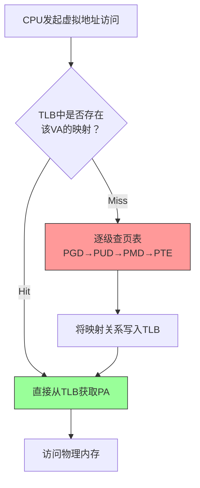
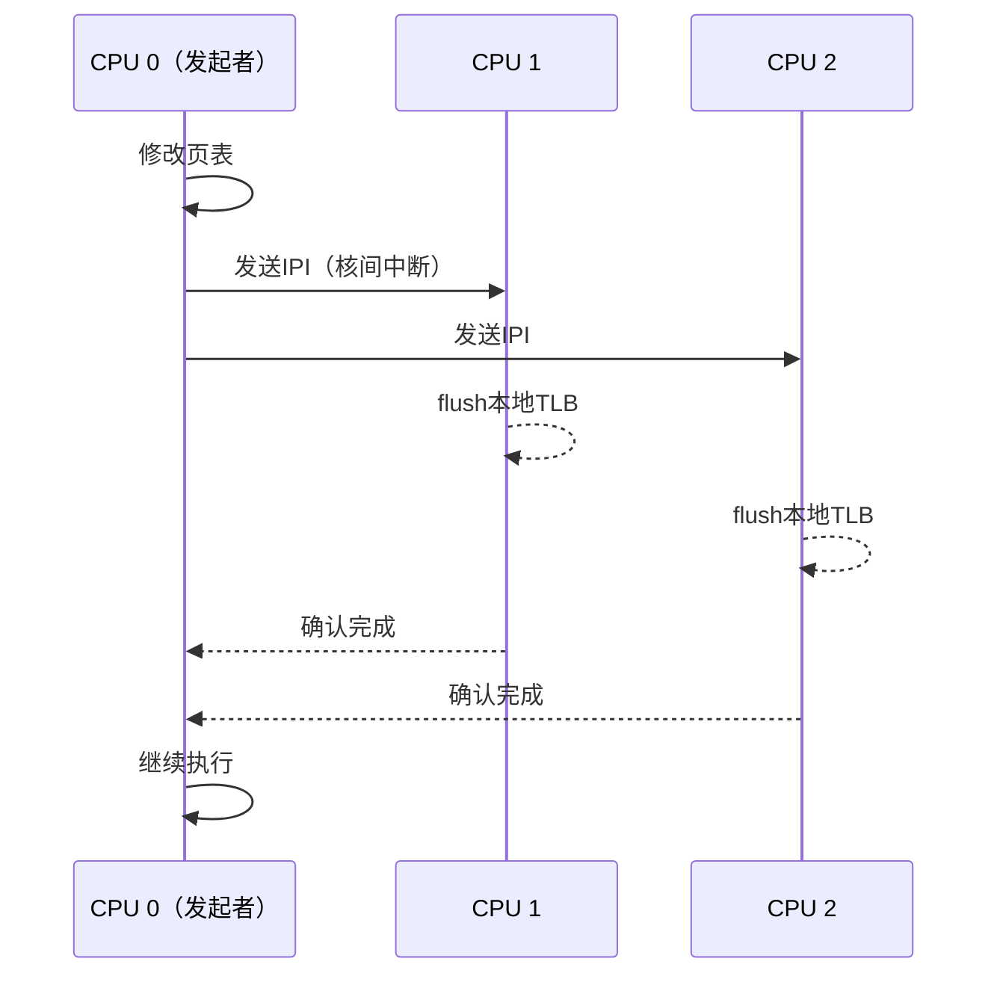

**知识点7 [I]**

TLB就像是页表的"快捷方式"。前面我们讲到，ARM64在4级页表架构下，把虚拟地址翻译成物理地址需要依次查询PGD→PUD→PMD→PTE四级页表，每一级都有一次内存访问。这意味着一次有效的地址转换最多要走4次内存。听起来还行？但问题是——CPU执行每一条指令、读写每一个变量，几乎都要做地址转换。如果每次访存都先从内存里查4次页表，CPU大部分时间都在等内存，这性能根本没法接受。

上世纪80年代的工程师们想了个办法：既然程序的访存具有很强的时间局部性——刚访问过的地址大概率很快还会再访问——那为什么不把最近用过的"虚拟地址→物理地址"映射关系缓存到CPU内部呢？这就是TLB（Translation Lookaside Buffer）的由来。本质上，TLB是MMU内部的一块高速SRAM，存放着最近命中过的页表项。有了它，地址转换的流程就变成了下面这样：

当TLB命中（TLB Hit）时，地址转换在几个时钟周期内就能完成，几乎可以忽略不计。但一旦TLB未命中（TLB Miss），就得老老实实去内存里查页表，走完整套4级lookup流程，延迟一下子翻了几十倍。在ARM Cortex-A系列上，TLB命中通常只要几个cycle，而一次miss则可能拖出上百个cycle——这差距可不是一星半点。

实际项目中，TLB miss的开销往往比你想象的更隐蔽。我见过一个案例：团队在一款安防NVR上做性能优化，CPU占用率明明不高，但视频帧处理延迟忽大忽小。抓了一圈ftrace，最后发现瓶颈出在频繁`mmap`/`munmap`导致TLB频繁miss上。后来改用大页（Huge Page）减少了页表层级，问题才缓解。这个经验的底层逻辑就是：页表层级越少，单次miss时查表开销越小；同时大页覆盖的地址范围更大，同一个TLB项能服务更多地址，间接提高了TLB的"覆盖率"。

TLB的容量很有限——通常只有几十到几百项，由硬件决定。ARMv8架构一般会配备一两百项的Data TLB和Instruction TLB各一个，容量不大但速度极快。操作系统能做的是尽量减少不必要的页表抖动，让"热"映射尽可能留在TLB里。

| 场景 | TLB状态 | 额外内存访问次数 | 典型延迟（cycles） |
|------|---------|-----------------|-----------------|
| TLB Hit | 命中 | 0 | 3~5 |
| TLB Miss（L1页表缓存命中）| 未命中 | 1~2 | 20~40 |
| TLB Miss（走完整页表walk）| 未命中 | 4 | 80~200 |

> **陷阱**：嵌入式平台上很多人会忽略TLB的影响，因为"才几百个cycle，忍忍就过去了"。但在音视频、工业控制这类延迟敏感场景里，TLB miss的抖动（jitter）会直接体现在端到端延迟上，debug起来特别折磨人。

---

**知识点8 [E]**

多核时代，TLB管理变得麻烦多了。假设CPU 0修改了某个进程的页表（比如做了`munmap`），把一段虚拟地址的映射给删掉了——可CPU 1的TLB里可能还缓存着这段地址的旧映射。如果不处理，CPU 1再去访问这段地址时，TLB命中了一个"幽灵映射"，访问到的可能是错误的物理页，甚至触发安全问题。

这时候就需要**TLB shootdown**。流程大概是这样的：

说白了就是：改页表的那个核，要给所有可能受影响的其他核发一条核间中断（IPI），让它们把自己的TLB里相关的项刷掉。其他核刷完后回复确认，发起者才能继续往下走。

这个机制的代价在`vmalloc`/`vfree`频繁的场景下尤其明显。内核的vmalloc区域每次分配都会建立新的页表映射，释放时又要拆映射，每次都可能触发一轮shootdown。早年间有个网关设备的项目，驱动里频繁用`vmalloc`分配大块DMA缓冲区，结果发现系统一跑起来就有大量的IPI开销，`/proc/interrupts`里的RES（rescheduling IPI）数字蹭蹭往上涨。后来改成用`dma_alloc_coherent`配合CMA，绕过了vmalloc的频繁shootdown，性能直接提升了一截。

如果 profilers 显示你的系统 IPI 数量异常高，不妨往这个方向查一查——页表修改和TLB shootdown，往往是多核性能毛刺的隐藏元凶。
