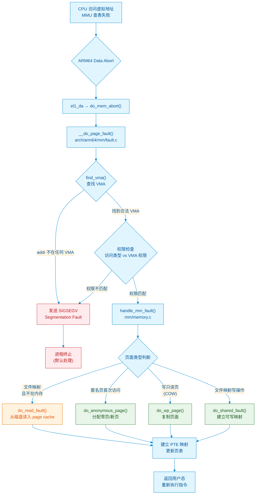

# 9.1.4 缺页中断与内核空间布局

> **主题**：Page Fault 的完整处理流程与 ARM64 内核空间三大区域划分

page fault 听到"fault"这个词，你是不是以为是程序出错了？恰恰相反——它是 Linux 内存管理最核心的正常工作机制。

---

## 知识点107 [I][M]：do_page_fault() 的调用路径与三种 Fault 类型

> 理解 `do_page_fault()` 的完整调用链，掌握 major fault、minor fault、segmentation fault 的本质区别，以及 COW 的底层实现原理。

### 从 MMU 触发到内核处理

当 CPU 访问一个虚拟地址时，MMU 会遍历页表寻找对应的物理页。如果页表项为空（PTE 无效）或权限不匹配（如写只读页），MMU 硬件会触发一个异常。在 ARM64 架构中，这表现为**数据异常（Data Abort）**，CPU 自动跳转到异常向量表的 `do_mem_abort` 入口，最终调用 `arch/arm64/mm/fault.c` 中的 `do_page_fault()` 函数。

```c
/* arch/arm64/mm/fault.c */
static void __do_page_fault(struct mm_struct *mm, unsigned long addr,
                           unsigned int mm_flags, struct pt_regs *regs,
                           unsigned int fault_code)
{
    struct vm_area_struct *vma;
    int fault;

    /* 查找 addr 所属的 VMA */
    vma = find_vma(mm, addr);
    if (unlikely(!vma)) {
        /* 地址不在任何 VMA 范围内 → 非法访问 */
        goto bad_area;
    }
    if (likely(vma->vm_start <= addr))
        goto good_area;  /* 正常 VMA 范围内 */
    if (unlikely(!(vma->vm_flags & VM_GROWSDOWN)))
        goto bad_area;   /* 栈下方也不合法 */

    /* 尝试扩展栈 */
    if (expand_stack(vma, addr))
        goto bad_area;

good_area:
    /* 权限检查：申请的访问类型与 VMA 权限是否匹配 */
    if ((fault_code & FAULT_FLAG_WRITE) && !(vma->vm_flags & VM_WRITE))
        goto bad_area;   /* 写不可写区域 */
    if ((fault_code & FAULT_FLAG_INSTRUCTION))
        goto bad_area;   /* 取指令异常且无可执行权限 */

    /* 核心：调用 handle_mm_fault() 进行页级处理 */
    fault = handle_mm_fault(vma, addr, mm_flags, regs);

    if (fault_signal_pending(fault, regs))
        return;  /* 被信号中断 */

    if (unlikely(fault & VM_FAULT_ERROR)) {
        if (fault & VM_FAULT_OOM)
            goto out_of_memory;
        if (fault & VM_FAULT_SIGSEGV)
            goto bad_area;
        if (fault & VM_FAULT_SIGBUS)
            goto do_sigbus;
    }
    /* ... */

bad_area:
    __do_kernel_fault(regs, addr, fault_code, vma);  /* 内核态访问错误 */
    /* 或 */
    do_force_sig_fault(SIGSEGV, ...)  /* 用户态 → 段错误 */
}
```

`__do_page_fault()` 的核心逻辑分为三步：首先通过 `find_vma()` 确认触发异常的地址是否落在某个已注册的 VMA（Virtual Memory Area）内；若不在任何 VMA 中，直接走向 `bad_area`，向进程发送 `SIGSEGV`。其次进行权限校验——即便地址落在合法 VMA 内，如果访问类型（读/写/执行）与 VMA 的权限位不匹配，同样判定为非法访问。最后，通过合法性检查的 fault 进入 `handle_mm_fault()`，由后者根据页面类型执行具体的缺页处理策略。

### 三种 Fault 类型

Page fault 并非单一概念，Linux 内核根据处理方式和开销将其细分为三类：

#### Major Fault（主缺页）

**触发条件**：访问的页面不在物理内存中，需要**从磁盘（swap 分区或文件系统）加载数据**。

完整路径是：进程访问虚拟地址 → MMU 发现 PTE 无效 → 进入 `do_page_fault()` → `handle_mm_fault()` → `do_read_fault()` → `page_cache_read()` 发起 I/O → 从磁盘读取页面到 page cache → 建立 PTE 映射 → 返回用户态重新执行指令。

一次 major fault 的延迟通常在**毫秒级别**（磁盘 I/O），是 page fault 中代价最高的类型。启动大型应用程序时看到的"卡顿"，往往就是成百上千次 major fault 叠加的结果。当系统内存紧张、大量匿名页被换出到 swap 分区后，再次访问这些页面会触发 major fault，从 swap 分区换入，这种现象被称为**换页抖动（thrashing）**。

> 💡 **速记口诀**：Major fault 等磁盘，Minor fault 只操作内存。

#### Minor Fault（次缺页 / 软缺页）

**触发条件**：页面已满足分配条件，**不需要磁盘 I/O**，仅需内核完成页表设置或页面复制。

典型场景包括：
- **匿名页首次写入**：`malloc` 后首次访问，`do_anonymous_page()` 分配一个零初始化页（来自 zero page 或新分配的物理页），建立 PTE 映射。
- **COW（Copy-On-Write）**：`fork()` 时父子进程共享只读页面，写操作触发 `do_wp_page()`，复制页面并建立私有映射。
- **共享库映射**：动态链接库的代码段已在 page cache 中，仅需建立进程页表到已有页面的映射。

Minor fault 的延迟在**微秒级别**，完全在内核态完成，不涉及磁盘。绝大多数 page fault 属于此类。

#### Segmentation Fault（段错误）

**触发条件**：访问的虚拟地址**不在任何 VMA 范围内**，或**权限不匹配**（如写只读的代码段、执行不可执行的数据段）。

此时 `find_vma()` 找不到合法 VMA，或权限检查发现冲突，内核向进程发送 `SIGSEGV` 信号。默认处理是终止进程并生成 core dump。这是程序 bug 的典型表现——空指针解引用、栈溢出、越界访问等。

> ⚠️ **陷阱**：`SIGSEGV` 不是硬件"段"的概念，而是历史遗留名称。实际上是页级访问权限检查失败。

### COW 的实现基础

Copy-On-Write 是 Linux 进程创建的核心优化。当 `fork()` 创建子进程时：

1. 父进程的所有可写匿名页被标记为**只读**（PTE 清除写权限位）。
2. 父子进程的页表指向**同一组物理页**，并将页面引用计数设为 2。
3. 任一进程尝试写入时，MMU 触发 page fault（写只读页）。
4. `do_wp_page()` 检测到这是 COW 场景，分配新的物理页，复制旧页内容，更新当前进程的 PTE 为可写，重新执行写指令。

```c
/* mm/memory.c - do_wp_page */
static vm_fault_t do_wp_page(struct vm_fault *vmf)
    __releases(vmf->ptl)
{
    struct page *old_page = vmf->page;
    struct page *new_page;

    if (page_ref_count(old_page) > 1) {
        /* 有多个引用者 → 需要复制 */
        new_page = alloc_page_vma(GFP_HIGHUSER_MOVABLE, vma, addr);
        copy_user_highpage(new_page, old_page, addr, vma);
        /* 更新 PTE 指向新页面，并恢复写权限 */
        wp_page_reuse(vmf, new_page);
        /* 减少旧页面引用计数 */
        put_page(old_page);
    } else {
        /* 唯一引用者 → 直接恢复写权限 */
        wp_page_reuse(vmf, old_page);
    }
}
```

这种延迟复制策略使得 `fork()` 的开销极低——不需要立即复制整个地址空间，只有真正发生写入的页面才进行复制。对于执行 `fork()` 后立即调用 `exec()` 的场景（如 shell 创建子进程），子进程可能一个页面都不写就直接替换地址空间，此时 COW 带来的节省是 100%。

> 🔍 **内核视角**：`/proc/vmstat` 中的 `pgfault`（总 page fault 次数）、`pgmajfault`（major fault 次数）可以帮你判断系统内存压力。若 `pgmajfault` 持续走高，说明系统正在频繁换页，可能需要增加物理内存或调整 swap 策略。

### Page Fault 处理流程图



---

## 知识点108 [I]：内核空间的三大区域与 /proc/pid/maps 解读

> 理解 ARM64 内核地址空间的三大区域划分及其设计 rationale，掌握 `/proc/pid/maps` 的逐列含义。

### 内核空间三大区域

在 ARM64 的 48 位虚拟地址空间中，高 128TB（`0xffff_0000_0000_0000` ~ `0xffff_ffff_ffff_ffff`）保留给内核。这片区域划分为三个功能明确的子区域：

#### 线性映射区（Linear Mapping）

**地址范围**：通常从 `0xffff_8000_0000_0000` 起（由 `PAGE_OFFSET` 定义）。

**核心特征**：物理内存被**连续、直接**地映射到这片虚拟地址区域。虚拟地址与物理地址之间只存在一个固定的偏移量：

```c
#define __va(x)     ((void *)((unsigned long)(x) + PAGE_OFFSET))
#define __pa(x)     ((unsigned long)(x) - PAGE_OFFSET)
```

**用途**：内核代码、kmalloc 分配的内存、页表等绝大多数内核态内存都位于此区域。

**优势**：转换高效（只需加减常量），TLB 命中率高，适合频繁访问的内核数据。

#### Vmalloc 区（Non-contiguous Mapping）

**地址范围**：`VMALLOC_START` ~ `VMALLOC_END`，位于线性映射区下方。

**核心特征**：虚拟地址连续，但对应的**物理页可以分散**在物理内存中，通过独立的页表管理。

**用途**：ioremap（设备物理地址映射到内核空间）、大块动态内存分配、以及内核栈等场景。vmalloc 让内核可以像用户空间的 mmap 一样，用散落的物理页拼接出连续的虚拟地址空间。

**代价**：访问需额外 TLB 开销（独立二级页表），地址转换不能用简单的 `__va()`/`__pa()`，必须遍历页表。vmalloc 区域总大小通常有限（128MB~256MB），过度使用会耗尽空间。

> ⚠️ **注意**：`/proc/vmallocinfo` 可查看当前所有 vmalloc 分配。

#### Modules 区（Kernel Modules）

**地址范围**：`MODULES_VADDR` ~ `MODULES_END`，紧邻 vmalloc 区域下方。

**核心特征**：专门用于加载内核模块（`.ko` 文件）的代码段、数据段和 BSS 段。

**用途**：隔离内核模块与核心内核的地址空间，便于模块的动态加载和卸载。

### 为什么这样划分？

三大区域的划分体现了内核设计的核心思想：**不同的使用模式需要不同的映射策略**。

| 区域 | 映射特性 | 适用场景 | 核心优势 |
|------|----------|----------|----------|
| 线性映射区 | 虚拟-物理固定偏移 | 内核数据、kmalloc、页表 | 转换极快，TLB 高效 |
| vmalloc 区 | 虚拟连续、物理不连续 | ioremap、大块动态内存 | 突破物理碎片限制 |
| modules 区 | 独立映射 | 内核模块加载 | 隔离模块与核心内核 |

若所有内核内存都线性映射，物理内存碎片化时将无法分配大块连续物理页。vmalloc 区让内核用分散的物理页拼接连续虚拟空间。模块独立映射则避免了加载/卸载对核心内核地址空间的扰动。

### /proc/pid/maps 逐列解读

`/proc/pid/maps` 是观察进程地址空间最直观的工具：

```
55a3c2d6b000-55a3c2d6d000 r-xp 00000000 08:01 1310734    /usr/bin/cat
55a3c2f6d000-55a3c2f6e000 rw-p 00002000 08:01 1310734    /usr/bin/cat
7ffd9b3fe000-7ffd9b41f000 rw-p 00000000 00:00 0          [stack]
```

| 列 | 示例值 | 含义 |
|----|--------|------|
| 1 | `55a3c2d6b000-55a3c2d6d000` | VMA 虚拟地址范围（起始-结束） |
| 2 | `r-xp` | 权限：`r`=读，`w`=写，`x`=执行，`p`=私有，`s`=共享 |
| 3 | `00000000` | 文件映射时在文件中的偏移量 |
| 4 | `08:01` | 设备号（主:次） |
| 5 | `1310734` | 文件 inode 号 |
| 6 | `/usr/bin/cat` | 映射文件路径，或 `[stack]`/`[heap]`/`[vdso]` 等 |

权限列含义：`r-xp` = 可读、可执行、不可写、私有映射（典型代码段）；`rw-p` = 可读可写、不可执行、私有（数据段/堆）。第4位的 `p`/`s` 区分私有（COW）与共享（多进程共享同一物理页）。

> 🔍 **调试技巧**：程序报 `SIGSEGV` 时，查看 `/proc/<pid>/maps` 对比触发地址与各 VMA 范围，可快速判断是访问了未映射区域还是权限错误。
