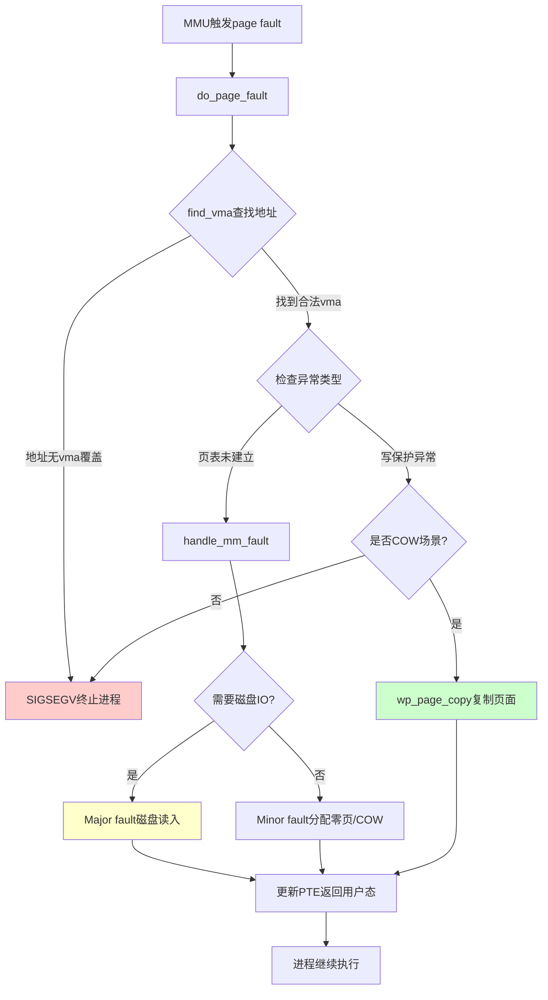

**知识点9 [I][M]**

page fault——听到"fault"这个词，你是不是以为是程序出错了？恰恰相反，缺页中断是操作系统最正常不过的工作流程。没有它，进程地址空间根本跑不起来。

ARM64上的入口在 `arch/arm64/mm/fault.c` 的 `do_page_fault()` 里。当MMU翻译虚拟地址时发现页表项无效（PTE没有present位），硬件会自动跳到这里。内核拿到控制权后，第一件要做的事不是panic，而是淡定地问一句：这个地址，进程到底有没有权限访问？

判断路径很有意思。`do_page_fault()` 会沿着这样一条链路走下来：

```
do_page_fault()
  └── mm/page_alloc.c: find_vma()    // 先查这个地址落在哪个vma里
        ├── 地址不在任何vma范围内 ──→ 非法访问 → SIGSEGV
        ├── vma里有权限，但页表未建立 ──→ 合法的新访问
        │       └── handle_mm_fault() → 分配物理页、填充PTE
        ├── vma只读，但进程试图写入 ──→ 可能是COW，也可能是真越权
        │       └── 检查COW标志 → 复制页面或SIGSEGV
        └── 其他权限不匹配 ──→ SIGSEGV
```

这里就分出三种截然不同的"fault"面孔：

| 类型 | 触发条件 | 处理方式 | 开销量级 |
|------|---------|---------|---------|
| Major fault | 页表未建立，且内容在磁盘（如mmap文件、swap） | 从磁盘读入，分配物理页，填PTE | 毫秒级，最慢 |
| Minor fault | 页表未建立但无需IO（零页初始化、COW） | 仅分配/映射内存，不读磁盘 | 微秒级 |
| Segmentation fault | 地址不在任何vma，或权限严重不足 | 发SIGSEGV，进程被杀 | 无修复 |

Major fault最直观——你第一次访问一个文件映射的页面，内核得去硬盘上把它读进来。`handle_mm_fault()` 一路调到 `do_sync_mmap_readahead()`，磁盘灯闪一下，数据才落进物理页。Minor fault就轻快多了，比如进程刚fork出来时，子进程的地址空间全是父进程的页表映射，标记为只读——这全是minor fault的伏笔。

**COW(copy-on-write)的精妙就在这儿。**

fork() 的时候，内核并不会老老实实把所有父进程的物理页都复制一份。它做的事很简单：把父子双方的PTE全部改成只读，然后在vma上打上VM_SHARED标记。双方看起来各有一份独立的地址空间，实际上在读的时候共享同一批物理页。

```c
// 简化的COW触发路径示意
do_page_fault(unsigned long addr, unsigned int esr, struct pt_regs *regs)
{
    // esr 包含了异常原因——这次是"写权限不足"
    if (esr & ESR_ELx_WNR) {  // Write-not-Read bit set
        vma = find_vma(mm, addr);
        
        // 地址合法，但PTE只读？可能是COW
        if (vma && (vma->vm_flags & VM_WRITE)) {
            // 走 COW 路径：分配新页，复制内容，更新PTE为可写
            return wp_page_copy(vma, pmd, pte, addr);
        }
    }
    // 否则就是真的越权写了
    force_sig(SIGSEGV, current);
}
```

`wp_page_copy()` 这个名字里的"wp"就是write-protect的意思。它干的事儿说透了也不复杂：分配一个新的物理页，把旧页内容memcpy过去，然后把当前进程的PTE指向新页，权限改成可写。从此父子在这一页上彻底分道扬镳——但注意，其他没改过的页依然共享。

这个设计的聪明之处在于，如果fork后子进程马上exec()，那一堆COW页根本就没人写过，复制操作全部省下来了。unix诞生几十年了，这套把戏至今还在用，因为**大多数fork就是不写就直接exec的**。

下面是page fault处理的整体流程：



**陷阱标注**：很多新手一看到dmesg里的"page fault at address 0x0"就慌，觉得内核崩溃了。其实绝大多数page fault都是minor fault，正常得不能再正常。`ps -eo min_flt,maj_flt,cmd` 看一眼，你系统上每个进程都挂着几万甚至几十万次的minor fault，这是健康的表现。

---

**知识点10 [I]**

看COW怎么省内存，写段代码比什么都有说服力：

```c
#include <stdio.h>
#include <unistd.h>
#include <sys/wait.h>

int main(void)
{
    int data = 0x12345678;  // 进程初始数据
    pid_t pid = fork();
    
    if (pid == 0) {
        // 子进程：修改变量，触发COW
        data = 0xDEADBEEF;
        printf("child: data=%x, &data=%p\n", data, &data);
        
        // 观察smaps，此时子进程多了一张Anonymous页面
        getchar();  // 暂停，方便用cat /proc/self/smaps观察
    } else {
        // 父进程：也修改同一变量
        wait(NULL);  // 等待子进程先完成修改
        data = 0xCAFEBABE;
        printf("parent: data=%x, &data=%p\n", data, &data);
    }
    return 0;
}
```

编译运行后，打开另一个终端，用 `cat /proc/$(pidof a.out)/smaps | grep Anonymous -A2` 观察。你会发现一个有趣的现象：fork刚完成时父子共享同一批物理页，RSS加起来几乎等于父进程自己；但子进程写了`data`之后，它的`Anonymous`页面数就往上跳了一页——这一页就是COW复制出来的。

父进程后来也写了自己的那份，于是父子在这一页上彻底分家。同一个虚拟地址，两套物理页，双方各写各的，互不干扰。`vmstat -f` 还能看到系统级的minor fault计数在蹭蹭涨。说到底，COW就是一场"能拖就拖，拖到最后一刻才复制"的lazy game，而page fault正是这场游戏的裁判哨声。
