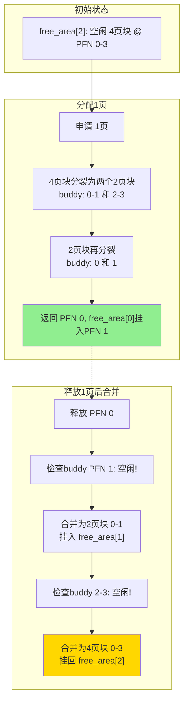

Buddy这个名字听起来很友好，像是某个动画片里的搭档角色。但实际上，这个算法精明得很——它用一种非常优雅的方式解决了内存分配中最让人头疼的两个问题：**如何快速找到合适大小的内存块**，以及**如何在释放时把它们高效地拼回去**。

上世纪60年代，人们在开发操作系统时就发现，物理内存如果采用固定大小的分配粒度，要么浪费严重，要么面对大块分配请求时束手无策。Knuth在他的经典著作里详细描述了一种基于二进制拆分的策略，也就是后来广为人知的Buddy System。Linux内核从2.4版本开始引入这个设计，一直沿用至今。

**知识点13 [I][M] — Buddy系统的二进制伙伴机制**

Buddy系统的核心思想干净利落：把全部内存看成一系列大小为 $2^{order}$ 的块，order从0到10（即1个Page到1024个Page，在4K页大小下就是4KB到4MB）。这些块挂在对应的空闲链表上——`free_area[0]`存1页的小块，`free_area[10]`存1024页的大块。

当你要分配内存时，算法先找大小刚好合适的块。如果没有，就把更大的块**分裂**成两个等大的"伙伴"（buddy），一个拿去用，另一个挂回低一级的链表。反过来，释放的时候，算法会去检查你的"伙伴"是不是也空闲着——如果是，就**合并**成一个更大的块，然后递归地往上继续尝试合并。

这里的关键问题是：怎么确定你的buddy在哪里？

答案是利用地址的数学特性。两个buddy块的大小都是 $2^{order}$，它们在物理地址上只有第order位的差别。换句话说，你的buddy的地址可以通过简单的异或操作算出来：`buddy = page_pfn ^ (1 << order)`。这个设计太妙了——不需要额外的元数据结构，不需要全局搜索， XOR一下就知道该找谁合并。

来看一个分裂与合并的完整过程：

这张图展示了一个经典的场景：系统只有一个4页的空闲块，但你只想要1页。Buddy系统会把大块一路劈下去，最后把PFN 0给你用，PFN 1挂在`free_area[0]`的链表上。释放时，PFN 0发现它的buddy PFN 1正好也闲着，立刻合并成2页块；再一查，2页块的buddy（2-3）也闲着，于是继续合并，最终恢复成原始的4页块。

这个过程中有一个重要约束：**只有buddy之间才能合并，不是任意两个相邻的块都能凑在一起**。这就是"伙伴"这个词的含义——你们是同一父母分裂出来的双胞胎，才能合体。这种约束虽然看起来限制了合并的灵活性，但换来的是O(1)的查找效率和极简的实现。

**知识点14 [I] — Buddy系统的演化历史**

Linux早期的内存管理其实没有这么精巧。1.x时代的内核用的是一种非常朴素的策略：把所有空闲页面串在几条简单的链表上，按大小分类。分配时从头找到第一个够大的块，回收时挂回去。这种方案写起来简单，跑起来问题一大堆。

最严重的是**外部碎片化**。你一开始有一块完整的连续内存，经过多次大小不一的分配和释放后，虽然总的空闲内存还很多，但都被切成了零散的碎片。这时候内核突然要申请一块大的连续内存——比如加载一个内核模块，或者给DMA设备分配缓冲区——就会失败。我见过一个案例：服务器跑了三天，空闲内存还有几百MB，但连着8页的物理空间都找不出来，直接导致内核Oops。

另一个致命伤是这种简单链表**完全无法适应NUMA架构**。当系统有多个CPU、多组内存控制器时，你总得知道一块物理页属于哪个Node、哪个Zone吧？早期那种全局大一统的链表根本做不到这一点。

2.4版本是一个分水岭。内核引入了以Buddy System为核心的页分配器，配合Zone的概念（DMA、Normal、HighMem），把内存按Node和Zone拆分成独立管理的Buddy池。每个Zone都有自己完整的`free_area[]`数组，分配时优先从本节点本Zone找页，既解决了碎片问题，也为NUMA打下了基础。

| 版本 | 核心方案 | 主要问题 | Buddy支持 |
|------|---------|---------|----------|
| Linux 1.x | 简单空闲链表，按大小分类 | 严重外部碎片，无NUMA感知 | 无 |
| Linux 2.4 | 引入Buddy System + Zone划分 | 基本解决碎片，支持NUMA框架 | 有，基础实现 |
| Linux 2.6+ | 多Zone Buddy + 迁移类型(migratetype) | 反碎片进一步优化 | 有，增强版 |

后来的内核继续在这个基础上打磨——2.6引入了页面迁移类型（migrate type）来进一步抑制碎片，较新版本还加入了CMA（Contiguous Memory Allocator）来处理大块连续内存的预留需求。但最核心的二进制伙伴机制，那个用XOR找buddy的精妙设计，六十年来一直没变。

说白了，Buddy System之所以长盛不衰，就是因为它在**实现复杂度**和**分配效率**之间找到了一个近乎完美的平衡点。
