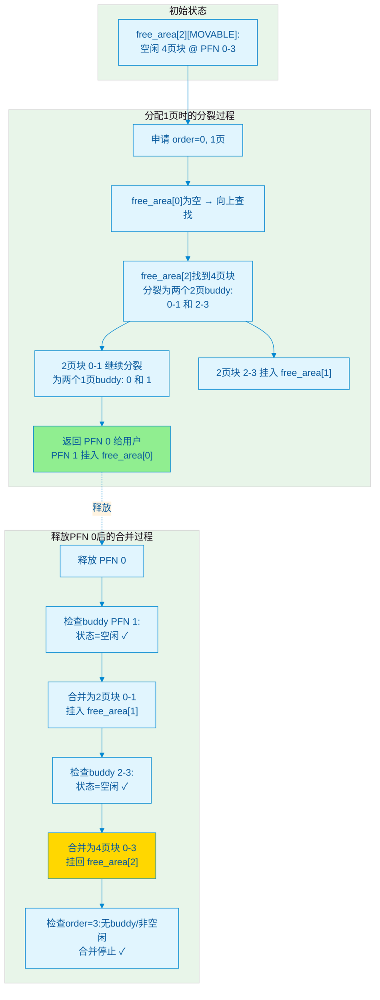

# 9.2.1 Buddy系统的设计与分配

> 所属：第9章 内存管理子系统 > 9.2 物理内存分配：从页到Slab
> 难度：[I→E] | 预计阅读时间：25分钟

## 本节导读

Buddy这个名字听起来很友好，但它背后的算法很精明——它像搭积木一样管理内存，大拆小、小合大，确保分配和回收都高效。当你在用户空间调用`malloc()`申请几十KB内存时，内核并不会直接给你分配物理页；而当你在内核空间调用`alloc_pages()`时，真正干活的正是这个诞生于上世纪60年代、至今仍在Linux内核中扮演核心角色的Buddy System。本节将揭开它的二进制伙伴机制、从`__alloc_pages_nodemask()`到`rmqueue()`的完整调用链，以及内核为了对抗碎片而引入的迁移类型（MIGRATE_TYPES）策略——这些知识是你理解后续Slab、CMA乃至内存规整的必备基础。

---

## 知识点109：为什么叫"Buddy"？二进制伙伴的概念与分裂合并机制 [I][M] ~1200字

### 问题场景

你正在排查一个内核模块加载失败的bug：`insmod`报告`-ENOMEM`，但`free`命令显示系统还有几百MB空闲内存。深入分析后发现，问题是内核找不到**足够大的连续物理页块**来满足DMA缓冲区的需求。虽然总空闲内存很多，但它们被切成了零散的碎片。你打开`/proc/buddyinfo`，看到各order的分布极不均匀——大量1页、2页的小块，却找不到64页以上的大块。这时候你需要理解：Buddy系统是如何组织空闲页面的？它怎样把大块拆成小块来满足分配？又如何在释放时把小块拼回大块？

### 机制深入

#### 二进制伙伴的核心思想

"Buddy"直译是"伙伴"或"搭档"。这个名字的精妙之处在于它的**数学对称性**：系统中的每一块空闲内存都有一个唯一的"伙伴"，两者像孪生兄弟一样，从同一个父块分裂而来，也可以重新合并成父块。

Buddy系统将物理内存组织成大小为 $2^{order}$ 的块，order取值0到10（在4KB页大小下对应4KB到4MB）。这些块由`free_area[order]`数组管理：

| order | 页数 | 大小（4KB页） | 用途场景 |
|-------|------|---------------|----------|
| 0 | 1页 | 4KB | 通用小对象、kmalloc最小粒度 |
| 1 | 2页 | 8KB | 小缓冲区 |
| 2 | 4页 | 16KB | 中等对象 |
| 3 | 8页 | 32KB | `kmalloc-32K` |
| ... | ... | ... | ... |
| 9 | 512页 | 2MB | THP（透明大页）默认 |
| 10 | 1024页 | 4MB | 大DMA缓冲区、大页映射 |

💡 **关键洞察**：order上限`MAX_ORDER`默认是11（即0~10），可通过内核配置调整。这个设计把"任意大小的内存分配"转化成"找最接近的2的幂次块"，大幅简化了管理复杂度。

#### 分裂：大块变小块

当需要分配 $2^{order}$ 个页但对应链表为空时，Buddy系统会从更高order的链表中找到一个更大的块，**递归地分裂**成两半，直到得到目标大小。例如分配1页时，如果`free_area[0]`为空，就从`free_area[1]`取一个2页块分裂，或从`free_area[2]`取4页块连续分裂两次。

分裂出的两个半块互为"buddy"——它们的物理地址只差一个第order位，可以通过异或运算直接定位：`buddy_pfn = pfn ^ (1 << order)`。

#### 合并：小块回大块

释放页面时，Buddy系统检查该页的buddy是否也空闲。如果是，两者合并成一个更大的块，然后递归地继续向上检查合并，直到buddy不空闲或达到`MAX_ORDER-1`。

**只有互为buddy的块才能合并**，不是任意两个相邻的空闲页都能凑在一起。这个约束看似限制了灵活性，但换来的是O(1)的查找效率和极简的实现——不需要扫描整个内存，一个XOR就知道buddy在哪里。

#### 分配调用链：从__alloc_pages_nodemask()到rmqueue()

Buddy系统的分配入口是`__alloc_pages_nodemask()`，它完成了从"申请内存"到"拿到物理页"的完整调度：

```
__alloc_pages_nodemask(gfp_mask, order, preferred_nid, nodemask)
    │
    ├──► __alloc_pages_slowpath()  ← 快速路径失败后的回退逻辑
    │       └──► wake_all_kswapds()  ← 唤醒swap守护进程回收内存
    │
    └──► get_page_from_freelist(gfp_mask, order, zonelist, alloc_flags)
            │
            └──► rmqueue(pgdat, zone, order, gfp_flags, migratetype)
                    │
                    ├──► __rmqueue_smallest(zone, order, migratetype)
                    │       └──► 从 free_area[order][migratetype] 链表摘取页面
                    │
                    └──► __rmqueue_fallback()  ← 当前migratetype无可用页时，
                            └──► 从其他 migratetype"窃取"页面块
```

`rmqueue()`是Buddy分配的核心，它接收`migratetype`参数——这决定了从哪个迁移类型的空闲链表中取页。每个`free_area[order]`实际上不是单一链表，而是按迁移类型（MIGRATE_UNMOVABLE、MIGRATE_MOVABLE等）分成多个链表，形成**二维数组结构**：`free_area[order][migratetype]`。

#### Buddy分裂与合并的完整过程



这张图展示了一个典型场景：系统只有一个4页的空闲块（order=2），但用户只申请1页。Buddy系统把大块一路分裂下去，返回PFN 0，PFN 1留在`free_area[0]`，PFN 2-3留在`free_area[1]`。释放时，PFN 0与buddy PFN 1合并成2页块；继续向上，2页块0-1又与buddy 2-3合并，恢复成原始的4页块。

🔴 **核心约束**：分裂出去的半块如果不被使用，会挂在对应order的链表上等待后续分配。这种"预分裂"策略用空间换时间，让后续的同类分配更快命中。

---

## 知识点110：MIGRATE_TYPES — 五种迁移类型与反碎片策略 [E] ~1000字

### 问题场景

你的嵌入式设备运行一段时间后，`/proc/buddyinfo`显示高order的块几乎耗尽，但系统总空闲内存仍然充足。你尝试触发内存规整（`echo 1 > /proc/sys/vm/compact_memory`），却发现效果极差——大量页面无法迁移。进一步排查发现，不可迁移的内核数据页和可回收的缓存页与可迁移页混杂在一起，导致规整算法无法搬动页块来腾出连续空间。为什么内核不把不同性质的页分开存放？这就是MIGRATE_TYPES要解决的核心问题。

### 机制深入

#### 五种迁移类型

Linux内核从2.6.31开始引入页面迁移类型（migrate type），将每个order的空闲链表按用途进一步细分。这样做的根本目的是**预防碎片**：如果不可迁移的页混入可迁移区域，内存规整时就无法搬动这些页，导致即使有足够空闲内存也拼不出大块连续空间。

| 迁移类型 | 宏定义 | 用途 | 可迁移性 |
|----------|--------|------|----------|
| **不可迁移** | `MIGRATE_UNMOVABLE` | 内核数据结构、模块代码、DMA缓冲区 | ❌ 不可迁移 |
| **可回收** | `MIGRATE_RECLAIMABLE` | 文件页缓存、swap缓存 | ⚠️ 可回收（间接释放） |
| **可迁移** | `MIGRATE_MOVABLE` | 用户空间匿名页、tmpfs页 | ✅ 可直接迁移 |
| **CMA** | `MIGRATE_CMA` | 连续内存分配器预留区域 | ✅ 可迁移（受CMA约束） |
| **预留** | `MIGRATE_RESERVE` | 紧急分配备用 | 混合类型 |

💡 **关键洞察**： Buddy系统的`free_area[order]`不再是一个简单的链表数组，而是一个**二维结构**：`free_area[order][migratetype]`。分配时根据请求类型选择对应的迁移链表；当某个类型耗尽时，可以从其他类型"窃取"（fallback），但有严格的优先级规则。

#### 为什么分类能抗碎片？

想象一个没有迁移类型的系统：内核从某处分配了一个不可移动的struct，后来这块区域周围的可移动页被分配出去，再释放后，这个不可移动的struct就像一颗钉子钉在那里，把连续的物理内存切成两段——这就是**外部碎片的根源**。

有了迁移类型后，Buddy系统会尽量把相同性质的页归拢到不同的pageblock中。当需要进行内存规整时，内核可以安全地搬动`MIGRATE_MOVABLE`类型的整个pageblock，而不会触碰`MIGRATE_UNMOVABLE`中的内核数据。这相当于给内存做了一个"分区隔离"，可动区和不可动区互不干扰。

#### pageblock_order — 管理的基本单元

迁移类型不是按单个page标记的，而是以**pageblock**为单位。一个pageblock的大小是`pageblock_order`，在大多数情况下等于**9**（即512个page，2MB）。这意味着每2MB的物理内存区域有一个对应的迁移类型标记。

```
物理内存视图（按pageblock划分）：
├─ pageblock 0: [MIGRATE_MOVABLE]    ← 用户匿名页，可安全迁移
├─ pageblock 1: [MIGRATE_UNMOVABLE]  ← 内核数据，禁止迁移
├─ pageblock 2: [MIGRATE_RECLAIMABLE]← 文件缓存，可回收
├─ pageblock 3: [MIGRATE_MOVABLE]
├─ pageblock 4: [MIGRATE_CMA]        ← 预留，可迁移但受CMA规则约束
└─ ...
```

`pageblock_order`选为9（2MB）是经过权衡的：太小则管理开销大，太大则粒度粗、浪费严重。在支持THP（透明大页）的系统上，这个值恰好匹配THP的默认大小（2MB），使得THP分配可以直接落在`MIGRATE_MOVABLE`的pageblock中。

#### /proc/pagetypeinfo解读

`/proc/pagetypeinfo`是观察迁移类型分布的利器。典型输出如下：

```
Page block order: 9
Pages per block:  512

Free pages count per migrate type at order       0      1      2      3      4 ...     10
Node    0, zone      DMA, type    Unmovable      5      2      1      0      0 ...      0
Node    0, zone      DMA, type  Reclaimable      0      1      0      2      0 ...      0
Node    0, zone      DMA, type      Movable    100     50     25     12      6 ...      1
Node    0, zone      DMA, type          CMA      0      0      0      0      0 ...      0
Node    0, zone      DMA, type      Reserve      1      0      0      0      0 ...      0
...（Normal、HighMem区域类似）

Number of blocks type     Unmovable   Reclaimable      Movable          CMA      Reserve
Node 0, zone      DMA           10              5            100          0            2
Node 0, zone    Normal          50             20            500         10            5
```

解读要点：

- **上半部分**：按Node、Zone、迁移类型、order维度统计的空闲页数量。例如`Movable`在`order 0`有100个单页空闲块，在`order 10`有1个4MB空闲块。
- **下半部分**：各Zone中各迁移类型的pageblock数量。`Normal`区有500个`Movable`类型的pageblock（即约1GB），只有50个`Unmovable`——这是健康的分布。
- **诊断信号**：如果`Unmovable`的pageblock数量异常增长，或`Movable`在高order上长期为0，说明系统存在严重的碎片或迁移类型污染。

🔴 **核心洞察**：内存规整（compaction）本质上是一个两阶段过程——先扫描找可迁移的`MIGRATE_MOVABLE`页块，再把这些页搬到别处以腾出连续空间。如果`Unmovable`页和`Movable`页混在一起，规整就会失败。MIGRATE_TYPES的设计让"好的页面跟好的页面待在一起"，是Buddy系统对抗长期碎片的杀手锏。
