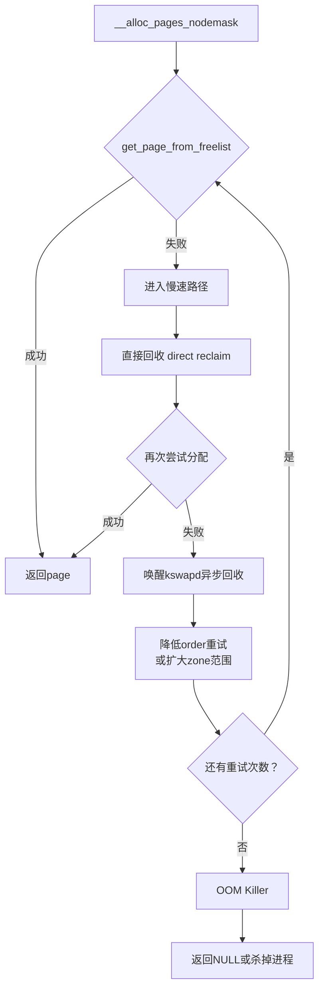

你调用`alloc_pages()`时，内核内部到底发生了什么？说实话，远比你想的复杂。这个看起来人畜无害的接口背后，藏着一套精心设计的多层分配策略——快的时候直接摘一个页就走，慢的时候可能要触发回收、唤醒后台线程，甚至到最后被逼无奈杀掉进程。今天咱们就把这层皮扒开，看看Buddy分配器的核心源码到底是怎么走的。

**知识点15 [E][M] `__alloc_pages_nodemask()`的完整调用链**

一切的起点是`__alloc_pages_nodemask()`，所有页面分配的最终入口。不管你是`alloc_pages()`、`__get_free_pages()`还是`kmalloc`大到走slab分配器以上的路径，最终都会落到这里。

它的逻辑可以粗线条地分成两条路：**快速路径**和**慢速路径**。快速路径就是"运气好的话一秒搞定"，慢速路径则是"内存紧张时的一场长征"。

先看看快速路径。`__alloc_pages_nodemask()`进来以后，第一件事是调用`get_page_from_freelist()`。这个函数拿着你请求的order（0就是单页，1就是2页连续，以此类推），去遍历本地NUMA node的zone——通常先从ZONE_NORMAL找，找不到再降级到ZONE_DMA32之类的低端区域。

找到合适的zone之后，真正的摘页动作发生在`rmqueue()`里面。`rmqueue()`这个名字很直白——remove from queue。它从`zone->free_area[order].free_list[migratetype]`这条链表上把页面摘下来。`free_area`数组是Buddy分配器的核心数据结构，长这样：

```
struct zone {
    ...
    struct free_area    free_area[MAX_ORDER];   // MAX_ORDER通常是11
    ...
};

struct free_area {
    struct list_head    free_list[MIGRATE_TYPES]; // 按迁移类型分多条链表
    unsigned long       nr_free;                  // 该order下总空闲页数
};
```

`free_area[0]`存的是单页（2^0=1），`free_area[1]`存的是2页连续块，`free_area[10]`就是1024页（4MB）的大块。每条free_area下面又按迁移类型（MIGRATE_UNMOVABLE、MIGRATE_MOVABLE、MIGRATE_RECLAIMABLE等）分成多条链表。为什么要分迁移类型？因为如果随便混合，当内核想压缩内存、迁移页面时，发现页被不可迁移的类型占着，就傻眼了。迁移类型这个设计是后来加上去的，早年间没有这个区分，内存碎片问题搞得很头疼。

`rmqueue()`摘页的时候还有个经典操作：如果你要的是order=0的单页，但free_list[0]是空的，它会尝试从更高order拆分——从order=1拆两个0阶页出来，一个给你，一个挂回free_area[0]。如果order=1也没有，就继续往上找order=2、order=3...直到MAX_ORDER-1。这个拆分过程叫`expand()`，是Buddy算法名字的由来——像细胞分裂一样，大块不断拆成半块。

```c
// rmqueue()的核心逻辑（极度简化版）
struct page *rmqueue(struct zone *zone, unsigned int order, int migratetype)
{
    struct page *page;

    // 1. 先从指定迁移类型的链表摘
    page = __rmqueue_smallest(zone, order, migratetype);
    if (page)
        return page;

    // 2. 指定类型没了，尝试从其他类型 steal（fallback）
    page = __rmqueue_fallback(zone, order, migratetype);
    if (page)
        return page;

    // 3. 还是失败？返回NULL，走慢速路径
    return NULL;
}
```

如果`get_page_from_freelist()`顺利拿到了页，整个分配就大功告成，直接返回。这条快速路径在系统内存充足的情况下，命中率非常高——就是几次链表操作，微秒级别。

但如果快速路径空手而归，麻烦就来了。内核进入**慢速路径**，开启一场越来越激进的"找页行动"：



慢速路径的每一步都比上一步更"重"。第一步是直接回收（direct reclaim），这个咱们在知识点16细说。如果直接回收后还是不够，内核会唤醒`kswapd`内核线程——这是个后台回收者，异步地扫描LRU链表、写回脏页。注意`kswapd`是异步的，它启动后不会立刻解决问题，所以分配者还得继续重试。接下来内核会逐步放宽条件：降低order尝试（你要8页？先试试4页能不能凑合）、扩大zone范围（从NORMAL降级到DMA32）、甚至跨NUMA node去远端内存分配。

这一步比一步激进的策略，体现了内核设计者的务实——先用最小的代价解决，不行再加码。但这也意味着，**分配延迟在慢速路径下可能从微秒飙升到几十甚至上百毫秒**。我见过有业务因为间歇性的分配延迟毛刺来排查，最后发现就是direct reclaim在作怪。

**知识点16 [E] 慢速路径剖析：直接回收**

直接回收（direct reclaim）是整个分配延迟的最大元凶。它的本质很简单：分配者在`alloc_pages()`的调用路径上停下来，自己去回收页面——同步、阻塞、不可预期。

具体怎么回收？内核会调用`try_to_free_pages()`，从当前进程的LRU链表开始扫描，把最近最少用的匿名页换出到swap（如果有swap的话），把文件缓存页写回磁盘然后释放。这一系列操作涉及磁盘I/O，速度自然快不起来。

问题来了：为什么不做成完全异步的，非要让分配者自己干这个脏活？答案是**系统已经急得没办法了**。如果`kswapd`能搞定，快速路径之后的第二次尝试就不会走到direct reclaim这一步。进入direct reclaim意味着所有异步手段都没赶上内存消耗的速度——后台回收跟不上前台分配，系统正在往悬崖边冲。

直接回收有个保护机制叫`PF_MEMALLOC`，还有`zone_reclaim()`的门槛值，防止回收太凶猛导致系统抖动。但即便如此，direct reclaim对延迟敏感型业务（比如实时请求处理）仍然是噩梦。线上环境通常会用`vm.swappiness`、NUMA policy、甚至预留内存（`min_free_kbytes`）等手段来尽量避免踏进这个坑。

说白了，Buddy分配器的源码流程就是一场**从优雅到狼狈的渐进式求援**。快速路径是理想情况——链表一摘，完事走人。慢速路径则是现实——内存不够时一层层加码，直到最后OOM Killer出场。理解这条调用链，不只是读懂几个函数的先后关系，更是理解Linux内核面对内存压力时的完整应对策略。
