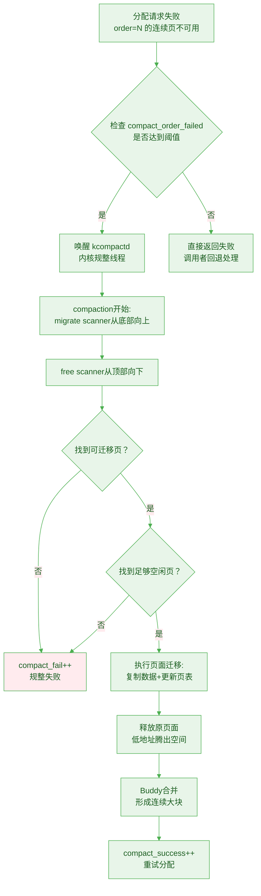

# 9.2.3 内存规整与Compaction

> 所属：第9章 内存管理子系统 > 9.2 物理内存分配：从页到Slab
> 难度：[E] | 预计阅读时间：18分钟

## 本节导读

内存规整就像整理房间——你把散落的物品搬到角落，腾出中间的大块空间。但整理需要时间，而且有些物品搬不动。Buddy系统的分裂合并机制能高效管理空闲页，却无法解决已分配页面造成的物理碎片。当系统运行一段时间后，不可迁移的内核页像一颗颗钉子钉在内存各处，把原本连续的空闲区分割成碎片。内存规整（Compaction）正是为这一问题而生：它通过主动迁移可移动页面，把散布的占用页"搬运"到高处，让低地址端重新形成大块连续空间。本节将深入compaction的双指针扫描算法、触发时机，以及它在实际生产环境中的代价与效果权衡——这些知识是你调优高阶内存分配性能的关键。

---

## 知识点113：Compaction双指针扫描算法与触发机制 [E] ~1200字

### 问题场景

你的服务器在运行一个数据库应用，该应用为了提升性能频繁申请透明大页（THP，2MB）。启动初期一切正常，但运行数天后，`/sys/kernel/debug/tracing/thp_fault_alloc`中的成功计数增长明显放缓，而`thp_fault_fallback`（THP分配失败后回退到普通4KB页）急剧攀升。你用`cat /proc/vmstat | grep compact`查看，发现`compact_fail`持续增长。系统明明还有足够空闲内存，为什么THP分配频频失败？答案就是**外部碎片**——空闲页散落在已分配页之间，Buddy系统哪怕加起来有几百MB空闲，也拼不出一块连续的2MB区域。

### 机制深入

#### 为什么需要Compaction？Buddy的局限性

Buddy系统管理的是**空闲页**，对已分配的页面无能为力。当系统长期运行后，不可迁移的内核数据结构、驱动DMA缓冲区等`MIGRATE_UNMOVABLE`页面固定在物理内存各处，把空闲区分割成小块。此时即使系统总空闲内存充足，高order的分配请求也会失败。Compaction的设计目标就是**在运行时主动"挪动"可迁移的页面，把散布的空闲页合并成连续大块**。

#### 双指针扫描：迁移扫描器与空闲扫描器

Compaction算法的核心是**两个对向扫描的指针**，类似于快速排序中的双指针分区：

```
内存地址空间（从低到高）：
├─ 低地址端 ───────────────────────────────────── 高地址端 ─┤
│                                                          │
▼ 迁移扫描器（migrate scanner）向上扫描                   ▼ 空闲扫描器（free scanner）向下扫描
│                                                          │
│  [已分配][已分配][空闲][已分配][空闲][已分配][已分配][空闲] │
│     ↑可迁移页              ↑可迁移页              ↑空闲页  │
│                                                          │
│  策略：找到可迁移的MOVABLE页 ──────────────────→ 策略：找到目标空闲页 │
│        迁移到高处空闲区域                            作为迁移目的地   │
```

**迁移扫描器**从zone的底部（低地址）开始向上扫描，寻找属于`MIGRATE_MOVABLE`类型的已分配页块。这些页面的共同特征是可以被安全移动——它们通常是用户空间的匿名页或tmpfs页，内核只需修改页表映射，将其数据复制到新的物理位置即可。

**空闲扫描器**从zone的顶部（高地址）开始向下扫描，寻找足够大的空闲页块作为迁移的"目的地"。

当迁移扫描器找到一组可迁移页，空闲扫描器找到一片足够容纳它们的空闲区域后，内核执行页面迁移：把可迁移页的数据复制到高地址的空闲区域，更新对应进程的页表，然后释放原位置页面。这样，低地址端原本被占用的页变成了空闲页，与高地址附近的其他空闲页合并后，就能形成连续的大块空间。

#### Compaction的完整流程



#### 触发条件：谁叫醒了kcompactd？

Compaction不会无故运行，触发路径有两条：

**1. 分配失败后的自动触发**

当`__alloc_pages_slowpath()`在常规路径（快速分配、唤醒kswapd回收等）都失败后，会检查当前失败order是否超过`/proc/sys/vm/compaction_proactiveness`设定的阈值。如果达到条件，内核唤醒`kcompactd`线程对该zone执行规整。这是一种**被动触发**——只有分配压力足够大时才启动。

**2. 手动触发**

运维人员或调试脚本可以通过以下接口主动触发：

```bash
# 触发所有zone的内存规整
echo 1 > /proc/sys/vm/compact_memory

# 查看规整是否完成（compact_success应增加）
watch -n 1 'grep compact_ /proc/vmstat'
```

`compact_memory`是一个调试接口，执行时会同步等待规整完成。在生产环境中谨慎使用，因为大规模页面迁移会消耗大量CPU时间并产生内存访问抖动。

💡 **关键洞察**：Compaction并非总是有效。如果迁移扫描器遍历了大量区域却找不到足够的`MIGRATE_MOVABLE`页，或者空闲扫描器无法找到可用的目标区域，规整就会以`compact_fail`告终。这时内核只能选择更激进的策略——直接回收（reclaim）页面，或让分配请求失败。

---

## 知识点114：Compaction的代价、效果与实战诊断 [E] ~800字

### 问题场景

你在线上环境遇到了一个棘手问题：某业务高峰期时，系统的THP成功率骤降，但CPU使用率却莫名飙升。`top`显示`kcompactd`进程占据了单个CPU核心的80%以上时间。你尝试降低`compaction_proactiveness`，THP成功率进一步下降；提高它，CPU被compaction吃掉更多。如何在"大页性能"与"CPU开销"之间找到平衡点？这需要你深入理解compaction的真实代价与效果。

### 机制深入

#### Compaction vs 直接分配失败：一场权衡

Compaction的核心矛盾在于**时间换空间**：用CPU周期执行页面复制和页表更新，换取更大的连续物理内存块。这个交换是否划算，取决于三个因素：

| 因素 | Compaction有利 | Compaction不利 |
|------|---------------|---------------|
| **页面可迁移比例** | `MIGRATE_MOVABLE`占zone的60%以上 | 大量`UNMOVABLE`页或`RECLAIMABLE`页被钉住 |
| **分配请求的order** | order=9（2MB THP）获益明显 | order=0~2的小分配无需规整 |
| **CPU资源富余程度** | 服务器核心多、负载低 | 嵌入式单核CPU已满载 |

🔴 **核心洞察**：Compaction对**高order分配**（尤其是THP的order=9）价值最大。对于普通4KB页的分配，触发compaction完全是浪费——Buddy系统在order=0通常有大量空闲页，不需要规整。内核通过`compaction_proactiveness`参数控制这一权衡：值越高，越早启动规整；值越低，越倾向于直接让分配失败。

#### 实战：通过/proc/vmstat判断Compaction状态

`/proc/vmstat`中的`compact_*`系列计数器是观察compaction行为的最佳窗口：

```bash
$ grep compact_ /proc/vmstat
compact_success 184729       # 规整成功次数（腾出了足够连续空间）
compact_fail 34216            # 规整失败次数（找不到足够可迁移页）
compact_daemon_wake 15643     # kcompactd被唤醒次数
compact_daemon_migrate_scanned 9823741   # 迁移扫描器扫描的页面数
compact_daemon_free_scanned  15284736    # 空闲扫描器扫描的页面数
```

**诊断公式与判读要点**：

- **规整成功率** = `compact_success / (compact_success + compact_fail)`。健康系统应在70%以上；若低于30%，说明zone中可迁移页严重不足，compaction大多是徒劳。
- **扫描效率比** = `compact_daemon_migrate_scanned / compact_daemon_free_scanned`。接近1:1说明扫描器配合良好；如果migrate_scanned远大于free_scanned，说明大量可迁移页找不到目标空闲区域。
- **唤醒密度** = `compact_daemon_wake / 运行时间（秒）`。若每秒被唤醒多次，说明分配压力持续高于规整产出，应考虑调低`compaction_proactiveness`或禁用THP。

#### 影响Compaction成功率的因素

1. **迁移类型污染**：如果`MIGRATE_MOVABLE`的pageblock与`MIGRATE_UNMOVABLE`混杂（知识点110），迁移扫描器会频繁跳过不可迁移的页块，导致扫描开销大增、成功率下降。

2. **目标zone的水位线**：Compaction只在zone的空闲内存高于低水位线（low watermark）时运行。如果系统整体内存极度紧张，kswapd会持续回收直到低于低水位，此时compaction被抑制——即使运行也没意义，因为刚规整出来的空间会立刻被回收走。

3. **同步vs异步**：`kcompactd`是异步线程，不会阻塞分配路径。但在`__alloc_pages_slowpath()`中的**同步规整**（direct compaction）会直接阻塞调用者，这是导致分配延迟尖峰的主要来源。`/proc/sys/vm/compact_memory`触发的是同步规整，生产环境慎用。

4. **内存迁移的缓存惩罚**：被迁移的页面原本在CPU缓存中是热的，迁移到新的物理地址后，缓存失效（cache cold），访问延迟短期内上升。大规模compaction可能引发缓存抖动，对延迟敏感型业务不利。

💡 **关键洞察**：Compaction不是银弹。在内核调优实战中，如果`compact_fail`持续高于`compact_success`，最务实的做法往往不是继续调参，而是检查系统的页面迁移类型分布（`/proc/pagetypeinfo`），或考虑用CMA（知识点121~122）为关键业务预分配连续内存——与其在碎片后费力整理，不如从根源上避免碎片的产生。

---

## 本节小结

内存规整（Compaction）是Linux内核对抗外部碎片的核心机制。它通过迁移扫描器和空闲扫描器的双指针协作，把低地址端的可迁移页搬往高地址空闲区，从而腾出连续大块空间。其触发可以是分配失败后的被动唤醒，也可以是`compact_memory`的手动触发。然而，compaction本质上是CPU换空间的交易——它在高order分配（如THP）场景下价值显著，但在可迁移页不足或CPU资源紧张时，反而会成为性能瓶颈。通过`/proc/vmstat`中的`compact_*`计数器，运维人员可以量化评估规整的成效与代价，在实战中做出理性的权衡。
