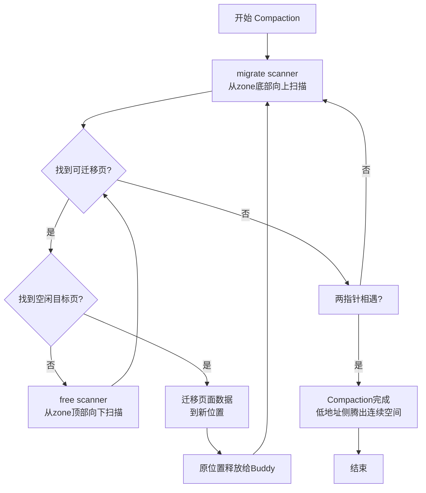

Buddy系统在运行久了之后，内存会被拆得七零八落。你可能有几十MB的空闲内存，但没有一块是连续的——申请个4MB的DMA缓冲区照样失败。这种场景在内核里太常见了，尤其是长期运行的服务器，内存碎片化是慢性顽疾。

那怎么办？把系统重启了清碎片？这显然不现实。内核给出的方案叫**Compaction（内存规整）**，说白了就是"搬家腾地"。

**知识点21 [E][M]** — Compaction的双指针扫描原理

Compaction 的设计很直观。一块内存区域，下面（低地址）塞满了各种正在使用的页，上面（高地址）散落着空闲页。我要做的是把下面能搬的页往上挪，挪完之后低地址端不就空出连续的一大片了么？

具体实现用了一套双指针扫描机制：

- **migrate scanner**：从 zone 底部开始，从下往上走，找**可以迁移的页**。用户空间的匿名页、映射页这些能迁，内核自己用的、pin 住的页就别想了。
- **free scanner**：从 zone 顶部开始，从上往下走，找**足够大的空闲块**当搬迁目的地。

两个指针向对方靠拢。迁移扫描器找到一页可迁移的数据、空闲扫描器也找到容纳位置，内核就把这页搬过去。原来位置空出来，加入 buddy 系统。不断重复，直到两指针相遇。

```c
/* mm/compaction.c - 双指针扫描核心循环 */
while (migrate_pfn < free_pfn) {
    isolate_migratepages(zone, cc);   /* 底部往上找可迁移页 */
    isolate_freepages(zone, cc);      /* 顶部往下找空闲页 */
    migrate_pages(cc->migratepages, alloc_migrate_target, NULL,
                  MR_COMPACTION, COMPACT_MOVABLE);
}
```



这招有几个要命的代价：**CPU开销极大**——搬物理页涉及大量 cache 操作和 TLB 刷新，我见过 compaction 吃掉单个核上百毫秒，同期网络延迟直接飙高。**可能阻塞分配路径**——同步 compaction 发生在分配失败后的 recovery 路径上，进程本来在等内存，现在还要额外等搬家完成。**不是想搬就能搬**——pin 住的页、内核 slab、部分 DMA 内存都动不了，有时候扫了一大圈白忙一场。

**知识点22 [I]** — 触发条件与调优

| 触发方式 | 说明 |
|:------:|:----|
| 分配失败后自动触发 | `__alloc_pages` 在 `__GFP_COMPACT` 标记下，order 分配失败会尝试同步 compaction |
| 手动触发 | 向 `/proc/sys/vm/compact_memory` 写入任意值，强制对当前节点做 compaction |

```bash
# 手动触发compaction
echo 1 > /proc/sys/vm/compact_memory
# 查看compaction统计
grep compact /proc/vmstat
```

内核并不是每次失败都 compaction，有一个衰减机制——最近 compaction 没搬出多少空间，下次就跳过，避免白白烧 CPU。这个积极性由 `/proc/sys/vm/compaction_proactiveness` 控制。另外 `/proc/sys/vm/extfrag_threshold`（默认500，范围0~1000）控制碎片化到什么程度才值得出手，调低更保守，调高更激进。

> **陷阱**：实时性要求高的系统里，同步 compaction 是隐藏的延迟炸弹。如果经常出现大块内存申请失败，别光调大 compaction 积极性——先考虑用 `__GFP_NORETRY` 控制分配行为，或者用 CMA 预留，从根本上绕开碎片问题。
