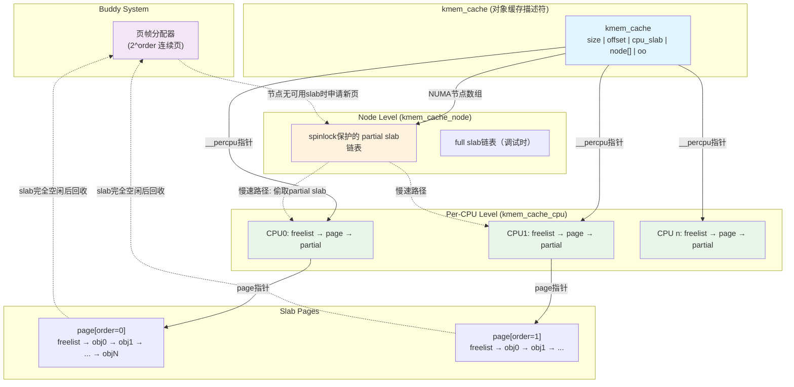

# 9.3.1 SLUB的设计与核心数据结构

> `kmalloc(256)`申请内存时，内核内部发生了什么？不是直接从Buddy System拿走一整页——而是从一个叫SLUB的"小对象工厂"里取出一个256字节的精确大小的块。这个工厂怎么运作的？为什么它成为现代Linux内核的默认选择？本节从SLAB到SLUB的演化脉络讲起，深入剖析SLUB的核心数据结构及其组织方式。

---

## 知识点115 [I] 从SLAB到SLUB的演化

### 1. SLAB分配器的起源与设计哲学

Linux 2.4内核引入了**SLAB分配器**，由SunOS的SLAB论文实现而来。其设计哲学是"对象缓存"：将频繁分配和释放的小对象（如`task_struct`、`inode`、`sk_buff`等）缓存起来，避免每次都要经过复杂的Buddy System分配流程。SLAB为每类对象创建一个`kmem_cache`，对象大小固定，回收时不立即归还给Buddy，而是保持在缓存中等待下次复用。

SLAB引入了**Cache Coloring（缓存着色）**机制。由于CPU缓存以Cache Line为单位工作，若不同slab中的对象映射到相同的缓存行，会产生伪共享（False Sharing）和缓存冲突。SLAB通过在slab头部预留不同大小的偏移量（color），使同类型对象在不同slab中的起始地址错开，从而降低缓存冲突概率。这一机制在理论上优雅，但实践中增加了内存开销和管理复杂度。

### 2. SLAB的管理困境

SLAB的核心痛点在于其**过于复杂的slab状态管理**。每个`kmem_cache`维护三条链表：

- **slabs_full**：完全分配的slab链表
- **slabs_partial**：部分空闲的slab链表（分配和释放的主要目标）
- **slabs_empty**：完全空闲的slab链表（可被回收给Buddy System）

这三条链表的维护需要频繁的加锁操作（`spinlock_t list_lock`），在多核并发场景下成为显著的性能瓶颈。更严重的是，SLAB为每个slab额外分配一个`struct slab`管理结构，记录对象位图、颜色偏移、已用/空闲计数等信息——这部分元数据本身也消耗内存，且增加了代码分支的复杂度。

此外，缓存着色机制的实际收益在现代CPU上逐渐减弱。现代处理器的缓存关联度（Cache Associativity）显著提高，硬件层面的缓存预取和冲突解决能力增强，使得软件层面的着色干预性价比降低，反而成为"食之无味、弃之可惜"的历史包袱。

### 3. SLUB的简化革命：Christoph Lameter的设计

2007年，Linux 2.6.22版本合入了**SLUB分配器**，由Christoph Lameter设计。SLUB的核心理念是**"做减法"**：去掉一切不必要的设计，让快速路径（Fast Path）尽可能简洁。

SLUB的简化体现在多个方面：

**取消缓存着色**：SLUB完全抛弃了Cache Coloring机制，对象在slab内按照固定间隔紧密排列。这一决策基于实证观察：在现代CPU架构下，缓存着色对性能的提升微乎其微，反而每个slab可节省约一个Cache Line的头部开销。

**消灭slab管理结构**：SLAB中独立的`struct slab`被彻底移除。SLUB复用**页描述符`struct page`**本身来承载slab管理信息——通过`page->freelist`、`page->inuse`、`page->frozen`等字段，直接在页元数据中嵌入空闲对象链表和使用计数。这一"嵌入式管理"技巧省去了单独的元数据分配，slab与page形成一对一（或一对多，当order>0时）的自然映射。

**取消三条链表**：SLUB不再维护满/半满/空三条全局链表。取而代之的是：每个CPU拥有独立的**本地缓存`kmem_cache_cpu`**，直接从本地slab分配和释放，绝大多数操作在**无锁（Lockless）**环境下完成。只有本地缓存耗尽时，才需要访问**节点级缓存`kmem_cache_node`**，此时才涉及锁竞争，但频率大幅降低。

### 4. 为什么SLUB成为默认选项？

Linux内核编译配置中，三种分配器通过`CONFIG_SLAB`、`CONFIG_SLUB`、`CONFIG_SLOB`互斥选择。现代发行版（包括服务器和桌面）几乎 unanimously 选择`CONFIG_SLUB=y`，原因在于SLUB达成了**性能与代码复杂度的最佳平衡**：

| 分配器 | 设计目标 | 内存开销 | 代码复杂度 | 适用场景 |
|---|---|---|---|---|
| **SLAB** | 缓存着色、对象缓存 | 较高（slab头+着色偏移） | 高（三链表管理） | 历史兼容 |
| **SLUB** | 可扩展、简化快速路径 | 低（嵌入page） | 中等 | **通用默认** |
| **SLOB** | 最小内存占用 | 最低 | 低（顺序查找） | 嵌入式系统 |

SLOB（Simple List Of Blocks）使用首次适配（First-Fit）的顺序查找算法，内存占用极小，但分配时间复杂度为O(n)，仅适用于内存极度受限的嵌入式场景。SLAB在大型NUMA系统上的扩展性问题使其逐渐被淘汰。SLUB则在保持较低内存开销的同时，通过per-CPU缓存实现了接近O(1)的快速分配，且代码路径清晰、易于维护。

内核默认配置可通过`/boot/config-$(uname -r)`中的`CONFIG_SLUB`项确认：

```bash
$ grep CONFIG_SLUB /boot/config-$(uname -r)
CONFIG_SLUB=y
# CONFIG_SLUB_TINY is not set
CONFIG_SLUB_CPU_PARTIAL=y
```

从演化脉络来看，SLUB不是对SLAB的推翻重来，而是**"奥卡姆剃刀"**式的精炼——保留对象缓存的核心思想，去除过度工程化的设计，使内存分配回归简单高效的本质。

---

## 知识点116 [E][M] SLUB核心数据结构

### 1. kmem_cache：对象工厂的"模具"

`kmem_cache`是SLUB的核心元数据结构，描述**一类对象**的分配器。每创建一种对象缓存（如通过`kmem_cache_create()`），内核就实例化一个`kmem_cache`。它记录了对象尺寸、对齐要求、slab的页阶（order）、per-CPU和节点级缓存的指针等关键参数。

```c
struct kmem_cache {
    unsigned int size;          /* 对象实际大小（含对齐和元数据） */
    unsigned int object_size;   /* 原始请求的对象大小 */
    unsigned int offset;        /* 自由链指针在对象内的偏移 */
    struct kmem_cache_cpu __percpu *cpu_slab;   /* per-CPU缓存指针 */
    struct kmem_cache_node *node[MAX_NUMNODES]; /* NUMA节点级数组 */
    unsigned int oo;            /* 最优slab布局（order + objects） */
    unsigned int min;           /* 最小slab布局 */
    unsigned int max;           /* 最大slab布局 */
    const char *name;           /* 人类可读的缓存名称 */
    // ... 其他调试和配置字段
};
```

其中`oo`（optimal order）、`min`、`max`编码了slab的页阶和可容纳的对象数量。SLUB通过`calculate_sizes()`计算最优布局，目标是在单个（或多个连续）页帧内容纳尽可能多的对象，同时最小化内部碎片。

### 2. slab的本质：一组page的聚合

SLUB中的**slab**由一个或多个物理上连续的页帧组成，页帧数由页阶`order`决定。`order=0`时一个slab为单页（4KB），`order=1`时为两页（8KB），以此类推。SLUB的slab没有独立的管理结构——它直接复用`struct page`。

关键洞察：当一组页被分配给SLUB作为slab时，这些页的`page->slab_cache`指针回指所属的`kmem_cache`，而**首个page**（head page）额外维护以下字段：

| 字段 | 作用 |
|---|---|
| `page->freelist` | 指向第一个空闲对象（嵌入在对象内部的链表） |
| `page->inuse` | 已分配对象的数量 |
| `page->frozen` | slab是否被冻结到某个CPU的本地缓存 |
| `page->objects` | slab中总对象数 |

`page->freelist`是SLUB实现高效分配的关键。它不使用额外的链表节点，而是**复用对象自身的内存空间**：每个空闲对象的前8字节（64位架构）存储下一个空闲对象的指针，形成一条**嵌入式的单链表**。这种"对象即节点"的设计省去了额外的指针存储开销。

### 3. kmem_cache_cpu：per-CPU无锁快速通道

`kmem_cache_cpu`是SLUB实现高性能的灵魂。每个CPU拥有独立的本地缓存实例，绝大多数分配和释放操作在此完成，无需任何锁：

```c
struct kmem_cache_cpu {
    void **freelist;        /* 指向本地slab的空闲对象链表 */
    unsigned long tid;      /* 事务ID，用于无锁同步 */
    struct page *page;      /* 当前正在服务的slab（快速分配源） */
    struct page *partial;   /* 本地partial slab链表头 */
#ifdef CONFIG_SLUB_CPU_PARTIAL
    unsigned short cpu_partial;  /* 本地partial链表最大长度计数 */
#endif
};
```

分配流程沿**快速路径**进行：CPU尝试从`freelist`弹出一个对象。若`freelist`非空，只需一次指针解引用和更新即可完成分配——这是纯粹的**本地操作**，不涉及任何原子指令或缓存一致性流量。仅当本地slab耗尽时，才进入**慢速路径**：从节点级`kmem_cache_node`的`partial`链表中获取新的slab，或在极端情况下向Buddy System申请新页帧。

`tid`字段配合CAS（Compare-And-Swap）操作实现无锁并发。当CPU调度可能导致一个`kmem_cache_cpu`结构被两个逻辑执行流访问时（如抢占后迁移到另一CPU再释放），`tid`用于检测冲突并重试。

### 4. 数据结构关系全景

SLUB的三层缓存架构（per-CPU → Node级 → Buddy System）形成了清晰的层次化数据流：



### 5. 分配路径的数据流追踪

以`kmalloc(256)`为例，完整追踪SLUB内部的数据访问链：

**快速路径（Fast Path）—— 约90%的情况：**

1. 根据256字节索引到对应的通用`kmem_cache`（`kmalloc-256`）
2. 获取当前CPU的`kmem_cache_cpu`实例
3. 检查`cpu_slab->freelist`：若非NULL，取出首对象，更新`freelist`指向`nextptr`，`page->inuse++`
4. 返回对象地址。**全程无锁，仅需几次指针访问**

**慢速路径（Slow Path）—— 本地slab耗尽：**

5. `freelist`为NULL，当前slab已满
6. 检查`cpu_slab->partial`链表：若有partial slab，将其提升为`page`
7. 若partial也为空：加锁访问`kmem_cache_node->partial`，批量迁移若干slab到本地
8. 若节点partial也为空：向Buddy System申请`2^order`个新页帧，初始化`freelist`链表，挂载到CPU

**释放路径同样分层：**

9. 释放对象时先尝试归还到`cpu_slab->freelist`（快速路径）
10. 若slab的所有对象都已释放且`cpu_partial`超限，将slab解冻并归还到节点级链表或Buddy System

这种三层架构的精妙之处在于：**通过数据的局部性（Locality）换取并行性（Parallelism）**。per-CPU缓存消除跨核竞争，节点级缓存作为缓冲池平滑突发的分配压力，Buddy System则提供最终的页帧来源保障。SLUB以此在NUMA多核系统上实现了接近线性的扩展能力。

---

> **关键回顾**：SLUB通过嵌入式空闲链表（`page->freelist`）、per-CPU无锁缓存（`kmem_cache_cpu`）和复用页描述符的管理策略，将对象分配的核心路径压缩到仅有几次指针操作。理解`kmem_cache`→`kmem_cache_cpu`→`page`→`freelist`的层次关系，是掌握Linux内核内存管理的钥匙。
