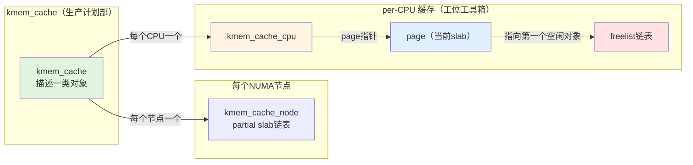

SLUB的数据结构就像是一家工厂的生产线——有统筹全局的生产计划部（`kmem_cache`），有实际存放零件的仓库货架（`slab`），还有每个工位手边随手可取的工具箱（per-CPU缓存）。这套设计的大原则是：把最快的路留给最频繁的操作，把最慢的锁竞争藏到最不常走的角落里。

**知识点25 [E][M]**

一切从`kmem_cache`说起。这个结构体描述的是"一类对象"的分配器，比如所有`task_struct`、所有`inode`，背后都有一个对应的`kmem_cache`。你可以把它当成生产计划部——它只管登记这类对象的尺寸、对齐要求、构造函数，并不直接持有任何一块可分配的内存。当一个内核组件调用`kmem_cache_create()`时，就是在向系统"注册一条产品线"。

那真正的内存从哪来？答案是`slab`。在SLUB里，一个slab就是一组连续的物理页（通常只有一页，除非对象特别大）。slab上被切成一个个等大的小块，每一块就是一个可用对象。`slab`这个概念在SLUB中被极度简化——它不再需要单独的结构体，而是直接由`struct page`来兼任管理。一个page（或复合页）被分配给某个`kmem_cache`之后，它上面的空闲对象通过`page->freelist`串成一条链表，随时等待被领走。

这里的关系用mermaid表示再清楚不过：



图中三个核心角色各司其职。`kmem_cache`作为总控，向每个NUMA节点派出一个`kmem_cache_node`，负责管理该节点上的partial slab链表；同时向每个CPU提供一个`kmem_cache_cpu`，这是整个SLUB的"快车道"。

`kmem_cache_cpu`的结构很简单，但对性能至关重要：

```c
struct kmem_cache_cpu {
    void **freelist;        /* 指向当前slab上的下一个空闲对象 */
    struct slab *slab;      /* 当前正在使用的slab（v5.17后从page改名） */
    struct slab *partial;   /* 本CPU的部分空闲slab */
#ifdef CONFIG_SLUB_CPU_STATS
    unsigned stat[NR_SLUB_STAT_ITEMS];
#endif
};
```

看到没有？`freelist`直接放在per-CPU结构里。这意味着什么？当你在本CPU上分配一个对象时，只需要取出`freelist`指向的那个地址，然后把`freelist`更新为下一个空闲对象——**全程不需要任何锁**。这条路径在源码里被称为**fastpath**，在热路径上，一次分配就是几条指令的事。

那`freelist`在slab内部是怎么组织的呢？每个空闲对象的开头几个字节存放下一个空闲对象的指针，形成一条 intrusive 链表。对象被分配出去时，直接把这个指针返回给用户；释放时，把对象插回到链表头部。说白了，就是一套经典的"头插法"链表操作，只不过链表节点本身就是内存对象。

```c
/* fastpath分配：从当前CPU缓存取一个对象 */
static __always_inline void *slab_alloc_node(struct kmem_cache *s,
                                              gfp_t gfpflags, int node,
                                              unsigned long addr)
{
    struct kmem_cache_cpu *c;
    void *object;
    
    c = raw_cpu_ptr(s->cpu_slab);   /* 取本CPU的缓存 */
    object = c->freelist;            /* 直接拿链表头 */
    if (unlikely(!object))           /* 当前slab空了？ */
        goto slowpath;               /* 只好走慢路 */
    
    c->freelist = get_freepointer(s, object);  /* 链表往前走一步 */
    return object;
slowpath:
    return __slab_alloc(s, gfpflags, node, addr, c);
}
```

这段代码是SLUB的心脏。`unlikely`那个分支提示编译器"当前slab为空"是少数情况，让CPU分支预测往fastpath走。只有当本CPU的当前slab耗尽时，才会进入`__slab_alloc`，这时候可能需要从本CPU的partial列表找、从节点的partial列表找，甚至向伙伴系统申请新页——**慢path就得加锁了**。

值得一提的是，per-CPU的`partial`链表是留给本CPU"私有化"的slab用的。某个slab在本CPU上分配了一些对象但没满，它就可能被挂到`partial`下面，下次本CPU需要时优先从这里取，尽量不让其他CPU碰。这个设计在多核竞争激烈的场景下能显著降低锁冲突。

| 数据结构 | 所在位置 | 核心职责 | 是否需要锁 |
|---------|---------|---------|----------|
| `kmem_cache` | 全局唯一 | 描述一类对象的属性（大小、对齐、构造函数等） | 读多写少，初始化后基本只读 |
| `kmem_cache_cpu` | 每CPU一份 | 提供无锁fastpath分配/释放 | **不需要锁** |
| `kmem_cache_node` | 每NUMA节点一份 | 管理partial/full slab链表 | 需要spinlock |
| `page->freelist` | slab页内 | 串连该slab上的所有空闲对象 | 同CPU访问时无锁 |

> **陷阱**：早期SLUB的`kmem_cache_cpu`里存的是`struct page *page`，5.17内核将其改名为`struct slab *slab`，但本质上还是指向那个page。如果你在阅读不同版本源码时看到不一致的类型名，不要困惑——`struct slab`就是`struct page`的别名包装，目的是让代码语义更清晰。

**知识点26 [E]**

`page`结构体兼职slab管理，这是SLUB相比SLAB最大的简化之一。在老的SLAB分配器里，每个slab都有一个独立的`struct slab`描述符，结构臃肿不说，管理起来也费劲。SLUB直接复用`struct page`，靠几个联合体字段来扮演"slab管理员"的角色。

关键字段是`page->slab_cache`：

```c
struct page {
    /* ... 其他字段 ... */
    union {
        /* 当此page被用作slab时 */
        struct kmem_cache *slab_cache;  /* 指向所属的kmem_cache */
    };
    /* 空闲对象链表头，slab使用时有效 */
    void *freelist;
};
```

通过`page->slab_cache`，你可以在拿到一个page指针后立刻知道它属于哪条"产品线"，这在调试和内存回收时特别有用。比如`kfree()`传入一个未知指针，系统需要判断它是不是来自slab分配器，就会通过地址找到对应的page，再查`slab_cache`——如果不是NULL，说明这是slab管理的对象，走SLUB的释放路径；否则归还给伙伴系统。

这种"一鱼两吃"的设计省掉了独立的slab描述符，也减少了指针跳转层级。Linus在SLUB的设计里贯彻了一个朴素的原则：**数据结构和代码路径，能简单就别复杂**。page反正已经存在了，再多塞两个字段进来，比专门造一个新结构划算得多。
