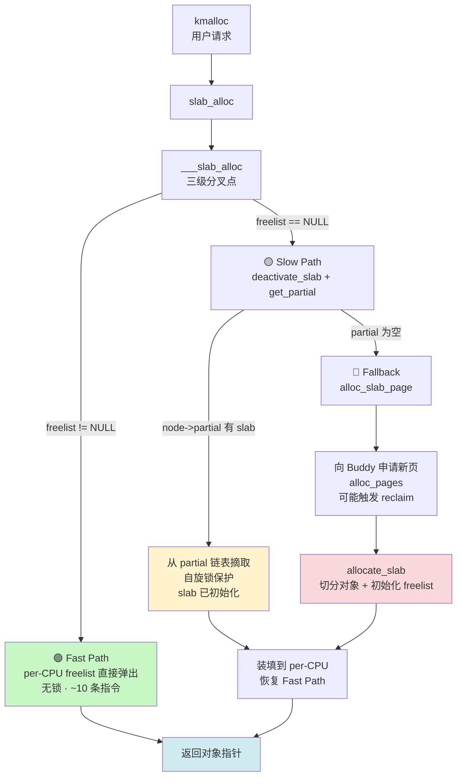

# 9.3.2 kmalloc 的分配路径

> kmalloc(256) 时，内核不是每次都向 Buddy 要一页——那样太浪费了。SLUB 有三级加速路径，最快的情况只需要 10 条指令就能完成分配。

---

## 知识点 117：kmalloc → slab_alloc → ___slab_alloc 三级加速 [E][M] ~1500 字

### 核心链路

kmalloc 的底层并不直接对接伙伴系统（Buddy），而是委托给 SLUB 分配器。其调用链在开启 SLUB 的系统中为：

```
kmalloc(size, gfp)
  → __kmalloc(size, gfp)
    → slab_alloc(kmalloc_caches[size_to_index(size)], gfp, _RET_IP_)
      → slab_alloc_node()
        → ___slab_alloc()   ← 三级路径的分叉点
```

`___slab_alloc()` 是整个 SLUB 分配器的核心枢纽，它通过三条逐级降速的路径来平衡**延迟**与**利用率**：Fast Path → Slow Path → Fallback。三条路径的设计哲学非常明确："能走本地缓存就不碰共享结构，能复用已有 slab 就不向 Buddy 申请新页"。

---

### 第一级：Fast Path —— per-CPU freelist 直接取出（无锁，~10 条指令）

每个 CPU 拥有私有的 `kmem_cache_cpu` 结构，其中 `freelist` 指向该 CPU 当前正在使用的 slab 中**下一个可用的对象**。`kmem_cache_cpu` 的结构极其精简，通常只有三个字段：

```c
struct kmem_cache_cpu {
    void **freelist;        // 指向当前 slab 中下一个空闲对象
    struct page *page;      // 当前正在使用的 slab（struct page）
    int partial;            // 当前 CPU 上 partial  slab 的数量（节流用）
};
```

这是整个分配路径的热路径，代码位于 `___slab_alloc()` 开头：

```c
struct kmem_cache_cpu *c = raw_cpu_ptr(s->cpu_slab);
void *object = c->freelist;          // 1. 读取本地 freelist
if (likely(object)) {                // 2. 大概率命中
    c->freelist = get_freepointer(s, object);  // 3. 推进 freelist 指针
    stat(s, ALLOC_FASTPATH);
    return object;                   // 4. 返回对象，全程无锁
}
```

`get_freepointer()` 的逻辑是从对象的元数据区域读取下一个空闲指针。SLUB 将 freelist 指针直接嵌入在每个对象头部的 `void *` 中，不占用额外空间，因此推进操作只是一个内存读写。

这条路径的特点：

| 特性 | 说明 |
|------|------|
| **指令数** | 约 10 条（读 per-CPU 指针、读 freelist、比较、读下一个指针、写回、返回） |
| **锁开销** | **零** —— 只访问 per-CPU 变量，不涉及任何原子操作或自旋锁 |
| **TLB/Cache 友好性** | `kmem_cache_cpu` 和 slab 本身都在 CPU 本地，L1 Cache 命中率高 |
| **适用场景** | 同 CPU 上连续分配同 size 的对象，如网络包 skb、文件系统 inode、定时器 |

Fast Path 成功的关键在于**对象的释放路径**：`kfree()` 默认将对象归还到**释放者所在的 CPU** 的 `freelist` 中，而非分配时的 CPU。这保证了"谁释放、谁复用"的局部性，让 per-CPU freelist 不至于过快枯竭。在多核系统中，这种设计避免了跨 CPU 的缓存行抖动（cache line bouncing），是 SLUB 相比 SLAB allocator 的核心性能优势之一。

从实现角度看，`raw_cpu_ptr(s->cpu_slab)` 通过 `gs` 段寄存器（x86_64）或 `tpidr_el1`（ARM64）直接取得当前 CPU 的私有指针，不经过 SMP 处理器 ID 查找，指令开销极低。`likely(object)` 则是编译器分支预测提示，告诉编译器 Fast Path 是高频分支，使得指令流水线尽可能顺畅。整个 Fast Path 的汇编通常不超过 15 条指令：取 per-CPU 指针、取 freelist、判空、取下一个指针、写回、stat 计数、返回。这种极致的精简，使得 kmalloc 在小对象场景下的性能可以与栈分配相媲美。

---

### 第二级：Slow Path —— per-CPU freelist 空，从 `kmem_cache_node->partial` 取 slab

当 Fast Path 发现 `c->freelist == NULL` 时，说明当前 CPU 的 slab 已经耗尽。此时进入 Slow Path，尝试从该 NUMA 节点的**共享 partial 链表**中取一个仍有空闲对象的 slab：

```
___slab_alloc() Fast Path miss
  → c->freelist == NULL
    → deactivate_slab()           // 将当前空 slab 移回 node->partial
    → get_partial(s, node)        // 从 node->partial 摘一个 slab
      → c->page = new_slab        // 装到 CPU 上
      → c->freelist = new_slab->freelist
    → return object (from new freelist)
```

`kmem_cache_node` 中的 `partial` 链表是**该节点所有 CPU 的共享后备池**。它链住的是"部分已用"的 slab（既有已分配对象，也有空闲对象）。Slow Path 的执行流程如下：

1. **关闭本地中断**（`local_irq_save`）防止 `kfree` 的并发干扰；
2. 调用 `deactivate_slab()`：将当前 CPU 上已空的 slab 归还到 `node->partial` 链表头部；
3. 调用 `get_partial()`：在自旋锁 `node->list_lock` 保护下，从 `node->partial` 摘取一个 slab；
4. 将新 slab 绑定到 `kmem_cache_cpu->page`，恢复 Fast Path。

这一步引入了**自旋锁竞争**，但开销仍远小于向 Buddy 申请新页：partial 链表中的 slab 已经初始化好 `freelist`，无需再设置对象元数据。`node->partial` 的存在意义正是作为 CPU 之间的"缓冲带"——当一个 CPU 的 slab 耗尽而另一个 CPU 正在释放对象时，释放的 slab 进入 partial，可被快速复用。

`deactivate_slab()` 的核心操作是"冻结"（freeze）当前 slab：将 `c->page` 的引用清空，把 slab 的剩余空闲对象和已用计数写回到 `struct page` 的元数据中，再链入 `node->partial`。冻结后，该 slab 对其他 CPU 可见，可被它们的 `get_partial()` 获取。值得注意的是，`node->partial` 通常维护在链表头部进行插入和删除，以实现近似 LRU 的复用策略——刚释放的 slab 最可能被再次分配，因为其数据还热在 CPU cache 中。

---

### 第三级：Fallback —— partial 链表也空，向 Buddy 申请新页并初始化

如果连 `node->partial` 也为空，说明该 size 的缓存完全耗尽，必须向伙伴系统请求全新页面：

```
___slab_alloc() Slow Path miss
  → node->partial is empty
    → new_slab = alloc_slab_page(s, gfp, nodeid)   // 调用 Buddy: alloc_pages
    → allocate_slab()
      → 计算该 slab 可容纳的对象数 (oo)
      → 对每个对象执行 init_object()  // 设置 redzone、POISON 等调试标记
      → 将所有对象串成 freelist 链表
    → c->page = new_slab
    → c->freelist = new_slab->freelist
    → return object
```

这是最慢的路径，涉及：

- **页级分配**：Buddy 系统的 zone lock、伙伴合并/拆分、可能的 direct reclaim 或 compaction；
- **对象初始化**：把新页切分为固定 size 的对象，并串成单向 freelist 链表；
- **调试特性填充**：若开启 `SLUB_DEBUG`，还需写入 redzone（`0xbb`）、poison（`0x5a`）等模式；
- **元数据设置**：在 `struct page` 中设置 `slab_cache`、`freelist`、`inuse`、`objects` 等字段。

不过，一旦新 slab 被挂到 per-CPU 上，后续多次分配又重新走 Fast Path，平摊下来的 amortized cost 仍然很低。SLUB 通过 `oo`（order + objects）参数控制每个 slab 的页阶数，使得常见 size（如 64 B、256 B）的 slab 能容纳数十个对象，减少 Fallback 频率。

`oo` 是一个打包的整数，低 16 位存储页阶数（order，即 slab 占用 `2^order` 个连续页），高 16 位存储该 slab 可容纳的对象总数。例如对于 64 B 对象，`order = 0`（单页 4 KB），则 `objects = 4096 / 64 = 64` 个对象每 slab。初始化新 slab 时，`allocate_slab()` 会遍历页内所有对象位置，将相邻对象用 freelist 指针串联：对象 0 的 freepointer 指向对象 1，对象 1 指向对象 2，……，最后一个对象指向 NULL。这个链表的头指针保存在 `struct page->freelist` 中，待 slab 绑定到 CPU 时直接赋给 `c->freelist`，无需额外计算。

---

### 三级路径 Mermaid 图



---

### 热点数据局部性总结

| 路径 | 数据所在位置 | 锁 | 典型延迟 |
|------|------------|-----|---------|
| Fast Path | `kmem_cache_cpu` + slab 页 | 无 | ~30 ns |
| Slow Path | `kmem_cache_node->partial` | 自旋锁 | ~200 ns |
| Fallback | Buddy zones + 新页 | zone lock + 可能的 reclaim | ~5–50 μs |

---

## 知识点 118：kmalloc 大小序列与变体对比 [I] ~800 字

### kmalloc size 序列

SLUB 不会为任意 `size` 创建独立的 `kmem_cache`，而是使用一组**预定义的固定 size 档**，俗称 kmalloc size table。x86_64 上（`KMALLOC_MIN_SIZE = 8`）的完整序列为：

```
8, 16, 32, 64, 96, 128, 192, 256, 512, 1024,
2048, 4096, 8192, 16384, 32768, 65536, 131072
```

共 17 档，上限 **128 KB**（`KMALLOC_MAX_SIZE = 131072`）。当调用 `kmalloc(size, gfp)` 时，内核通过 `size_index_elem()` 或 `kmalloc_index()` 将请求 size **向上取整**到最近的档，再索引到对应的 `kmalloc_caches[index]`。

例如 `kmalloc(200, GFP_KERNEL)` 实际会使用 **256 B** 的 cache；`kmalloc(3000, GFP_KERNEL)` 会使用 **4 KB** 的 cache。这带来了**内部碎片**（internal fragmentation），平均浪费约为半个档位的 25%。size table 的设计遵循"2 的幂次 + 中间插值"策略：在 64 B 以下每 2 倍一档，64 B 到 512 B 之间插入 96、192 等中间档，以平衡碎片率和缓存数量。

> 观察 `/proc/slabinfo` 中名为 `kmalloc-64`、`kmalloc-128`、`kmalloc-1k` 等条目，即为对应档位的 kmem_cache。系统启动时由 `create_kmalloc_caches()` 统一创建。

---

### 三个兄弟 API

| 函数 | 签名特点 | 行为差异 | 适用场景 |
|------|---------|---------|---------|
| **`kmalloc`** | 不初始化内存 | 返回的内存**包含原页内容**，可能残留敏感数据 | 性能敏感、调用者自行初始化 |
| **`kzalloc`** | 内部调用 `kmalloc` + `memset(0)` | 保证返回**清零内存**，略慢于 `kmalloc` | 结构体分配、需要零初始化的场景 |
| **`kvmalloc`** | 超过 kmalloc 上限时回退 | 先尝试 `kmalloc_node(GFP_RECLAIM)`，失败则走 `vmalloc` | 大块内存（>128 KB）且需要连续虚拟地址 |

#### kmalloc vs kzalloc

```c
static inline void *kzalloc(size_t size, gfp_t flags)
{
    return kmalloc(size, flags | __GFP_ZERO);   // 本质：kmalloc + __GFP_ZERO
}
```

`__GFP_ZERO` 标志会让 SLUB 在 Fast Path 返回前执行清零。对于小对象（< 1 KB），清零开销与分配本身相当；但对于页级对象（4 KB+），现代 CPU 的 `rep stosb`/`erms` 指令能高效完成，差距不明显。在安全敏感场景（如密钥缓冲区、用户数据）中，优先使用 `kzalloc` 避免信息泄漏。

#### kmalloc vs kvmalloc

`kvmalloc(size, gfp)` 的逻辑：

```
if (size <= KMALLOC_MAX_SIZE)
    return kmalloc(size, gfp);           // 走 SLUB，物理连续
else
    return __vmalloc_node_range(...);    // 走 vmalloc，仅虚拟连续
```

关键差异：

| 特性 | kmalloc | kvmalloc（>128 KB 时） |
|------|---------|----------------------|
| 物理连续性 | **保证** | 不保证 |
| 虚拟连续性 | 保证 | 保证 |
| 最大 size | 128 KB | 无硬上限（受 vmalloc space 限制） |
| 对 DMA 友好 | 是 | 否（需 `dma_alloc_coherent` 另处理） |
| 典型用途 | 小对象、高频分配 | 大块缓冲区、描述符表 |

在设备驱动中，若需要为大型描述符表（如 NVMe 的 SQ/CQ、GPU 的页表）分配 >128 KB 的缓冲区，应优先使用 `kvmalloc`；若硬件要求物理连续（如传统 DMA、网卡 Ring Buffer），则必须用 `__get_free_pages` 或 `dma_alloc_coherent`。`kvmalloc` 的巧妙之处在于对调用者透明——小于 128 KB 时完全等价于 kmalloc，无额外开销。

此外，`kvcalloc()` 是 `kvmalloc` 的数组版本，内部先做 `array_size(n, size)` 溢出检查，再走 kvmalloc 路径，适合分配大型数组。`kcalloc()` 则是 `kzalloc` 的数组版本，等价于 `kmalloc_array(size, n, flags | __GFP_ZERO)`。在实际编码中，优先使用带 `z` 和 `array` 后缀的安全版本，能减少内存安全漏洞。

---

### 一句话总结

> kmalloc 的三级路径是 SLUB 的精髓：per-CPU freelist 让 90% 以上的分配无锁且低于 30 ns；Slow Path 复用 partial slab 避免重复初始化；只有极端情况才 Fallback 到 Buddy。理解这套逐级降速机制，是分析内核分配延迟和编写高性能驱动的基本功。
