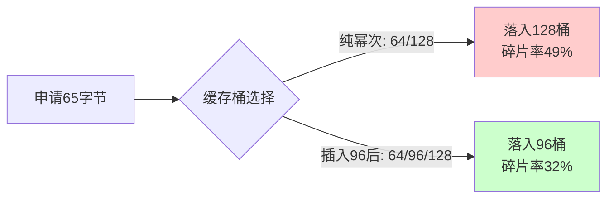

kmalloc 背后是一组预分配好的 slab 缓存。你调用 `kmalloc(123, GFP_KERNEL)` 时，内核并不会真的给你切一块 123 字节出来，而是找最接近、且不小于 123 的那个缓存桶，从中取一个完整对象。这就引出了一个关键问题——这些桶的大小是怎么定的？

**知识点29 [I]**

看过内核源码的都知道，`kmalloc` 的通用缓存序列长这样：

| 缓存编号 | 对象大小 (字节) | 幂次规律 |
|:------:|:-----------:|:------:|
| 0 | 8 | 2³ |
| 1 | 16 | 2⁴ |
| 2 | 32 | 2⁵ |
| 3 | 64 | 2⁶ |
| 4 | 96 | 64 × 1.5 |
| 5 | 128 | 2⁷ |
| 6 | 192 | 128 × 1.5 |
| 7 | 256 | 2⁸ |
| 8 | 512 | 2⁹ |
| 9 | 1024 | 2¹⁰ |
| 10 | 2048 | 2¹¹ |
| 11 | 4096 | 2¹² (1 page) |
| 12 | 8192 | 2 × page |

```c
/* mm/slab_common.c 中的 kmalloc 大小定义（示意） */
/* 8, 16, 32, 64, 96, 128, 192, 256, 512, 1024, 2048, 4096, 8192 */
```

你发现规律了吗？前几个是纯幂次：8、16、32、64。然后不是直接跳到 128，而是插了一个 96。接下来 128、192、256，又是 1.5 倍的间隔。这种设计不是拍脑袋想出来的。

纯幂次增长有个问题：内部碎片太严重。你申请 65 字节，如果只有 64 和 128 两个桶，那你就得落进 128 的桶里，浪费将近一半。插一个 96，申请 65~96 字节的人都落进这里，平均碎片率一下就降下来了。同理，128 和 256 之间插一个 192，也是同样的道理。



这个序列在内核里由 `KMALLOC_MIN_SIZE` 和 `KMALLOC_SHIFT_LOW` 等宏控制，实际数量还受页大小和 slab 子系统版本的影响。32 位系统和 64 位系统、4KB 页和 64KB 页，具体条目数略有差异，但核心思想不变。

再说上限。`kmalloc` 有一个硬性上限——通常是 **128KB**（`KMALLOC_MAX_SIZE` 定义，跟 `MAX_ORDER` 相关）。你要的内存超过这个数，`kmalloc` 会直接返回 NULL。这时候怎么办？要么改用 `alloc_pages` 去拿页帧自己管理，要么走 `vmalloc` 做虚拟地址连续的分配。记住一条：`kmalloc` 保证的是物理地址连续，而物理地址连续的大块内存本来就是稀缺资源，128KB 这个天花板的存在是合理的。

> **陷阱**：在 32 位 arm 平台上，`KMALLOC_MAX_SIZE` 可能只有 4MB 左右，但由于 slab 元数据开销和高阶分配失败率，实际能稳定 `kmalloc` 到的连续内存往往远小于理论上限。写驱动时如果需要大块 DMA 缓冲区，别指望 `kmalloc`，老老实实用 `dma_alloc_coherent` 或 CMA。

---

**知识点30 [I]**

内核里跟 `kmalloc` 长得像的兄弟有好几个，搞清楚它们的区别能少踩不少坑。

**`kzalloc`** — 说白了就是 `kmalloc` + `memset(0)`。分配完自动清零。驱动里特别常用，因为很多时候你申请一个结构体，接着就填充几个字段往内核注册了，剩下没初始化的成员如果是 0 才是安全的。省一行代码，也少一份忘记清零的隐患。

```c
struct my_dev *dev;

dev = kzalloc(sizeof(*dev), GFP_KERNEL);
if (!dev)
    return -ENOMEM;
/* dev 所有字段已清零，直接初始化你需要的即可 */
```

**`kvmalloc`** — 这个稍微新一点，是个"聪明"的包装函数。它内部先尝试走 `kmalloc`，如果请求大小超过了 `kmalloc` 的硬限制（或者因为高阶分配失败而满足不了），就自动回退到 `vmalloc`。你拿到的是虚拟地址连续的内存，但物理上可能不连续。对于大块内存请求来说，这是个性价比很高的选择——有连续物理页就用，没有也不死磕。

```c
void *buf;

/* 32KB：大概率走 kmalloc */
/* 256KB：自动回退到 vmalloc */
buf = kvmalloc(size, GFP_KERNEL);
```

三个函数的对比如下：

| 函数 | 清零 | 物理连续 | 超过限制时的行为 | 适用场景 |
|:---:|:---:|:---:|:---|:---|
| `kmalloc` | 否 | 是 | 返回 NULL | 常规小对象，要求物理连续 |
| `kzalloc` | 是 | 是 | 返回 NULL | 需要清零的小对象 |
| `kvmalloc` | 否 | 优先尝试 | 自动回退 `vmalloc` | 大块内存，不强制物理连续 |

注意 `kvmalloc` 不会清零，这一点和 `kmalloc` 一样。如果你既要自动回退又要清零，内核还提供了 `kvzalloc`——体贴到这份上了，该用就用。
