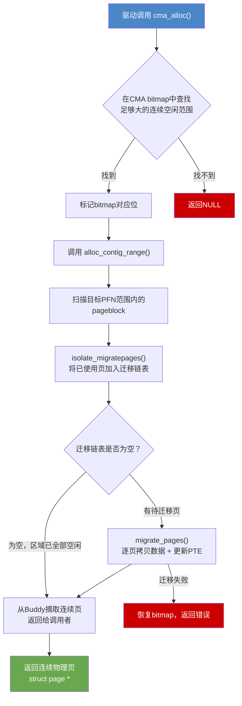

**知识点37 [E][M]：CMA区域的初始化与分配流程**

CMA（Contiguous Memory Allocator）是Linaro在ARM平台上推动的连续性内存解决方案，后来被主线内核合并。它的设计思路很有意思——**平时让这块内存参与Buddy系统的正常分配，只有当需要大块连续物理页时，才把里面的零散页面"赶走"**。

具体怎么初始化呢？启动阶段，内核通过`dma_contiguous_reserve()`或者设备树里的`linux,cma`节点划定一块连续物理区域。这块区域**仍然保留在Buddy系统的管理范围之内**，但里面的每一个page都会被标记为`MIGRATE_MOVABLE`。这个标记至关重要，它告诉Buddy系统：这些页面上存放的数据是可以被迁移走的。

当驱动调用`cma_alloc()`请求一块连续物理内存时，CMA的执行链路如下：

```c
/* drivers/base/dma-contiguous.c */
struct page *cma_alloc(struct cma *cma, unsigned int count,
                       unsigned int align, gfp_t gfp_mask)
{
    unsigned long bitmap_zero_bits;
    unsigned long start;
    struct page *page = NULL;
    int ret;

    mutex_lock(&cma->lock);
    /* 1. 在CMA bitmap中查找足够大的连续空闲范围 */
    bitmap_zero_bits = bitmap_find_next_zero_area(
            cma->bitmap, cma->count, 0, count, align_mask);
    if (bitmap_zero_bits >= cma->count)
        goto out;  /* 找不到，分配失败 */

    bitmap_set(cma->bitmap, bitmap_zero_bits, count);
    start = cma->base_pfn + bitmap_zero_bits;

    /* 2. 尝试从Buddy手里"夺"出这块连续区域 */
    page = alloc_contig_range(start, start + count,
                              MIGRATE_MOVABLE, gfp_mask);
    if (IS_ERR(page)) {
        bitmap_clear(cma->bitmap, bitmap_zero_bits, count);
        page = NULL;
    }
out:
    mutex_unlock(&cma->lock);
    return page;
}
```

`alloc_contig_range()`是CMA的核心，它要做的事说白了就是：**划定一个PFN范围，把里面已经被占用的页面全部迁移出去，把空闲的页面抓取回来**。这个过程调用`isolate_migratepages()`扫描目标区域内的所有pageblock，找出正在被使用的页，把它们挂到迁移链表上；然后调用`migrate_pages()`逐页完成迁移。

页面迁移的本质是什么？其实不复杂：**申请一个新的物理页，把旧页的数据完整拷贝过去，然后把所有指向旧页的PTE全部更新到新页**。只要PTE更新完成，进程对此毫无感知，因为它看到的虚拟地址没有任何变化。

整个过程可以用下面的流程图表示：



> **陷阱**：`cma_alloc()`内部持有`cma->lock`并可能触发页面迁移，迁移路径中可能需要回收其他内存，注意不要与需要同一锁的代码路径形成死锁。另一个常见问题是**迁移超时**——如果CMA区域内的页被频繁引用且更新PTE的遍历路径过长，`alloc_contig_range()`可能在`MIGRATE_PAGES_TIMEOUT`到期后放弃，导致分配失败。

---

**知识点38 [E]：为什么必须是MIGRATE_MOVABLE？**

你可能已经注意到了，CMA区域强制使用`MIGRATE_MOVABLE`类型。这不是随便选的——**只有可迁移的页才能被搬走**。

Buddy系统的迁移类型分类不是为了好看。一个页面如果被标记为`MIGRATE_UNMOVABLE`（比如内核栈、kmalloc分配的slab对象），说明它背后的数据结构不能被随意更换物理位置；`MIGRATE_RECLAIMABLE`（比如buffer cache、文件页）虽然可以被回收，但回收时需要刷盘、解除映射，路径完全不同。

问题来了：如果CMA区域里混进了不可迁移的页怎么办？

`alloc_contig_range()`在扫描过程中会检查每个页block的迁移类型。如果发现不可迁移的页块（`MIGRATE_UNMOVABLE`），它会尝试整块隔离并迁移。但如果某个页面被`mlock()`锁在了内存里，或者属于pin住的内核数据结构，迁移就会失败——**这些页"搬不动"，CMA的连续区域就"清"不出来**，最终`cma_alloc()`只能空手而归。

| 迁移类型 | 能否被CMA迁移 | 典型场景 |
|---------|------------|---------|
| `MIGRATE_MOVABLE` | 是 | 用户空间匿名页、用户空间文件映射页 |
| `MIGRATE_UNMOVABLE` | 否 | 内核slab、vmalloc区域、设备映射 |
| `MIGRATE_RECLAIMABLE` | 需先回收 | buffer cache、页缓存（需写回） |

所以在实际产品中，CMA区域的大小和位置需要仔细规划。我见过一个案例：某平台把CMA区域设得很大，但系统跑起来后用户空间进程用`mlock`锁了不少内存，刚好落在CMA范围内，结果Camera驱动申请DMA buffer时频频失败。最后的解决办法是**通过`memblock`把CMA区域和可能被pin住的内存区域在物理上隔离开**，让两者不要 overlapping。
