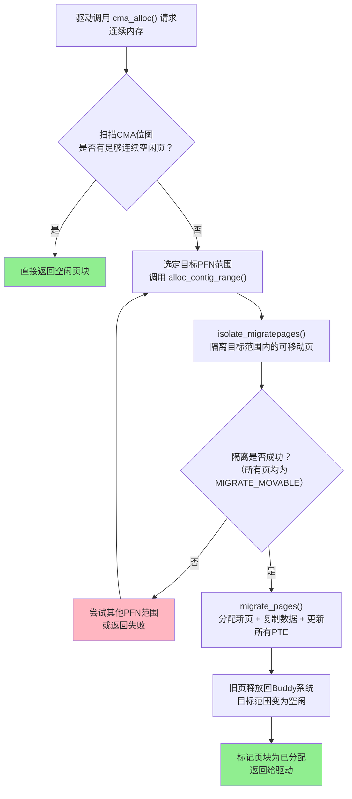

## 9.4.2 CMA的设计与实现

> **引入**：CMA的分配过程就像搬家——你需要一块连续空间，但原地已经被占用了。CMA的做法是：把那些可移动的东西搬到别处，腾出你需要的连续空间。

---

### 知识点 122 CMA区域初始化与页面迁移机制 [M] [E]

#### 1. CMA的设计思想

CMA（Contiguous Memory Allocator）解决的核心问题是：系统运行一段时间后物理内存严重碎片化，即便空闲内存总量充足，也难以找到大片连续页框。传统方案如大页（HugeTLB）需要预先保留且无法被其他用途借用，造成内存浪费；而CMA采用"预留+迁移"的折中策略——启动时预留连续物理内存区域，但该区域允许Buddy系统将其分配给可移动类型的请求使用；当驱动真正需要连续内存时，通过页面迁移将已占用页搬走，腾出连续空间。

这种设计的精妙之处在于：预留区域空闲时可被正常使用，不造成内存浪费；仅在需要连续分配时才触发迁移代价。这是一种典型的"延迟代价"工程哲学——用迁移的开销换取内存利用率的最大化。

#### 2. CMA区域的初始化

CMA初始化发生在系统启动阶段，`cma_init_reserved_areas()`将设备树或命令行参数中指定的物理内存范围注册为CMA区域，关键步骤如下：

首先，`cma_activate_area()`为每个CMA区域建立独立的页位图（bitmap），用于追踪区域内每个页的分配状态。位图与Buddy系统的空闲链表相互独立，意味着CMA拥有自己专门的分配追踪机制。

最关键的是：CMA区域内所有Page结构体被标记为`MIGRATE_MOVABLE`类型。这是通过遍历区域中每个页帧并设置其迁移类型来实现的。正是这个标记，决定了这些页可被Buddy用于可移动页面分配，也为后续页面迁移埋下了伏笔。

`MIGRATE_MOVABLE`是迁移机制能够运作的根本前提。Buddy系统按迁移类型分组管理空闲页：`MIGRATE_MOVABLE`表示页数据可迁移到新位置（如用户进程的匿名页、页缓存）；与之相对的是`MIGRATE_UNMOVABLE`（内核栈、代码段等不可迁移数据）和`MIGRATE_RECLAIMABLE`（可回收的干净页缓存）。只有`MIGRATE_MOVABLE`类型的页才具备迁移能力，因为迁移过程需要复制数据到新页并更新所有指向旧页的PTE（页表项），不可移动的页无法完成这一操作。

#### 3. cma_alloc()的分配路径

当驱动调用`cma_alloc()`请求连续内存时，CMA执行一套精心设计的分配与迁移流程：

**第一步：扫描CMA位图**，寻找足够大的连续空闲页块。若直接找到空闲区域，立即返回，无需触发迁移。

**第二步：若无直接可用空间，调用`alloc_contig_range()`**。该函数接收`[start_pfn, end_pfn]`的物理页帧范围，目标是将该范围内所有页迁移出去，使其变为空闲。

**第三步：`isolate_migratepages()`隔离页**。`alloc_contig_range()`调用该函数遍历目标范围，将`MIGRATE_MOVABLE`页从Buddy空闲链表或LRU链表中隔离出来，进入`migratepages`链表等待迁移。对于不可移动页，隔离失败，CMA将尝试其他范围或返回错误。

**第四步：`migrate_pages()`执行页面迁移**。为`migratepages`链表中每个被隔离页：在CMA区域外分配新页作为目的地；调用迁移回调等待页上所有访问完成；将旧页数据复制到新页；遍历所有引用旧页的PTE，将其更新为指向新页物理地址。PTE更新确保所有进程和内核数据结构对迁移无感知——迁移后的页在虚拟地址空间中无缝替换旧页。

**第五步：收尾处理**。旧页释放回Buddy，目标范围变为空闲，标记为已分配后通过`cma_alloc()`返回。

#### 4. 页面迁移的本质

页面迁移的本质可以概括为：复制数据到新页，更新所有PTE。数据复制将旧页帧内容逐字节复制到目标页帧。真正复杂的是PTE更新——内核通过RMAP（Reverse Mapping，反向映射）机制追踪"哪些页表项指向了这个物理页"，每个`struct page`的`anon_vma`或`address_space`结构使内核能遍历所有映射，逐一修改页表项。对于运行中的进程，PTE修改还需配合TLB刷新，确保CPU不使用旧地址翻译。

迁移过程中，旧页被标记为"迁移中页"（migration entry），试图访问该页的进程被阻塞在`migration_entry_wait()`，直到迁移完成，确保数据一致性。

#### 5. CMA分配与页面迁移流程图



CMA分配有快慢两条路径：快速路径直接命中位图，慢速路径触发页面迁移。`MIGRATE_MOVABLE`是慢速路径能否走通的关键决定因素——CMA初始化时将所有页标记为`MIGRATE_MOVABLE`，正是为了最大化慢速路径的成功率。

---

### 知识点 123 CMA的设备树配置与多区域管理 [E]

#### 1. 设备树中的CMA配置

CMA区域的大小和位置通常在设备树（Device Tree）的`reserved-memory`节点中声明，内核在启动早期解析这些属性并完成初始化。典型配置如下：

```dts
reserved-memory {
    #address-cells = <2>;
    #size-cells = <2>;
    ranges;

    linux,cma {
        compatible = "shared-dma-pool";
        size = <0x0 0x40000000>;     /* 1GB CMA区域 */
        alignment = <0x0 0x1000000>;  /* 16MB 对齐 */
        linux,cma-default;            /* 标记为默认CMA池 */
    };
};
```

`compatible = "shared-dma-pool"`表明该保留区域用作DMA缓冲池，可被多个设备驱动共享。`size`指定CMA大小为1GB，`alignment`要求按16MB边界对齐（许多DMA控制器的硬件对齐要求）。`linux,cma-default`标记该区域为默认CMA池——不指定具体CMA区域的驱动申请（如`dma_alloc_coherent()`不指明CMA区域时）将从此分配。一个系统中只能有一个默认CMA区域。

#### 2. 多个CMA区域的管理

现代嵌入式系统常配置多个CMA区域以满足不同硬件模块需求。内核通过全局`cma_areas[]`数组管理所有区域，每个元素是一个`struct cma`结构，记录起始PFN、页数、位图、名称以及所属`struct device`等元信息。

每个CMA区域分配唯一名称。驱动可通过`cma_alloc_by_name()`或DMA配置指定名称来使用特定区域。非默认区域需在设备树中显式绑定，或在驱动中通过`of_reserved_mem_device_init()`将特定`struct device`与CMA区域关联——该设备发起DMA分配时，自动从绑定的CMA申请内存。

#### 3. 不同驱动的CMA区域定制

为特定驱动定制专属CMA区域是高性能DMA场景的常见做法：

```dts
reserved-memory {
    vpu_cma: vpu-region@0x98000000 {
        compatible = "shared-dma-pool";
        size = <0x0 0x10000000>;  /* 256MB */
    };

    isp_cma: isp-region@0xa8000000 {
        compatible = "shared-dma-pool";
        size = <0x0 0x8000000>;   /* 128MB */
        no-map;  /* 不参与常规内存映射 */
    };
};

&vpu { memory-region = <&vpu_cma>; };
&isp { memory-region = <&isp_cma>; };
```

VPU使用标准shared-dma-pool，允许CMA页面迁移机制正常运作；ISP带`no-map`标志，表示不参与内核常规内存映射，用于需要物理连续且固定的DMA缓冲区（如摄像头帧缓冲）。`memory-region`属性在设备节点中将硬件模块与保留内存绑定，实现驱动的专用内存池。

多CMA区域管理体现了嵌入式系统中资源隔离的设计思想——不同硬件模块获得独立的连续内存池，避免竞争和碎片化干扰，也便于系统调试和性能调优。例如，当视频编解码器需要超大缓冲区而ISP仅需小范围连续内存时，分别为两者配置合适大小的CMA区域，比使用单一巨大CMA池更高效、更可控。
