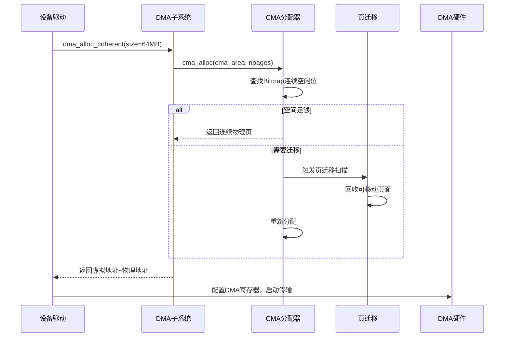

前面我们把CMA的底层机制聊了个遍——Buddy的困境、迁移扫描、页帧的偷梁换柱，这些说到底都是内核里自动发生的事。但真正到了一块新板子上，CMA区域打哪儿来？你总得告诉内核："留一片连续的地儿给我_dma用。" 这个沟通的桥梁，就是设备树里的`reserved-memory`节点。这一节咱们不扯虚的，直接上设备树配置，再看`dma_alloc_coherent()`是怎么跟这块预留内存打交道的。

**知识点39 [I][M]**

设备树里预留CMA区域的写法， mainstream内核有一套标准格式。你看下面这段典型的设备树片段——这几乎是每块ARM/ARM64板子启动DMA时都要面对的配置：

```dts
/ {
    reserved-memory {
        #address-cells = <2>;
        #size-cells = <2>;
        ranges;

        linux,cma {
            compatible = "shared-dma-pool";
            size = <0x0 0x4000000>;    /* 64MB */
            alignment = <0x0 0x400000>; /* 4MB对齐 */
            linux,cma-default;
        };
    };

    /* 某个需要使用CMA的设备 */
    my_device: my_device@0 {
        compatible = "myvendor,mydev";
        memory-region = <&linux_cma>;
        /* ... */
    };
};
```

几个属性你得记牢。`compatible = "shared-dma-pool"` 这个字符串是CMA子系统的"接头暗号"——内核在启动阶段解析设备树时，`of_reserved_mem_device_init()`会遍历所有`reserved-memory`子节点，碰到这个compatible就知道"这是CMA的地盘"。`size`显而易见，定义了这片连续区域有多大。`linux,cma-default`这个布尔属性更关键：标了它，意味着这片区域自动成为系统默认的CMA池子，后面驱动调用`dma_alloc_coherent()`时，如果不指定特殊要求，就会从这个池子里分配。

这里有个坑我见过不止一次：有人把`size`设得特别大，比如给了512MB，结果板子总共才1GB内存，系统跑起来后普通进程内存紧张，CMA区域又迟迟释放不了（因为里面还卡着几个大块分配），最后OOM killer到处找人背锅。说白了，CMA不是越大越好，要根据你实际DMA传输的峰值需求来定，留点余量就行，别太贪心。

| 属性名 | 说明 | 注意事项 |
|--------|------|----------|
| `compatible="shared-dma-pool"` | 标识CMA区域 | 固定写法，内核靠它识别 |
| `size` | CMA区域大小 | 过大挤占正常内存，过小分配失败 |
| `alignment` | 对齐要求 | 影响物理地址边界，某些DMA控制器有硬要求 |
| `linux,cma-default` | 设为默认CMA池 | 一个系统通常只设一个 |
| `no-map` | 不映射到内核线性映射 | 特殊场景才需要 |

好，设备树配好了，那`dma_alloc_coherent()`到底怎么走？不少人有这个疑问："我调用的是DMA API，怎么最后跑到CMA去了？" 流程并不神秘。内核启动时，`dma_contiguous_reserve()`会根据设备树中的`reserved-memory`节点初始化CMA区域，把对应范围的页帧挂到CMA管理器下。当你调用`dma_alloc_coherent()`时，它最终会走到`__dma_alloc()` → `cma_alloc()`这条路径：

```c
/* dma_alloc_coherent 的核心调用链 */
void *dma_alloc_coherent(struct device *dev, size_t size,
                         dma_addr_t *dma_handle, gfp_t gfp)
{
    /* ... */
    /* 如果设备绑定了特定CMA区域，优先从该区域分配 */
    if (dev->cma_area)
        return cma_alloc(dev->cma_area, count, align);
    
    /* 否则尝试默认CMA区域 */
    if (dma_get_mask(dev) & DMA_CMA_THRESHOLD)
        return cma_alloc(dev_get_cma_area(dev), count, align);
    /* ... */
}
```

`cma_alloc()`内部就是我们之前聊过的那一套：从Bitmap里找连续空闲位，没有的话触发迁移扫描，把可移动的匿名页、文件页"轰走"，腾出连续的物理页帧。`dma_alloc_coherent`对连续性有硬性要求（设备看到的物理地址必须连续），这正是CMA的用武之地。



**知识点40 [I]**

一个系统只有一个CMA区域？那可不一定。实际上，现代SoC里不同子系统对内存的需求差异很大——GPU可能要几百MB做纹理缓冲，视频编解码器需要自己的连续区域，某个专用加速器又有对齐和大小上的特殊癖好。内核支持多个CMA区域，每个驱动可以绑定自己专属的那一块。

设备树里怎么区分的？靠`compatible`字符串。你前面看到默认CMA用`"shared-dma-pool"`，如果你想给某个设备单独划一片，就用更具体的compatible，比如`"myvendor,gpu-mempool"`。内核解析时，匹配机制会把特定设备和对应的`reserved-memory`节点绑在一起：

```dts
reserved-memory {
    /* 默认CMA池 */
    linux,cma {
        compatible = "shared-dma-pool";
        size = <0x0 0x4000000>;
        linux,cma-default;
    };

    /* GPU专属区域 */
    gpu_memory: gpu_mem@0x90000000 {
        compatible = "myvendor,gpu-mempool";
        reg = <0x0 0x90000000 0x0 0x10000000>;
        no-map;
    };
};

gpu@0 {
    compatible = "myvendor,gpu";
    memory-region = <&gpu_memory>;
};
```

驱动代码里，通过`of_reserved_mem_device_init_by_idx()`或者`dma_declare_coherent_memory()`，把设备结构体里的`cma_area`指针指向自己那片区域。这样一来，该设备后续的`dma_alloc_coherent()`调用就会优先从私有池子里分配，不会跟其他设备抢默认CMA的资源。维护起来也清爽——哪个区域用爆了、哪个还空着，看设备树配置一目了然，排错的时候不用在内核里到处翻日志猜分配路径。

多个CMA区域的管理本质上就是"分池治理"，内核里每个CMA区域对应一个`struct cma`实例，各自独立维护自己的空闲bitmap和锁。你的板子上如果有好几个DMA大户，趁早把它们拆开配，比大家挤在一个池子里互相踩要靠谱得多。
