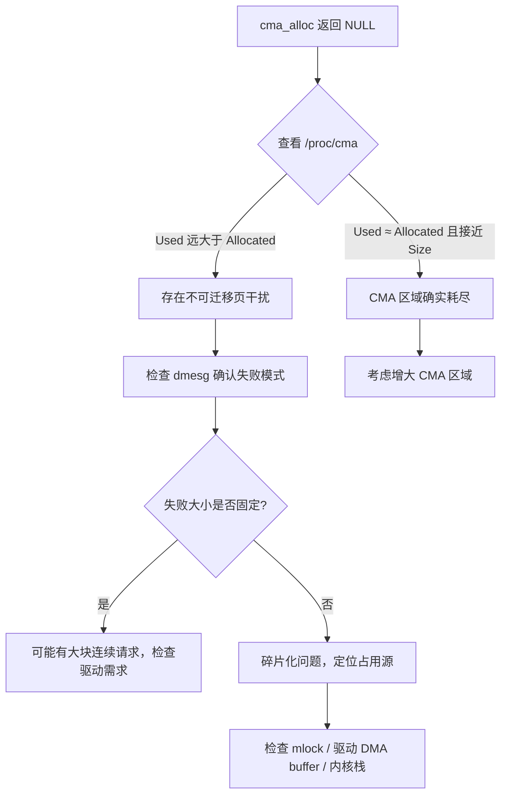

CMA（Contiguous Memory Allocator）看起来很美——一块专门预留的连续内存区域，供摄像头、GPU、DMA控制器这些"大客户"随时申请。但等你真正在产线上跑起来，很可能遇到这种糟心事儿：`cma_alloc()` 返回了 NULL，明明 `/proc/cma` 里显示还有几十兆空闲，就是分配不出来。

这背后最常见的原因，就是 CMA 区域里混进了"钉子户"。

**知识点41 [E] 不可迁移页——CMA里的钉子户**

CMA 的核心机制是"迁移"：当有一块连续内存需求来临时，CMA 会把区域里已有的可迁移页（movable pages）搬到别处，腾出一片连续的物理地址。但问题是，**不是所有页都能迁走**。

早年间我调过一个车载平台的摄像头驱动， symptoms 很奇怪：开机后前几次拍照没问题，多拍几张后 `cma_alloc()` 就开始失败。最后查出来，是某个内核模块在 CMA 区域内用 `mlock()` 锁住了用户态缓冲区。这些被锁定的页被标记为 `VM_LOCKED`，对 CMA 来说相当于打了地桩，根本搬不动。除了 `mlock`，还有几种常见的"钉子户"：

- 驱动自己分配的 DMA buffer，用了 `GFP_KERNEL` 而非 `GFP_USER|__GFP_MOVABLE`，页属性不对
- 内核线程的栈空间，恰好落在 CMA 区间内
- 某些驱动在 `initcall` 阶段偷偷申请了 CMA 范围内的内存，且标记为不可迁移

排查这类问题，我通常分两步走。

**第一步，看 `/proc/cma`。** 这个文件会列出每个 CMA 区域的使用情况，重点关注 `used` 和 `alloc` 两列的差异。如果 `used` 很大但 `alloc` 很小，说明很多页被占用但没真正分配给 CMA 用户——这往往就是不可迁移页在作怪。下面是一个典型的异常输出：

```
# cat /proc/cma
Number of CMA areas: 2
Name                    Base            Size            Allocated       Used
raster                  0x97000000      104857600       12582912        78643200
cma                     0xa0000000      67108864        0               41943040
```

看到没有？`cma` 这个区域 `Allocated` 是 0，但 `Used` 已经有 40MB。这意味着 40MB 的页被人占了，但 CMA 自己一毛钱都没分出去。这些被占用的页很可能是不可迁移的，挡住了后续的连续分配请求。

**第二步，翻 dmesg。** `cma_alloc()` 失败时内核会打印日志，典型长这样：

```
cma: cma_alloc: alloc failed, req-size: 4096 pages, ret-size: 0 pages
```

如果日志里频繁出现这种消息，而且失败大小并不是每次都一样，那基本可以确认是碎片化导致的。结合 `/proc/cma` 的异常数据，就能锁定方向。

下面这张流程图总结了我排查 CMA 分配失败的思路：



排查到这里，你可能会问：怎么知道具体是谁占了这些页？说实话，没有一招毙命的方法。你可以用 `page_owner` 抓一下（`CONFIG_PAGE_OWNER=y`），配合 `echo cma > /sys/kernel/debug/page_owner/filter` 过滤 CMA 区域，看看那些页的归属栈。也可以试试在 CMA 初始化后尽早 `cat /proc/pagetypeinfo`，对比前后的页类型变化，找出哪些页"赖着不走"。

**知识点42 [E] 预防与根治**

排查到根因后，解决方向通常有三个。

**增大 CMA 区域。** 这是最直接也最粗暴的一招。设备树里调整 `size` 字段，或者 bootargs 里改 `cma=` 参数。但注意，CMA 不是越大越好——它本质上是把一部分内存提前圈起来，系统其他部分能用的就少了。你得在"连续分配成功率"和"整体内存利用率"之间找个平衡点。我的经验是，先按业务峰值需求的 1.5 到 2 倍预留，上线后根据 `/proc/cma` 的监控数据再微调。

**调整初始化顺序，越早越好。** CMA 区域在内核启动过程中初始化，如果驱动或子系统在 CMA 初始化之前就申请内存，这些页可能恰好落在 CMA 区间内，且被标记为不可迁移。看看你的设备树 `probe` 顺序，或者检查驱动的 `module_init` 优先级。把 CMA 的初始化往前挪，或者把可能占用大块内存的驱动的初始化往后推，都能减少冲突。有些平台甚至需要改 `initcalls` 的顺序才能搞定。

**检查驱动是否正确释放 DMA buffer。** 这是最常见的"内存泄漏"。驱动申请了 CMA 内存做 DMA，但异常路径上忘了释放，或者 `dma_free_coherent()` 调用次数和 `dma_alloc_coherent()` 对不上。久而久之，CMA 区域被蚕食殆尽，新的分配请求只能吃闭门羹。建议你给驱动的 DMA 分配/释放接口加一层封装，用引用计数或者 devm 机制，确保配对。如果怀疑泄漏，可以用 `slabinfo`、`/proc/meminfo` 的变化趋势，或者直接上 kmemleak 辅助定位。

说到底，CMA 分配失败不是单一问题，它往往是系统设计、驱动质量、内存策略多方面因素叠加的结果。上面这套排查思路，我在好几个项目上走过完整流程，希望能帮你少走点弯路。
