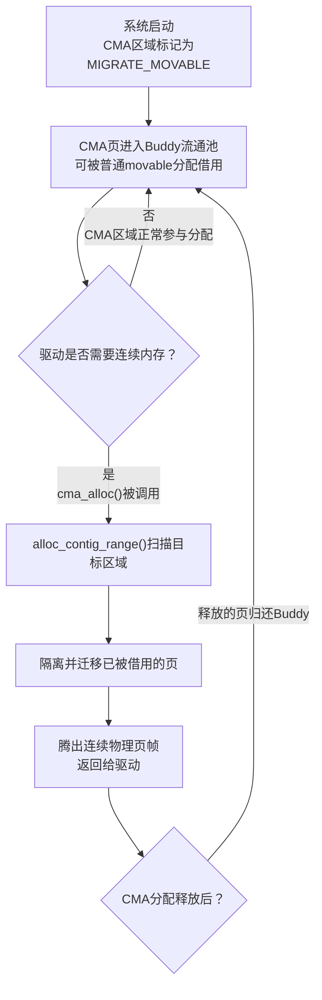

CMA听起来很美好——平时当普通内存用，关键时刻还能挤出连续大块。但天底下没有免费的午餐，预留内存本身就是有代价的。这一节咱们聊聊这笔账怎么算，以及CMA和系统内存之间是怎么玩"动态平衡"的。

**知识点43 [I]**

最直接的代价：你把一块物理内存划给CMA，这块地儿就算"半冻结"了。说它半冻结，是因为平时它确实能被Buddy拿去分配给movable页，但高阶分配请求一来，这些页就得被迁走。换句话说，CMA区域里的内存**永远无法被系统真正自由支配**——你没法指望它来承载一个普通的匿名页映射然后安安稳稳地用到进程结束，因为随时可能被CMA的分配请求打断、迁移到别处。

更大的账在系统启动时就欠下了。假设板子有1GB DDR，你划了128MB给CMA，那留给内核和普通进程的可用内存本质上就只有896MB。这896MB里还得扣掉kernel text/data、设备树reserved、framebuffer这些固定开销。对内存紧张的小系统来说，少几十兆是能要命的。我见过一个只有256MB内存的工业网关，CMA留了64MB，跑着跑着用户空间进程就因为可用内存不足被OOM killer干掉，而CMA区域里其实常年空闲着四五十兆——典型的资源错配。

那到底该留多大？

原则很简单：**你的最大并发DMA buffer需求 + 30%~50%的安全余量**。最大并发需求怎么算？把系统里所有可能同时申请CMA内存的设备加起来——比如camera ISP需要4MB × 4路 = 16MB，视频编码器需要8MB，GPU纹理需要16MB，那峰值大约是40MB，留点余量设64MB就够了。别拍脑袋给128MB，那不是大气，是浪费。

| 系统类型 | 典型配置 | 并发DMA需求估算 | 推荐CMA大小 | 备注 |
|---------|---------|---------------|------------|------|
| 小型嵌入式（工业控制、传感器网关） | 256~512MB DDR | 4~16MB | 32MB | 内存紧张，能省则省 |
| 中型多媒体设备（IPC、NVR、机顶盒） | 512MB~1GB DDR | 32~64MB | 64MB | 多路视频编解码是主要需求 |
| 大型SoC（智能电视、车载信息娱乐、AI边缘） | 2GB+ DDR | 64~256MB | 128MB+ | GPU、NPU、VPU多设备并发 |

> **陷阱**：CMA大小在内核启动后就固定了（`cma=64M`或设备树配置），**无法运行时动态调整**。这意味着你得在产品设计阶段就把所有DMA设备的峰值需求算清楚，宁可多留一点，也不要后续因为CMA不够而改DTB、重刷固件。我见过太多项目在开发后期发现CMA不够，临时加补丁做workaround，结果引发 regressions，得不偿失。

**知识点44 [I]**

说CMA"预留了内存"其实不太准确，更准确的说法是**"圈了一块地，但允许别人临时借用"**。这是CMA和硬预留（`mem=`）最根本的区别。

Buddy分配器把CMA区域的pageblock标记为`MIGRATE_MOVABLE`后，这些页帧就进入了普通内存的流通池。当用户空间mmap一个匿名页，或者文件系统读了一个文件页到page cache，Buddy完全可以从CMA区域里拿页来满足请求。这些被借走的页就跟普通内存一样用，进程无感知。

但一旦驱动调用`cma_alloc()`，故事就开始了。CMA分配器要求这块区域里的连续页帧，于是`alloc_contig_range()`出场，把已经借出去的页一个个找回来——通过页面迁移把它们的数据搬到别处，腾出的连续页帧归还给CMA。

这个设计妙就妙在**动态平衡**。系统负载低的时候，CMA区域几乎就是普通内存的一部分，不会坐着干等；负载高、DMA需求来的时候，它又能把借出去的资源收回来。代价是迁移页面的开销——页数据要拷贝，PTE要更新——但这个成本和整块内存硬预留的浪费相比，通常是划算的。

不过你也别觉得这就是完美的。迁移的延迟在高实时场景下可能是个问题。我曾经在一个相机系统里遇到这样的情况：`cma_alloc()`触发迁移时，几百个page的拷贝加上PTE遍历更新，在1GHz的ARM上能吃掉几十毫秒。如果是视频帧的实时采集pipeline，这一 jitter 就可能导致丢帧。所以CMA的动态平衡虽然好，也要掂量掂量你的场景能不能承受迁移的延迟——实在不行，硬预留配`mem=`反而是更稳的选择。
