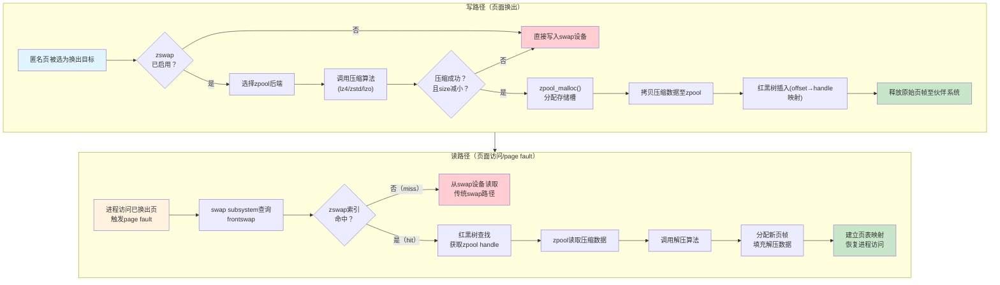

# 9.5.1 zswap的工作原理与配置

> 服务器有swap，嵌入式没有swap。没有swap的小内存设备怎么办？等死吗？不是，有zswap——用CPU换内存的"免费午餐"。

---

## 知识点125：zswap的设计动机与核心机制 [I]

### 嵌入式设备为何排斥swap分区

在桌面和服务器Linux系统中，swap分区（或swap文件）是内存不足时的标准退路——将不活跃的匿名页换出到磁盘，腾出物理内存供活跃进程使用。但在嵌入式设备中，这个看似合理的机制却面临致命障碍：

**Flash寿命限制**。嵌入式设备普遍使用NAND Flash或eMMC作为存储介质，这类存储器的擦写次数（Program/Erase Cycle）极为有限。SLC Flash约10万次，MLC约3000~10000次，TLC仅500~3000次。swap的换入换出会产生大量随机写操作，一个2GB的swap分区在高负载下可能每天经历数百次全盘写入，数月即可耗尽Flash的寿命预算。一位嵌入式老兵曾戏言："开swap等于给板子安装定时炸弹。"

**写入延迟不可接受**。Flash的随机写延迟远高于DRAM，swap out路径上的同步写操作会导致任务调度卡顿，破坏嵌入式场景的实时性承诺。

**没有swap，内存不足时怎么办？** 答案要么是OOM Killer无差别收割进程（用户体验灾难），要么是开发者被迫购买更大容量的DRAM（成本灾难）。zswap正是为破解这一困局而生。

### zswap的本质：内存中的压缩缓存层

zswap是一个**内核压缩交换缓存机制**，它在内存和真正的swap设备之间插入了一个压缩缓冲层。其核心哲学是：**与其把冷页面换出到慢速且易损的磁盘，不如在内存内部将其压缩，用CPU周期换取空间**。

从数据结构的角度理解，zswap维护了两级存储：

- **一级：未压缩页帧** — 仍然以原生形式存在于伙伴系统管理的物理内存中。
- **二级：压缩内存池（compressed memory pool）** — 由`zpool`子系统管理，存储经压缩算法处理后的页面数据。

当系统面临内存压力、内核的swap子系统决定将某匿名页换出时，frontswap钩子拦截这一操作，将页面送入zswap而非磁盘。只有在zswap自身空间不足时，页面才会被逐出（writeback）到真实的swap设备。

### 写路径：页面的压缩之旅

当一个匿名页被选中换出时，zswap的写路径如下：

```
[待换出页面] → [压缩算法(lz4/zstd/lzo)] → [压缩后数据] → [zpool分配存储槽] → [记录(索引→偏移)映射] → [原始页帧回收至伙伴系统]
```

关键细节在于：zswap并不保留原始页帧。页面被压缩存储后，原始页帧立即被释放回伙伴系统，这一行为使得**zswap具备实际的内存节省效果**，而非纯粹的缓存。

### 读路径：命中与未命中

当进程访问一个已被zswap接管的虚拟页时，触发page fault，读路径开始工作：

**命中场景（cache hit）**：
```
[page fault] → [查索引表命中] → [从zpool读取压缩数据] → [解压算法] → [填充新页帧] → [建立页表映射] → [返回用户态]
```

这一过程完全在内存中完成，不涉及任何磁盘I/O，因此延迟远低于传统swap。典型的解压操作仅需数十微秒，而磁盘swap的读延迟在毫秒级。

**未命中场景（cache miss）**：
```
[page fault] → [查索引表未命中] → [从真实swap设备读取页面] → [填充页帧] → [建立页表映射]
```

这种情况发生在zswap因空间不足已将部分页面逐出（writeback）到磁盘后。读路径退化为传统swap行为，但这是必要的降级策略。

### zswap vs zram：关键区分

初学者常混淆zswap与zram。二者核心差异在于：

| 特性 | zswap | zram |
|------|-------|------|
| 后端存储 | 仍关联swap设备，可writeback | 纯内存块设备，无后端 |
| 溢出行为 | 压缩页可逐出到磁盘 | 无出口，满则OOM |
| 定位 | 内存与swap间的缓存层 | swap设备的纯内存替代 |
| 适用场景 | 有swap但想加速/减写 | 无swap的极简系统 |

---

## 知识点126：zswap_frontswap_store()完整流程与配置调优 [E][M]

### 入口函数：zswap_frontswap_store()

当一个匿名页需要被换出时，frontswap机制将调用`zswap_frontswap_store(struct zswap_tree *tree, pgoff_t offset, struct page *page)`。这个函数是zswap的核心枢纽，其完整执行流程如下：

**步骤1：选择zpool后端**

zswap根据`zswap.zpool`模块参数，从已注册的zpool实现中选择内存池管理器。当前内核支持三种zpool类型，后续详述。

**步骤2：压缩页面**

调用已绑定的压缩算法`ops->compress`，将`page`的`PAGE_SIZE`（通常为4KB）数据进行压缩。压缩在预分配的 per-CPU `workspace` 缓冲区中进行，避免运行时内存分配。压缩结果分为两种情况：

- **压缩成功且有效**：压缩后数据显著小于原大小（通常有`ZSWAP_RECLAIM_K`阈值控制），进入步骤3。
- **压缩失败或膨胀**：某些数据（如已压缩的媒体文件）无法被进一步压缩，甚至"压缩"后更大。此时zswap拒绝存储，返回`-E2BIG`，页面将直接换出到真实swap设备。

**步骤3：分配zpool存储槽**

调用`zpool_malloc()`在压缩内存池中分配一个匹配压缩数据大小的槽位。zpool内部实现了细粒度的对象分配策略，将多个压缩页 packing 到同一个物理页帧中，以最大化空间利用率。

**步骤4：写入压缩数据并建立索引**

将压缩数据拷贝至zpool分配的内存区域，同时在zswap的红黑树索引中插入一条记录：

```c
struct zswap_entry {
    struct rb_node rbnode;      /* 红黑树节点，按键(offset)排序 */
    pgoff_t offset;             /* swap offset，作为查找键 */
    unsigned int length;        /* 压缩数据长度 */
    unsigned long handle;       /* zpool内存句柄 */
    struct zpool *pool;         /* 所属zpool */
    refcount_t refcount;        /* 引用计数 */
};
```

红黑树以`offset`（swap偏移）为键，确保page fault时的查找复杂度为O(log n)。

**步骤5：回收原始页帧**

原始`struct page`的页帧被释放回伙伴系统。从此刻起，该页面的唯一权威副本存在于zpool的压缩形态中。

### zpool三巨头：zsmalloc、zbud与z3fold

zpool是zswap的底层存储抽象，三种实现代表了不同的工程折中：

| zpool类型 | 核心机制 | 压缩比 | 复杂度 | CPU开销 | 适用场景 |
|-----------|----------|--------|--------|---------|----------|
| **zsmalloc** | size-class分级分配，高 packing 密度 | 最高 | 高 | 中等 | 内存极度紧张，追求最大压缩收益 |
| **zbud** | 每页最多存2个对象，简单可靠 | 低 | 低 | 最低 | 可靠性优先，容忍较低压缩比 |
| **z3fold** | 每页最多存3个对象，折中设计 | 中等 | 中等 | 中等 | 平衡压缩比与实现复杂度 |

**zsmalloc**是嵌入式场景的首选。它将压缩对象按size-class组织，同一class内的对象填入专用页，内部碎片极低。实测中，zsmalloc的packing效率可达80%~90%，意味着10MB的压缩数据仅需约11~12.5MB物理内存承载——接近理论极限。

**zbud**是保守派的选择，每页最多容纳2个压缩对象，实现简单、调试友好，但内部碎片严重。当压缩对象大小分布不均匀时，可能浪费近50%的zpool空间。

**z3fold**试图在二者间寻找甜点，允许每页3个对象。对于中等压缩比（如文本数据2:1压缩）的场景，3个4KB→2KB的压缩对象恰好填满一页，实现零内部碎片。

### 压缩算法选型

zswap通过Crypto API调用压缩算法，内核5.x后主要选择包括：

| 算法 | 压缩速度 | 压缩比 | 解压速度 | 内核版本 | 推荐场景 |
|------|----------|--------|----------|----------|----------|
| **lzo** | 快 | 中等 | 极快 | 全版本 | 旧内核兼容，均衡选择 |
| **lz4** | 极快 | 较低 | 极快 | 3.11+ | 低延迟敏感场景 |
| **zstd** | 慢 | 高 | 快 | 4.11+ | 高压缩比优先 |

**lzo**是Linux内核的经典选择，以Jack-knife算法闻名，解压速度极快但压缩比一般。适合I/O密集而非CPU极度受限的设备。

**lz4**由Yann Collet开发，设计哲学是"速度优先，压缩比够用就好"。其解压速度可达数GB/s，几乎不受带宽限制。在ARM Cortex-A53这类中低端嵌入式CPU上，lz4解压一页（4KB）的时间通常<10μs，对实时性的影响微乎其微。

**zstd**（Zstandard）同样出自Yann Collet之手，提供了多级压缩级别（1~22）。zswap默认使用中间级别，平衡压缩比与速度。对于文本密集型负载（如日志系统、JSON处理），zstd可达到3:1甚至更高的压缩比，但其压缩路径的CPU消耗约为lz4的3~5倍。适合CPU富余但内存极度受限的场景。

算法选择的工程建议：**嵌入式默认选lz4，若系统以文本数据为主且CPU负载<50%，可尝试zstd**。

### 关键配置参数

zswap通过sysfs暴露配置接口，挂载于`/sys/kernel/debug/zswap/`（调试信息）和模块参数：

```bash
# 查看当前参数
cat /sys/module/zswap/parameters/enabled          # 是否启用（Y/N）
cat /sys/module/zswap/parameters/zpool            # zpool类型（zsmalloc/zbud/z3fold）
cat /sys/module/zswap/parameters/compressor       # 压缩算法（lzo/lz4/zstd）
cat /sys/module/zswap/parameters/max_pool_percent # zpool最大占内存百分比（默认20）

# 运行时修改（需root）
echo zstd > /sys/module/zswap/parameters/compressor
echo 30 > /sys/module/zswap/parameters/max_pool_percent
```

**max_pool_percent**是最关键的调参项，它决定zpool可占用的最大内存比例。默认值20%在桌面系统较为保守，嵌入式设备可根据实际负载调整为30%~40%。需注意：此值是上限而非预留，zpool仅在页面换出时按需增长。

**enabled**开关可在运行时动态切换，关闭时zpool中已有的压缩页会被立即writeback到真实swap设备，然后释放内存。

### zswap读写路径全景图



### 嵌入式实践建议

1. **内核配置开启**：确保`CONFIG_ZSWAP=y`、`CONFIG_ZPOOL=y`、`CONFIG_ZSMALLOC=y`、`CONFIG_LZ4_COMPRESS=y`。

2. **启动参数预配置**：在bootargs或`/etc/modprobe.d/zswap.conf`中预设参数：
   ```bash
   # /etc/modprobe.d/zswap.conf
   options zswap enabled=1 zpool=zsmalloc compressor=lz4 max_pool_percent=25
   ```

3. **监控与调优**：通过`/sys/kernel/debug/zswap/stats`观察压缩比和命中率：
   ```bash
   grep -E "stored_pages|pool_total_size|written_back_pages" \
       /sys/kernel/debug/zswap/stats
   ```
   计算压缩比公式：`压缩比 = stored_pages × PAGE_SIZE / pool_total_size`。若压缩比<1.5，考虑切换至zstd算法；若writeback频繁，考虑增大max_pool_percent。

4. **与zram的协同**：部分发行版采用zswap+zram的叠层架构——zswap作为L1缓存，zram作为L2压缩swap设备。此架构兼顾了低延迟（zswap内存命中）和零磁盘写入（zram不触碰Flash），是高端嵌入式设备的推荐配置。
