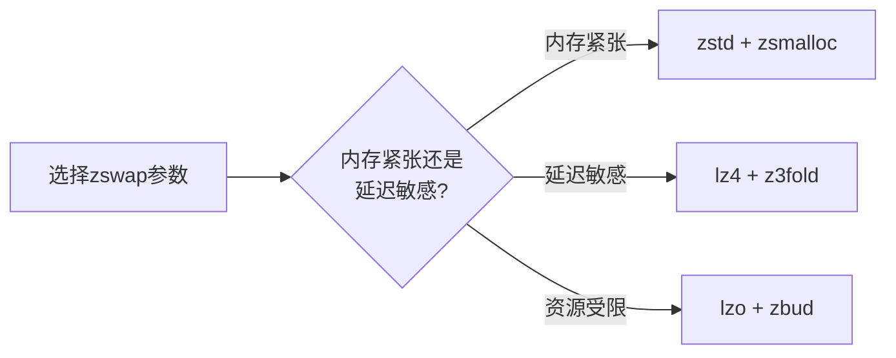

**知识点49 [I] — zswap配置参数详解**

zswap不是内核里默认就火力全开的。要让它真正干起活来，你得先告诉内核"我打算用你"。最直接的开关就是 `zswap.enabled=1`，这个参数写在启动命令行里，内核初始化阶段就会把zswap的核心数据结构搭起来。如果没加这个参数，或者设为0，那zswap模块虽然在编译时进了内核，但实际就是个摆设——页帧照样往swap分区上写，压缩池压根不会被创建。

有意思的是，zswap的设计者们当初争论了很久，最后决定默认关闭。理由倒也实在：不是所有场景都需要它，开了就多一层内存拷贝和压缩开销，嵌入式小内存设备可能反而吃亏。这个决定后来证明是明智的，gives user the control。

池子类型通过 `zswap.zpool` 来选，候选的有三个：zsmalloc、zbud、z3fold。这三个的名字都挺直白——"z"打头表示压缩页专用，后面跟着各自的分配策略。默认用的是zbud，原因是它历史悠久、稳定可靠，但未必是你场景下的最优解。这个选择直接影响后面内存碎片的程度和能塞进压缩池的页数，后面知识点50会展开细说。

压缩算法这块，`zswap.compressor` 说了算。目前内核里支持lzo、lz4、zstd这三个主流选择，有的发行版还会把lzo-rle也编进去。它们的性格差异很大：

- **lzo**：老牌算法，压缩速度 decent，压缩比一般般，胜在稳定、历史悠久，很多ARM嵌入式平台默认带它。
- **lz4**：追求极致速度，压缩和解压都飞快，适合对延迟敏感的场景。代价是压缩比不太好看——说白了就是你省不下太多内存。
- **zstd**：Facebook（现在的Meta）推出来的，压缩比非常漂亮，能把数据压得比较小。但CPU开销也实打实地高，解压速度倒是还行。适合内存吃紧、CPU有富余的场景。

这里有个常见的误区：很多人觉得压缩比越高越好，闭眼选zstd。但现实是，zswap走的压缩路径在内存回收的热路径上，每次写swap都要压一次，swap in的时候又要解压。算法慢了，直接拖慢整个系统的响应。早年间我见过一个案例，某服务器开了zstd做zswap压缩，结果内存回收时延迟 spikes 到几十毫秒，业务抖动得厉害，后来切回lz4才消停。

最后别忘了 `zswap.max_pool_percent`，这个参数控制压缩池最多占系统总内存的百分之几。默认值通常是20。注意这个百分比是**动态**的——zswap实际分配多少，取决于当前有多少页被压缩进去了，上限就是这个百分比对应的RAM大小。如果你的系统内存本身就不大（比如4GB以下），建议把这个值调低一点，否则压缩池本身就成了内存大户，得不偿失。

几个参数可以组合用，比如：

```bash
# /etc/default/grub 中的 GRUB_CMDLINE_LINUX 行
GRUB_CMDLINE_LINUX="... zswap.enabled=1 zswap.compressor=lz4 zswap.zpool=z3fold zswap.max_pool_percent=15"
```

改完记得 update-grub 重启。如果想在运行时确认生效没，可以翻 `/sys/module/zswap/parameters/` 下的各个文件，它们都是只读的当前值：

```bash
cat /sys/module/zswap/parameters/enabled
cat /sys/module/zswap/parameters/compressor
cat /sys/module/zswap/parameters/zpool
```

> **陷阱**：`/sys/module/zswap/parameters/` 里的文件有些是启动时只读的（如enabled），改了grub参数、重启才生效；有些发行版提供了debug接口可以运行时切换压缩算法，但这属于非标准操作，生产环境别轻易试。

---

**知识点50 [I] — zpool与压缩算法对比**

选zpool和选压缩算法，本质上是在**压缩比、速度、内存开销**这三个维度上做trade-off。没有银弹，看你的场景侧重哪个。下面这张表把三个zpool和三个压缩算法的核心指标列出来，方便你快速做决策：

| zpool 类型 | 压缩密度 | CPU开销 | 内部碎片 | 适用场景 |
|-----------|---------|--------|---------|---------|
| **zbud** | 低（每页独立压缩） | 中等 | 高（每页最多压缩2页） | 求稳、兼容性优先 |
| **zsmalloc** | 高（细粒度合并） | 较高 | 低（buddy不感知的子页分配） | 追求最大压缩密度 |
| **z3fold** | 中高（3页一组） | 中 | 中等 | 平衡之选，近年较流行 |

zbud是最保守的选择。它每个压缩页存到独立的内存单元里，设计简单、回收时干净利落。但问题也在这里——单个压缩页可能只占原页的一半甚至更小，剩下的空间就浪费了。而且它有个硬性限制：每个zbud页最多存**两个**原页，压缩比的天花板很低。

zsmalloc走的是另一个极端。它在buddy allocator下面偷偷搞了一套子页分配机制，把不同大小的压缩页碎片凑在一起，空间利用率极高。代价是分配和回收路径更复杂，内部有锁竞争，CPU开销上去了。如果你的系统CPU核数不多，zsmalloc的锁可能成为瓶颈。

z3fold是后来居上的折中方案。它把页分成三人一组（hence the "3"），每个slot最多容纳3个压缩页，碎片比zbud好，复杂度和开销又比zsmalloc低。近年来不少发行版开始把默认zpool从zbud切到z3fold，就是这个原因。

再看压缩算法的横向对比：

| 压缩算法 | 压缩速度 | 解压速度 | 压缩比 | CPU占用 | 最佳场景 |
|---------|---------|---------|--------|--------|---------|
| **lzo** | 快 | 极快 | ~2.1:1 | 低 | 嵌入式、通用默认 |
| **lz4** | 极快 | 极快 | ~2.0:1 | 很低 | 延迟敏感型负载 |
| **zstd** | 慢 | 快 | ~2.8:1 | 高 | 内存极度紧张、CPU富余 |

选搭配的建议是：
- **桌面/笔记本**（内存8-16GB，CPU不差）：`zswap.compressor=zstd zswap.zpool=zsmalloc`，追求最大内存节省
- **服务器/云实例**（延迟敏感，内存相对充裕）：`zswap.compressor=lz4 zswap.zpool=z3fold`，速度和密度兼顾
- **嵌入式/ARM板子**（CPU弱、内存小）：`zswap.compressor=lzo zswap.zpool=zbud`，保守稳妥



> **陷阱**：zsmalloc在较早版本的内核里有rcu stall的report，虽然后来修了，但如果你跑的是老内核（比如4.x系列），zpool选zsmalloc前最好先去bugzilla扫一眼有没有已知的bug。生产环境求稳的话，z3fold是个 safer bet。
